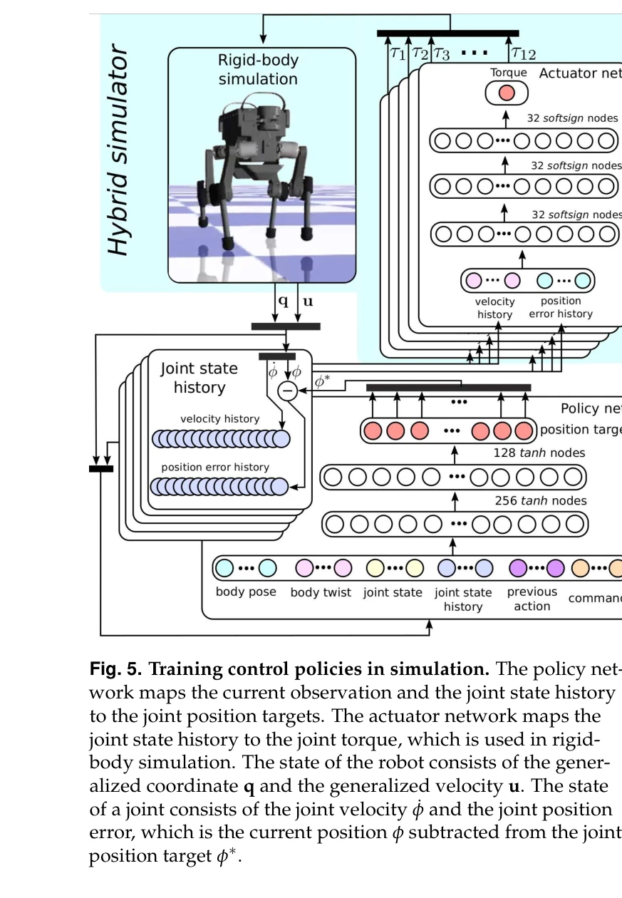

# Learning agile and dynamic motor skills for legged robots

> **저자**: Jemin Hwangbo, Joonho Lee, Alexey Dosovitskiy, Dario Bellicoso, Vassilios Tsounis, Vladlen Koltun, Marco Hutter | **날짜**: 2019-01-24 | **URL**: [https://arxiv.org/abs/1901.08652](https://arxiv.org/abs/1901.08652)

---

## Essence

*Fig. 5. Training control policies in simulation. The policy net-*

본 논문은 시뮬레이션에서 reinforcement learning으로 사족 로봇의 제어 정책을 학습하고 현실의 ANYmal 로봇에 전이하는 방법을 제시하여, 고속 주행과 낙하 복구 등의 동적 운동 기술을 달성했다.

## Motivation

- **Known**: Modular controller design과 trajectory optimization 방법들이 사족 로봇 제어에 주로 사용되어 왔으나, 수작업 튜닝이 많이 필요하고 성능 제약이 있다. Reinforcement learning은 시뮬레이션에서 우수한 결과를 보였지만 현실 로봇 적용은 제한적이었다.
- **Gap**: 시뮬레이션과 현실 간의 reality gap을 효과적으로 극복하여 학습된 정책을 물리적 사족 로봇에 안정적으로 전이할 수 있는 방법이 부족했다.
- **Why**: 사족 로봇은 복잡한 동역학, 빈번한 접촉 변화, 높은 차원의 비선형 제어 문제를 가지고 있어 자동화된 학습 방법을 통해 효율적이고 민첩한 제어기를 개발하는 것이 중요하다.
- **Approach**: Simulation-to-reality transfer를 위해 dynamics randomization, reference state initialization randomization, action delay randomization 등의 도메인 랜더마이제이션 기법을 적용하여 정책의 강건성을 향상시키고, 실제 로봇에서의 파라미터 동정을 통해 시뮬레이션 정확도를 개선했다.

## Achievement

- **고속 주행 능력**: ANYmal이 이전 방법들보다 빠른 속도로 안정적으로 주행할 수 있게 됨
- **정밀한 속도 제어**: 고수준의 신체 속도 명령을 정확하고 에너지 효율적으로 추적
- **낙하 복구**: 복잡한 자세에서도 낙하로부터 회복하는 능력 획득
- **자동화된 학습**: 수작업 튜닝 최소화로 새로운 로봇이나 과제에 빠른 적응 가능

## How

- PPO (Proximal Policy Optimization) 또는 유사한 actor-critic reinforcement learning 알고리즘으로 신경망 정책 학습
- Randomized dynamics parameters (질량, 마찰, damping, actuator response 등)를 포함한 domain randomization 적용
- Reference state initialization randomization으로 다양한 초기 상태에 대한 강건성 확보
- Action delay와 observation noise randomization으로 현실의 지연과 노이즈에 대응
- 실제 로봇 하드웨어의 파라미터를 측정하여 시뮬레이터에 반영
- 시뮬레이션 환경에서의 리워드 함수 설계로 원하는 동작 유도

## Originality

- 사족 로봇의 동적 운동 기술 학습에 대한 포괄적인 domain randomization 프레임워크 제시
- Reality gap을 극복하기 위한 체계적인 시뮬레이션 파라미터 동정과 randomization 전략의 조합
- 실제 수중 로봇(ANYmal)을 대상으로 한 reinforcement learning 적용의 성공적 사례 제시
- Modular design의 단점을 극복하는 end-to-end 학습 방식의 효과 실증

## Limitation & Further Study

- 시뮬레이션 환경이 완벽하게 현실을 모사하지 못하므로 일부 모션의 미세한 부자연스러움 가능성
- Domain randomization의 과도한 적용으로 시뮬레이션에서의 성능 저하 가능성 (trade-off)
- ANYmal 특정 로봇에 대한 정책으로, 다른 하드웨어 플랫폼으로의 일반화 검증 필요
- 학습 과정에서 로봇 손상 위험을 완전히 제거하지 못함
- 후속 연구: 더 다양한 지형과 복잡한 환경에서의 성능 평가, multi-task 학습을 통한 일반화 능력 개선, 더 효율적인 domain randomization 전략 개발 필요

## Evaluation

- Novelty: 4/5
- Technical Soundness: 4/5
- Significance: 4/5
- Clarity: 4/5
- Overall: 4/5

**총평**: 본 논문은 사족 로봇의 동적 제어에 reinforcement learning과 domain randomization을 효과적으로 결합하여 시뮬레이션-현실 전이 문제를 체계적으로 해결했으며, 실제 고급 로봇 플랫폼에서 이전에 달성하지 못한 수준의 운동 기술을 구현함으로써 로봇 제어 분야에 중요한 기여를 했다.
