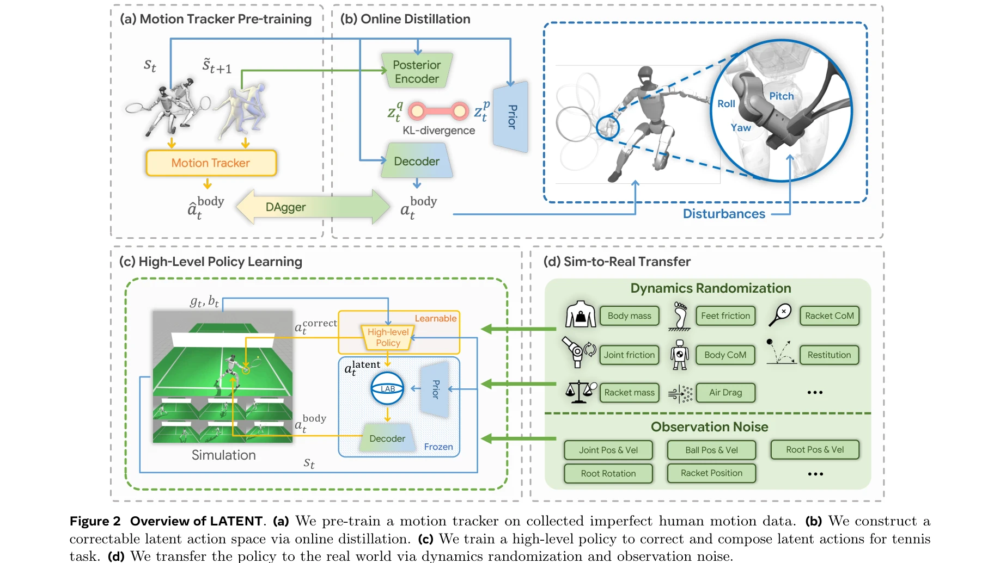
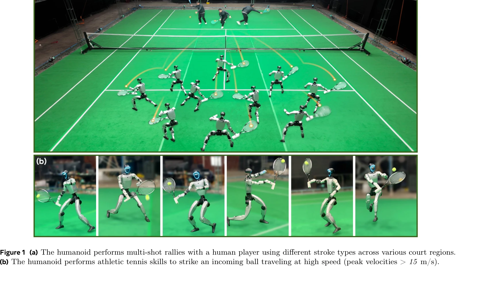

# Learning Athletic Humanoid Tennis Skills from Imperfect Human Motion Data (LATENT)

> **저자**: Zhikai Zhang, Haofei Lu, Yunrui Lian, Ziqing Chen, Yun Liu, Chenghuai Lin, Han Xue, Zicheng Zeng, Zekun Qi, Shaolin Zheng, Qing Luan, Jingbo Wang, Junliang Xing, He Wang, Li Yi | **날짜**: 2026-03-13 | **URL**: [https://arxiv.org/abs/2603.12686](https://arxiv.org/abs/2603.12686)

---

## Essence

*Figure 2 Overview of LATENT. (a) We pre-train a motion tracker on collected imperfect human motion data. (b) We construc*

LATENT는 불완전한 인간 모션 데이터(5시간 분량의 테니스 프리미브)로부터 수정 가능한 잠재 행동 공간을 구성하고, 고수준 정책으로 이를 보정·합성하여 휴머노이드 로봇이 인간과의 멀티샷 테니스 랠리를 수행하도록 학습하는 시스템이다.

## Motivation

- **Known**: 인간 모션 데이터를 기반으로 한 잠재 행동 공간 학습은 기존 연구에서 다루어져 왔으며, 최근 humanoid 로봇의 스포츠 능력 향상이 진행 중이다. 그러나 완전하고 정확한 테니스 모션 데이터 수집의 어려움이 있었다.
- **Gap**: 기존 연구는 완전하고 정확한 인간-테니스 모션 시퀀스 수집을 요구하거나 복잡한 비디오 처리 파이프라인이 필요했다. 불완전한 모션 프리미티브만으로 운동능력 높은 테니스 기술을 학습하는 방법이 부재했다.
- **Why**: 테니스는 시속 15-30 m/s의 고속 공에 밀리초 단위로 반응해야 하며, 넓은 범위의 움직임과 정밀한 손목 조절이 필요해 humanoid 로봇의 athletic 능력을 검증하는 좋은 벤치마크이다.
- **Approach**: 세 단계 파이프라인으로, 첫째 compact motion capture로 5명의 선수로부터 5시간의 프리미티브 스킬 데이터를 수집하고, 둘째 수정 가능한 latent action space를 motion tracker와 variational information bottleneck으로 구성한 후, 셋째 latent action barrier를 통해 high-level policy가 task 성능과 자연스러운 동작을 균형있게 학습하도록 한다.

## Achievement

*Figure 1 (a) The humanoid performs multi-shot rallies with a human player using different stroke types across various co*

- **Correctable latent space**: 불완전한 모션 데이터에서 high-level policy의 보정을 가능하게 하는 latent action space 설계
- **Latent action barrier (LAB)**: state-based action distribution prior를 이용해 RL 탐색을 제약하며 task 성능과 motion style adherence의 균형을 달성
- **Sim-to-real transfer**: dynamics randomization과 observation noise 적용으로 robust real-world deployment 달성
- **Real-world demonstration**: Unitree G1 humanoid에서 인간 플레이어와 안정적인 멀티샷 랠리 수행, 최고 15 m/s 이상의 고속 공 타격 성공

## How

*Figure 2 Overview of LATENT. (a) We pre-train a motion tracker on collected imperfect human motion data. (b) We construc*

- Motion capture: 3m×5m의 compact 시스템에서 5명의 선수로부터 forehand, backhand, lateral shuffle, crossover step 등의 프리미티브 스킬 수집
- Motion retargeting: LocoMuJoCo를 사용해 인간 모션을 humanoid 모션으로 변환
- Motion tracker pre-training: 수집된 imprecise 모션을 모방하도록 tracker 학습
- Latent space distillation: variational information bottleneck을 통해 motion tracker를 latent model로 증류
- High-level policy training: PPO를 사용해 latent space에서 sampling하고 wrist correction을 예측하며 task reward와 latent action barrier constraint를 고려
- Sim-to-real: 로봇과 테니스공의 동역학 randomization 및 관측 노이즈 적용

## Originality

- **불완전 데이터의 체계적 활용**: imprecise와 incomplete 모션 데이터의 특성을 명시적으로 정의하고 각각에 대응하는 설계 제시
- **Wrist correction 메커니즘**: 높은 정밀도가 필요한 racket swing 보정을 latent space 상위의 high-level policy로 해결
- **Latent action barrier**: state-based distribution prior 기반의 novel constraint로 task 성능과 motion naturalness의 trade-off 해결
- **Real-world athletic 스포츠 구현**: humanoid 로봇의 빠른 반응과 정밀한 움직임이 동시에 요구되는 테니스 랠리의 실세계 구현

## Limitation & Further Study

- **데이터 수집의 한계**: 5명의 amateur 선수로부터 5시간만 수집했으며, professional 선수의 데이터나 더 다양한 스타일 미포함
- **모션 캡처 시스템의 제약**: 3m×5m 영역 내에서의 프리미티브만 수집 가능, 전반적인 코트 커버리지나 고속 이동 스킬의 완전성 미보장
- **일반화 성능**: wrist correction이 특정 swing 스타일에 최적화되었을 가능성, 새로운 strike 각도나 속도에 대한 일반화 성능 미평가
- **Real-world 검증 제한**: Unitree G1 단일 로봇에서만 검증되었으며, 다른 humanoid 플랫폼으로의 전이 성능 미확인
- **상대방 예측 능력**: 인간 상대의 동작 예측 없이 고정된 ball trajectory에 대응하는 수준, 진정한 interactive rally의 복잡성 미해결
- **후속연구 방향**: (1) professional player 데이터 포함, (2) 더 다양한 court position과 strike 조건에 대한 일반화, (3) 상대방의 움직임을 예측하고 대응하는 능력 확장, (4) 다른 로봇 플랫폼으로의 transfer learning

## Evaluation

- Novelty: 4/5
- Technical Soundness: 3/5
- Significance: 4/5
- Clarity: 4/5
- Overall: 4/5

**총평**: 본 논문은 불완전한 모션 데이터로부터 athletic humanoid 스포츠 기술을 학습하는 실질적이고 창의적인 시스템을 제시하며, correctable latent space와 latent action barrier라는 두 가지 novel design으로 imperfect data의 한계를 효과적으로 극복했다. Real-world humanoid 로봇에서 인간과의 멀티샷 테니스 랠리를 성공적으로 구현한 점이 이 분야의 중요한 이정표이다.

## Related Papers

- 🔄 다른 접근: [[papers/2053_Learning_Human-Like_Badminton_Skills_for_Humanoid_Robots/review]] — 스포츠 기술 학습에서 테니스 대신 배드민턴을 통한 다른 라켓 스포츠 접근법과 학습 프레임워크를 비교할 수 있다.
- 🔗 후속 연구: [[papers/2003_Humanoid_Whole-Body_Badminton_via_Multi-Stage_Reinforcement/review]] — LATENT 시스템을 다단계 강화학습과 결합하여 더 정교하고 다양한 배드민턴 기술을 습득할 수 있다.
- 🏛 기반 연구: [[papers/1979_HITTER_A_HumanoId_Table_TEnnis_Robot_via_Hierarchical_Planni/review]] — 계층적 계획을 통한 탁구 로봇 제어의 원리가 테니스 기술 학습에서의 고수준 정책 설계에 기본 틀을 제공한다.
- 🏛 기반 연구: [[papers/1679_SkillMimic_Learning_Basketball_Interaction_Skills_from_Demon/review]] — 불완전한 시연 데이터로부터 스포츠 기술을 학습하는 기본 방법론 제공
- 🔗 후속 연구: [[papers/1650_Robot_Drummer_Learning_Rhythmic_Skills_for_Humanoid_Drumming/review]] — LATENT의 불완전한 인간 데이터 활용이 Robot Drummer의 리듬 스킬 학습과 결합되어 음악적 타이밍이 있는 스포츠 동작 학습 가능
- 🏛 기반 연구: [[papers/1917_Example-based_Motion_Synthesis_via_Generative_Motion_Matchin/review]] — 생성형 모션 매칭이 LATENT의 테니스 프리미브 수정 및 합성에 더 자연스러운 인간-로봇 스포츠 상호작용 기반 제공
- 🔗 후속 연구: [[papers/1650_Robot_Drummer_Learning_Rhythmic_Skills_for_Humanoid_Drumming/review]] — Learning Athletic Humanoid Tennis Skills의 불완전한 인간 데이터 학습이 Robot Drummer의 temporal decomposition 기반 리듬 학습을 확장함
- 🏛 기반 연구: [[papers/1979_HITTER_A_HumanoId_Table_TEnnis_Robot_via_Hierarchical_Planni/review]] — 불완전한 인간 데이터에서 테니스 스킬을 학습하는 방법론이 HITTER의 빠른 반응 기반 탁구 제어의 토대가 된다.
- 🔗 후속 연구: [[papers/2037_KungfuBot_Physics-Based_Humanoid_Whole-Body_Control_for_Lear/review]] — KungfuBot의 물리 기반 고동적 행동 학습이 테니스 기술 학습의 운동 기반을 제공하여 더 정확한 스포츠 모션 구현 가능
- 🔄 다른 접근: [[papers/2053_Learning_Human-Like_Badminton_Skills_for_Humanoid_Robots/review]] — 라켓 스포츠 학습에서 배드민턴과 테니스라는 서로 다른 종목에 대한 휴머노이드 기술 습득 방법론을 비교할 수 있다.
- 🔗 후속 연구: [[papers/2131_PACE_Physics_Augmentation_for_Coordinated_End-to-end_Reinfor/review]] — Learning athletic tennis skills의 imperfect human data 활용이 PACE의 탁구 경기 학습을 인간 시연 데이터의 불완전성을 고려한 확장된 접근법입니다.
