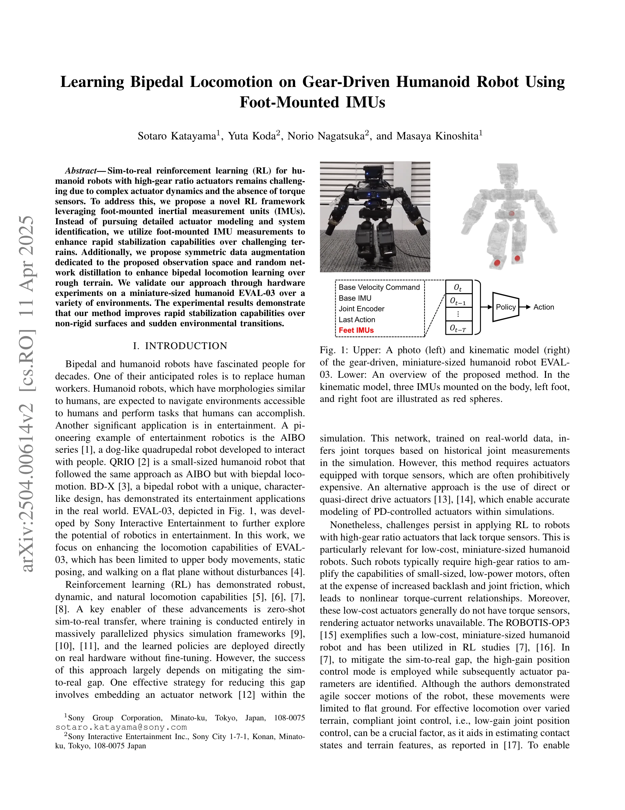

# Learning Bipedal Locomotion on Gear-Driven Humanoid Robot Using Foot-Mounted IMUs

> **저자**: Sotaro Katayama, Yuta Koda, Norio Nagatsuka, Masaya Kinoshita | **날짜**: 2025-04-01 | **URL**: [https://arxiv.org/abs/2504.00614](https://arxiv.org/abs/2504.00614)

---

## Essence

*Fig. 1: Upper: A photo (left) and kinematic model (right)*

고기어비 액추에이터와 토크 센서가 없는 휴머노이드 로봇의 이족 보행 학습을 위해 발목 장착 IMU를 활용하는 Sim-to-Real RL 프레임워크를 제안하고, 대칭 데이터 증강과 random network distillation을 통해 불규칙한 지형에서의 안정화를 향상시킨다.

## Motivation

- **Known**: 직접 또는 준직접 구동 액추에이터를 사용하는 로봇의 경우 간단한 domain randomization으로 Sim-to-Real 전이가 효과적이며, 토크 센서가 있는 액추에이터의 경우 actuator network를 통한 전이가 가능하다는 것이 알려져 있다.
- **Gap**: 고기어비 액추에이터를 가진 저비용 미니어처 휴머노이드 로봇은 토크 센서가 없고 비선형 토크-전류 관계를 가져 상세한 시스템 식별이 어렵고, 기존 방법들은 느린 보행이나 불규칙한 지형에서의 실패를 보이고 있다.
- **Why**: 발목 장착 IMU를 통해 발의 상태를 직접 측정할 수 있으면 복잡한 액추에이터 모델링 없이도 다양한 지형에서의 동적 보행이 가능하며, 이는 엔터테인먼트 및 상용 로봇의 실제 배포에 중요하다.
- **Approach**: Legged Gym 기반 model-free RL에서 발목 IMU의 선형 가속도와 각속도를 관측 공간에 추가하고, 대칭 데이터 증강과 random network distillation을 적용하여 거친 지형에서의 학습을 강화한다.

## Achievement

- **발목 IMU 기반 관측**: 복잡한 액추에이터 모델링 및 시스템 식별 없이도 발의 상태 측정을 통해 빠른 안정화 달성
- **대칭 데이터 증강**: 제안된 관측 공간에 맞춘 symmetric data augmentation으로 학습 효율 향상
- **Random Network Distillation**: 거친 지형에서의 탐색 강화를 통해 불규칙한 표면과 급격한 환경 변화에 대한 보행 능력 개선
- **하드웨어 검증**: EVAL-03 로봇을 통해 다양한 환경(비탄성 표면, 급격한 전환 등)에서의 실제 성능 입증

## How

*Fig. 1: Upper: A photo (left) and kinematic model (right)*

- Legged Gym 프레임워크를 기반으로 PPO 학습 진행
- 관측 공간에 좌측·우측 발목의 IMU 가속도(6차원)와 각속도(6차원) 포함
- 기본 IMU의 선형 가속도 추가로 기울기 및 동적 상태 정보 강화
- 10개 난이도 수준의 다양한 지형(경사면, 거친 표면, 계단 등)에서 커리큘럼 기반 학습
- Symmetric data augmentation으로 좌우 대칭 정책 강건성 확보
- Random network distillation으로 탐색 보상 추가하여 거친 지형 학습 촉진
- 낮은 이득 위치 제어(compliant joint control)로 낮은 비용 액추에이터에 맞춤

## Originality

- 고기어비 액추에이터 로봇에서 토크 센서 대체 수단으로 발목 IMU를 활용한 최초의 체계적 접근
- Sim-to-Real RL에서 추가 센서 관측을 통해 상세한 액추에이터 모델링을 회피하는 새로운 패러다임 제시
- 발목 IMU 관측 공간에 특화된 symmetric data augmentation 기법 개발
- 거친 지형에서의 RL 학습을 위해 random network distillation과 compliant control을 결합

## Limitation & Further Study

- EVAL-03의 미니어처 크기 로봇에서만 검증되었으며 인간 크기 휴머노이드로의 확장성 미확인
- 발목 IMU 센서의 추가 비용 및 무게 증가가 초저비용 설계에 미치는 영향 분석 부족
- Symmetric data augmentation의 효과가 수량화되지 않아 각 개선 기법의 기여도 파악 어려움
- 시뮬레이션과 실제 환경의 IMU 노이즈 모델이 충분히 정확한지에 대한 민감도 분석 부재
- 다양한 IMU 마운팅 위치 및 방향에 따른 성능 변화 연구 필요

## Evaluation

- Novelty: 4/5
- Technical Soundness: 3/5
- Significance: 4/5
- Clarity: 4/5
- Overall: 4/5

**총평**: 본 논문은 저비용 고기어비 액추에이터 로봇의 Sim-to-Real 학습에서 발목 IMU 센서를 혁신적으로 활용하여 복잡한 모델링을 회피하면서도 강건한 이족 보행을 달성한다. 하드웨어 검증과 실제 성능 개선이 입증되었으나, 다양한 로봇 플랫폼으로의 일반화 가능성과 기여도 분석이 향후 강화될 필요가 있다.

## Related Papers

- 🏛 기반 연구: [[papers/1988_HuMam_Humanoid_Motion_Control_via_End-to-End_Deep_Reinforcem/review]] — 발목 IMU 기반 학습이 HuMam의 로봇 중심 상태 융합에 필요한 센서 데이터를 제공한다.
- 🧪 응용 사례: [[papers/1675_Sim-to-Real_of_Humanoid_Locomotion_Policies_via_Joint_Torque/review]] — 발목 IMU 기반 프레임워크가 관절 토크를 통한 sim-to-real 학습에 실제 적용될 수 있다.
- 🔄 다른 접근: [[papers/1630_Quasi-Direct_Drive_for_Low-Cost_Compliant_Robotic_Manipulati/review]] — Learning Bipedal Locomotion은 고기어비 액추에이터 사용, Quasi-Direct Drive는 저비용 컴플라이언트 구동으로 서로 다른 액추에이션 방식을 채택한다.
- 🔗 후속 연구: [[papers/1664_Sampling-Based_System_Identification_with_Active_Exploration/review]] — Learning Bipedal Locomotion의 random network distillation을 Sampling-Based System Identification의 능동 탐색과 결합하여 더 효과적인 지형 적응 학습이 가능하다.
- 🔄 다른 접근: [[papers/2061_Learning_Sim-to-Real_Humanoid_Locomotion_in_15_Minutes/review]] — 두 논문 모두 하드웨어 제약이 있는 휴머노이드에서 빠른 강화학습을 통한 보행 학습을 다루며 실용적 접근법을 제시한다.
- 🏛 기반 연구: [[papers/1627_PvP_Data-Efficient_Humanoid_Robot_Learning_with_Propriocepti/review]] — PvP의 고유감각 기반 데이터 효율적 학습이 발목 IMU를 활용한 센서 제약 환경에서의 강화학습에 이론적 기반을 제공한다.
- 🧪 응용 사례: [[papers/1988_HuMam_Humanoid_Motion_Control_via_End-to-End_Deep_Reinforcem/review]] — HuMam의 에너지 효율적 제어가 기어 구동 로봇의 발목 IMU 기반 학습에 적용될 수 있다.
- 🔄 다른 접근: [[papers/2061_Learning_Sim-to-Real_Humanoid_Locomotion_in_15_Minutes/review]] — 두 논문 모두 하드웨어 제약이 있는 휴머노이드에서 빠른 강화학습을 다루며 실용적 sim-to-real 접근법을 제시한다.
