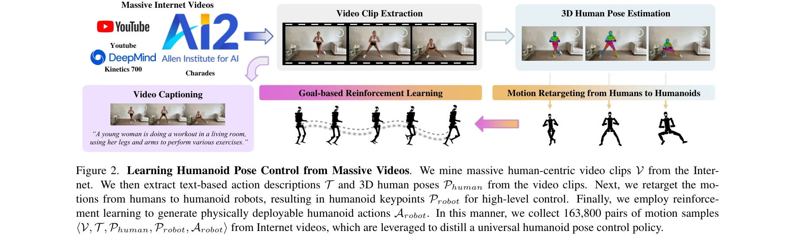

# Learning from Massive Human Videos for Universal Humanoid Pose Control

> **저자**: Jiageng Mao, Siheng Zhao, Siqi Song, Tianheng Shi, Junjie Ye, Mingtong Zhang, Haoran Geng, Jitendra Malik, Vitor Guizilini, Yue Wang | **날짜**: 2024-12-18 | **URL**: [https://arxiv.org/abs/2412.14172](https://arxiv.org/abs/2412.14172)

---

## Essence

*Figure 2. Learning Humanoid Pose Control from Massive Videos. We mine massive human-centric video clips V from the Inter*

Humanoid-X는 인터넷의 160,000개 이상의 인간 동영상으로부터 20백만 개의 휴머노이드 로봇 동작을 수집한 대규모 데이터셋이며, UH-1 모델을 통해 텍스트 명령을 휴머노이드 로봇의 제어 신호로 변환하는 범용 언어 조건부 제어를 실현한다.

## Motivation

- **Known**: 로봇 조작 학습에서 인터넷 데이터 활용과 3D 인간 동작 생성은 활발히 연구되고 있으나, 휴머노이드 로봇은 강화학습이나 원격조종에 의존하며 제한된 기술만 습득 가능하다.
- **Gap**: 휴머노이드 로봇의 복잡한 운동학 구조와 높은 자유도 때문에 대규모 비로봇 비디오 데이터로부터 범용 동작 제어를 학습하는 방법이 부족하다.
- **Why**: 휴머노이드 로봇의 실세계 배치를 위해서는 다양한 작업을 수행할 수 있는 확장 가능한 학습이 필수적이며, 인간 동영상의 풍부한 정보를 활용하면 로봇의 일반화 능력을 크게 향상시킬 수 있다.
- **Approach**: 인터넷 비디오로부터 3D 인간 포즈를 추정하고 motion retargeting으로 휴머노이드 로봇 동작으로 변환한 후, Transformer 기반 UH-1 모델을 통해 텍스트 명령을 action tokens으로 자동회귀 디코딩하여 제어한다.

## Achievement

*Figure 1. Overview. We introduce Humanoid-X, a large-scale dataset to facilitate humanoid robot learning from massive hu*

- **Humanoid-X 데이터셋**: 163,800개 모션 샘플과 20백만 개의 휴머노이드 동작으로 구성된 최대 규모의 휴머노이드 로봇 데이터셋 구축
- **UH-1 모델**: 텍스트 입력으로부터 휴머노이드 키포인트 또는 DoF 위치를 직접 생성하는 언어 조건부 범용 제어 모델 개발
- **높은 일반화 성능**: 시뮬레이션 및 실제 로봇 환경에서 대규모 비디오 학습의 우월한 일반화 능력 실증
- **유연한 제어 모드**: 텍스트-키포인트 및 텍스트-액션 두 가지 제어 모드 지원으로 작업 요구사항에 따른 유연성 제공

## How

*Figure 2. Learning Humanoid Pose Control from Massive Videos. We mine massive human-centric video clips V from the Inter*

- 대규모 인터넷 비디오 수집: Kinetics 700, Charades, YouTube 등에서 다양한 동작 카테고리를 포함한 비디오 추출
- 비디오 캡셔닝: 자동화된 도구를 통해 각 비디오의 텍스트 기반 동작 설명 생성
- 3D 인간 포즈 추정: SMPL 기반 모델을 사용하여 비디오로부터 3D 인간 포즈 시퀀스 재구성
- Motion retargeting: 추정된 인간 포즈를 휴머노이드 로봇의 키포인트로 변환
- 강화학습 기반 정책 학습: Goal-based RL을 통해 로봇 키포인트를 물리적으로 배치 가능한 DoF 위치로 매핑
- Transformer 기반 모델: 20백만 동작을 action tokens으로 이산화하고 자동회귀 Transformer로 텍스트-액션 매핑 학습
- 실세계 배치: PD 컨트롤러를 통해 DoF 위치를 모터 토크로 변환하여 실제 로봇 제어 실현

## Originality

- 휴머노이드 로봇 제어를 위한 대규모 인터넷 비디오 데이터의 체계적 활용이 처음 시도됨
- Motion retargeting과 RL을 결합한 2단계 action 변환 파이프라인으로 비로봇 데이터의 실로봇 적용성 확보
- 텍스트-액션 쌍으로 이루어진 20백만 규모의 휴머노이드 데이터셋 구축으로 기존 연구의 데이터 스케일 대폭 확대
- 언어 조건부 범용 제어를 위한 통합 프레임워크 제안으로 이전의 제한된 기술(보행, 점프) 학습에서 벗어남

## Limitation & Further Study

- Motion retargeting 과정에서 인간과 휴머노이드 로봇의 구조적 차이로 인한 정보 손실 가능성
- 실제 로봇 환경의 물리적 제약(토크 한계, 접촉 상호작용)을 충분히 반영하지 못할 수 있음
- 텍스트 캡셔닝 자동화 도구의 오류가 학습 데이터 품질에 미치는 영향 미분석
- 복잡한 손 조작 동작이나 환경과의 상호작용이 필요한 작업에 대한 성능 평가 부재
- 후속 연구: 물리 시뮬레이션과 실제 로봇 센서 피드백을 더 정확히 모델링하는 개선된 retargeting 알고리즘 개발 필요
- 후속 연구: Vision-language 모델을 활용하여 캡셔닝 품질 향상 및 멀티모달 학습 확장 필요

## Evaluation

- Novelty: 4/5
- Technical Soundness: 4/5
- Significance: 4/5
- Clarity: 4/5
- Overall: 4/5

**총평**: 본 논문은 휴머노이드 로봇 제어에 인터넷 비디오 빅데이터를 최초로 체계적으로 적용하고, 대규모 데이터셋과 범용 모델을 구축함으로써 로봇 학습의 확장성 문제를 실질적으로 해결한 중요한 기여를 한다. 시뮬레이션과 실세계 실험을 통한 검증이 충분하며 기술적·실무적 가치가 높다.
