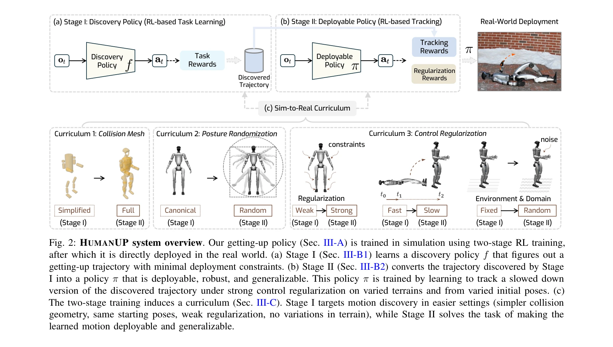
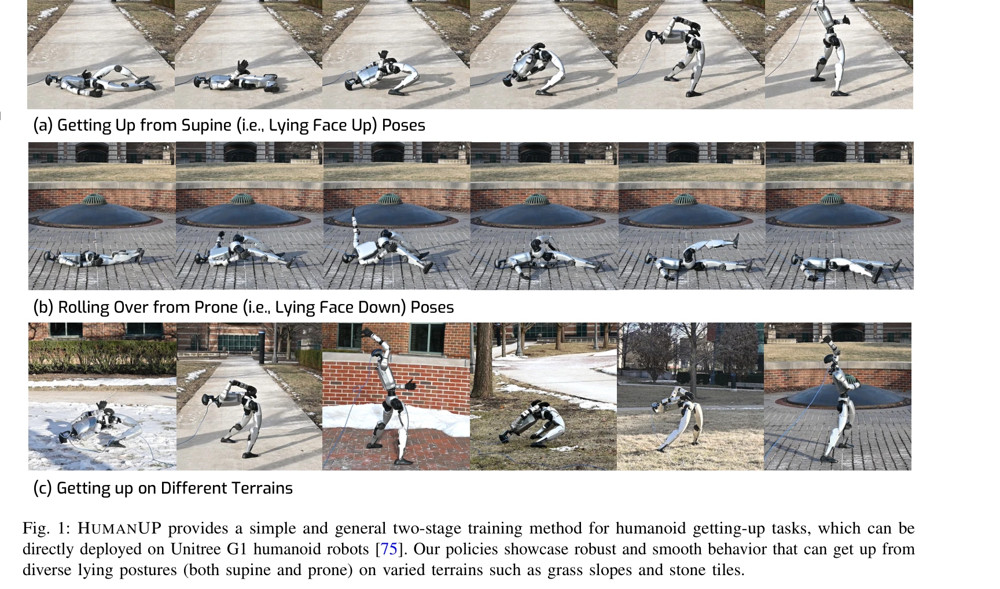

# Learning Getting-Up Policies for Real-World Humanoid Robots

> **저자**: Xialin He, Runpei Dong, Zixuan Chen, Saurabh Gupta | **날짜**: 2025-02-17 | **URL**: [https://arxiv.org/abs/2502.12152](https://arxiv.org/abs/2502.12152)

---

## Essence

*Fig. 2: HUMANUP system overview. Our getting-up policy (Sec. III-A) is trained in simulation using two-stage RL training*

휴머노이드 로봇의 낙상 복구를 위해 두 단계 강화학습 프레임워크(HUMANUP)를 제시하여 다양한 자세와 지형에서 일어나는 동작을 학습하고 실제 G1 로봇에 배포했다.

## Motivation

- **Known**: 휴머노이드 로봇을 위한 학습 기반 제어는 보행 같은 주기적 동작에서 성공했으나, 복잡한 접촉 패턴과 희소한 보상을 요구하는 일어나기 작업은 미탐색 분야다.
- **Gap**: 기존 보행 학습 방법을 일어나기 작업에 직접 적용하기 어려운 이유는 비주기적 동작, 풍부한 접촉 패턴, 희소한 보상이라는 세 가지 본질적 차이가 있기 때문이다.
- **Why**: 휴머노이드 로봇이 다양한 환경에서 안정적으로 배포되려면 자동 낙상 복구 능력이 필수적이며, DARPA Robotics Challenge에서 56%의 시도가 인간 개입 없이 복구되지 못했다.
- **Approach**: Stage I에서는 제약 없이 일어나기 궤적을 발견하고, Stage II에서는 발견된 궤적을 추적하는 방식으로 배포 가능한 정책으로 변환하는 커리큘럼 학습을 수행한다.

## Achievement

*Fig. 1: HUMANUP provides a simple and general two-stage training method for humanoid getting-up tasks, which can be*

- **실제 로봇 배포 성공**: G1 휴머노이드 로봇이 supine(누운 상태)과 prone(엎드린 상태) 자세에서 6가지 지형(평탄, 변형 가능, 미끄러운 표면, 경사)에서 일어나기에 성공
- **제조사 컨트롤러 능력 확대**: 기존 G1의 수동 설계 컨트롤러(평탄면 supine만 가능)보다 훨씬 넓은 범위의 자세와 지형 지원
- **인간 규모 로봇의 첫 번째 사례**: 인간 규모 휴머노이드 로봇에서 학습된 일어나기 정책의 첫 번째 성공적 실제 시연

## How

*Fig. 2: HUMANUP system overview. Our getting-up policy (Sec. III-A) is trained in simulation using two-stage RL training*

- **Stage I (Discovery Policy)**: 최소한의 제약(부드러움, 속도/토크 제한 없음)으로 task reward를 통해 일어나기 궤적 발견, 단순화된 충돌 기하학과 정규화된 초기 자세 사용
- **Stage II (Deployable Policy)**: Stage I에서 발견한 궤적의 느린 버전을 추적하도록 강한 제어 정규화(control regularization) 하에서 학습, 다양한 지형과 초기 자세로 domain randomization 적용
- **커리큘럼 구성**: 충돌 메시 단순화→완전화, 정규화된→무작위 초기 자세, 약한→강한 제어 정규화, 고정→무작위 환경으로 진행
- **Sim-to-Real 전이**: 시뮬레이션에서만 학습하고 실제 로봇에 직접 배포, 도메인 무작위화로 현실 편차 대응

## Originality

- 보행과 달리 비주기적이고 접촉이 풍부한 일어나기 작업의 고유한 특성을 명확히 규정하고 이를 해결하기 위한 전문화된 프레임워크 제시
- 두 단계 커리큘럼의 역설적 설계: 작업 난도는 쉬운→어려운(보상 밀도), 제약은 약한→강한(정규화)으로 진행
- 접촉이 풍부한 전신 동작 학습에 대한 시뮬레이션 모델링 방법론(정확한 충돌 기하학, 작은 시뮬레이션 스텝) 기여

## Limitation & Further Study

- 두 가지 자세(supine, prone)만 다루며, 옆으로 누운 상태(lateral) 등 다른 자세로의 확장 미흡
- 6가지 지형 테스트는 제한적이며, 더 극단적인 환경(가파른 경사, 진흙, 물)에서의 성능 불명확
- Stage I과 Stage II 사이의 전이 메커니즘(궤적 슬로우다운, 추적 거리) 설계의 자동화 부재로 수동 튜닝 필요 가능성
- 실패 케이스 분석 부족: 정책이 실패하는 초기 자세나 지형 조건에 대한 체계적 분석 필요
- 계산 비용 분석 미흡: 두 단계 학습의 총 시간, 환경 상호작용 수 등 정량적 정보 부족

## Evaluation

- Novelty: 4/5
- Technical Soundness: 3/5
- Significance: 4/5
- Clarity: 4/5
- Overall: 4/5

**총평**: 휴머노이드 로봇 낙상 복구는 중요하면서도 미탐색된 문제이며, 이 논문은 작업 특성을 정확히 파악하고 실용적 커리큘럼 학습을 통해 인간 규모 로봇에서 처음 성공적인 실제 배포를 시연했다. 기술적 기여도 있지만 평가 범위의 한계와 설계 선택의 일반화 가능성에 대한 추가 검증이 필요하다.

## Related Papers

- 🔄 다른 접근: [[papers/2058_Learning_Humanoid_Standing-up_Control_across_Diverse_Posture/review]] — 두 논문 모두 휴머노이드의 일어서기 동작을 다루지만 HoST는 단일 프레임워크로 HUMANUP은 두 단계 접근법을 사용한다.
- 🔗 후속 연구: [[papers/2068_Learning_to_Get_Up_Across_Morphologies_Zero-Shot_Recovery_wi/review]] — 단일 로봇의 낙상 복구에서 여러 형태의 로봇에서 작동하는 통합 정책으로의 일반화를 보여준다.
- 🏛 기반 연구: [[papers/1661_SafeFall_Learning_Protective_Control_for_Humanoid_Robots/review]] — 낙상 상황에서의 보호적 제어 학습이 낙상 후 복구 정책 학습의 안전성 기반을 제공한다.
- 🧪 응용 사례: [[papers/1639_Residual_Off-Policy_RL_for_Finetuning_Behavior_Cloning_Polic/review]] — Learning Getting-Up Policies의 실제 휴머노이드 기립 정책 학습이 본 논문의 residual off-policy RL 방법론의 실제 적용 사례임
- 🔗 후속 연구: [[papers/1905_Embedding_Classical_Balance_Control_Principles_in_Reinforcem/review]] — 실제 휴머노이드 로봇의 일어서기 정책 학습 연구가 낙상 회복의 다중접촉 일어서기 능력을 실제 환경에서 확장 적용할 수 있는 방향을 제시한다.
- 🔗 후속 연구: [[papers/1976_HiFAR_Multi-Stage_Curriculum_Learning_for_High-Dynamics_Huma/review]] — 일어서기 정책 학습의 기초를 다단계 커리큘럼을 통한 낙상 회복까지 확장한 HiFAR의 발전된 형태다.
- 🏛 기반 연구: [[papers/2058_Learning_Humanoid_Standing-up_Control_across_Diverse_Posture/review]] — 실제 휴머노이드를 위한 일어서기 정책 학습의 기본 원리가 HoST의 다양한 자세 대응 능력에 대한 이론적 토대를 제공한다.
- 🔗 후속 연구: [[papers/2068_Learning_to_Get_Up_Across_Morphologies_Zero-Shot_Recovery_wi/review]] — 단일 로봇 낙상 복구에서 여러 형태의 로봇에서 작동하는 통합 정책으로 일반화되어 범용성을 보여준다.
- 🔗 후속 연구: [[papers/2171_Unified_Humanoid_Fall-Safety_Policy_from_a_Few_Demonstration/review]] — 실제 휴머노이드 로봇을 위한 일어나기 정책 학습이 통합 낙상-안전 정책의 회복 단계를 실제 환경에서 더욱 견고하게 구현할 수 있습니다.
- 🧪 응용 사례: [[papers/2123_One-shot_Adaptation_of_Humanoid_Whole-body_Motion_with_Walki/review]] — Learning getting-up policies의 실제 humanoid 적용이 one-shot adaptation의 보행 사전 지식을 활용한 비보행 동작 학습의 구체적인 적용 사례입니다.
