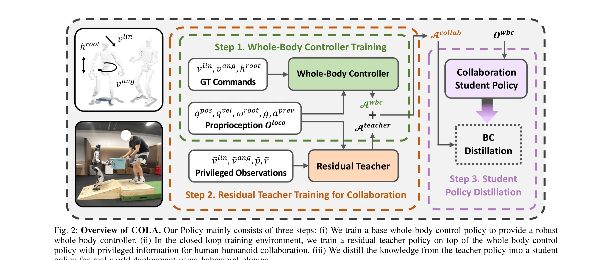
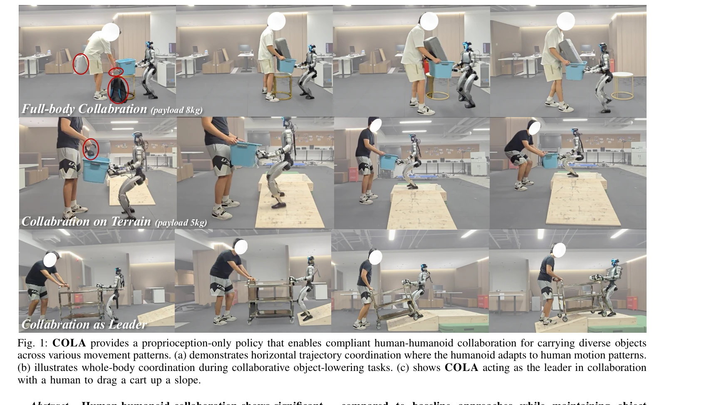

# Learning Human-Humanoid Coordination for Collaborative Object Carrying

> **저자**: Yushi Du, Yixuan Li, Baoxiong Jia, Yutang Lin, Pei Zhou, Wei Liang, Yanchao Yang, Siyuan Huang | **날짜**: 2025-10-16 | **DOI**: [10.48550/arXiv.2510.14293](https://doi.org/10.48550/arXiv.2510.14293)

---

## Essence

*Fig. 2: Overview of COLA. Our Policy mainly consists of three steps: (i) We train a base whole-body control policy to pr*

COLA는 proprioception만을 사용하는 reinforcement learning 기반의 정책으로, humanoid 로봇이 인간과 협력하여 물체를 운반할 때 적응적이고 안정적인 whole-body coordination을 가능하게 한다.

## Motivation

- **Known**: 로봇-인간 협력은 robotic arm에서 잘 개발되었으나, humanoid 로봇의 복잡한 whole-body dynamics로 인해 compliant human-humanoid collaboration은 미개척 영역이다. 기존 방법들은 model-based 접근이나 제한된 scope의 학습 기반 모델에 의존한다.
- **Gap**: Humanoid 로봇이 multiple terrain, diverse object types, dynamic role switching(leader/follower)을 모두 포함한 compliant collaborative carrying을 수행할 수 있는 unified framework이 부재하다.
- **Why**: Humanoid 로봇의 practical deployment를 위해 healthcare, domestic assistance, manufacturing 등 실생활 환경에서 인간과 자연스럽게 협력할 수 있는 능력이 필수적이다.
- **Approach**: Three-step training framework를 제안한다: (1) whole-body control policy 학습, (2) privileged object-state information을 사용한 residual teacher policy 학습, (3) proprioception-only student policy로의 behavioral cloning 기반 distillation을 수행하여, 실제 배포 시 external sensor 없이 작동 가능하게 한다.

## Achievement

*Fig. 1: COLA provides a proprioception-only policy that enables compliant human-humanoid collaboration for carrying dive*

- **시뮬레이션 성능**: 인간의 물리적 부담을 기존 방법 대비 24.7% 감소, 10.2 cm/s의 선형 속도 추적 오차와 0.1 rad/s의 각속도 추적 오차로 정밀한 조정 달성
- **실제 환경 검증**: boxes, desks, stretchers 등 다양한 물체 유형과 straight-line, turning, slope climbing 등 다양한 이동 패턴에서 robust collaborative carrying 달성
- **사용자 연구**: 23명의 참가자 대상 human user study에서 기존 모델 대비 평균 27.4% 개선된 compliant collaboration 확인
- **실용성**: External sensor나 복잡한 interaction model 없이 proprioception만으로 작동하는 실용적 솔루션 제시

## How

*Fig. 2: Overview of COLA. Our Policy mainly consists of three steps: (i) We train a base whole-body control policy to pr*

- Joint state offset을 interaction force 추정의 proxy로 활용하는 residual 학습 방식 도입
- Carried object의 state를 implicit collaboration constraint(안정성, 좌표)로 인코딩
- Teacher-student framework: teacher는 privileged information으로 학습, student는 distillation을 통해 proprioception-only로 변환
- Velocity command를 통한 role allocation 제어(zero velocity = following)
- Closed-loop training environment에서 dynamic object interaction을 명시적으로 모델링
- Whole-body controller 기반의 base policy에 residual policy 추가하여 안정성과 적응성 동시 달성

## Originality

- Humanoid의 whole-body coordination을 위한 unified proprioception-only 정책 제안으로, 기존의 제한된 scope의 모델-기반 또는 부분적 학습 기반 접근과 차별화
- Joint state offset을 implicit force proxy로 사용하는 novel design으로 explicit force sensing 없이 compliant collaboration 구현
- Teacher-student distillation framework를 통해 privileged information 기반 학습과 실제 배포의 갭을 해결
- Leader-follower role switching을 velocity command로 간단히 제어하면서도 복잡한 interaction을 암묵적으로 학습하는 방식

## Limitation & Further Study

- 시뮬레이션-실제 환경 갭(sim-to-real gap)을 완전히 해결하지 못했으며, 실제 환경에서의 성능이 시뮬레이션보다 낮을 수 있음
- Student policy distillation 시 information loss로 인한 성능 저하 가능성이 명시적으로 논의되지 않음
- 인간 파트너의 움직임 의도 예측이 '암묵적(implicit)' 학습에 의존하므로, 예측 실패 시 대응 메커니즘이 불명확", 'Real-world 실험이 제한된 시나리오(23명 사용자, 특정 물체 유형)에서만 수행되었으므로 일반화 가능성의 완전한 입증 필요
- 후속 연구: (1) More challenging terrains와 환경에서의 성능 평가, (2) 인간 의도 예측 성능 명시적 분석, (3) Multi-agent collaboration으로의 확장, (4) Physical HRI safety 평가 강화

## Evaluation

- Novelty: 4/5
- Technical Soundness: 4/5
- Significance: 4/5
- Clarity: 4/5
- Overall: 4/5

**총평**: COLA는 humanoid-human collaborative carrying이라는 실용적 과제에 대해 proprioception-only 정책으로 완전한 솔루션을 제시하며, three-step training framework와 implicit force modeling을 통해 높은 독창성을 보여준다. 시뮬레이션과 실제 환경에서 동시에 검증된 결과는 실제 배포 가능성을 시사하며, human user study를 통한 compliant collaboration 확인으로 실무적 가치를 입증한다.
