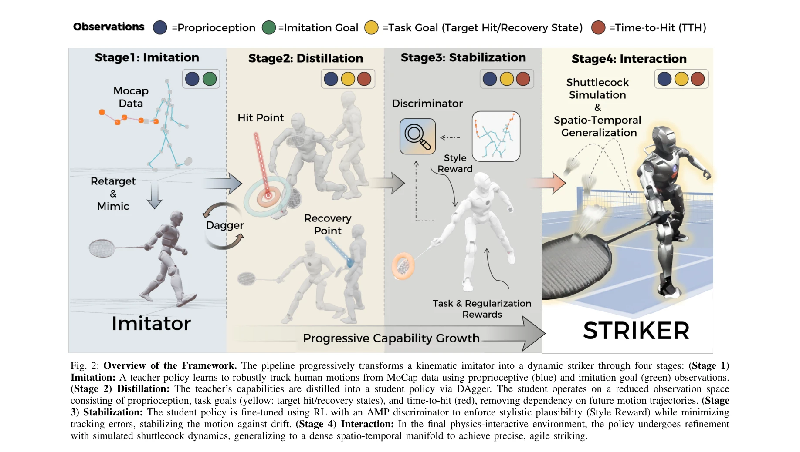
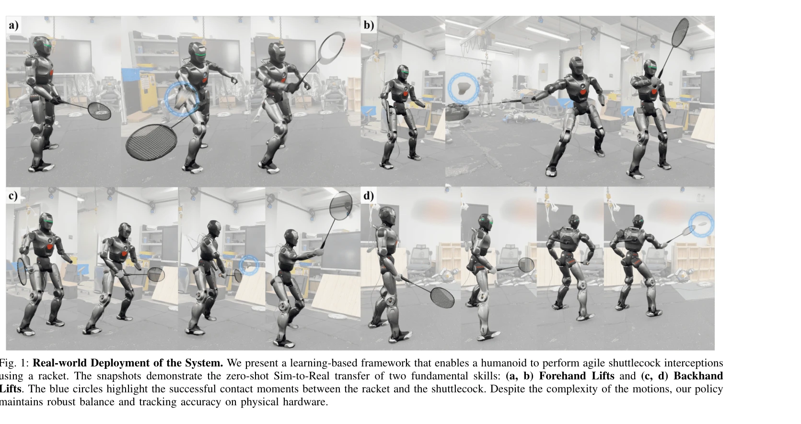

# Learning Human-Like Badminton Skills for Humanoid Robots

> **저자**: Yeke Chen, Shihao Dong, Xiaoyu Ji, Jingkai Sun, Zeren Luo, Liu Zhao, Jiahui Zhang, Wanyue Li, Ji Ma, Bowen Xu, Yimin Han, Yudong Zhao, Peng Lu | **날짜**: 2026-02-09 | **DOI**: [10.48550/arXiv.2602.08370](https://doi.org/10.48550/arXiv.2602.08370)

---

## Essence

*Fig. 2: Overview of the Framework. The pipeline progressively transforms a kinematic imitator into a dynamic striker thr*

휴머노이드 로봇이 배드민턴 기술을 습득하도록 하는 Imitation-to-Interaction 점진적 강화학습 프레임워크를 제안하며, 시뮬레이션에서 실제 로봇으로의 제로샷 sim-to-real 전이를 달성했다.

## Motivation

- **Known**: 휴머노이드 로봇은 복잡한 전신 운동 모방이나 정적 조작은 가능하지만, 인간답고 기능적인 동적 상호작용을 동시에 달성하기 어렵다. 최근 AMP 등 모션 프라이어 기반 학습과 스포츠 로보틱스 연구가 진행되었다.
- **Gap**: 기존 연구는 운동학적 모방과 물리 기반 상호작용 사이의 간격을 극복하지 못했으며, 배드민턴처럼 정확한 타이밍, 높은 속도, 전신 협응이 모두 필요한 도전적 스포츠에서 인간답고 기능적인 성능을 실현하지 못했다.
- **Why**: 배드민턴은 explosive whole-body coordination과 timing-critical interception을 동시에 요구하는 최고난도 스포츠로, 로봇의 지각-의사결정-운동 실행의 통합을 테스트하는 이상적인 벤치마크이며, 성공하면 범용 로봇 능력 향상에 기여할 수 있다.
- **Approach**: 4단계 파이프라인으로 (1) 모션 캡처 데이터로부터 robust motor prior 학습, (2) goal-conditioned distillation을 통해 Time-to-Hit, Target Hit State 등 model-based state representation으로 압축, (3) AMP를 활용한 안정화, (4) manifold expansion 전략으로 희소 데이터를 밀집 상호작용 볼륨으로 일반화하여 '모방자'에서 '타격 수행자'로 진화시킨다.

## Achievement

*Fig. 1: Real-world Deployment of the System. We present a learning-based framework that enables a humanoid to perform ag*

- **제로샷 sim-to-real 전이**: 배드민턴 기술의 첫 번째 전신 zero-shot sim-to-real 전이를 물리 휴머노이드 로봇에서 성공적으로 달성
- **다양한 기술 습득**: Forehand Lift, Backhand Lift, Drop Shot 등 다양한 배드민턴 기술을 시뮬레이션에서 습득 및 실제 환경에서 실행
- **인간다운 동작 유지**: 기능적 정확성을 확보하면서도 kinetic elegance와 biomechanically efficient posture 유지
- **희소 데이터 극복**: Manifold expansion 전략으로 제한된 전문가 시연(discrete strike points)을 밀집 상호작용 공간으로 일반화

## How

*Fig. 2: Overview of the Framework. The pipeline progressively transforms a kinematic imitator into a dynamic striker thr*

- **Stage 1 - Imitation**: Teacher policy가 MoCap 데이터에서 proprioceptive observation과 imitation goal을 활용해 전신 운동 추적
- **Stage 2 - Distillation**: DAgger를 통해 teacher 정책을 student policy로 증류하며, 관찰 공간을 proprioception + task goal (target hit/recovery state) + Time-to-Hit로 축소하여 미래 궤적에 대한 의존성 제거
- **Stage 3 - Stabilization**: AMP discriminator를 사용한 RL fine-tuning으로 style reward 적용하여 인간다운 스타일 유지 및 추적 오차 최소화
- **Stage 4 - Interaction**: 물리 시뮬레이션 환경에서 shuttlecock dynamics와의 상호작용을 통해 정책을 시간-공간 밀집 manifold로 일반화
- **Manifold Expansion**: 희소한 데이터 샘플을 밀집 상호작용 볼륨으로 확장하여 정확한 타이밍 및 위치 달성 가능하게 함

## Originality

- **Imitation-to-Interaction 프레임워크**: 운동학적 모방에서 물리 기반 상호작용으로의 점진적 전환 구조가 혁신적
- **Model-based State Representation**: Time-to-Hit, Target Hit State, Target Recovery State 등 모션 프라이어를 보존하는 특화된 상태 표현 설계
- **Manifold Expansion 전략**: 희소 expert demonstration을 밀집 상호작용 공간으로 일반화하는 새로운 접근법
- **End-to-end Zero-shot Sim-to-Real**: 배드민턴 스포츠 도메인에서 인간다운 전신 협응의 첫 번째 성공적 sim-to-real 전이

## Limitation & Further Study

- **환경 변동성**: 실험이 제한된 배드민턴 시나리오에서만 검증되었으며, 서로 다른 로봇 플랫폼이나 환경 조건에서의 일반화 가능성 미검증
- **상대 플레이어 부재**: 배드민턴의 핵심인 상대방과의 동적 상호작용 및 적응 전략이 포함되지 않음
- **shuttlecock 모델링**: 실제 shuttlecock의 복잡한 공기역학을 완전히 포함하지 못했을 가능성
- **확장성 한계**: 복잡한 4단계 파이프라인으로 인한 학습 비용과 새로운 스포츠 또는 기술로의 전이 가능성 불명확
- **후속 연구 방향**: (1) 다중 에이전트 시나리오에서의 경쟁적 상호작용 학습, (2) 더 다양한 환경 조건에서의 robust transfer, (3) 온라인 적응 메커니즘 추가

## Evaluation

- Novelty: 4/5
- Technical Soundness: 3/5
- Significance: 4/5
- Clarity: 4/5
- Overall: 4/5

**총평**: 휴머노이드 로봇 스포츠 제어의 새로운 경계를 개척한 혁신적 연구로, Imitation-to-Interaction 프레임워크와 manifold expansion 전략은 희소한 전문가 데이터에서 고도로 정밀하고 인간다운 운동을 학습하는 강력한 솔루션을 제시한다. 제로샷 sim-to-real 전이의 성공은 실용적 가치가 높으나, 상대방 상호작용과 환경 변동성 측면의 제한이 남아 있다.
