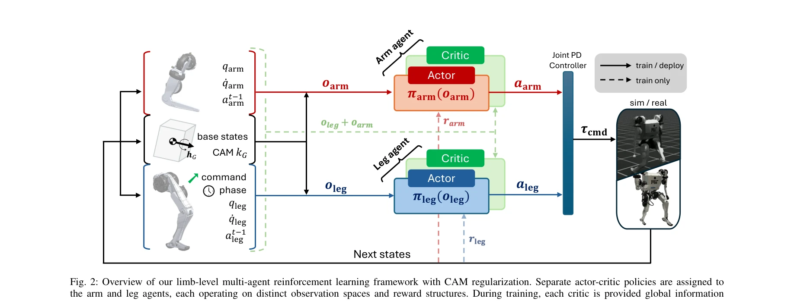
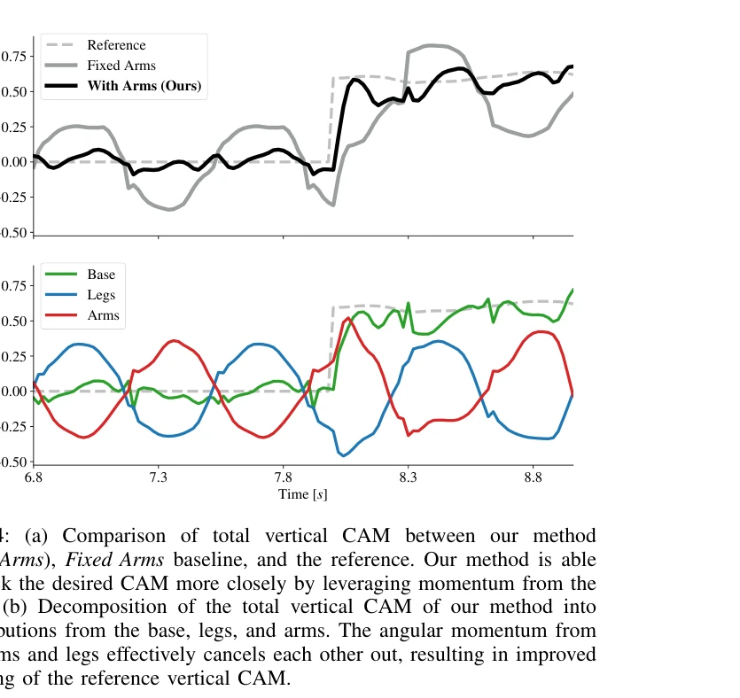

# Learning Humanoid Arm Motion via Centroidal Momentum Regularized Multi-Agent Reinforcement Learning

> **저자**: Ho Jae Lee, Se Hwan Jeon, Sangbae Kim | **날짜**: 2025-07-05 | **URL**: [https://arxiv.org/abs/2507.04140](https://arxiv.org/abs/2507.04140)

---

## Essence

*Fig. 2: Overview of our limb-level multi-agent reinforcement learning framework with CAM regularization. Separate actor-*

인간의 팔 스윙 운동에서 영감을 받아, centroidal angular momentum (CAM) 추적 보상을 통해 다리와 팔을 별도의 에이전트로 취급하는 multi-agent RL 프레임워크를 제시하여 휴머노이드 로봇의 협응 제어를 달성한다.

## Motivation

- **Known**: 인간은 보행 중 자연스럽게 팔을 흔들어 각운동량을 감소시키고 균형을 유지하며, 기존 방법들은 전체 신체 최적화 또는 모방 학습으로 팔-다리 운동을 통합적으로 제어해왔다.
- **Gap**: 기존 RL 방법은 팔과 다리의 충돌하는 보상으로 인해 계획이 어렵고, 모델 기반 제어는 계산 비용이 높으며, 팔 운동 가이드에 물리적 근거가 부족한 휴리스틱만 사용해왔다.
- **Why**: 팔 운동의 명시적 제어는 보행 안정성, 외부 교란 복구, 에너지 효율 개선에 중요하며, 실제 휴머노이드 플랫폼에서 다양한 보행 작업에 강건한 성능을 제공할 수 있다.
- **Approach**: Centralized Training with Decentralized Execution (CTDE) 패러다임 하에서 팔과 다리 에이전트는 기저 상태와 CAM만 공유하는 분산형 배우를 가지며, 중앙화된 비평가는 전역 정보에 접근하여 CAM 추적 및 감쇠 보상으로 팔 운동을 명시적으로 유도한다.

## Achievement

*Fig. 4: (a) Comparison of total vertical CAM between our method*

- **CAM 기반 보상 설계**: 생역학적 연구에 기초한 centroidal angular momentum 추적 및 감쇠 보상이 자연스러운 팔 스윙과 안정적인 보행을 유도한다.
- **Multi-agent RL 프레임워크**: 팔과 다리를 별도 에이전트로 취급하면서 CAM을 통해 암묵적으로 결합하는 CTDE 기반 구조로 수렴 속도와 성능을 향상시킨다.
- **하드웨어 검증**: 시뮬레이션과 실제 휴머노이드 플랫폼에서 평지 보행, 불규칙 지형, 계단 오르기 등 다양한 작업에서 강건한 성능을 달성한다.

## How

*Fig. 2: Overview of our limb-level multi-agent reinforcement learning framework with CAM regularization. Separate actor-*

- Centroidal momentum matrix (CMM)를 통해 전체 신체 동역학을 CAM과 centroidal linear momentum (CLM)으로 나타낸다.
- 팔 에이전트와 다리 에이전트의 분리된 actor-critic 네트워크 구조를 구성하며, 각 actor는 로컬 관찰값만 사용한다.
- 중앙화된 critic은 전역 상태 정보(기저 상태, CAM, 모든 관찰값 및 행동)에 접근하여 training 중 안정성을 확보한다.
- 팔 에이전트의 보상 함수에 CAM 추적 오차와 CAM의 시간 미분값 제어를 포함하여 각운동량 감소를 명시적으로 유도한다.
- Proximal Policy Optimization (PPO) 등의 actor-critic 알고리즘을 multi-agent 정책 그래디언트 형식에 적용하여 학습한다.

## Originality

- CAM을 신호로 사용하는 암묵적 에이전트 결합: 기존 multi-agent RL의 명시적 통신 대신 centroidal dynamics의 물리적 의미를 활용한 참신한 접근이다.
- 생역학 원리 기반 보상: 인간 보행의 팔 스윙이 각운동량 감소에 기여한다는 생물학적 증거를 RL 보상으로 직접 변환하였다.
- CTDE 패러다임의 적용: 분산형 배우와 중앙화된 비평가의 조합으로 다중 에이전트 수렴 문제를 해결하면서도 배포 시 분산형 실행을 유지한다.
- limb-level 분리: 뇌의 별도 피질 영역에서 팔과 다리 제어가 나온다는 신경과학적 영감을 공학적으로 구현하였다.

## Limitation & Further Study

- CAM 기반 보상의 일반화: 다양한 로봇 형태나 질량 분포에서 CAM 추적 가중치가 어떻게 변해야 하는지 명확하지 않다.
- 학습 초기 수렴 속도: 두 에이전트의 비정상성(non-stationarity) 문제가 완전히 해결되지는 않으며, 학습 초기 단계의 불안정성이 존재할 수 있다.
- 상태 추정 노이즈: 실제 하드웨어에서 CAM과 기저 상태 추정의 노이즈에 대한 강건성 분석이 제한적이다.
- 복잡한 조작 작업으로의 확장: loco-manipulation과 같이 팔과 다리가 완전히 다른 목표를 가지는 경우의 적용성이 미검증이다.
- 후속 연구 방향: (1) 다양한 로봇 플랫폼에 대한 일반화 (2) CAM 외 추가 물리량(관성 매트릭스 등)을 신호로 활용 (3) 복합 작업 환경에서의 다중 목표 최적화

## Evaluation

- Novelty: 4/5
- Technical Soundness: 4/5
- Significance: 4/5
- Clarity: 4/5
- Overall: 4/5

**총평**: 본 논문은 centroidal dynamics의 물리적 의미와 생역학적 원리를 CTDE 기반 multi-agent RL과 효과적으로 결합하여, 휴머노이드 로봇의 자연스러운 팔 스윙과 향상된 균형 제어를 달성한 독창적이고 실용적인 연구이다.
