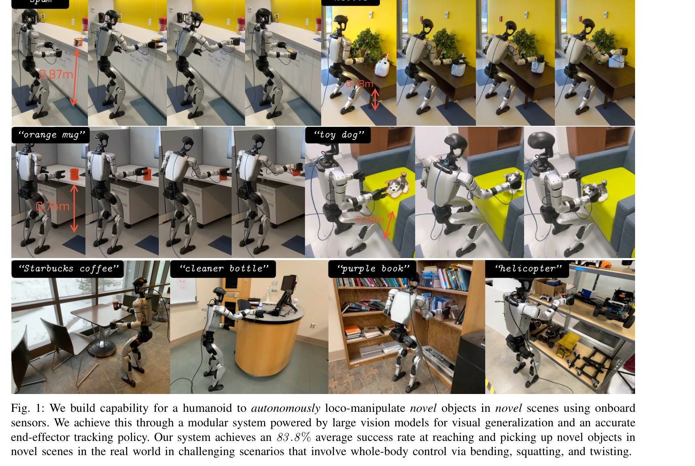
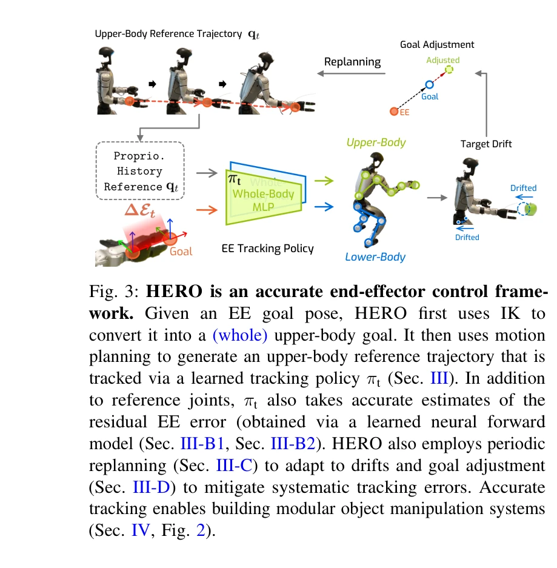

# Learning Humanoid End-Effector Control for Open-Vocabulary Visual Loco-Manipulation

> **저자**: Runpei Dong, Ziyan Li, Xialin He, Saurabh Gupta | **날짜**: 2026-02-24 | **DOI**: [10.48550/arXiv.2602.16705](https://doi.org/10.48550/arXiv.2602.16705)

---

## Essence

*Fig. 2: Overall architecture for our proposed modular system for open-vocabulary object grasping. Given a free-form*

HERO 시스템은 정확한 end-effector 추적 정책과 대규모 비전 모델을 결합하여 휴머노이드 로봇이 미지의 환경에서 임의의 일상용품을 자율적으로 집을 수 있게 한다. End-effector 추적 오차를 3.2배 감소시키고 83.8%의 성공률을 달성했다.

## Motivation

- **Known**: 휴머노이드 로봇은 end-to-end imitation learning으로 loco-manipulation을 학습해왔으나, 대규모 실제 데이터 수집의 어려움으로 인해 미지 환경에서의 일반화 능력이 제한적이다. 기존 end-effector 추적 방법은 8-13cm의 큰 추적 오차를 보인다.
- **Gap**: 현재 방법들은 정확한 end-effector 제어 능력이 부족하여 모듈식 시스템을 통한 고일반화 humanoid 조작이 불가능했다. RGB-D 센서 기반의 복잡한 장면 이해와 mm 단위의 정밀 조작을 동시에 요구하는 문제가 미해결 상태였다.
- **Why**: 휴머노이드 로봇의 일상 환경 자율 조작은 로봇의 실생활 응용을 위해 필수적이며, 정확한 low-level 제어와 강한 visual 일반화 능력의 결합은 대규모 데이터셋 수집 없이도 확장 가능한 시스템 구축을 가능하게 한다.
- **Approach**: 모듈식 아키텍처를 채택하여 open-vocabulary large vision models (Grounding DINO, SAM, AnyGrasp)로 객체 감지와 grasp 생성을 수행하고, 정밀한 end-effector 추적 정책(HERO)을 low-level 제어기로 사용하여 두 계층을 분리한다.

## Achievement

*Fig. 1: We build capability for a humanoid to autonomously loco-manipulate novel objects in novel scenes using onboard*

- **End-effector 추적 오차 개선**: 기존 8-13cm에서 시뮬레이션 2.5cm, 실제 환경 2.44cm로 개선(3.2배 감소)
- **실제 환경 성공률**: 10개 일상용품에서 90%, 다양한 scene에서 73.3%, 복잡한 장면에서 80%의 pick-up 성공률 달성
- **높이 범위 확대**: 43-92cm 높이 범위의 다양한 surface에서 안정적 조작 가능
- **Open-vocabulary 일반화**: 대규모 pre-trained vision models 활용으로 미지 객체와 미지 환경에서의 강한 일반화 성능

## How

*Fig. 3: HERO is an accurate end-effector control frame-*

- **Inverse kinematics (IK)**: end-effector 목표를 upper-body reference trajectory로 변환
- **Neural forward kinematics model**: 저비용 humanoid의 부정확한 analytical forward kinematics를 보정하여 base 대비 EE 위치 추정
- **Neural odometry model**: 정지한 발(stationary feet) 대비 base 위치의 정확한 추정
- **Learned tracking policy πt**: reference joint와 residual EE 오차를 입력으로 받아 whole-body control 수행(sim2real transfer 적용)
- **Periodic replanning**: 추적 과정 중 drift에 대응하기 위한 주기적 재계획
- **Goal adjustment**: 현재 EE 추적 오차에 기반한 target pose 조정으로 systematic 오차 완화
- **Grasp retargeting**: 병렬 jaw gripper용 grasp를 Dex-3 hand로 retarget
- **Motion planning (cuRobo)**: upper-body trajectory 생성

## Originality

- **Residual-aware end-effector tracking의 새로운 정의**: classical robotics (IK, motion planning)와 machine learning (learned forward models, tracking policy)의 창의적 결합
- **Neural forward kinematics와 odometry의 활용**: 저비용 로봇의 kinematic 부정확성을 DL로 보정하는 실용적 해법
- **Goal adjustment와 replanning 메커니즘**: closed-loop에서 누적되는 오차를 체계적으로 감소시키는 설계
- **모듈식 아키텍처의 효율적 구현**: vision-planning-control의 명확한 분리로 각 모듈의 장점(일반화, 정밀성)을 최대화

## Limitation & Further Study

- **데이터셋 의존성**: sim2real transfer의 성공이 시뮬레이션 환경의 정확한 dynamics 모델링에 의존하며, low-cost Unitree G1의 실제 특성 편차 미처리
- **Gripper 한정성**: Dex-3 hand 기반이므로 다양한 gripper 형태로의 확장성 미검증
- **복잡한 장면 성능**: cluttered scene에서 80% 성공률로 깔끔한 장면(90%)보다 크게 저하
- **동적 환경 부재**: 모든 테스트가 정적 환경(테이블 위 고정 객체)에서만 수행되어 moving target이나 interactive 객체 미처리
- **계산 복잡도**: motion planning, forward kinematics inference 등 multiple models의 sequential 실행으로 실시간 성능 미분석
- **후속 연구**: (1) 다양한 hand morphology에 대한 grasp retargeting 일반화, (2) dynamic scene과 moving target 지원, (3) end-to-end 학습과의 성능 비교, (4) 더 복잡한 manipulation (pushing, in-hand manipulation) 확장

## Evaluation

- Novelty: 4/5
- Technical Soundness: 3/5
- Significance: 4/5
- Clarity: 4/5
- Overall: 4/5

**총평**: 본 논문은 정확한 end-effector 제어의 기술적 난제를 classical robotics와 학습 기반 모듈의 창의적 결합으로 해결하고, 이를 통해 humanoid의 실제 환경 object manipulation을 처음으로 현실화했다. 모듈식 설계로 대규모 실제 데이터 수집 없이도 open-vocabulary 일반화를 달성한 점이 특히 의미 있으며, 83.8%의 실제 환경 성공률은 해당 분야의 significant advance를 나타낸다.

## Related Papers

- 🏛 기반 연구: [[papers/1747_VIGOR_Visual_Goal-In-Context_Inference_for_Unified_Humanoid/review]] — 비전 기반 목표 추론의 원리가 HERO 시스템의 open-vocabulary 객체 인식 및 조작에 대한 이론적 토대를 제공한다.
- 🔄 다른 접근: [[papers/1980_HiWET_Hierarchical_World-Frame_End-Effector_Tracking_for_Lon/review]] — end-effector 제어에서 HERO의 정확한 추적 정책 대신 계층적 world-frame 추적을 통한 다른 접근법을 제시한다.
- 🔗 후속 연구: [[papers/2115_OKAMI_Teaching_Humanoid_Robots_Manipulation_Skills_through_S/review]] — 정밀한 end-effector 추적을 인간 모션 데이터 기반 조작 기술과 결합하여 더 자연스럽고 효과적인 객체 조작을 구현할 수 있다.
- 🏛 기반 연구: [[papers/1750_Vision_in_Action_Learning_Active_Perception_from_Human_Demon/review]] — 인간 시연으로부터 능동적 인식을 학습하는 기본 방법론을 end-effector 제어에 적용
- 🔗 후속 연구: [[papers/1966_Hand-Eye_Autonomous_Delivery_Learning_Humanoid_Navigation_Lo/review]] — 시각 기반 객체 수집을 손-눈 협응 배달 시스템으로 확장한 종합적 접근
- 🏛 기반 연구: [[papers/2049_Learning_Differentiable_Reachability_Maps_for_Optimization-b/review]] — 도달성 맵 기반 최적화가 end-effector 추적의 효율적인 운동 계획에 이론적 기반을 제공한다.
- 🔄 다른 접근: [[papers/1900_EgoDex_Learning_Dexterous_Manipulation_from_Large-Scale_Egoc/review]] — 시각 기반 물체 집기에서 HERO는 정확한 추적에, EgoDex는 자기중심 시점 데이터에서의 학습에 중점을 둔다.
- 🔄 다른 접근: [[papers/1911_Emergent_Active_Perception_and_Dexterity_of_Simulated_Humano/review]] — open-vocabulary 시각 조작을 위한 휴머노이드 말단 장치 제어가 household tasks가 아닌 다른 도메인에서 시각 기반 조작을 다루는 접근을 제시한다.
- 🔗 후속 연구: [[papers/1980_HiWET_Hierarchical_World-Frame_End-Effector_Tracking_for_Lon/review]] — open-vocabulary visual manipulation을 위한 end-effector 제어 학습이 HiWET의 hierarchical tracking을 언어 이해와 결합합니다.
- 🧪 응용 사례: [[papers/2049_Learning_Differentiable_Reachability_Maps_for_Optimization-b/review]] — 최적화 기반 운동 계획에서 도출된 효율적인 제약 조건이 정확한 end-effector 추적을 요구하는 물체 집기 작업에 직접 적용된다.
