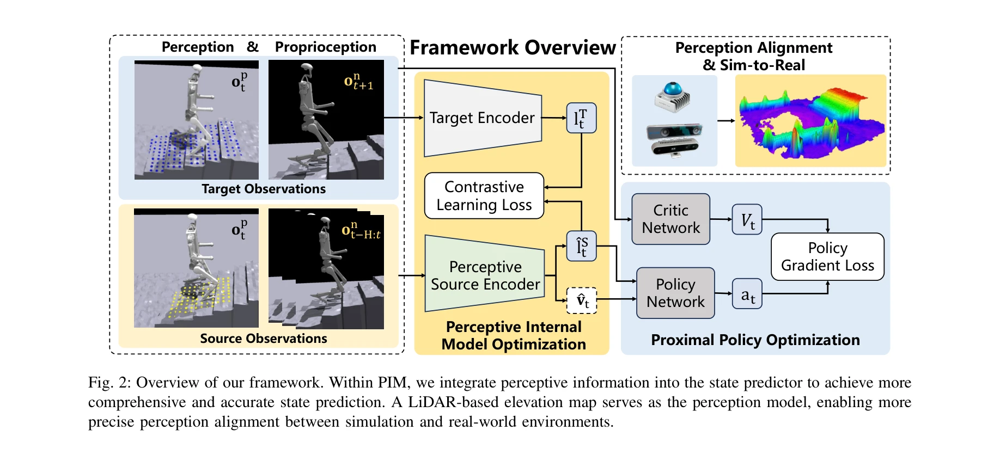
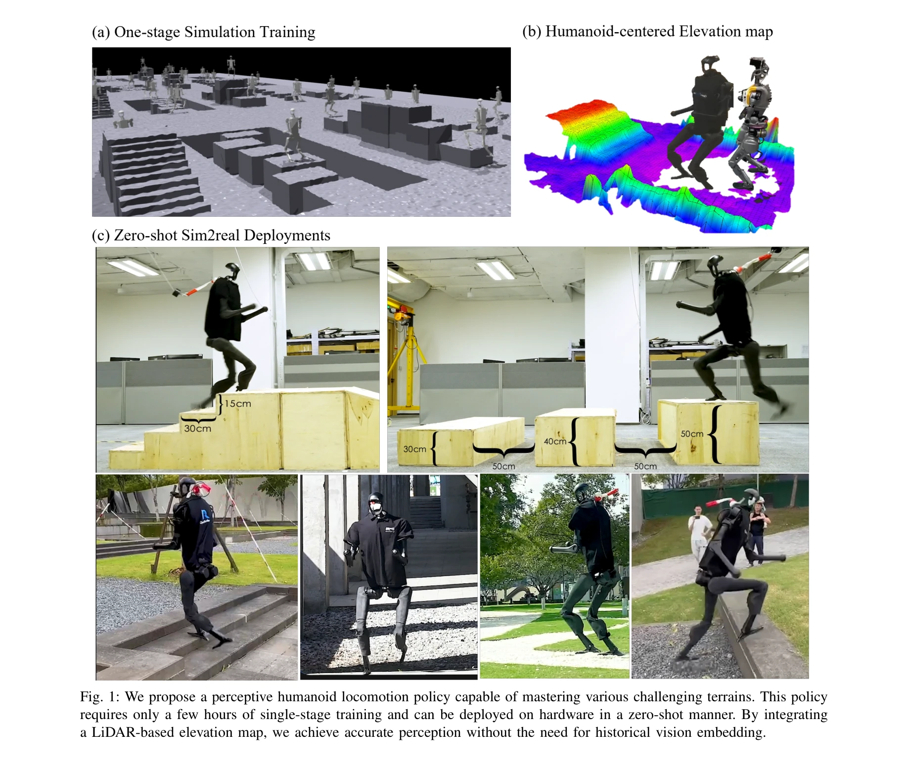
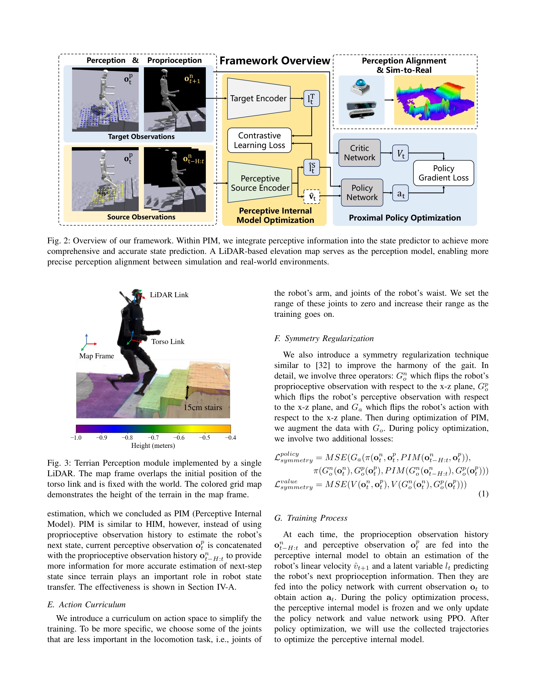

# Learning Humanoid Locomotion with Perceptive Internal Model

> **저자**: Junfeng Long, Junli Ren, Moji Shi, Zirui Wang, Tao Huang, Ping Luo, Jiangmiao Pang | **날짜**: 2024-11-21 | **URL**: [https://arxiv.org/abs/2411.14386](https://arxiv.org/abs/2411.14386)

---

## Essence

*Fig. 2: Overview of our framework. Within PIM, we integrate perceptive information into the state predictor to achieve m*

인간형 로봇의 안정적인 이동을 위해 온보드 elevation map을 기반으로 한 Perceptive Internal Model (PIM)을 제안하며, HIM을 확장하여 지각 정보를 통합한 단일 단계 학습 방법을 제시한다.

## Motivation

- **Known**: 사족 로봇은 '블라인드' 정책으로 다양한 지형을 네비게이션할 수 있지만, 인간형 로봇은 높은 자유도와 불안정한 형태로 인해 안정적인 이동을 위해 정확한 지각이 필수적이다.
- **Gap**: 기존 방법들은 깊이 맵이나 raw point cloud를 직접 인코딩하거나 다중 단계 학습을 사용하며, 계단 같은 미세한 발판이 필요한 지형에서 불충분한 성능을 보인다.
- **Why**: 인간형 로봇이 계단 연속 등반, 갭 또는 높은 플랫폼 등 도전적인 지형을 안정적으로 네비게이션할 수 있도록 하는 것은 휴머노이드 로봇 제어의 기초 알고리즘 개발에 중요하다.
- **Approach**: LiDAR 또는 RGB-D 카메라로부터 구성된 로봇 중심의 elevation map을 지각 정보로 사용하여 HIM 기반의 정책을 학습하고, 시뮬레이션에서 지면 높이를 직접 쿼리하여 깊이 맵 렌더링 없이 효율적으로 학습한다.

## Achievement

*Fig. 1: We propose a perceptive humanoid locomotion policy capable of mastering various challenging terrains. This polic*

- **효율적인 학습**: RTX 4090 GPU에서 3시간 내 단일 단계 정책 학습 완성 및 zero-shot 실제 배포 가능
- **높은 성공률**: 계단 연속 등반 시 90% 이상의 성공률, 갭, 고저차 플랫폼 등 다양한 도전적 지형 네비게이션
- **센서 강건성**: 카메라 움직임과 노이즈에 덜 민감한 elevation map 기반 접근으로 다양한 센서 구성(LiDAR, RGB-D) 지원
- **다중 로봇 검증**: Unitree H1, Fourier GR-1 등 다양한 인간형 로봇에서 유효성 입증

## How

*Fig. 3: Terrian Perception module implemented by a single*

- Hybrid Internal Model (HIM)을 기반으로 하여 batch-level contrastive learning을 통한 상태 예측
- 온보드 elevation map을 로봇 중심으로 연속 업데이트하여 발 아래 지형을 명확히 인식
- 시뮬레이션에서 ground-truth 장애물 높이 맵으로 정책 학습 후 실제 환경에서 구성된 elevation map의 높이 샘플링으로 추론
- PPO를 활용한 정책 최적화 with privileged information (critic이 학습 중 linear velocity 접근)
- 비지각 정보와 지각 정보를 분리하여 관리: on_t = [ct, ωt, gt, θt, θ̇t, at-1], op_t = [pt]

## Originality

- 깊이 맵 또는 raw point cloud 직접 인코딩 대신 robot-centered elevation map 기반의 새로운 지각 표현 방식 도입
- HIM의 batch-level contrastive learning을 지각 정보와 통합하여 단일 단계 학습으로 달성 (기존 다중 단계 training paradigm 회피)
- 로봇 odometry를 고려한 동적 elevation map 유지로 sim2real 갭 감소 및 도메인 적응 필요성 완화
- 시뮬레이션에서 깊이 렌더링 불필요로 인한 계산 비용 최소화와 학습 시간 대폭 단축

## Limitation & Further Study

- Elevation map 구성이 정확한 로봇 odometry에 의존하므로 odometry 오류 누적에 취약할 수 있음
- LiDAR와 RGB-D 카메라 외 다른 센서 모달리티에 대한 검증 부족
- 계단 너비, 높이 등의 극단적 환경 변화에 대한 일반화 성능 분석 미흡
- 후속 연구로 다중 센서 fusion, 동적 장애물 환경 대응, 보다 복잡한 실내 네비게이션 시나리오 확장 필요

## Evaluation

- Novelty: 4/5
- Technical Soundness: 3/5
- Significance: 4/5
- Clarity: 4/5
- Overall: 4/5

**총평**: 본 논문은 elevation map 기반 지각 모듈을 HIM과 통합하여 인간형 로봇의 복잡한 지형 네비게이션을 단일 단계로 효율적으로 학습하는 실질적이고 우수한 방법을 제시하며, 다양한 로봇과 지형에서의 광범위한 검증을 통해 실용성을 입증한다.
