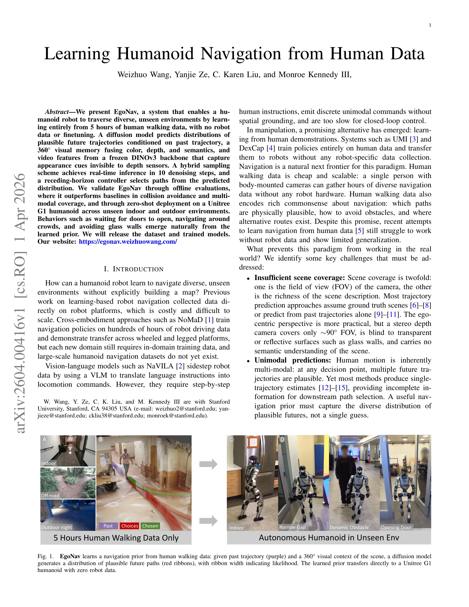
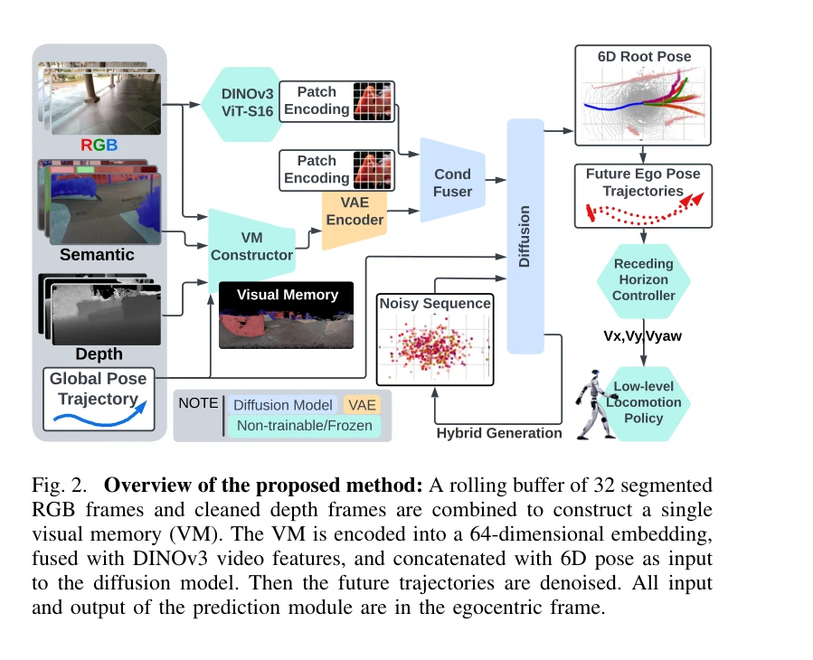

# Learning Humanoid Navigation from Human Data

> **저자**:  | **날짜**: 2026-04-01 | **URL**: [https://arxiv.org/abs/2604.00416](https://arxiv.org/abs/2604.00416)

---

## Essence

*Fig. 1.*

인간 보행 데이터 5시간으로만 학습하여 휴머노이드 로봇이 미지의 환경을 자율 내비게이션할 수 있는 EgoNav 시스템을 제안. 360° 시각 메모리와 diffusion model을 통해 다중모달 궤적 분포를 생성하고 로봇에 직접 배포 가능.

## Motivation

- **Known**: 기존 학습 기반 로봇 내비게이션은 로봇 데이터를 직접 수집해야 하거나 대규모 로봇 데이터셋이 필요했으며, 조작 분야에서는 인간 데모 학습이 성공했지만 내비게이션 분야에는 제한적으로만 적용되었다.
- **Gap**: 인간 데이터로부터 학습한 내비게이션 정책이 다중모달 경로 예측, 360° 환경 이해(유리벽 등 depth 센서 불가시 영역), 구현화 간격(embodiment gap) 해결 없이 로봇 배포에 성공한 사례가 부재하다.
- **Why**: 인간 보행 데이터는 저비용이고 확장 가능하며 상식적 내비게이션 지식을 포함하고 있어, 로봇별 데이터 수집 부담을 제거함으로써 휴머노이드 로봇의 실제 배포를 가속화할 수 있다.
- **Approach**: RGB, depth, semantic을 융합한 360° panoramic visual memory와 DINOv3 vision feature를 조건으로 하는 diffusion model을 학습하여 다중모달 궤적 분포를 생성하고, hybrid DDIM–DDPM sampling으로 실시간 추론을 실현한 후 receding-horizon controller로 경로를 선택 실행한다.

## Achievement

*Fig. 1.*

- **장시간 인간 데이터 전이**: 로봇 데이터나 fine-tuning 없이 5시간의 인간 보행 데이터만으로 Unitree G1 휴머노이드에 직접 배포 가능
- **다중모달 예측**: 단일 궤적 대신 plausible한 미래 경로의 분포를 생성하여 불확실성 정량화
- **360° 환경 이해**: color, depth, semantic 채널과 DINOv3 feature를 결합하여 유리벽, 투명 표면 등 depth만으로는 감지 불가능한 장애물 인식
- **실시간 성능**: hybrid sampling으로 10 denoising step에서 거의 전체 품질 달성
- **emergent behavior**: 문 열림 대기, 군중 회피, 유리벽 회피 등의 행동이 명시적 프로그래밍 없이 자동 학습

## How

*Fig. 2. Overview of the proposed method: A rolling buffer of 32 segmented*

- rolling buffer의 32개 분할 RGB 프레임과 정제된 depth 프레임으로 panoramic visual memory 구성
- visual memory를 64차원 임베딩으로 인코딩하고 DINOv3 ViT-S16 patch encoding과 fuse
- 6D root pose와 함께 diffusion model 입력으로 제공하여 future ego pose trajectories 생성
- 조건부 diffusion model 학습으로 scene 조건 궤적 분포 모델링
- classifier-free guidance를 활용한 scene context 및 video feature 조건부 생성
- hybrid DDIM–DDPM 샘플링 스킴으로 latency 최소화
- receding-horizon controller로 예측 분포에서 경로 선택 및 latency compensation

## Originality

- 인간 보행 데이터만으로 휴머노이드 내비게이션을 로봇 데이터 없이 성공적으로 배포한 최초 사례
- color, depth, semantic, DINOv3 feature를 통합한 360° panoramic visual memory 설계로 egocentric perspective의 장점 극대화
- diffusion model 기반 다중모달 궤적 예측을 실시간 내비게이션에 적용한 hybrid DDIM–DDPM 샘플링 기법
- embodiment-agnostic interface 설계로 인간-로봇 간 구현화 간격 해소

## Limitation & Further Study

- 평가가 주로 offline으로 진행되었으며 실제 배포 결과는 정성적 행동 사례에 한정
- 인간 데이터 5시간의 구체적 환경(실내/실외/날씨 등)이나 수집 시나리오 명시 부족
- diffusion model의 10 step 감소가 정량적으로 성능 저하를 초래하는지 미검증
- 다양한 신체 구조의 로봇(예: 다리 길이 다른 모델)에 대한 일반화 가능성 미확인
- 동적 장애물(사람)이 있는 복잡한 군중 환경에서의 성능 한계 미분석
- 후속 연구로 고속 동적 환경, 비정형 지형 특성 학습, 다중 휴머노이드 체형 커버 필요

## Evaluation

- Novelty: 4/5
- Technical Soundness: 3/5
- Significance: 4/5
- Clarity: 4/5
- Overall: 4/5

**총평**: 인간 보행 데이터로부터 로봇 데이터 없이 휴머노이드 내비게이션을 학습하는 혁신적 접근으로, 360° visual memory와 diffusion model의 조합으로 다중모달 예측과 실시간 성능을 동시에 달성했다. 실제 로봇 배포 데모는 임팩트 있지만 정량적 성능 평가 확대와 다양한 로봇 및 환경에서의 일반화 검증이 필요하다.

## Related Papers

- 🔄 다른 접근: [[papers/1996_Humanoid_Locomotion_as_Next_Token_Prediction/review]] — 휴머노이드 내비게이션에서 diffusion model 기반 접근법 대신 다음 토큰 예측을 통한 locomotion 방법을 제시한다.
- 🏛 기반 연구: [[papers/1932_FocusNav_Spatial_Selective_Attention_with_Waypoint_Guidance/review]] — 공간 선택적 주의와 waypoint 가이드의 원리가 EgoNav의 360도 시각 메모리 기반 내비게이션에 대한 이론적 기반을 제공한다.
- 🔗 후속 연구: [[papers/2087_LookOut_Real-World_Humanoid_Egocentric_Navigation/review]] — 인간 데이터 기반 내비게이션 학습을 실제 환경의 에고센트릭 내비게이션 시스템으로 확장하여 더 실용적인 구현을 달성할 수 있다.
- 🏛 기반 연구: [[papers/1713_Thinking_in_360_Humanoid_Visual_Search_in_the_Wild/review]] — 야생 환경에서의 휴머노이드 시각 탐색 능력이 자율 내비게이션의 기반 제공
- 🧪 응용 사례: [[papers/2104_MolmoSpaces_A_Large-Scale_Open_Ecosystem_for_Robot_Navigatio/review]] — 인간 데이터 기반 내비게이션 학습을 대규모 로봇 내비게이션 생태계에 적용
- 🔗 후속 연구: [[papers/2064_Learning_Social_Navigation_from_Positive_and_Negative_Demons/review]] — 인간 데이터 기반 내비게이션이 긍정적/부정적 시연을 활용한 사회적 내비게이션으로 확장되어 인간 환경 적응을 보여준다.
- 🏛 기반 연구: [[papers/2064_Learning_Social_Navigation_from_Positive_and_Negative_Demons/review]] — 긍정적/부정적 시연을 활용한 사회적 내비게이션이 인간 데이터 기반 내비게이션 학습의 기반을 제공한다.
