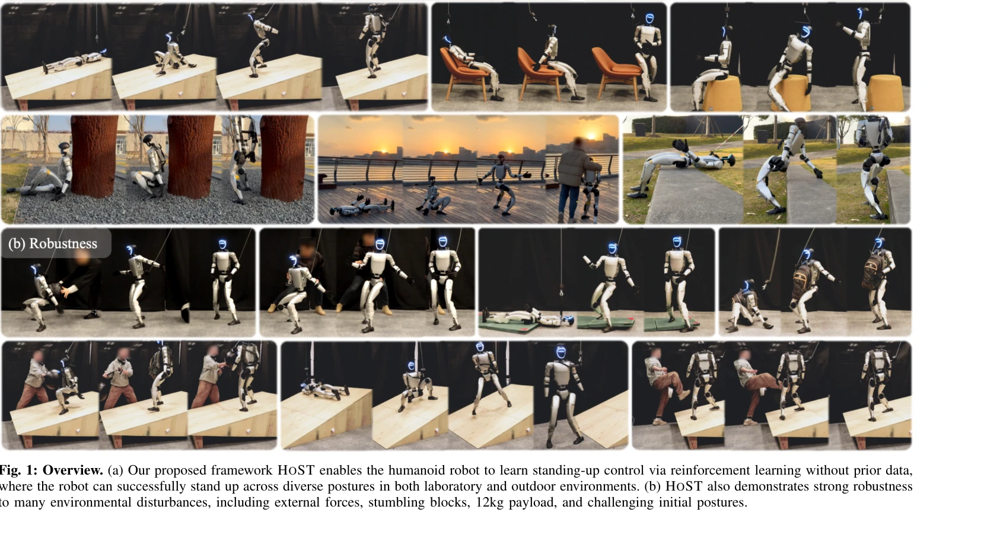
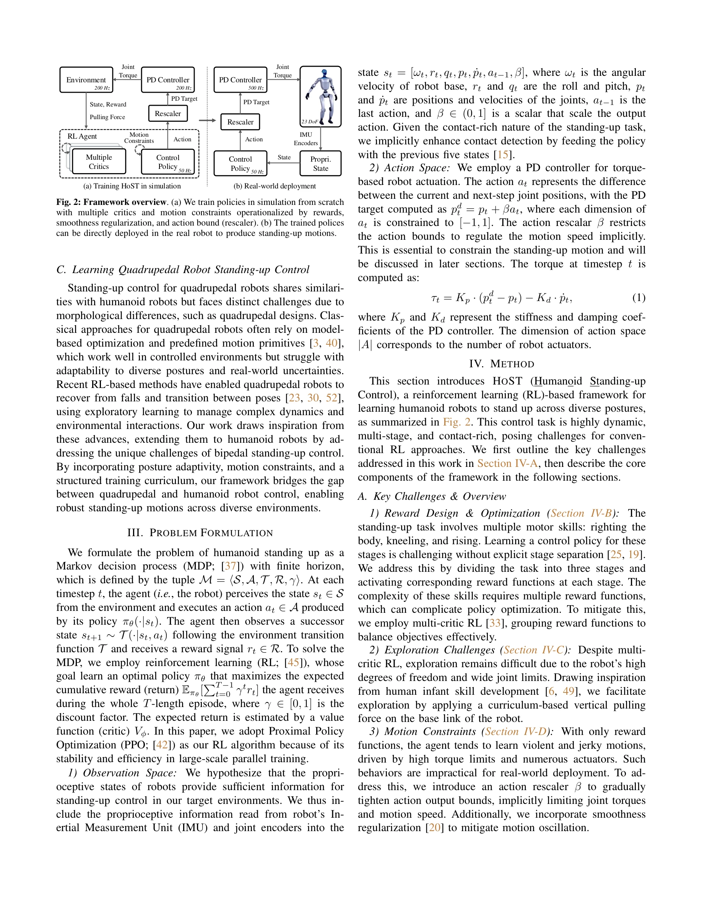

# Learning Humanoid Standing-up Control across Diverse Postures

> **저자**: Tao Huang, Junli Ren, Huayi Wang, Zirui Wang, Qingwei Ben, Muning Wen, Xiao Chen, Jianan Li, Jiangmiao Pang | **날짜**: 2025-02-12 | **URL**: [https://arxiv.org/abs/2502.08378](https://arxiv.org/abs/2502.08378)

---

## Essence

*Fig. 1: Overview. (a) Our proposed framework HOST enables the humanoid robot to learn standing-up control via reinforcem*

HoST는 강화학습 기반 프레임워크로 휴머노이드 로봇이 다양한 자세에서 일어서는 동작을 학습하고 실제 환경에서 robust하게 수행할 수 있도록 한다.

## Motivation

- **Known**: 휴머노이드 로봇의 보행 및 조작 기술은 발전했으나, 다양한 자세에서의 일어서기 제어는 시뮬레이션 기반이거나 사전 정의된 궤적에 의존하는 한계가 있다.
- **Gap**: 기존 RL 기반 방법들은 특정 지면에만 적용되거나 실제 배포 시 불안정한 동작을 생성하며, 사전 궤적 없이 diverse posture에서 작동하는 방법이 부재하다.
- **Why**: 일어서기 능력은 낙상 복구, 앉은 자세에서의 전환 등 실제 적용의 핵심 기능이며, 이를 통해 휴머노이드 로봇의 실용성과 자율성을 크게 향상시킬 수 있다.
- **Approach**: HoST는 multi-critic RL 아키텍처와 curriculum 기반 학습을 결합하고, smoothness regularization과 implicit motion speed bound를 적용하여 시뮬레이션에서 실제 로봇으로의 직접 배포를 가능하게 한다.

## Achievement

*Fig. 1: Overview. (a) Our proposed framework HOST enables the humanoid robot to learn standing-up control via reinforcem*

- **Posture-adaptive motions**: 사전 정의된 궤적 없이 diverse posture에서 안정적인 일어서기 동작 학습
- **Real-world robustness**: 실험실과 야외 환경에서 외부 힘, 장애물, 12kg 페이로드 등에 대한 강건성 입증
- **Direct sim-to-real transfer**: 시뮬레이션에서 학습한 정책을 Unitree G1 휴머노이드 로봇에 직접 배포
- **Smooth and stable motions**: smoothness regularization과 motion speed constraint를 통해 진동과 폭력적 동작 완화

## How

*Fig. 2: Framework overview. (a) We train policies in simulation from scratch*

- **Multi-critic RL 아키텍처**: 여러 reward group을 독립적으로 최적화하여 reward balancing 개선
- **Curriculum-based training**: 다양한 시뮬레이션 지면과 초기 단계의 vertical pulling force를 통한 체계적 탐색
- **Motion constraints**: smoothness regularization(보상)과 implicit motion speed bound(action rescaler)로 물리적 실현 가능성 보장
- **Domain randomization**: 시뮬레이션에서의 다양한 환경 변동으로 sim-to-real gap 감소
- **Proprioceptive state representation**: IMU와 joint encoder 정보 기반 상태 정의로 contact-rich task 처리

## Originality

- 기존 방법과 달리 **사전 궤적 없이** diverse posture 적응이 가능한 첫 실제 로봇 시스템 구현
- **Multi-critic + curriculum learning의 조합**으로 복잡한 다단계 동작의 효과적인 학습 달성
- **Motion constraints (smoothness + speed bound)**를 보상과 action rescaler로 이원화하여 실제 배포 안정성 확보
- **Comprehensive evaluation protocol** 설계로 standing-up control의 다양한 측면 분석

## Limitation & Further Study

- 현재는 proprioceptive 정보만 사용하며, 시각 정보 통합의 가능성 미탐색
- 특정 로봇(Unitree G1)에 대한 검증으로 다른 플랫폼 적용성 미확인
- 극단적인 초기 자세(완전히 누운 상태 등)에 대한 처리 한계 존재 가능
- 후속 연구: 다양한 로봇 플랫폼 검증, visual feedback 통합, 더 극한 자세 대응 알고리즘 개발

## Evaluation

- Novelty: 4/5
- Technical Soundness: 3/5
- Significance: 4/5
- Clarity: 4/5
- Overall: 4/5

**총평**: 이 논문은 휴머노이드 로봇의 standing-up control이라는 실질적 문제를 RL 기반으로 체계적으로 해결하며, 사전 궤적 없이 diverse posture에서의 실제 배포를 성공적으로 달성한 의미 있는 기여로, 실제 로봇 시스템의 자율성 향상에 중요한 발걸음이다.
