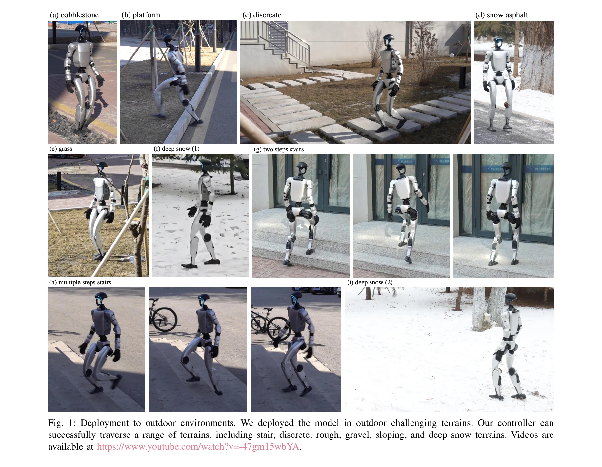

# Learning Perceptive Humanoid Locomotion over Challenging Terrain

> **저자**: Wandong Sun, Baoshi Cao, Long Chen, Yongbo Su, Yang Liu, Zongwu Xie, Hong Liu | **날짜**: 2025-03-02 | **URL**: [https://arxiv.org/abs/2503.00692](https://arxiv.org/abs/2503.00692)

---

## Essence

*Fig. 2: Training of Humanoid Perception Controller consists of two stages: (1) Oracle Policy Training generates referenc*

인간형 로봇이 소음이 있는 센서 데이터로부터 지형을 인식하고 거친 지형을 안정적으로 보행할 수 있도록, teacher-student distillation과 variational information bottleneck을 결합한 세계 모델 기반 방법을 제안한다.

## Motivation

- **Known**: 최근 강화학습 기반 인간형 로봇 보행 제어기는 높이 맵(height map)을 통한 지형 인식을 통합하여 성능을 향상시켰다. 그러나 실세계 센서의 노이즈로 인한 지형 인식 오류는 여전히 해결되지 않은 문제이다.
- **Gap**: 기존 방법들은 노이즈가 없는 센서 입력을 가정하거나 domain randomization만으로 센서 노이즈를 처리하는데, 실제 센서 오류(예: 식생으로 인한 높이 오류)를 충분히 반영하지 못한다. 따라서 시뮬레이션-실제 간의 갭이 여전히 크다.
- **Why**: 인간형 로봇이 계단, 눈, 거친 지형 등 실제 환경에서 안정적으로 이동하려면 noisy 센서 데이터로부터 지형을 정확히 추정하고 이를 보행 계획에 반영해야 한다. 이는 로봇의 실제 배포 안정성과 신뢰성을 크게 좌우한다.
- **Approach**: 두 단계 학습 프레임워크를 제안한다: (1) 첫 단계에서는 노이즈 없는 privileged state로 oracle policy를 학습하고, (2) 두 번째 단계에서는 student policy가 VAE encoder-decoder로 구성된 world model을 학습하면서 동시에 oracle policy의 행동을 모방(imitation loss)하고 입력을 재구성(reconstruction loss)한다.

## Achievement

*Fig. 1: Deployment to outdoor environments. We deployed the model in outdoor challenging terrains. Our controller can*

- **센서 노이즈 강건성**: Variational information bottleneck을 통한 world model이 noisy 지형 정보를 효과적으로 디노이징하여, 신뢰할 수 없는 지형 추정 환경에서도 성능 저하를 최소화한다.
- **실제 환경 성능**: 실제 실내 계단, 실외 눈, 풀, 거친 지형 등 다양한 환경에서 2 km의 지형을 추가 미세조정 없이 성공적으로 횡단한다.
- **세계 모델 통합**: 인간처럼 누적된 경험으로부터 환경과 자신의 상태를 지속적으로 개선하는 world model을 통해 deformable surface(깊은 눈 등)에서의 착지 전략을 개선한다.
- **배포 효율성**: 학습 후 decoder를 제거하고 encoder와 policy만 실제 로봇에 배포하여 계산 효율성을 유지한다.

## How

*Fig. 2: Training of Humanoid Perception Controller consists of two stages: (1) Oracle Policy Training generates referenc*

- **Stage 1 - Oracle Policy Training**: Privileged state(노이즈 없는 root height, 위치, 회전, 속도, 지형 높이 맵 등)를 포함한 완전한 관찰값으로 PPO를 사용하여 최적 참조 정책을 학습한다.
- **Stage 2 - Student Policy Training**: Noisy 관찰값을 입력으로 받는 VAE encoder와 terrain encoder를 통해 압축된 특징을 생성하고, 이를 locomotion controller에 입력한다.
- **Variational Information Bottleneck**: VAE의 encoder-decoder 구조에서 정보 병목(information bottleneck)을 통해 노이즈를 필터링하고, 핵심 정보만 추출하여 downstream 제어기로 전달한다.
- **Dual Loss Function**: Reconstruction loss(VAE decoder의 출력 재구성)와 imitation loss(oracle policy 모방)를 동시에 최소화하여 입력 품질과 제어 성능을 함께 개선한다.
- **Terrain Encoder Integration**: Robot-centric height map을 별도의 terrain encoder로 처리하여 지형 정보를 효과적으로 인코딩한다.

## Originality

- **Teacher-Student Distillation + World Model 결합**: 기존 방법들이 world model 학습(Gu et al. 2024)과 terrain perception 통합(Long et al., Wang et al.)을 분리하여 다루던 것을 하나의 프레임워크로 통합한다.
- **Variational Information Bottleneck의 명시적 활용**: 센서 노이즈 처리를 위해 VAE의 information bottleneck 특성을 명시적으로 활용하여, reconstruction과 imitation을 동시에 최적화한다.
- **Privileged State 기반의 Oracle Policy**: Simulation에서만 접근 가능한 완벽한 상태 정보를 oracle policy 학습에 활용하는 두 단계 접근은 기존 방법보다 더 명확한 supervision signal을 제공한다.
- **실제 배포 효율성 고려**: Decoder를 버리고 encoder만 배포하도록 설계하여 실시간 제어의 계산 오버헤드를 최소화한다.

## Limitation & Further Study

- **시뮬레이션 기반 평가**: 대부분의 성능 평가가 시뮬레이션에서 수행되었으며, 실제 배포는 제한된 시나리오(계단, 눈, 풀 등)에서만 검증되었다.
- **오라클 정책의 의존성**: Stage 1에서의 oracle policy 성능이 Stage 2의 상한선을 정하므로, oracle policy의 한계가 전체 시스템 성능을 제한할 수 있다.
- **센서 노이즈 모델의 단순성**: 학습 중 사용된 센서 노이즈 모델이 실제 다양한 환경의 복잡한 지각 오류(예: 식생으로 인한 높이 오류)를 완전히 반영하지 못할 수 있다.
- **일반화 성능 분석 부족**: 학습하지 않은 새로운 지형 타입이나 노이즈 분포에 대한 일반화 능력에 대한 체계적 분석이 제한적이다.
- **후속 연구**: (1) 더 복잡한 동역학(물 통과, 모래 등)을 갖는 지형에 대한 확장, (2) 다양한 센서 종류(LiDAR, 카메라 등)에 대한 적용, (3) Online adaptation을 통한 실시간 정책 개선 메커니즘 개발이 필요하다.

## Evaluation

- Novelty: 4/5
- Technical Soundness: 3/5
- Significance: 4/5
- Clarity: 4/5
- Overall: 4/5

**총평**: 본 논문은 teacher-student distillation과 world model 기반 센서 디노이징을 효과적으로 결합하여 인간형 로봇의 실제 환경 보행 성능을 크게 향상시켰다. 2 km의 다양한 지형 횡단 성과와 체계적인 방법론은 높은 기술적 가치를 가지며, 실제 로봇 배포를 위한 중요한 진전을 보여준다.
