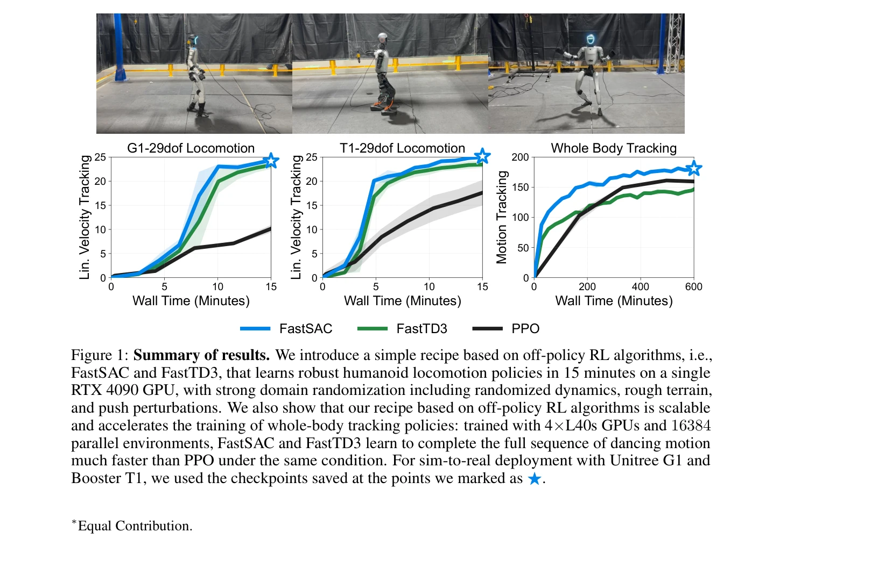

# Learning Sim-to-Real Humanoid Locomotion in 15 Minutes

> **저자**: Younggyo Seo, Carmelo Sferrazza, Juyue Chen, Guanya Shi, Rocky Duan, Pieter Abbeel | **날짜**: 2025-12-01 | **URL**: [https://arxiv.org/abs/2512.01996](https://arxiv.org/abs/2512.01996)

---

## Essence

*Figure 1: Summary of results. We introduce a simple recipe based on off-policy RL algorithms, i.e.,*

이 논문은 FastSAC와 FastTD3라는 off-policy RL 알고리즘을 기반으로 단일 RTX 4090 GPU에서 15분 이내에 humanoid 로봇의 보행 정책을 학습할 수 있는 실용적인 레시피를 제시한다.

## Motivation

- **Known**: Massively parallel simulation은 로봇 RL 훈련 시간을 크게 단축했으며, off-policy RL 알고리즘이 on-policy 방식보다 효율적일 수 있다는 것이 최근 연구로 입증되었다.
- **Gap**: 기존 연구는 humanoid의 일부 관절만 제어하는 제한된 결과를 보였고, 강력한 domain randomization (randomized dynamics, rough terrain, push perturbations) 하에서 전체 신체 제어 정책의 빠른 학습은 여전히 도전적이다.
- **Why**: Sim-to-real 로봇 개발은 반복적인 순환 과정이기 때문에 빠른 훈련 시간은 실제 배포 사이클을 가능하게 하며, humanoid와 같은 고차원 시스템에서 이를 달성하는 것은 산업적으로 중요하다.
- **Approach**: FastSAC와 FastTD3를 기반으로 joint-limit-aware action bounds, observation과 layer normalization, clipped double Q-learning 등의 신중히 조정된 설계 선택과 최소주의 보상 함수를 사용하여 massively parallel 환경에서 off-policy RL을 안정화한다.

## Achievement

*Figure 1: Summary of results. We introduce a simple recipe based on off-policy RL algorithms, i.e.,*

- **빠른 훈련**: 단일 RTX 4090 GPU에서 강력한 domain randomization (randomized dynamics, rough terrain, push perturbations) 포함하여 humanoid locomotion 정책을 15분 내에 학습
- **실제 배포**: Unitree G1과 Booster T1 로봇에 대한 end-to-end sim-to-real 배포 달성
- **확장성**: 4×L40s GPU와 16384 parallel 환경으로 전체 신체 human-motion tracking 정책을 PPO보다 훨씬 빠르게 학습
- **알고리즘 개선**: FastSAC를 이전 FastTD3 연구보다 향상시켜 maximum entropy learning으로 exploration 효율 증대

## How

*Figure 2: FastSAC: Analyses. We investigate the effect of (a) Clipped double Q-learning, (b) number*

- FastSAC와 FastTD3 off-policy RL 알고리즘 적용 및 대규모 병렬 시뮬레이션 활용
- Joint-limit-aware action bounds를 통해 Tanh 정책의 action bound를 로봇 관절 한계에 기반하여 설정
- Observation normalization과 layer normalization을 결합하여 고차원 작업에서 안정성 향상
- Clipped double Q-learning (CDQ) 적용으로 overestimation 감소
- 최소주의 보상 함수 설계로 하이퍼파라미터 튜닝 용이성과 transfer 가능성 확보
- Automatic action-rate curriculum을 통해 점진적인 학습 진행

## Originality

- 기존 Seo et al. (2025)의 FastTD3 결과를 전체 신체 humanoid 제어로 확장하고 FastSAC를 함께 적용
- Joint-limit-aware action bounds라는 간단하지만 효과적인 기술로 hyperparameter tuning 복잡도 감소
- Layer normalization의 명시적 도입으로 high-dimensional humanoid 제어 안정화
- 최소주의 보상 함수 철학으로 brittle engineering을 피하는 실용적 접근

## Limitation & Further Study

- 단일 GPU (RTX 4090)에서의 결과로 다양한 하드웨어 환경에서의 일반화 가능성 미검증
- 두 가지 humanoid 로봇 (G1, T1)에만 실제 배포 테스트되어 다른 humanoid 설계에 대한 일반화 불명확
- Domain randomization의 범위와 강도에 대한 상세 분석 부족 (어느 정도의 randomization이 최적인지)
- Whole-body tracking 결과가 PPO와 비교되었으나 다른 humanoid 제어 baseline과의 비교 부재
- 후속 연구: 더 복잡한 지형, 접촉 풍부한 작업(manipulation), 더 많은 로봇 플랫폼에서의 검증 필요

## Evaluation

- Novelty: 4/5
- Technical Soundness: 3/5
- Significance: 4/5
- Clarity: 4/5
- Overall: 4/5

**총평**: 이 논문은 off-policy RL을 humanoid 제어에 효과적으로 적용하기 위한 실용적이고 체계적인 레시피를 제공하며, 15분의 빠른 훈련 시간과 실제 로봇 배포를 통해 sim-to-real 개발 사이클의 혁신을 보여준다. 오픈소스 구현 제공으로 산업 및 학계에 즉시 영향을 미칠 수 있다.
