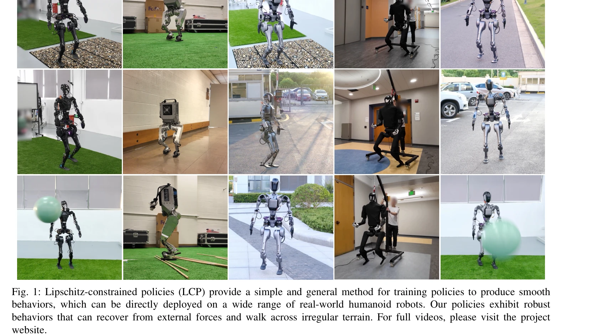
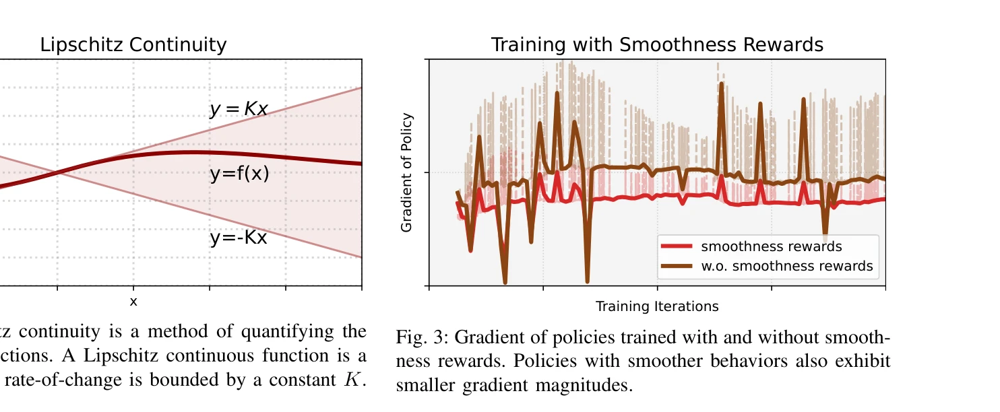

# Learning Smooth Humanoid Locomotion through Lipschitz-Constrained Policies

> **저자**: Zixuan Chen, Xialin He, Yen-Jen Wang, Qiayuan Liao, Yanjie Ze, Zhongyu Li, S. Shankar Sastry, Jiajun Wu, Koushil Sreenath, Saurabh Gupta, Xue Bin Peng | **날짜**: 2024-10-15 | **URL**: [https://arxiv.org/abs/2410.11825](https://arxiv.org/abs/2410.11825)

---

## Essence

*Fig. 2: Lipschitz continuity is a method of quantifying the*

본 논문은 Reinforcement Learning으로 훈련한 humanoid robot의 locomotion policy에 Lipschitz 제약을 부여하여 smooth behavior를 자동으로 유도하는 Lipschitz-Constrained Policies (LCP) 방법을 제안한다.

## Motivation

- **Known**: 시뮬레이션에서 훈련한 legged robot 제어기는 sim-to-real transfer를 위해 smoothness rewards나 low-pass filters 같은 비미분 가능한 기법을 통해 smooth behavior를 강제해야 한다.
- **Gap**: 기존 smoothing 기법들은 hyperparameter 튜닝이 필요하고 robot 플랫폼마다 재설정해야 하며, 비미분 가능한 특성으로 인해 학습 프레임워크와 통합하기 어렵다.
- **Why**: Smooth policy behavior는 시뮬레이션과 실제 로봇 간의 domain gap을 줄이고 jittery bang-bang control을 방지하여 성공적인 sim-to-real transfer와 robust locomotion 실현의 핵심이다.
- **Approach**: Policy의 gradient norm을 제한하는 gradient penalty 형태의 Lipschitz 제약을 통해 미분 가능하고 자동 미분 프레임워크에 쉽게 통합 가능한 smoothness 강제 기법을 개발했다.

## Achievement

*Fig. 1: Lipschitz-constrained policies (LCP) provide a simple and general method for training policies to produce smooth*

- **일반적 적용성**: 여러 humanoid robot 플랫폼에 쉽게 적용 가능하며 수동 튜닝 최소화
- **미분 가능성**: Gradient penalty 형태로 구현되어 기존 RL 프레임워크와 자동 미분으로 완전 통합 가능
- **실험 검증**: 시뮬레이션과 실제 robot에서 smooth하고 robust한 locomotion 달성, zero-shot transfer 성공
- **재현성**: 모든 simulation 및 deployment 코드, checkpoint 공개

## How

*Fig. 3: Gradient of policies trained with and without smooth-*

- Lipschitz continuity의 정의를 이용하여 ||∇_x f(x)|| ≤ K 제약이 smooth behavior를 보장함을 활용
- Gradient penalty L_gp = (||∇_s π(s)||_2 - K)^2 형태로 policy의 gradient norm 제한
- Teacher-student framework와 domain randomization을 활용한 sim-to-real transfer
- Multiple humanoid robot morphology에 대해 동일한 LCP 목표함수 적용 및 평가
- Smoothness metric (policy output 변화율)과 task return을 동시에 모니터링하여 효과성 검증

## Originality

- Gradient penalty를 GAN 안정화에서 motion control adversarial imitation learning (AMP, CALM, ASE)으로의 사용을 넘어 **policy 자체의 smoothness 강제**에 직접 적용한 새로운 관점
- Lipschitz continuity라는 수학적으로 well-defined된 개념을 robot locomotion의 smoothness 문제에 연결
- Non-differentiable smoothness rewards, low-pass filters와 달리 완전히 미분 가능한 통합 솔루션 제시
- Zero-shot transfer로 서로 다른 morphology의 humanoid robot들에서 일반화 가능성 입증

## Limitation & Further Study

- Lipschitz constant K 값 선택에 대한 이론적 가이드 부재 - 실험적 결정에 의존
- Gradient norm 제약이 모든 robot morphology에서 optimal인지 미검증 - robot별 최적값 존재 가능성
- Real-world 실험이 제한된 수의 humanoid robot에서만 수행됨 - 더 다양한 플랫폼에서의 검증 필요
- Lipschitz constraint의 계산 비용(gradient 계산)이 기존 방법 대비 얼마나 증가하는지에 대한 분석 부재
- **후속 연구**: K 값의 adaptive 선택 메커니즘, 다양한 morphology에 대한 자동 하이퍼파라미터 결정, 다른 로봇 플랫폼(quadruped 등)으로의 확장

## Evaluation

- Novelty: 4/5
- Technical Soundness: 3/5
- Significance: 4/5
- Clarity: 4/5
- Overall: 4/5

**총평**: Lipschitz constraint을 통한 smooth policy 학습은 이론적으로 명확하고 실용적이며, 기존의 복잡한 smoothing 기법들을 단순하고 미분 가능한 방식으로 대체하는 우수한 기여이다. 실제 humanoid robot에서의 검증과 재현성 있는 공개 코드 공개로 high impact을 기대할 수 있다.

## Related Papers

- 🏛 기반 연구: [[papers/1688_Spectral_Normalization_for_Lipschitz-Constrained_Policies_on/review]] — Lipschitz 제약을 통한 정책 안정화의 이론적 기반과 구현 방법을 제공한다.
- 🔄 다른 접근: [[papers/1671_SHIELD_Safety_on_Humanoids_via_CBFs_In_Expectation_on_Learne/review]] — CBF를 통한 휴머노이드 안전성 확보라는 유사하지만 다른 접근법을 사용한다.
- 🔗 후속 연구: [[papers/1954_Geometry-Aware_Predictive_Safety_Filters_on_Humanoids_From_P/review]] — 기하학적 인식과 예측 안전 필터를 결합하여 안전한 휴머노이드 제어를 확장한다.
- 🧪 응용 사례: [[papers/1696_Success_in_Humanoid_Reinforcement_Learning_under_Partial_Obs/review]] — 부분 관측 하에서의 강화학습을 스무스 보행 제어에 적용한 실용적 접근
- 🧪 응용 사례: [[papers/1649_Robot_Crash_Course_Learning_Soft_and_Stylized_Falling/review]] — Lipschitz 제약을 통한 부드러운 제어가 부드럽고 스타일화된 낙상 학습에 직접 적용된다.
- 🔄 다른 접근: [[papers/1688_Spectral_Normalization_for_Lipschitz-Constrained_Policies_on/review]] — 두 논문 모두 Lipschitz 제약을 통한 부드러운 휴머노이드 보행을 다루지만, spectral normalization과 일반적인 제약이라는 다른 구현 방법을 사용한다.
