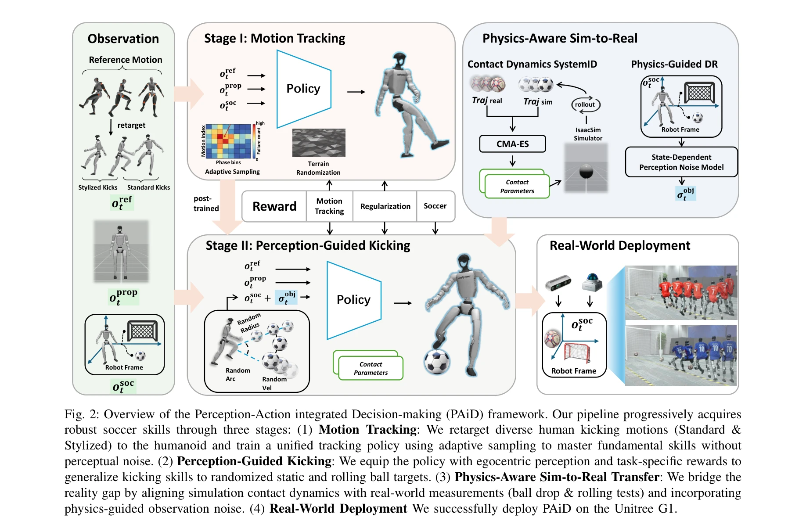
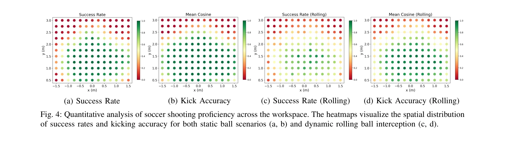

# Learning Soccer Skills for Humanoid Robots: A Progressive Perception-Action Framework

> **저자**: Jipeng Kong, Xinzhe Liu, Yuhang Lin, Jinrui Han, Sören Schwertfeger, Chenjia Bai, Xuelong Li | **날짜**: 2026-02-05 | **DOI**: [10.48550/arXiv.2602.05310](https://doi.org/10.48550/arXiv.2602.05310)

---

## Essence

*Fig. 2: Overview of the Perception-Action integrated Decision-making (PAiD) framework. Our pipeline progressively acquir*

본 논문은 humanoid robot이 human-like kicking과 whole-body balance를 동시에 수행하는 soccer skill을 습득하기 위해, 세 단계로 구성된 Perception-Action integrated Decision-making (PAiD) 프레임워크를 제안한다.

## Motivation

- **Known**: Humanoid robot의 whole-body control은 motion tracking, RL 기반 gait control, motion capture를 통한 행동 학습 등으로 발전해왔으나, 기존 접근법들은 모듈 간 불안정성 또는 reward conflict 문제를 겪고 있다.
- **Gap**: Soccer와 같이 perception-guided motion과 whole-body balance를 동시에 요구하는 복잡한 embodied skill에서 modular pipeline의 inter-module instability와 end-to-end RL의 training instability를 모두 해결하는 통합적 프레임워크가 부재하다.
- **Why**: Soccer는 humanoid robot의 perception-action 통합 능력을 평가하는 벤치마크이며, 이를 통해 습득한 기술은 다른 복잡한 embodied skill 습득으로 확장 가능하다.
- **Approach**: 세 단계 progressive 아키텍처를 통해 문제를 분해한다: (1) human motion tracking으로 fundamental kicking skill 습득, (2) lightweight perception module 추가로 positional generalization, (3) physics-aware sim-to-real transfer로 현실 갭 최소화.

## Achievement

*Fig. 4: Quantitative analysis of soccer shooting proficiency across the workspace. The heatmaps visualize the spatial di*

- **Progressive skill decomposition**: 복잡한 soccer skill을 motion-skill 습득, perception-action 통합, sim-to-real 전이의 세 단계로 분해하여 각 단계에서의 training instability와 reward conflict를 제거
- **High-fidelity human-like kicking**: Unitree G1에서 91.3% kick success rate를 달성하며 kinematic trajectory가 human player motion과 유사
- **Robust real-world performance**: 다양한 ball 위치, lighting condition, 물리적 disturbance, 실내외 환경에서 일관된 성능 유지
- **Physics-aware sim-to-real transfer**: Iterative physics alignment 전략으로 ball contact parameter를 식별하여 sim-to-real gap 최소화

## How

*Fig. 2: Overview of the Perception-Action integrated Decision-making (PAiD) framework. Our pipeline progressively acquir*

- **Stage I - Motion Tracking**: Motion capture로부터 다양한 human kicking motion을 수집하고 motion retargeting을 통해 humanoid에 적응시킨 후, adaptive sampling을 이용한 motion tracking 정규화로 perception-free kicking skill 학습
- **Stage II - Perception-Guided Kicking**: Egocentric perception을 추가하고 minimal prior reward를 통해 ball position에 따른 whole-body gait 조정 및 orientation 제어를 학습하며, lightweight perception module로 reward conflict 회피
- **Stage III - Physics-Aware Sim-to-Real**: CMA-ES를 이용한 contact parameter 최적화, state-dependent perception noise model 적용, contact dynamics system ID를 통해 simulation의 physics property를 실제 world와 정렬
- **Real-World Deployment**: Visual과 radar-based localization 결합으로 robust perception input 확보하며, adaptive sampling mechanism으로 failure case에 대한 정책 재학습

## Originality

- 기존 modular 또는 end-to-end 방식의 이분법을 넘어서는 progressive multi-stage framework 제안으로 각 단계의 training stability 확보
- Motion tracking stage에서 perception-free learning으로 기초 skill 안정화한 후 perception 통합으로 reward conflict 회피하는 novel staged decomposition strategy
- Ball의 physical property (restitution, friction)에 초점을 맞춘 iterative physics alignment 전략으로 sim-to-real gap을 체계적으로 해소
- Adaptive sampling mechanism을 통해 motion tracking에서 phase-dependent failure를 동적으로 처리하는 mechanism

## Limitation & Further Study

- 현재 연구는 soccer의 kicking 기술에 집중하며 defensive play, dribbling combination, multi-robot coordination 등 더 복잡한 soccer skill은 미포함
- Unitree G1 단일 platform에서만 검증되어 다른 humanoid architecture에 대한 일반화 가능성이 불명확함
- Physics alignment를 위해 ball drop과 rolling test 같은 manual calibration이 필요하여 완전 자동화된 sim-to-real transfer와는 차이 있음
- **후속연구**: Multi-task skill composition, 다양한 humanoid platform으로의 일반화, fully automated physics parameter discovery 메커니즘 개발이 필요

## Evaluation

- Novelty: 4/5
- Technical Soundness: 4/5
- Significance: 4/5
- Clarity: 4/5
- Overall: 4/5

**총평**: 본 논문은 humanoid robot의 복잡한 embodied skill 습득을 위한 체계적인 progressive framework를 제시하며, motion tracking-perception integration-sim-to-real transfer의 세 단계 분해를 통해 기존 방식의 training instability와 reward conflict를 효과적으로 해결한다. 91.3% 성공률의 robust real-world kicking 성능과 diverse condition에서의 일관성은 제안 방법의 효과를 입증하며, divide-and-conquer 전략은 향후 complex embodied skill 습득의 scalable framework로 활용 가능하다.
