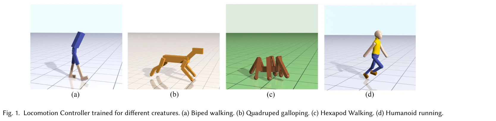
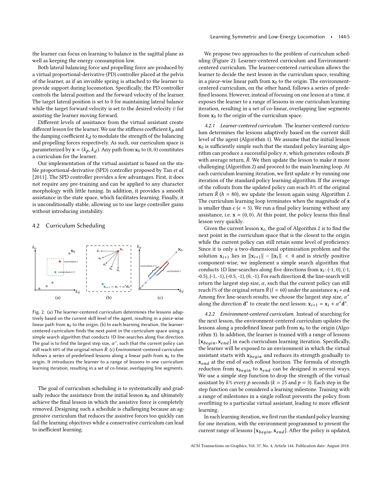

# Learning Symmetric and Low-energy Locomotion

> **저자**: Wenhao Yu, Greg Turk, C. Karen Liu | **날짜**: 2018-01-24 | **URL**: [https://arxiv.org/abs/1801.08093](https://arxiv.org/abs/1801.08093)

---

## Essence

*Fig. 1. Locomotion Controller trained for different creatures. (a) Biped walking. (b) Quadruped galloping. (c) Hexapod W*

Deep Reinforcement Learning에 미러 대칭 손실 함수와 커리큘럼 학습을 적용하여 모션 캡처 데이터 없이 자연스럽고 저에너지의 대칭적인 로코모션을 학습하는 방법을 제안한다.

## Motivation

- **Known**: 기존 DRL 방식은 로코모션 제어기를 학습할 수 있으나, 결과 동작이 부자연스럽고 고에너지 소비를 보이며 모션 캡처나 FSM, 형태-특화 지식에 의존한다.
- **Gap**: DRL만으로 생물학적으로 타당한 대칭적이고 저에너지의 자연스러운 로코모션을 다양한 형태(biped, quadruped, hexapod 등)에 일반화하여 학습하는 방법이 부재하다.
- **Why**: 자동 로코모션 학습은 애니메이션, 로봇공학, 시뮬레이션에서 중요하며, 모션 데이터에 의존하지 않는 방법은 임의의 형태에 적용 가능하여 실용성이 높다.
- **Approach**: 손실 함수에 미러 대칭 항을 추가하고, 물리적 보조를 제공하는 learner-centered curriculum 학습을 도입하여 점진적으로 보조를 감소시킨다.

## Achievement

- **대칭적 로코모션 생성**: 대칭 손실 함수를 통해 쌍을 이루는 사지가 동일한 제어 전략을 학습하도록 유도
- **저에너지 동작**: 커리큘럼 학습으로 높은 에너지 페널티를 유지하면서도 안정적인 학습 달성
- **다양한 형태 지원**: 동일한 보상 함수로 biped, humanoid, quadruped, hexapod에 적용 가능
- **속도-적응적 보행패턴**: 모션 예제나 접촉 계획 없이 속도에 맞는 보행 패턴이 자동으로 출현

## How

*Fig. 2. (a) The learner-centered curriculum determines the lessons adap-*

- 손실 함수에 미러 대칭 손실항 추가: 좌우 대칭 관절 쌍의 행동 차이를 페널티화
- Learner-centered curriculum: 횡방향 균형과 전진 이동을 위한 조정 가능한 물리적 보조력 동적 계산
- 점진적 보조 완화: 학습 진행에 따라 보조력을 자동으로 감소시켜 최종적으로 독립적 움직임 달성
- Policy gradient 기반 DRL 알고리즘 활용: 신경망 정책 학습에 대칭 손실을 통합
- 이산 궤적 전체에 대한 대칭 메트릭 대신 행동 수준의 미러 대칭 측정

## Originality

- 기존 보상 함수 기반 접근과 달리 손실 함수에 미러 대칭 항을 도입한 혁신적 방법
- 동작의 대칭성이 아닌 정책 출력(행동)의 대칭성을 직접 측정하여 정책 구배 학습 적합성 개선
- 자동으로 적절한 보조력을 계산하고 점진적으로 완화하는 adaptive curriculum learning 메커니즘
- 모션 데이터 없이도 생물학적으로 타당한 보행 패턴이 자동으로 출현함을 입증

## Limitation & Further Study

- 평가가 주로 시각적 결과와 에너지 소비 메트릭에 기초하며, 생물학적 타당성에 대한 정량적 검증 부족
- 커리큘럼의 보조력 제거 스케줄이 수동으로 설정되거나 휴리스틱 기반일 수 있음
- 복잡한 지형, 외부 방해, 동적 환경에서의 성능 미평가
- 각 형태별로 보상 함수의 가중치를 조정해야 하므로 완전 일반화는 아님
- 후속 연구: 정량적 생체역학 지표(대칭성, 에너지 효율성, 안정성) 사용한 검증, 적응적 커리큘럼 스케줄 자동화, 불규칙 지형 및 동적 환경 확장

## Evaluation

- Novelty: 4/5
- Technical Soundness: 4/5
- Significance: 4/5
- Clarity: 4/5
- Overall: 4/5

**총평**: 본 논문은 미러 대칭 손실과 adaptive curriculum learning을 결합하여 DRL 기반 로코모션 학습의 오래된 문제(부자연스러움, 고에너지)를 우아하게 해결하며, 다양한 형태에 일반화 가능한 점에서 높은 독창성과 실용성을 갖춘 우수한 연구이다.

## Related Papers

- 🧪 응용 사례: [[papers/1940_Gait-Conditioned_Reinforcement_Learning_with_Multi-Phase_Cur/review]] — 대칭적이고 저에너지 보행 학습의 원리가 gait-conditioned 멀티 phase 커리큘럼에 적용될 수 있다.
- 🏛 기반 연구: [[papers/2109_Natural_Humanoid_Robot_Locomotion_with_Generative_Motion_Pri/review]] — 미러 대칭 손실과 커리큘럼 학습이 생성적 모션 프라이어를 통한 자연스러운 보행의 기반을 제공한다.
- 🔗 후속 연구: [[papers/1709_The_Duke_Humanoid_Design_and_Control_For_Energy_Efficient_Bi/review]] — 대칭적이고 저에너지 보행의 개념을 Duke Humanoid라는 구체적 플랫폼에서 패시브 다이내믹스와 강화학습을 결합하여 실현했다.
- ⚖️ 반론/비판: [[papers/1834_Chasing_Stability_Humanoid_Running_via_Control_Lyapunov_Func/review]] — CLF 기반 동적 달리기 vs 저에너지 대칭 보행이라는 상반된 설계 철학을 비교하여 성능과 에너지 효율성의 트레이드오프를 분석할 수 있다
- 🔗 후속 연구: [[papers/1854_Coordinated_Humanoid_Robot_Locomotion_with_Symmetry_Equivari/review]] — 대칭성 기반 정책 학습이 에너지 효율적이고 균형잡힌 보행 패턴 생성으로 확장되는 자연스러운 발전 과정을 보여준다.
- 🔗 후속 연구: [[papers/1777_A_Gait_Driven_Reinforcement_Learning_Framework_for_Humanoid/review]] — 대칭적이고 에너지 효율적인 locomotion 학습 기법이 gait driven RL framework의 보행 효율성과 안정성을 향상시킬 수 있다.
- 🏛 기반 연구: [[papers/1894_ECO_Energy-Constrained_Optimization_with_Reinforcement_Learn/review]] — ECO의 에너지 제약 조건 최적화가 symmetric and low-energy locomotion의 기본적인 에너지 효율성 원리와 일치한다.
- 🏛 기반 연구: [[papers/1940_Gait-Conditioned_Reinforcement_Learning_with_Multi-Phase_Cur/review]] — 대칭적이고 저에너지 보행 학습이 다중 phase 커리큘럼의 기본 원리를 제공한다.
