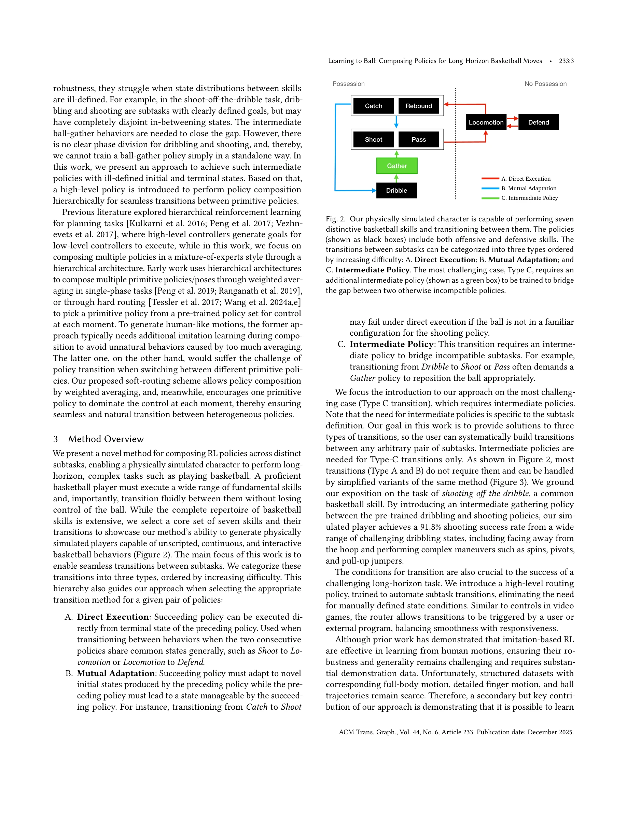
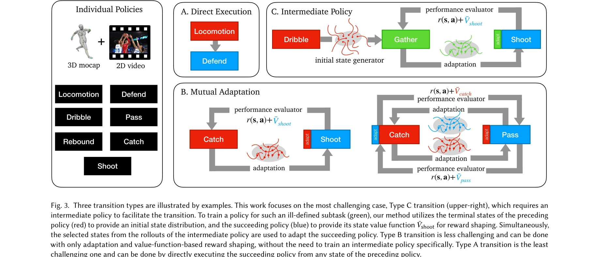

# Learning to Ball: Composing Policies for Long-Horizon Basketball Moves

> **저자**: Pei Xu, Zhen Wu, Ruocheng Wang, Vishnu Sarukkai, Kayvon Fatahalian, Ioannis Karamouzas, Victor Zordan, C. Karen Liu | **날짜**: 2025-09-26 | **URL**: [https://arxiv.org/abs/2509.22442](https://arxiv.org/abs/2509.22442)

---

## Essence

*Fig. 1. We introduce a novel policy integration framework to enable the composition of drastically different motor skill*

농구 동작과 같은 다단계 장기 과제에서 정의되지 않은 중간 상태를 가진 이질적인 스킬들을 seamlessly 합성하기 위해 policy integration framework와 soft routing을 제안한다.

## Motivation

- **Known**: Reinforcement learning은 개별 스킬에 대한 정책 학습에는 성공했으나, mixture of experts나 skill chaining 같은 기존 방법들은 정의되지 않은 중간 상태와 공유되지 않는 상태 공간을 가진 다단계 과제에서 정책 합성에 실패한다.
- **Gap**: Dribble-gather-shoot처럼 중간 subtask가 명확한 목표 없이 다음 스킬의 성공을 위해 필수적인 경우, 기존의 skill chaining이나 mixture of experts 방식으로는 효과적인 보상 함수를 설계하기 어렵다.
- **Why**: 농구와 같은 복잡한 실시간 대화형 환경에서 다중 이질 스킬의 seamless 합성은 로보틱스, 비디오 게임, 캐릭터 애니메이션 등 다양한 분야의 실제 응용에 필수적이며, 장기 과제 RL의 근본적인 한계를 해결한다.
- **Approach**: Well-defined subtask A, C의 사전학습 정책으로부터 ill-defined subtask B의 초기 상태 분포와 terminal reward를 지정하고, C를 B의 생성 상태에 적응시키면서 동시에 B를 최적화한다. 그 후 soft routing policy로 실시간 명령 기반의 primitive policy들을 통합 제어한다.

## Achievement

*Fig. 2. Our physically simulated character is capable of performing seven*

- **Policy integration framework**: Well-defined 스킬의 policy를 ill-defined 중간 subtask 학습에 활용하여 정책 합성 문제를 해결
- **Soft routing 메커니즘**: 실시간 외부 명령(드리블 목적지, 속도, 점프 슛)에 따라 primitive policy 간의 robust transition 실현
- **비정형 데이터 활용**: 풀바디, 손동작만, 비정형 비디오, 일반 달리기 모션 등 다양한 소스의 구조화되지 않은 농구 모션 데이터로부터 policy 학습
- **높은 성능**: 자유로운 농구 플레이(변속 드리블, 임의 방향 점프슛), 91.8% 슈팅 정확도, 다중 에이전트 팀 플레이(패스, 리바운드, 디펜스) 달성
- **광범위한 검증**: Soft routing, policy fine-tuning의 중요성을 입증하고 기존 방법의 한계를 노출하는 ablation study 제공

## How

*Figure 4 shows our system architecture for primitive policy learn-*

- Well-defined goal을 가진 subtask A와 C에 대해 먼저 독립적으로 RL 정책 학습
- Subtask B의 training 시 policy A의 탐색으로부터 유효한 초기 상태 분포 정의
- Policy C의 state value function으로 B의 terminal reward shaping 수행
- B 학습 중 pretrained policy C를 B가 생성하는 상태에 적응(fine-tuning)시킴
- 적응된 C와 함께 최적화된 state value estimator로 B의 state value를 반영
- Adversarial imitation learning과 GAN-like architecture를 결합하여 다양한 모션 소스로부터 학습
- High-level soft routing policy를 학습하여 primitive policy들의 실행을 외부 명령 기반으로 제어

## Originality

- **Ill-defined subtask 해결**: 기존의 mixture of experts와 skill chaining이 해결하지 못한 명확하지 않은 중간 상태와 목표를 가진 subtask의 policy 학습 방법 제시
- **Dual adaptation 전략**: Well-defined 정책이 ill-defined 정책을 가이드하면서 동시에 다음 정책이 현재 정책의 생성 상태에 적응하는 상호작용적 학습 구조의 창안
- **비정형 데이터 활용**: 구조화된 correspondence가 없는 다양한 출처의 모션 데이터로부터 coherent 정책을 학습하는 실용적 접근
- **Soft routing**: Hard policy switching 대신 smooth transition을 가능하게 하는 high-level router의 도입

## Limitation & Further Study

- 현재 방법은 basketball-specific 문제로 설계되었으며, 다른 장기 다단계 과제(예: 격투 기술, 악기 연주)로의 일반화 가능성이 미지수
- 시뮬레이션 환경에서만 검증되었으며 실제 로봇이나 물리 환경으로의 sim-to-real transfer 미해결
- Method의 성공은 well-defined subtask A, C의 정책 품질에 의존하므로 이들의 불완전성이 downstream task에 전파될 수 있음
- 다양한 모션 데이터 소스를 활용하지만 데이터 균형, 품질, 적절한 가중치 설정에 대한 상세 분석 부재
- 후속 연구로는 (1) 더 복잡한 team sport 시나리오, (2) sim-to-real transfer, (3) 자동화된 subtask decomposition, (4) 다양한 물리 환경과 에이전트 특성에 대한 일반화 필요

## Evaluation

- Novelty: 4/5
- Technical Soundness: 3/5
- Significance: 4/5
- Clarity: 4/5
- Overall: 4/5

**총평**: 본 논문은 ill-defined 중간 subtask를 다루기 위한 혁신적인 policy integration framework를 제시하며, soft routing과 adaptive fine-tuning을 통해 다단계 장기 과제에서 이질 스킬의 seamless 합성을 실현한다. 실시간 사용자 명령 기반의 자유로운 농구 플레이와 높은 슈팅 정확도는 제안 방법의 유효성을 강력히 입증하나, 시뮬레이션 환경 한정과 방법의 일반화 가능성이 향후 과제이다.
