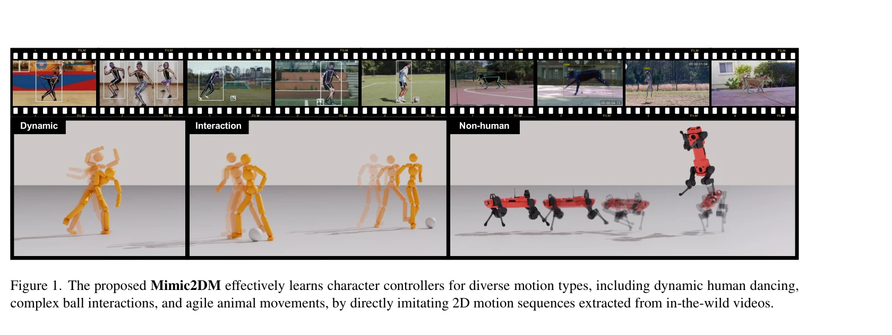

# Learning to Control Physically-simulated 3D Characters via Generating and Mimicking 2D Motions

> **저자**: Jianan Li, Xiao Chen, Tao Huang, Tien-Tsin Wong | **날짜**: 2025-12-09 | **URL**: [https://arxiv.org/abs/2512.08500](https://arxiv.org/abs/2512.08500)

---

## Essence

*Figure 1. The proposed Mimic2DM effectively learns character controllers for diverse motion types, including dynamic hum*

Mimic2DM은 비디오에서 추출한 2D 키포인트 궤적만을 사용하여 물리 기반 3D 캐릭터 제어 정책을 직접 학습하는 모션 모방 프레임워크이며, 재투영 오차 최소화와 RL을 통해 2D 데이터로부터 물리적으로 타당한 3D 동작을 합성한다.

## Motivation

- **Known**: 기존 방법들은 비디오에서 3D 모션을 재구성하여 물리 기반 모방 학습에 사용하지만, 이러한 재구성 기법들은 3D 훈련 데이터 부족이나 물리적으로 부자연스러운 포즈 생성으로 인해 일반화 능력이 제한된다.
- **Gap**: 인간-물체 상호작용(HOI)이나 비인간 캐릭터처럼 3D 데이터가 희소한 도메인에서 비디오로부터 직접 물리 기반 제어 정책을 학습할 수 있는 방법이 부족하다.
- **Why**: 비디오 데이터는 MoCap 데이터보다 훨씬 비용 효율적이고 접근성이 높으므로, 2D 데이터만 사용하여 다양한 도메인에서 물리적으로 타당한 3D 동작을 학습할 수 있다면 캐릭터 제어의 실용성과 확장성이 크게 향상된다.
- **Approach**: View-agnostic 2D 모션 추적 정책을 재투영 오차 최소화를 통해 학습하고, 여러 시점의 데이터로 훈련하여 3D 모션 추적 능력을 획득하도록 하며, 2D 모션 생성기를 계층적 제어 프레임워크에 통합하여 제어 정책을 안내한다.

## Achievement

- **2D 기반 물리 제어 정책**: 2D 키포인트 궤적만을 사용하여 물리적으로 타당한 3D 동작을 직접 생성할 수 있는 제어 정책을 개발
- **다중 도메인 확장성**: 댄싱, 축구 드리블, 동물 움직임 등 다양한 도메인에서 3D MoCap 데이터 없이 효과적으로 동작을 합성
- **View-agnostic 설계**: 단일 시점으로 훈련한 정책이 여러 시점의 2D 데이터 집계를 통해 3D 추적 능력을 획득하도록 설계
- **계층적 생성 프레임워크**: Transformer 기반 자기회귀 2D 모션 생성기를 통합하여 높은 품질의 모션 합성 및 조건부 제어 실현
- **동등한 3D 추적 성능**: 순수 2D 데이터로만 훈련함에도 불구하고 3D 데이터 기반 방법과 비교 가능한 3D 추적 정확도 달성

## How

*Figure 3. Overview of the pipeline. Our approach Mimic2DM learns a view-agnostic tracking policy that imitates 2D motion*

- 재투영 오차 최소화를 통한 3D 재구성과 물리 기반 모방 학습을 통합하여 RL로 추적 정책 최적화
- 적응형 상태 초기화 전략과 재투영 오차 기반 조기 종료 기준을 도입하여 단일 시점 모션 추적의 훈련 효율성 향상
- View-agnostic 정책 아키텍처로 다양한 시점에서 촬영된 2D 모션 데이터로부터 robust한 3D 추적 능력 학습
- 여러 시점의 2D 데이터를 집계하는 메커니즘을 통해 단일 시점 정책을 다중 시점 정책으로 확장
- Transformer 기반 자기회귀 모델로 고품질 2D 모션 시퀀스를 생성하여 추적 정책을 안내하는 계층적 제어 구조 구성

## Originality

- 3D 재구성과 물리 기반 모방을 재투영 오차 최소화라는 통일된 프레임워크로 융합하여 2D 데이터의 깊이 정보 부재 문제 해결
- View-agnostic 정책 설계로 단일 시점 추적에서 다중 시점 추적으로의 자연스러운 확장 메커니즘 제시
- 2D 모션을 생성기와 추적 정책 사이의 인터페이스로 사용하는 계층적 제어 구조로 생성 기반 동작 합성과 제어 통합
- 비인간 캐릭터와 인간-물체 상호작용 등 기존 방법이 어려워하는 도메인에서 3D 데이터 없이 성공적으로 동작 학습 달성

## Limitation & Further Study

- 2D 키포인트 추출의 정확도가 최종 성능에 직접 영향을 미치므로, 낮은 품질의 2D 추정은 학습 저하로 이어질 수 있음
- 깊이 정보 부재로 인한 모호성(depth ambiguity)이 여전히 존재하므로, 복잡한 자가 폐색(self-occlusion)이 많은 동작에서 어려움 가능
- 물리 시뮬레이션의 정확도와 현실 세계의 동역학 간 차이(sim-to-real gap)가 실제 로봇 제어 적용에 영향을 미칠 수 있음
- 다양한 체형, 포즈 범위, 카메라 매개변수에 대한 일반화 능력에 대한 체계적인 분석 부재
- 후속 연구로 더욱 강건한 2D 키포인트 검출 방법 개발, 깊이 모호성을 줄이는 추가 제약 조건 도입, 시뮬레이션과 현실의 간격 축소 기술 개발 필요

## Evaluation

- Novelty: 4/5
- Technical Soundness: 3/5
- Significance: 4/5
- Clarity: 4/5
- Overall: 4/5

**총평**: Mimic2DM은 접근성 높은 2D 데이터로부터 물리 기반 3D 캐릭터 제어를 학습하는 실질적이고 혁신적인 방법으로, 기존의 희소한 3D MoCap 데이터 의존성을 크게 완화하며 다양한 도메인에서 우수한 성능을 보여준다.

## Related Papers

- 🏛 기반 연구: [[papers/1862_DeepMimic_Example-Guided_Deep_Reinforcement_Learning_of_Phys/review]] — 물리 기반 캐릭터 제어의 기본 방법론을 2D 데이터 기반 3D 제어로 확장한 기반
- 🔄 다른 접근: [[papers/1701_Taming_Diffusion_Probabilistic_Models_for_Character_Control/review]] — 확률적 모델을 이용한 캐릭터 제어에서 diffusion과 재투영 기반의 다른 접근법
- 🏛 기반 연구: [[papers/1858_cuRoboV2_Dynamics-Aware_Motion_Generation_with_Depth-Fused_D/review]] — 2D 키포인트를 활용한 물리 기반 제어가 깊이 융합 동역학 인식 운동 생성에 이론적 기반을 제공한다.
- 🔗 후속 연구: [[papers/1878_Diffusion_Forcing_for_Multi-Agent_Interaction_Sequence_Model/review]] — 2D 데이터에서의 3D 캐릭터 제어가 다중 에이전트 상호작용 시퀀스 모델링으로 확장된다.
- 🧪 응용 사례: [[papers/1815_Being-M05_A_Real-Time_Controllable_Vision-Language-Motion_Mo/review]] — 비디오에서의 모션 모방이 실시간 제어 가능한 vision-language-motion 생성에 직접 적용된다.
- 🔗 후속 연구: [[papers/2123_One-shot_Adaptation_of_Humanoid_Whole-body_Motion_with_Walki/review]] — Learning to Control 3D Characters의 물리 시뮬레이션 캐릭터 제어를 실제 휴머노이드의 원샷 전신 운동 적응으로 발전시킨 연구이다.
