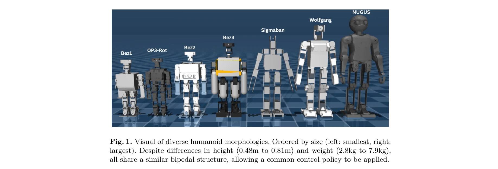
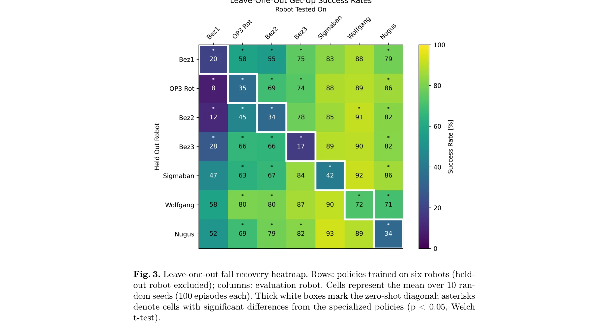

# Learning to Get Up Across Morphologies: Zero-Shot Recovery with a Unified Humanoid Policy

> **저자**: Jonathan Spraggett | **날짜**: 2025-12-13 | **URL**: [https://arxiv.org/abs/2512.12230](https://arxiv.org/abs/2512.12230)

---

## Essence

*Fig. 1. Visual of diverse humanoid morphologies. Ordered by size (left: smallest, right:*

7개의 다양한 휴머노이드 로봇(높이 0.48-0.81m, 무게 2.8-7.9kg)에서 낙상 복구를 수행할 수 있는 단일 통합 DRL 정책을 제시하며, 로봇 특화 학습 없이 미학습 로봇에 86±7% 성공률로 제로샷 전이가 가능함을 보였다.

## Motivation

- **Known**: 낙상 복구는 RoboCup 같은 동적 환경에서 휴머노이드 로봇에게 필수적인 기술이며, 최근 DRL 기반 방법들이 강건한 get-up 행동을 생성하지만 각 로봇 형태(morphology)마다 별도의 정책 학습이 필요했다.
- **Gap**: 기존 DRL 방법들은 단일 로봇 형태에만 학습되며, 다중 형태의 휴머노이드 로봇에 걸쳐 일반화되는 낙상 복구 정책이 존재하지 않았다. URMA, ModuMorph 등의 다형태 제어 방법은 주로 보행에만 적용되었다.
- **Why**: 휴머노이드 로봇의 배포 비용을 감소시키고, 각 로봇마다 정책을 재학습하지 않아도 되는 형태-불가지론적(morphology-agnostic) 제어의 실용성을 입증하여 일반화된 휴머노이드 제어의 기초를 마련할 수 있다.
- **Approach**: 7개 휴머노이드 형태를 MuJoCo에서 학습하되, 명시적 형태 식별자 없이 통합 관찰/행동 공간과 형태-불가지론적 보상 함수를 설계하여 상태 역학만으로 형태 차이를 학습하도록 함. CrossQ 알고리즘으로 학습하고 광범위한 domain randomization을 적용한다.

## Achievement

*Fig. 3. Leave-one-out fall recovery heatmap. Rows: policies trained on six robots (held-*

- **첫 통합 정책**: 7개 휴머노이드 형태에 대한 첫 번째 단일 DRL 낙상 복구 정책 제시
- **제로샷 전이 성능**: 미학습 형태에서 86±7% (95% CI [81, 89]) 성공률 달성
- **형태 다양성 효과**: Leave-one-out 실험과 형태 스케일링 분석으로 학습 중 형태 다양성 증가가 미학습 로봇으로의 일반화를 개선함을 입증
- **전문가 초과**: 일부 경우에서 통합 정책이 로봇 특화 기준 모델을 능가
- **오픈소스 공개**: 소프트웨어를 GitHub에 공개하여 재현성과 활용성 확보

## How

*Fig. 2. Recovery sequence of the Bez2 robot in Mujoco over 2 seconds.*

- 7개 휴머노이드 로봇(Bez1, OP3-Rot, Bez2, Bez3, Sigmaban, Wolfgang, NUGUS)을 MuJoCo XML 형식(MJCF)으로 표준화하여 구축
- 형태 간 일관성을 위해 관절 회전, 초기 관절각, 명명 규칙 정규화, IMU 및 발 프레임 참조점 추가
- 통합 행동 공간: 어깨, 팔꿈치, 고관절, 무릎, 발목 pitch 관절의 원하는 관절각 변화 출력(Equation 1)
- 확장 관찰 공간: 관절 위치/속도, 원하는 관절 위치, 몸통 오일러각(roll, pitch, yaw), 머리 높이, 이전 행동(Table 2)
- 형태-불가지론적 보상: 세운 자세(RUp), 피치 정렬(RPitch), 속도 제약(Rvel), 행동 변화 부드러움(Rvar), 자기충돌 회피(Rcollision) 조합(Equation 2, Table 3)
- CrossQ 알고리즘으로 학습, 광범위한 domain randomization 적용하여 sim-to-real 전이 강화
- Leave-one-out 실험: 6개 형태로 학습하고 1개 형태에서 평가하는 교차 검증

## Originality

- 형태 식별자를 전혀 제공하지 않는 완전 형태-불가지론적 설계: NerveNet, URMA, ModuMorph와 달리 그래프, 형태 벡터 등 구조 정보를 명시적으로 포함하지 않음
- 낙상 복구에서 처음으로 다중 형태 일반화 실현: 기존 다형태 제어는 주로 보행에 집중
- 확장 관찰 공간의 창의적 설계: 머리 높이 같은 형태-독립적 메트릭으로 서로 다른 크기의 로봇을 통일
- 포괄적 분석: Leave-one-out, 형태 스케일링, 다양성 절제(ablation) 실험으로 일반화 메커니즘 심층 분석

## Limitation & Further Study

- **시뮬레이션 기반**: MuJoCo 시뮬레이터에서만 검증되었으며, sim-to-real 전이는 실제 실험으로 입증되지 않음 (FRASA는 실현했으나 이 논문은 미포함)
- **제한된 형태 범위**: 7개 휴머노이드만 포함되었으며, 사족 로봇이나 더 이질적인 형태로의 확장 검증 부족
- **형태 정보 활용 부재**: 명시적 형태 정보를 사용하지 않는 선택이 성능 한계를 야기할 수 있음 (일부 경우 전문가 모델에 못 미칠 가능성)
- **부드러운 동작 미흡**: Adversarial Motion Priors(AMP) 미적용으로 인간다운 동작이 부족할 수 있음
- **후속연구**: AMP를 통합하여 회복 동작의 자연스러움 개선, 더 광범위한 형태(사족, 팔이 없는 로봇 등) 포함, 실제 로봇에서 sim-to-real 전이 검증 필요

## Evaluation

- Novelty: 4/5
- Technical Soundness: 3/5
- Significance: 4/5
- Clarity: 4/5
- Overall: 4/5

**총평**: 이 논문은 휴머노이드 낙상 복구라는 구체적 과제에서 형태-불가지론적 다중 로봇 제어의 실현 가능성을 처음 입증하며, 포괄적 실험과 높은 제로샷 성능으로 일반화된 로봇 제어의 기초를 마련한다. 다만 시뮬레이션 기반 검증과 실제 전이 실험이 부재한 점이 한계이지만, 오픈소스 공개와 체계적 분석은 해당 분야에 실질적 기여를 한다.
