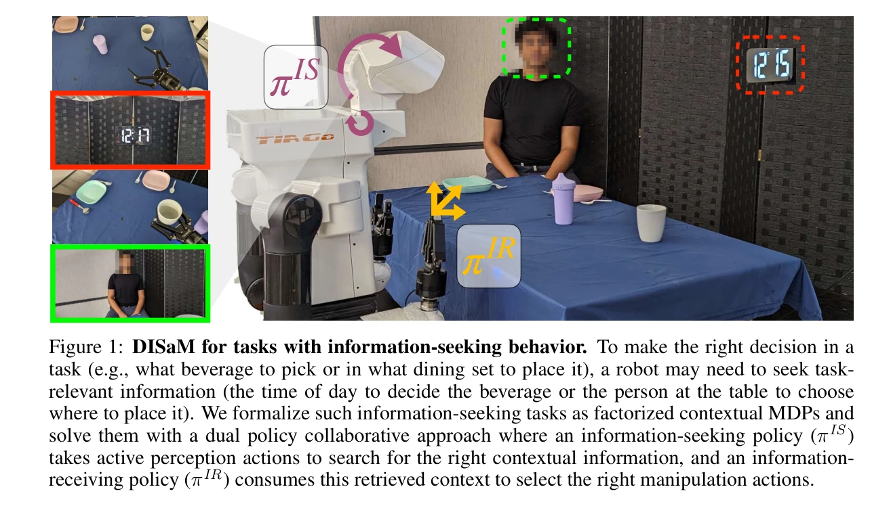
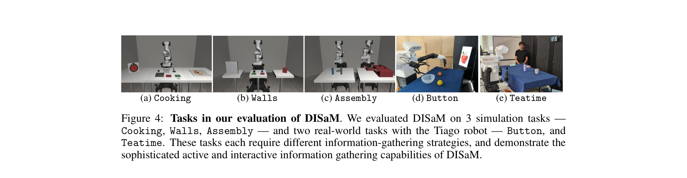
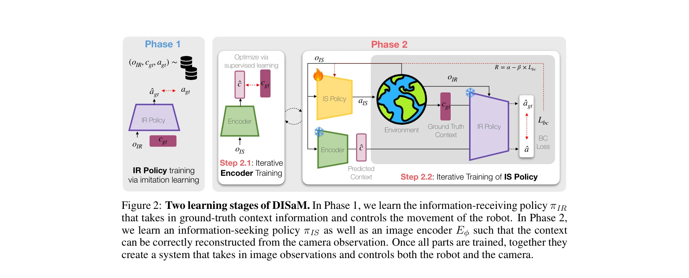

# Learning to Look: Seeking Information for Decision Making via Policy Factorization

> **저자**: Shivin Dass, Jiaheng Hu, Ben Abbatematteo, Peter Stone, Roberto Martín-Martín | **날짜**: 2024-10-24 | **URL**: [https://arxiv.org/abs/2410.18964](https://arxiv.org/abs/2410.18964)

---

## Essence

*Figure 1: DISaM for tasks with information-seeking behavior. To make the right decision in a*

로봇이 조작 작업을 수행하기 위해 필요한 정보를 능동적으로 탐색하는 문제를 factorized Contextual MDP로 정의하고, 정보 탐색 정책과 정보 활용 정책으로 분리된 dual-policy 솔루션 DISaM을 제안한다.

## Motivation

- **Known**: 능동 지각(active perception)과 상호작용 지각(interactive perception)은 로봇이 정보를 찾는 데 중요하나, 기존 방법들은 수집할 정보를 사전에 명시해야 하거나 POMDP 해결의 계산 복잡성으로 인해 제한된다.
- **Gap**: 장지평 작업에서 스스로 필요한 정보를 발견하고 탐색과 활용을 균형있게 수행하는 로봇의 학습 문제는 충분히 다뤄지지 않았다.
- **Why**: 로봇 조작에서 조리, 물건 배치 등 많은 작업이 먼저 필요한 문맥 정보를 능동적으로 찾아야 성공 가능하므로, 이를 자동으로 학습하는 방법이 필수적이다.
- **Approach**: 문제를 factorized CMDP로 형식화하여 정보 탐색 정책(πIS)과 정보 활용 정책(πIR)을 분리 학습하고, IR 정책의 성능을 IS 정책의 내재적 보상으로 사용하여 훈련 효율을 높인다.

## Achievement

*Figure 4: Tasks in our evaluation of DISaM. We evaluated DISaM on 3 simulation tasks —*

- **Factorized CMDP 형식화**: 정보 탐색이 필요한 로봇 조작 문제를 체계적으로 정의하는 새로운 문제 클래스 제안
- **Dual-policy 솔루션 DISaM**: 정보 탐색과 조작을 분리된 정책으로 학습하되 IS가 IR을 통해 보상을 받도록 설계
- **분리된 학습의 이점**: IR 정책을 imitation learning으로 학습하고 IS 정책을 POMDP로 단순화하여 학습 효율 개선
- **테스트 시 불확실성 기반 균형**: IR 정책의 ensemble 기반 불확실성을 이용하여 탐색과 활용 자동 조절
- **광범위한 실험 검증**: 5개의 조작 작업(3개 시뮬레이션 + 2개 실제 로봇)에서 기존 방법 대비 현저한 성능 향상 입증

## How

*Figure 2: Two learning stages of DISaM. In Phase 1, we learn the information-receiving policy πIR*

- IR 정책 학습: 문맥이 주어졌을 때 fully observable MDP로 만들어 imitation learning 또는 behavioral cloning으로 효율적 학습
- IS 정책 학습: IR 정책의 성공 확률이나 보상을 내재적 보상으로 사용하여 POMDP 강화학습으로 학습
- 분리된 에이전트 구조: 동일 로봇의 경우 카메라 이동(IS) → 조작(IR), 또는 scout 로봇(IS)과 조작 로봇(IR) 등 다양한 구성 지원
- 테스트 시 정책 선택: IR 정책의 ensemble을 통해 다음 액션의 불확실성 계산하고, 높으면 IS 정책 실행, 낮으면 IR 정책 실행
- 다단계 작업 처리: 여러 정보 탐색/활용 단계가 필요한 경우에도 단계별로 같은 메커니즘 적용 가능

## Originality

- 기존 active perception/interactive perception과 달리 정보 수집 대상을 사전 지정 없이 보상 신호로부터 자동 발견
- CMDP 이론과 dual-policy 아이디어의 결합으로 정보 탐색-활용 문제의 새로운 형식화
- IL과 RL의 조합을 통해 장지평 문제를 두 개의 짧은 지평 문제로 분해하는 학습 전략의 혁신
- ensemble 기반 불확실성으로 테스트 시 탐색/활용 균형을 자동 제어하는 간단하면서도 효과적인 메커니즘

## Limitation & Further Study

- IS 정책이 모든 관련 정보를 한 번에 수집할 수 없는 경우 단계별 탐색 필요 — 다중 단계 정보 수집의 최적화 알고리즘 미개발
- IR 정책이 imitation learning으로 학습되어야 하므로 시연 데이터 필요 — end-to-end 강화학습만으로 두 정책 모두 학습하는 방법 미탐색
- 문맥이 동적으로 변하거나 지속적으로 변화하는 환경에서의 적용성 미검토
- IS 정책의 탐색 성능이 제한적일 때 IR의 보상 신호가 빈약해지는 악순환 가능성 — 초기 탐색 부스트 메커니즘 필요
- 복잡한 시각-조작 연결(visual servoing 등)이 필요한 작업에서의 일반화 능력 미확인

## Evaluation

- Novelty: 4/5
- Technical Soundness: 3/5
- Significance: 4/5
- Clarity: 4/5
- Overall: 4/5

**총평**: 정보 탐색과 조작의 분리를 통해 장지평 POMDP를 효율적으로 해결하는 우아한 솔루션을 제시하며, 광범위한 실험 검증으로 실용성을 입증한 강력한 논문이다. 다만 다단계 탐색 최적화와 완전 자동학습 가능성 탐색이 향후 과제이다.
