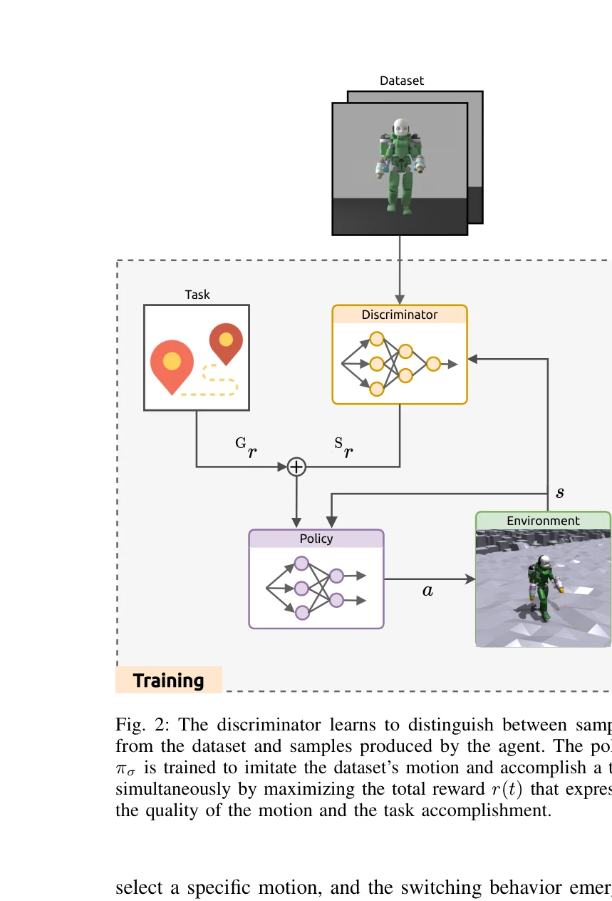
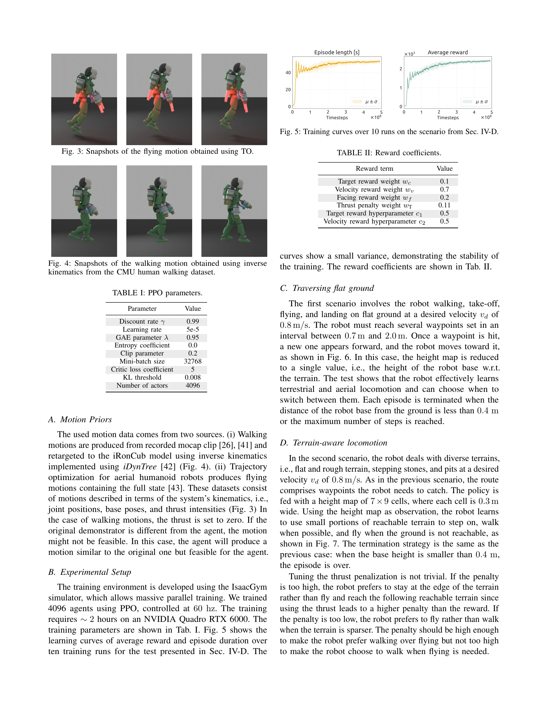

# Learning to Walk and Fly with Adversarial Motion Priors

> **저자**: Giuseppe L'Erario, Drew Hanover, Angel Romero, Yunlong Song, Gabriele Nava, Paolo Maria Viceconte, Daniele Pucci, Davide Scaramuzza | **날짜**: 2023-09-22 | **URL**: [https://arxiv.org/abs/2309.12784](https://arxiv.org/abs/2309.12784)

---

## Essence

*Fig. 2: The discriminator learns to distinguish between samples*

본 논문은 Adversarial Motion Priors(AMP)와 강화학습을 결합하여 항공 인형로봇(aerial humanoid robot)이 인간 같은 보행과 비행 사이를 자동으로 전환하도록 학습하는 방법을 제시한다. 복잡한 보상 함수 없이 동작 데이터셋을 모방하면서 과제를 수행하며, 환경 피드백에 따라 locomotion 모드가 자발적으로 전환된다.

## Motivation

- **Known**: 기존 연구는 주로 개별 locomotion 스타일에 특화된 로봇 시스템을 개발했으며, 보행과 비행과 같은 이종 locomotion 간의 전환은 trajectory optimization이나 state machine을 통해 명시적으로 제어되었다.
- **Gap**: 항공 인형로봇이 고수준의 과제 달성을 위해 언제, 어떻게 locomotion 모드를 자동으로 전환해야 하는지에 대한 학습 기반 방법이 부족했다. 특히 명시적 trajectory 추적이나 state machine 없이 자발적으로 mode-switching이 일어나는 방법이 없었다.
- **Why**: Search and rescue, surveillance, exploration 같은 다양한 환경에서 자율적으로 활동할 수 있는 항공 인형로봇의 versatile locomotion 능력은 실제 응용에서 중요하며, 이는 로봇 자동성과 적응성을 획기적으로 향상시킨다.
- **Approach**: 본 논문은 AMP의 style reward와 task reward를 결합한 이중 보상 구조를 사용하여, discriminator가 데이터셋과 정책 생성 동작을 구별하도록 학습시키면서 동시에 고수준 과제(waypoint tracking)를 수행하도록 강화학습으로 정책을 훈련한다. 에너지 proxy 항을 보상함수에 포함시켜 자연스러운 mode-switching을 유도한다.

## Achievement

*Fig. 4: Snapshots of the walking motion obtained using inverse*

- **최초 자동 mode-switching 달성**: trajectory optimization이나 state machine 없이 walking과 flying 사이의 smooth transitions를 자발적으로 학습
- **이중 데이터셋 활용**: 인간 유사 보행 데이터셋과 trajectory optimization으로부터 생성된 비행 동작 데이터셋을 동시에 모방
- **복잡 환경에서의 성능**: NVIDIA Isaac Gym 환경에서 복잡한 지형 및 rough courses를 성공적으로 순회
- **실제 모터 모델 적용**: 이상적 thrust와 실제 jet-powered actuation 두 가지 경우 모두에서 검증

## How

*Fig. 2: The discriminator learns to distinguish between samples*

- Floating-base formalism을 사용하여 항공 인형로봇의 동역학을 모델링 (Eq. 1)
- Markov Decision Process(MDP) 프레임워크 내에서 정책 πσ를 심층 신경망으로 표현
- Style reward Srt는 adversarial discriminator가 생성된 동작과 데이터셋 샘플을 구별할 수 없도록 학습
- Task reward Grt는 waypoint tracking을 위한 고수준 목표 달성을 장려
- 총 보상 rt = wG·Grt + wS·Srt에서 가중치를 조정하여 balance 제어
- 에너지 proxy 항을 포함시켜 지면이 접근 가능할 때 walking을, 그렇지 않을 때 flying을 자동으로 선택하도록 유도
- iRonCub 항공 인형로봇에 대해 Isaac Gym 시뮬레이터에서 훈련 및 평가

## Originality

- AMP를 항공 인형로봇의 multimodal locomotion에 처음 적용하여, 두 이질적인 locomotion 스타일 간의 자동 전환 달성
- 명시적 trajectory optimization 또는 state machine 없이 강화학습만으로 mode-switching의 자발적 출현을 구현한 혁신적 접근
- 인간 보행 데이터셋과 최적 비행 궤적을 동시에 모방하는 unified framework 제시
- 에너지 proxy 항을 통한 task-driven 자동 mode selection 메커니즘의 창의적 설계

## Limitation & Further Study

- 시뮬레이션 환경(Isaac Gym)에서만 검증되었으며 실물 로봇 iRonCub 실험이 부재
- 인간 보행 데이터셋의 품질과 diversity가 최종 성능에 미치는 영향이 충분히 분석되지 않음
- 복잡한 지형의 정의와 다양한 환경 조건에 대한 generalization 능력이 제한적
- Jet-powered actuation 모델이 실제 시스템과 완전히 일치하는지 검증 필요
- 후속 연구로 실제 항공 인형로봇 하드웨어에서의 검증 및 더 복잡한 3D 지형 환경 테스트 수행 권고

## Evaluation

- Novelty: 4/5
- Technical Soundness: 4/5
- Significance: 4/5
- Clarity: 4/5
- Overall: 4/5

**총평**: 본 논문은 AMP와 강화학습의 결합을 통해 항공 인형로봇의 multimodal locomotion에서 자동 mode-switching이라는 미해결 문제를 우아하게 해결한 높은 수준의 연구이다. 비록 시뮬레이션 환경에 한정되어 있지만, 기술적 혁신성, 문제 해결의 우수성, 그리고 실제 응용 가능성 측면에서 로봇공학 분야에 의미 있는 기여를 한다.
