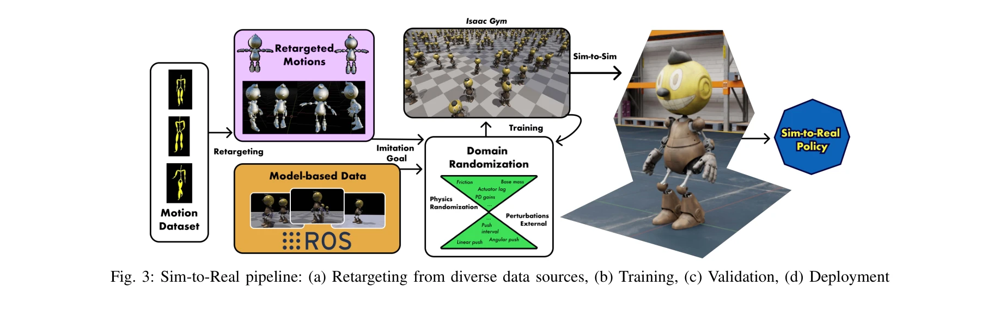

# Learning to Walk in Costume: Adversarial Motion Priors for Aesthetically Constrained Humanoids

> **저자**: Arturo Flores Alvarez, Fatemeh Zargarbashi, Havel Liu, Shiqi Wang, Liam Edwards, Jessica Anz, Alex Xu, Fan Shi, Stelian Coros, Dennis W. Hong | **날짜**: 2025-09-06 | **URL**: [https://arxiv.org/abs/2509.05581](https://arxiv.org/abs/2509.05581)

---

## Essence

*Fig. 1: Cosmo: an entertainment humanoid robot with covers*

미적 설계 제약이 있는 엔터테인먼트 휴머노이드 로봇 Cosmo를 위해 Adversarial Motion Priors (AMP)를 기반으로 한 강화학습 보행 시스템을 제시하며, 극단적인 질량 분포와 움직임 제약 하에서도 자연스러운 보행 행동을 학습할 수 있음을 보여준다.

## Motivation

- **Known**: Model-based 보행 제어는 수작업 튜닝이 필요하고 조건 변화에 취약하며, RL은 강력하지만 부자연스러운 움직임을 생성하는 경향이 있고, AMP는 모션 캡처 데이터를 통해 자연스러운 움직임을 학습할 수 있다.
- **Gap**: 기존 휴머노이드 로봇 제어 방법들은 미적 설계로 인한 불균형한 질량 분포(머리 16%)와 제한된 감각(비전 없음)을 가진 엔터테인먼트 로봇에 대해 거의 다루지 않았다.
- **Why**: 엔터테인먼트 로봇이 점점 더 인간의 환경에서 활용되고 있으며, 시각적 매력과 기능성 사이의 균형을 이루는 로봇 설계에 대한 해결책이 필요하다.
- **Approach**: 인간 모션 캡처 데이터를 Cosmo의 운동학적 제약에 맞게 retargeting한 후, AMP 프레임워크를 사용하여 discriminator 네트워크가 자연스러운 움직임을 유도하도록 하며, domain randomization과 specialized reward 구조를 통해 sim-to-real 전이를 수행한다.

## Achievement

*Fig. 3: Sim-to-Real pipeline: (a) Retargeting from diverse data sources, (b) Training, (c) Validation, (d) Deployment*

- **극단적 질량 분포 제어**: 머리가 총 질량의 16%를 차지하는 상단 중심의 불균형한 휴머노이드 로봇의 안정적인 보행 및 서기 행동 생성
- **미적 제약 하의 학습 기반 제어**: 보호 셸과 제한된 움직임으로 인한 미적 설계 제약 하에서도 자연스러운 움직임 생성 가능 입증
- **안전한 Sim-to-Real 전이**: Domain randomization과 specialized reward 구조를 통해 고가 하드웨어를 보호하면서 시뮬레이션에서 실제 로봇으로의 성공적인 전이 달성

## How

*Fig. 5: Schematic overview of the training framework.*

- CMU Mocap Dataset으로부터 인간 모션 캡처 데이터 수집 및 Rokoko plugin/Blender를 사용하여 Cosmo의 운동학적 구조에 맞게 retargeting
- Adversarial Motion Priors (AMP) 프레임워크 적용: Discriminator 네트워크 D_ϕ(s)가 참조 데이터셋과 정책 생성 상태를 구별하며 자연성 보상 신호 제공
- Proprioceptive 관찰 공간 구성: 기저 속도/각속도, 정규화된 관절 위치/속도, 중력 벡터, 이전 동작, 기저 높이, 명령 신호 등을 포함
- Task 보상과 style 보상 결합: Imitation (AMP 보상), Motion Quality (관절 속도), Safety (발 디딤, 발 방향, 발 높이) 항목으로 구성된 계층화된 보상 함수
- Isaac Gym의 대규모 병렬화된 환경을 활용하여 다양한 스타일과 지형에서 학습
- Domain randomization으로 시뮬레이션-현실 간의 차이 극복 및 하드웨어 파라미터 세심한 튜닝

## Originality

- 상단 중심(top-heavy) 질량 분포를 가진 휴머노이드 로봇의 보행 제어 문제를 처음 체계적으로 다룸
- 미적 설계 제약(보호 셸, 제한된 관절 이동)이 있는 엔터테인먼트 로봇용 AMP 기반 제어 시스템의 새로운 응용
- Vision 없이 proprioception만으로 안정적인 보행을 달성하는 조건에서 AMP의 효과성 입증
- 엔터테인먼트 로봇의 미적 요구사항과 기능성 사이의 균형을 다루는 새로운 관점 제시

## Limitation & Further Study

- 연구가 특정 로봇 플랫폼(Cosmo)에 대해 매우 맞춤화되어 다른 엔터테인먼트 로봇으로의 일반화 가능성이 불명확함
- Retargeting 과정에서 발 셸의 충돌(mesh clipping) 문제가 완전히 해결되지 않음
- 실험 결과가 주로 정상적인 보행(forward walking)에 제한되며, 더 복잡한 동작이나 불규칙한 지형에서의 성능은 제시되지 않음
- Vision이 없기 때문에 환경 인식 기반 동작 적응이 불가능하며, 이는 엔터테인먼�트 응용에서 제한적일 수 있음
- 후속 연구: 다양한 미적 제약이 있는 휴머노이드 로봇에 적용 가능한 일반화된 제어 프레임워크 개발, 시각 입력 통합을 통한 적응형 보행 제어 확장, 더 복잡한 엔터테인먼트 동작(춤, 제스처 등) 학습

## Evaluation

- Novelty: 4/5
- Technical Soundness: 3/5
- Significance: 4/5
- Clarity: 4/5
- Overall: 4/5

**총평**: 본 논문은 엔터테인먼트 로봇의 미적 설계 제약이라는 실제적이고 새로운 도전 문제를 다루면서 AMP 기반 학습을 성공적으로 적용한 의미 있는 연구이다. 극단적인 질량 분포와 제한된 감각 조건에서의 안정적인 sim-to-real 보행 달성은 인상적이지만, 특정 로봇 플랫폼에 대한 높은 맞춤화와 실험의 범위 제한이 일반화 가능성을 감소시킨다.

## Related Papers

- 🏛 기반 연구: [[papers/1801_AMP_Adversarial_Motion_Priors_for_Stylized_Physics-Based_Cha/review]] — Adversarial Motion Priors의 원리를 제공하며, 제약이 있는 엔터테인먼트 로봇의 자연스러운 보행 학습에 직접 활용된다.
- 🔄 다른 접근: [[papers/2116_Olaf_Bringing_an_Animated_Character_to_Life_in_the_Physical/review]] — 애니메이션 캐릭터의 물리적 구현이라는 같은 목표를 다른 기계설계와 제어 방식으로 접근한 사례이다.
- 🔗 후속 연구: [[papers/1884_DPL_Depth-only_Perceptive_Humanoid_Locomotion_via_Realistic/review]] — 깊이 기반 지각을 통해 극한 제약 조건에서도 환경 적응 보행을 가능하게 하는 확장된 방법론이다.
- 🧪 응용 사례: [[papers/1918_ExBody2_Advanced_Expressive_Humanoid_Whole-Body_Control/review]] — 표현적 휴머노이드 전신 제어 기술을 엔터테인먼트 로봇의 미적 보행에 실제 적용한 사례이다.
- 🔄 다른 접근: [[papers/1882_Do_You_Have_Freestyle_Expressive_Humanoid_Locomotion_via_Aud/review]] — 자율 휴머노이드 보행을 통한 표현적 보행과 미적 제약 하 자연스러운 보행이라는 다른 접근법을 제시한다.
- 🔄 다른 접근: [[papers/2072_Learning_to_Walk_and_Fly_with_Adversarial_Motion_Priors/review]] — 두 논문 모두 AMP 기반이지만 Cosmo는 미적 제약에, 항공 휴머노이드는 다중 모드 전환에 중점을 둔다.
- 🔗 후속 연구: [[papers/1649_Robot_Crash_Course_Learning_Soft_and_Stylized_Falling/review]] — 제약된 환경에서의 자연스러운 운동이 부드럽고 스타일화된 낙상 학습으로 확장되어 더 복잡한 제약 처리를 보여준다.
- 🔗 후속 연구: [[papers/1801_AMP_Adversarial_Motion_Priors_for_Stylized_Physics-Based_Cha/review]] — 의상 착용 캐릭터를 위한 adversarial motion prior 확장이 AMP의 stylized character control 응용 범위를 넓힌다
- 🔄 다른 접근: [[papers/2116_Olaf_Bringing_an_Animated_Character_to_Life_in_the_Physical/review]] — 애니메이션 캐릭터의 물리적 구현이라는 같은 도전을 다른 캐릭터와 기계설계로 접근한 유사 사례이다.
