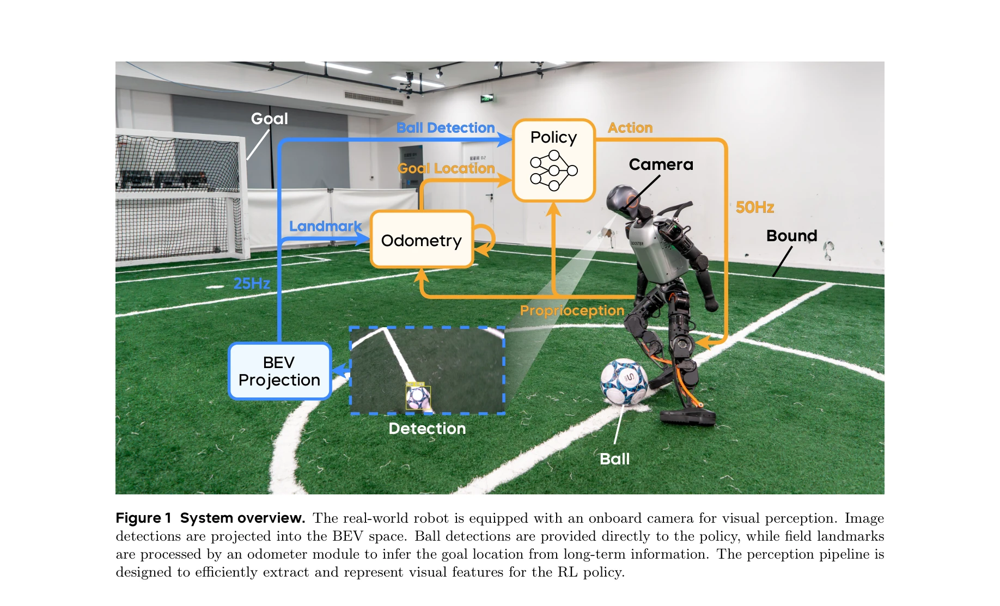

# Learning Vision-Driven Reactive Soccer Skills for Humanoid Robots

> **저자**: Yushi Wang, Changsheng Luo, Penghui Chen, Jianran Liu, Weijian Sun, Tong Guo, Kechang Yang, Biao Hu, Yangang Zhang, Mingguo Zhao | **날짜**: 2025-11-06 | **DOI**: [10.48550/arXiv.2511.03996](https://doi.org/10.48550/arXiv.2511.03996)

---

## Essence

*Figure 1 System overview. The real-world robot is equipped with an onboard camera for visual perception. Image*

본 논문은 시각 인식과 모션 제어를 직접 통합한 통합 강화학습 기반 컨트롤러를 통해 인형 로봇이 반응형 축구 기술을 습득할 수 있도록 하는 방법을 제시한다. Adversarial Motion Priors를 시각 기반 동적 제어 환경으로 확장하여 실제 RoboCup 경기에서 강력한 반응성을 보여준다.

## Motivation

- **Known**: 기존 로봇 축구 시스템은 저수준 모터 스킬과 고수준 전략을 분리하는 decoupled 아키텍처를 사용하였으며, 이전 RL 기반 접근법들은 반응성이 낮고 시뮬레이션 환경에 크게 의존하는 문제가 있었다.
- **Gap**: 시각 기반의 반응형 컨트롤러가 제약 없는 환경에서 일관되고 강건한 축구 행동을 생성할 수 있는 open challenge가 존재한다. 특히 노이즈 있는 시각 입력과 실시간 동적 환경에서의 perception-action coupling이 부족했다.
- **Why**: 인형 로봇 축구는 embodied intelligence의 대표적 과제로서, 실시간 시각 추적, 빠른 의사결정, 적응형 감각운동 조정이 필요하며, 이는 비정형 동적 환경에서의 자율 로봇 운영 능력으로 직결된다.
- **Approach**: encoder-decoder 아키텍처와 실제 시각 특성을 모델링하는 virtual perception system을 결합하여, 불완전한 관찰로부터 privileged state를 복원하고 perception과 action 사이의 능동적 조정을 가능하게 한다. 단계적 훈련 과정 없이 AMP 기반 RL로 통합 학습을 수행한다.

## Achievement

*Figure 2 Performance of the controller in various scenarios. (A to F) Real match performance in cluttered*

- **통합 시각-모터 제어**: 단일 단계 훈련으로 ball searching, chasing, multi-directional kicking 등의 적응형 행동을 수동 스킬 분할 없이 획득
- **강력한 반응성**: 시각 입력에 대한 빠른 반응과 gait 동적 조정으로 정확한 슈팅 달성
- **실세계 성능**: RoboCup 2025 Adult-size Humanoid League 우승팀과 2025 World Humanoid Robot Games에서 증명된 경쟁 환경에서의 강력한 성능
- **다양한 표면 대응**: grass, slabstone, soil, asphalt, rubber 등 다양한 지형에서 강건한 성능 유지
- **perception-action coupling**: encoder-decoder 네트워크와 virtual perception system으로 시각 노이즈 완화 및 볼 움직임 예측 가능

## How

*Figure 1 System overview. The real-world robot is equipped with an onboard camera for visual perception. Image*

- Intel RealSense Depth Camera D435i를 이용한 25 Hz 카메라 입력
- Camera 이미지를 Bird's Eye View (BEV) 공간으로 투영하여 detection 처리", 'Proprioception, ball detection, odometry 기반 goal 정보를 정책에 입력
- 50 Hz로 joint position command 생성
- Adversarial Motion Priors (AMP)를 RL 보상 신호로 활용하여 expert-like 동작 유도
- Multi-critic framework로 reward objectives 간 간섭 완화 및 학습 안정화
- Virtual perception system으로 시뮬레이션에서 onboard vision 특성 모방
- Encoder로 historical observation 압축, decoder로 privileged state 복원

## Originality

- GAN 기반 motion learning을 proprioception 기반 모방에서 시각 피드백 및 perception-action 조정이 필요한 실세계 동적 환경으로 확장한 첫 시도
- Virtual perception system을 통한 sim-to-real gap 해소: 시뮬레이션에서 실제 카메라의 시각 특성(노이즈, 지연, 공간 제약) 모델링
- Encoder-decoder 아키텍처로 불완전한 관찰로부터 privileged state 복원하는 새로운 방식
- 단계적 훈련 없이 단일 단계 RL 훈련으로 다양한 축구 기술을 동시에 습득
- BEV 공간 기반 perception pipeline으로 효율적인 시각 특징 추출 및 표현

## Limitation & Further Study

- Vision-based 컨트롤은 여전히 카메라의 onboard 제약(시야각, 처리 지연)에 의존하며, 이는 장거리 볼 추적에서 성능 제한 가능성
- Jetson AGX Orin 같은 고성능 엣지 컴퓨팅 장치 필요로 다른 로봇 플랫폼으로의 이식성 제한
- Virtual perception system의 정확도가 실제 환경의 복잡한 시각 왜곡(조명 변화, 반사 등)을 완전히 포착하지 못할 가능성
- **후속연구**: (1) 더 경량화된 perception 모델로 저성능 로봇 지원, (2) 멀티 카메라 또는 wider FOV 센서 활용, (3) 도메인 일반화를 위한 다양한 경기장 환경에서의 강건성 강화

## Evaluation

- Novelty: 4/5
- Technical Soundness: 4/5
- Significance: 4/5
- Clarity: 4/5
- Overall: 4/5

**총평**: 본 논문은 Adversarial Motion Priors를 시각 기반 동적 제어로 성공적으로 확장하여, 강화학습 기반 인형 로봇이 실세계 축구 환경에서 반응형 행동을 자동으로 습득할 수 있음을 처음으로 입증했다. RoboCup 2025 우승이라는 실제 경쟁 성과는 제시된 방법론의 실용성과 견고성을 강력하게 검증한다.

## Related Papers

- 🏛 기반 연구: [[papers/1801_AMP_Adversarial_Motion_Priors_for_Stylized_Physics-Based_Cha/review]] — 적대적 동작 선험을 시각 기반 동적 제어 환경으로 확장하는 이론적 기반을 제공한다.
- 🔄 다른 접근: [[papers/2063_Learning_Soccer_Skills_for_Humanoid_Robots_A_Progressive_Per/review]] — 인식-행동 통합 의사결정과 시각-모션 제어 통합이라는 다른 접근법으로 축구 스킬을 학습한다.
- 🔗 후속 연구: [[papers/1648_RoboStriker_Hierarchical_Decision-Making_for_Autonomous_Huma/review]] — 계층적 의사결정을 통한 자율 휴머노이드 축구의 확장된 구현을 보여준다.
- 🏛 기반 연구: [[papers/1792_Adversarial_Locomotion_and_Motion_Imitation_for_Humanoid_Pol/review]] — 적대적 학습을 통한 모션 모방이 시각 기반 반응형 축구 기술의 기반 제공
- 🔄 다른 접근: [[papers/2053_Learning_Human-Like_Badminton_Skills_for_Humanoid_Robots/review]] — 두 논문 모두 시각 기반 스포츠 기술을 다루지만 축구는 통합 강화학습을, 배드민턴은 모방-상호작용 접근법을 사용한다.
- 🔗 후속 연구: [[papers/1979_HITTER_A_HumanoId_Table_TEnnis_Robot_via_Hierarchical_Planni/review]] — 시각 기반 반응형 축구가 계층적 플래닝을 통한 탁구로 확장되어 더 정밀한 반응 제어를 보여준다.
- 🔗 후속 연구: [[papers/1679_SkillMimic_Learning_Basketball_Interaction_Skills_from_Demon/review]] — 스포츠 기술 학습에서 농구와 축구라는 서로 다른 종목에 대한 휴머노이드 제어 접근법을 다룬다.
- 🔗 후속 연구: [[papers/1683_SoccerDiffusion_Toward_Learning_End-to-End_Humanoid_Robot_So/review]] — 스포츠 로봇 제어에서 축구와 축구라는 동일 종목에 대한 end-to-end 학습과 시각 기반 반응 기술이라는 보완적 접근법을 다룬다.
- 🔄 다른 접근: [[papers/2053_Learning_Human-Like_Badminton_Skills_for_Humanoid_Robots/review]] — 배드민턴과 축구 모두 시각 기반 반응형 스포츠 기술이지만 배드민턴은 모방-상호작용, 축구는 통합 강화학습을 사용한다.
- 🔄 다른 접근: [[papers/2063_Learning_Soccer_Skills_for_Humanoid_Robots_A_Progressive_Per/review]] — 시각 기반 반응형 축구 기술과 인식-행동 통합 프레임워크라는 다른 접근법으로 축구 스킬을 학습한다.
