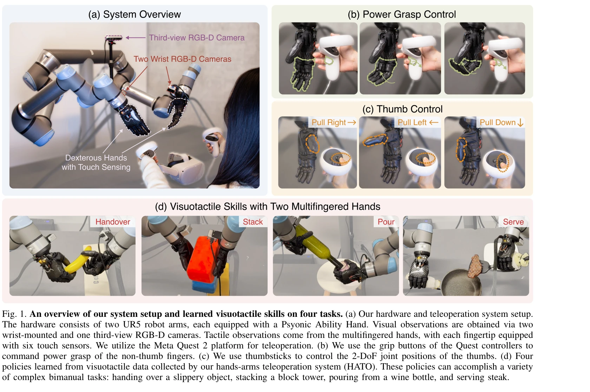
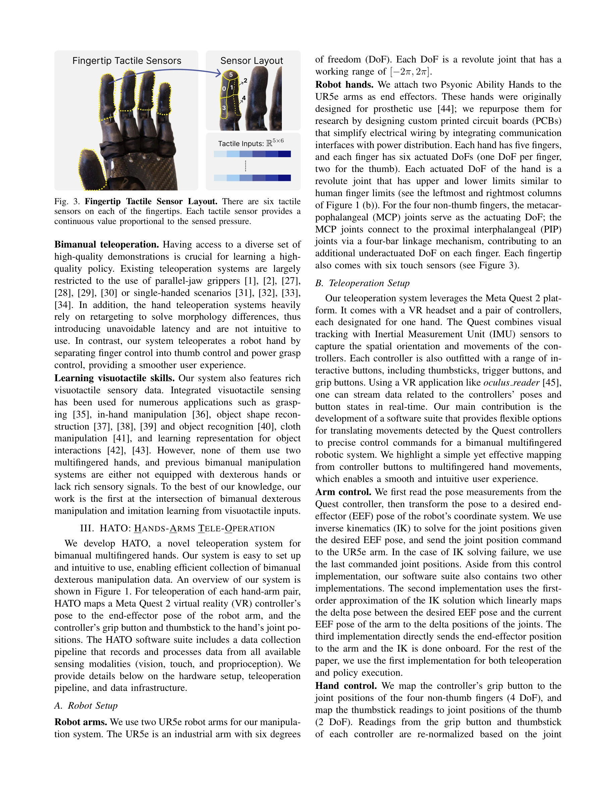

# Learning Visuotactile Skills with Two Multifingered Hands

> **저자**: Toru Lin, Yu Zhang, Qiyang Li, Haozhi Qi, Brent Yi, Sergey Levine, Jitendra Malik | **날짜**: 2024-04-25 | **URL**: [https://arxiv.org/abs/2404.16823](https://arxiv.org/abs/2404.16823)

---

## Essence

*Fig. 1. An overview of our system setup and learned visuotactile skills on four tasks. (a) Our hardware and teleoperatio*

VR 기반 저가형 텔레오퍼레이션 시스템 HATO와 촉각 센서가 장착된 의족 손을 활용하여 양손 다중지 조작 로봇이 시각-촉각 데이터로부터 인간 수준의 민첩한 조작 기술을 학습하는 시스템을 제시한다.

## Motivation

- **Known**: 기존 양손 조작 시스템은 단순성 때문에 병렬 그리퍼를 사용하며, imitation learning을 통한 조작 학습이 활발히 연구되고 있다. 그러나 촉각 센싱이 있는 다중지 손을 갖춘 양손 시스템은 매우 드물다.
- **Gap**: 양손 다중지 조작에 적합한 저가형 텔레오퍼레이션 시스템이 없고, 촉각 센싱을 갖춘 다중지 손 하드웨어도 부족하다. 또한 양손 다중지 조작과 visuotactile learning의 교집합 연구가 없다.
- **Why**: 인간 수준의 민첩함(dexterity)을 달성하려면 양손 협력, 적응적 파악, 도구 사용 등이 필수적이며, 촉각 피드백은 미끄러운 물체 조작이나 고정밀 작업에서 중요하다.
- **Approach**: 의료용 의족 손(Psyonic Ability Hand)을 연구용으로 재목적화하고, VR 컨트롤러(Meta Quest 2) 기반의 직관적 매핑을 통해 HATO 시스템을 개발했으며, 멀티모달 데이터 처리와 end-to-end 정책 학습을 수행했다.

## Achievement

*Fig. 2. Illustration of learned skills on four different tasks. Our learned policies complete long-horizon and high-prec*

- **저가형 텔레오퍼레이션 시스템**: Meta Quest 2의 VR 컨트롤러를 활용한 HATO로 30분~2시간의 데이터로 효과적인 정책 학습 가능
- **하드웨어 혁신**: 촉각 센서 장착 의족 손을 로봇 연구용으로 재목적화하여 6개의 손가락 DoF와 6개의 fingertip 촉각 센서 제공
- **복잡한 작업 성공**: 손가락 협력 필요(미끄러운 물체 전달, 블록 스택), 대형 물체 조작(와인 붓기), 도구 사용(스테이크 서빙) 등 4개 작업 수행
- **ablation study**: 촉각과 시각이 정책 성공률과 견고성을 크게 향상시키며, 수백 개의 시연만으로 효과적 학습 가능함을 입증

## How

*Fig. 3. Fingertip Tactile Sensor Layout. There are six tactile*

- Meta Quest 2 컨트롤러 pose → UR5e 팔의 end-effector pose 매핑
- grip button → 4개 손가락 파워 그래스 제어, thumbstick → 엄지 2-DoF 관절 위치 제어
- 3개 RGB-D 카메라(손목 2개, 제3관점 1개) + 각 fingertip 6개 촉각 센서 + proprioception 수집
- Multimodal data processing 파이프라인으로 시각, 촉각, proprioception 정렬 및 처리
- End-to-end behavior cloning으로 vision + tactile input으로부터 정책 학습

## Originality

- **처음의 교집합**: 양손 다중지 조작 + imitation learning + visuotactile sensing의 조합이 기존에 없음
- **의족 재목적화**: 의료용 prosthetic hand를 로봇 연구용으로 전환한 창의적 하드웨어 활용
- **직관적 텔레오퍼레이션**: 기존 retargeting 기반 접근과 달리 그리퍼/엄지 분리 제어로 낮은 지연시간과 사용성 개선
- **체계적 ablation**: dataset size, sensing modality, visual preprocessing의 영향을 종합적으로 분석

## Limitation & Further Study

- 데이터 수집이 여전히 수동 텔레오퍼레이션에 의존하므로 확장성 제한
- 4개 작업만 평가되었으며, 더 다양한 장기 지평 작업에 대한 검증 필요
- 촉각 센서의 temporal dynamics 활용이 제한적이며, 더 정교한 tactile representation 학습 필요
- 단일 정책이 모든 작업을 해결하지는 못하며, 작업별 독립적 정책 학습 필요
- Sim-to-real transfer나 domain adaptation 기법 미적용으로 실제 배포 견고성 평가 부족

## Evaluation

- Novelty: 4/5
- Technical Soundness: 4/5
- Significance: 4/5
- Clarity: 4/5
- Overall: 4/5

**총평**: 본 논문은 양손 다중지 조작 분야에서 하드웨어 혁신(의족 재목적화)과 접근성 높은 텔레오퍼레이션 시스템(HATO)을 통해 visuotactile learning의 새로운 경계를 개척했다. 촉각 센싱의 중요성을 실증적으로 보여주고 효율적 데이터 수집 및 정책 학습을 달성하여 로봇 조작 분야에 상당한 기여를 한다.

## Related Papers

- 🏛 기반 연구: [[papers/1631_RAPID_Hand_A_Robust_Affordable_Perception-Integrated_Dextero/review]] — Learning Visuotactile Skills의 촉각 센서가 RAPID Hand의 perception-integrated 민첩 조작에 필요한 감각 피드백 기반을 제공한다.
- 🔗 후속 연구: [[papers/1967_HandX_Scaling_Bimanual_Motion_and_Interaction_Generation/review]] — Learning Visuotactile Skills의 양손 다중지 조작을 HandX의 bimanual motion generation과 결합하여 더 정교한 양손 협업 작업이 가능하다.
- 🔄 다른 접근: [[papers/1869_DexMimicGen_Automated_Data_Generation_for_Bimanual_Dexterous/review]] — Learning Visuotactile Skills는 VR 기반 저가형 시스템, DexMimicGen은 자동화된 데이터 생성으로 서로 다른 방식의 양손 민첐 조작 학습을 제공한다.
- 🔗 후속 연구: [[papers/1779_A_Humanoid_Visual-Tactile-Action_Dataset_for_Contact-Rich_Ma/review]] — 두 개의 다중 손가락 손을 사용한 시각촉각 기술 학습에 휴머노이드 전신 데이터를 통합할 수 있습니다.
- 🧪 응용 사례: [[papers/1867_DexCap_Scalable_and_Portable_Mocap_Data_Collection_System_fo/review]] — DexCap의 정밀한 손가락 동작 데이터가 multifingered hands의 visuotactile skill 학습에 필수적인 고품질 시연 데이터를 제공한다.
- 🔗 후속 연구: [[papers/1870_DexterCap_An_Affordable_and_Automated_System_for_Capturing_D/review]] — 두 개의 다중 손가락 손을 사용한 시각촉각 기술 학습으로 발전됩니다.
- 🧪 응용 사례: [[papers/1922_FALCON_Learning_Force-Adaptive_Humanoid_Loco-Manipulation/review]] — 두 손가락 손의 시각촉각 기술 학습 연구가 FALCON의 정밀한 말단 장치 위치 추적을 실제 조작 작업에 적용하는 구체적인 사례를 제공한다.
- 🔗 후속 연구: [[papers/2114_Object-Centric_Dexterous_Manipulation_from_Human_Motion_Data/review]] — Learning Visuotactile Skills의 이중 다지 손 기법을 인간 모션 캡처 데이터 기반의 embodiment gap 해결로 확장한 연구이다.
- 🔗 후속 연구: [[papers/2169_UniDex_A_Robot_Foundation_Suite_for_Universal_Dexterous_Hand/review]] — 두 개의 다중 손가락 핸드를 사용한 시각-촉각 기술 학습이 UniDex의 범용 손재주 제어를 촉각 피드백을 포함한 더 정교한 조작으로 확장할 수 있습니다.
