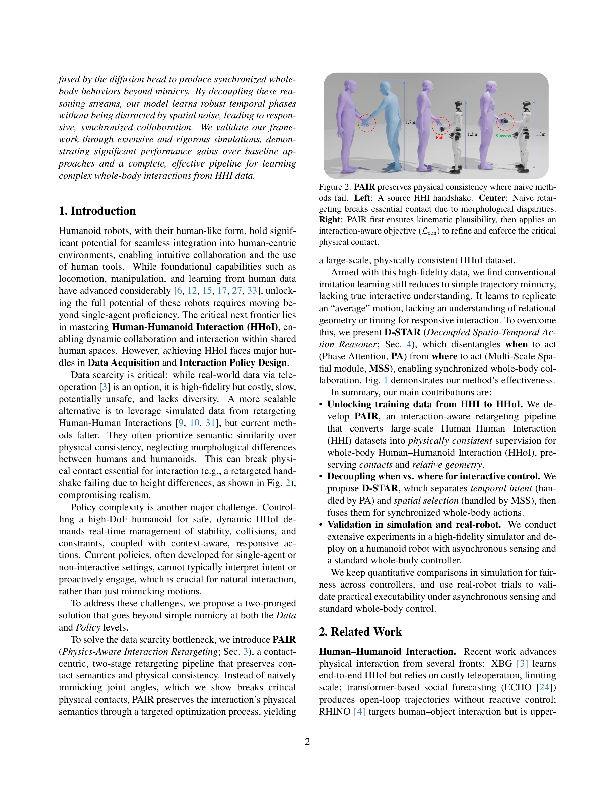
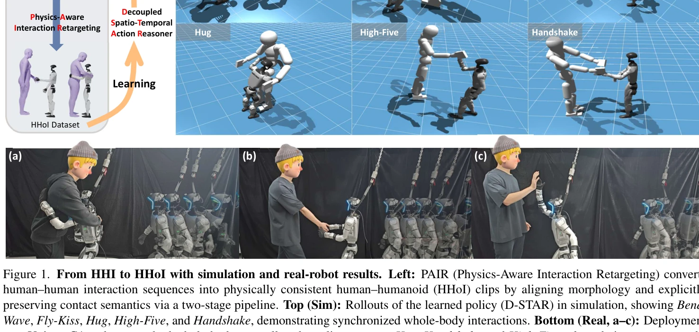
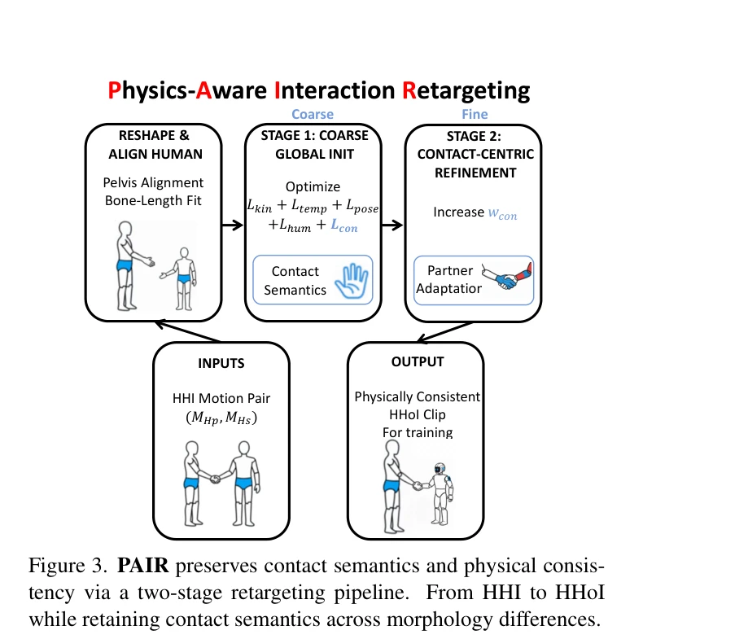

# Learning Whole-Body Human-Humanoid Interaction from Human-Human Demonstrations

> **저자**: Wei-Jin Huang, Yue-Yi Zhang, Yi-Lin Wei, Zhi-Wei Xia, Juantao Tan, Yuan-Ming Li, Zhilin Zhao, Wei-Shi Zheng | **날짜**: 2026-01-14 | **DOI**: [10.48550/arXiv.2601.09518](https://doi.org/10.48550/arXiv.2601.09518)

---

## Essence

*Figure 2. PAIR preserves physical consistency where naive meth-*

휴먼-휴먼 인터랙션(HHI) 데이터를 물리적 일관성을 보존하면서 휴먼-휴모이드 인터랙션(HHoI)으로 변환하는 PAIR와, 시간적 의도와 공간적 선택을 분리하여 상호작용적 이해를 갖춘 D-STAR 정책을 제안한다.

## Motivation

- **Known**: 휴머노이드 로봇이 인간과 물리적으로 상호작용할 수 있도록 학습하는 것은 중요하지만, HHoI 데이터의 부족으로 진행이 제한된다. 기존 재타겟팅 기법은 동작의 운동학적 유사성만 보존하므로 모폴로지 차이로 인해 필수 접촉을 손상시킨다.
- **Gap**: 표준 재타겟팅은 접촉 시맨틱을 보존하지 못하며, 기존 모방학습 정책은 궤적을 모방할 뿐 상호작용적 이해와 반응성이 부족하다.
- **Why**: 휴머노이드 로봇의 인간-로봇 협력 능력은 공유 환경에서의 자연스러운 상호작용을 위해 필수이며, 풍부한 HHI 데이터를 활용할 수 있다면 데이터 수집 비용을 대폭 절감할 수 있다.
- **Approach**: PAIR는 두 단계의 최적화 파이프라인으로 접촉 시맨틱을 명시적으로 보존하고, D-STAR는 Phase Attention(언제)과 Multi-Scale Spatial 모듈(어디)을 분리하여 diffusion head로 융합함으로써 동기화된 전신 행동을 생성한다.

## Achievement

*Figure 1. From HHI to HHoI with simulation and real-robot results. Left: PAIR (Physics-Aware Interaction Retargeting) co*

- **PAIR 개발**: 상호작용 인식형 N×N 휴먼-로봇 거리 손실 Lcon을 포함한 두 단계 재타겟팅 파이프라인으로 물리적으로 일관된 HHoI 데이터 생성
- **D-STAR 제안**: Phase Attention과 Multi-Scale Spatial 모듈을 분리하여 시간적 위상과 공간적 노이즈를 독립적으로 학습, 반응적 협력 실현
- **확장성**: HHI 데이터셋에서 대규모 물리적으로 일관된 HHoI 데이터 생성 가능
- **시뮬레이션 및 실제 로봇 검증**: 모의실험에서 기준 방법 대비 우수한 성능, Unitree G1 로봇에 성공적으로 배포

## How

*Figure 3. PAIR preserves contact semantics and physical consis-*

- **PAIR Stage 1 (Coarse Global Init)**: Lkin + Ltemp + Lpose + Lhum 손실로 운동학적 타당성 확보
- **PAIR Stage 2 (Contact-Centric Refinement)**: wcon 증가와 함께 Lcon을 강조하여 접촉 일관성 최적화
- **접촉 시맨틱 보존**: 누가 어디를 몇 초 동안 접촉하는지를 추적하는 N×N 휴먼-로봇 거리 손실로 접촉 의미 보존
- **Phase Attention**: 이산 시간 위상 정보로 '언제 행동할지' 학습", "**Multi-Scale Spatial 모듈**: 다중 스케일의 공간 특징으로 '어디서 행동할지' 학습", '**Diffusion head 융합**: PA와 MSS의 출력을 diffusion 메커니즘으로 통합하여 동기화된 전신 행동 생성
- **모폴로지 정렬**: 골반 정렬 및 비례적 뼈 길이 스케일링으로 초기 모폴로지 차이 해결

## Originality

- **상호작용 인식형 재타겟팅**: 기존의 운동학적 유사성 중심 재타겟팅에서 벗어나 접촉 시맨틱을 명시적으로 보존하는 새로운 손실 함수 제안
- **시공간 분리**: 동작 정책에서 시간적 의도(Phase Attention)와 공간적 선택(Multi-Scale Spatial)을 분리하는 계층적 구조 도입
- **두 단계 최적화 전략**: 전역 타당성 확보 후 접촉 정제로 지역 최솟값 문제 완화하는 이중 단계 설계
- **로보틱스 제약 통합**: 관절 한계, 자체 충돌, 강체 충돌 등 로보틱스 등급의 제약을 재타겟팅 최적화에 포함

## Limitation & Further Study

- **시뮬레이션 중심 정량 평가**: 실제 로봇 배포는 제한된 시나리오(Hug, Handshake, High-Five)에서만 검증됨
- **접촉 감지 의존성**: 실제 로봇의 비동기 센싱과 표준 전신 제어기의 제약을 완전히 극복하지 못함
- **모폴로지 다양성**: 다양한 휴머노이드 플랫폼이나 극단적 모폴로지 차이에 대한 일반화 성능 미검증
- **상호작용 복잡도**: 제시된 6가지 상호작용(Bend, Wave, Fly-Kiss, Hug, High-Five, Handshake)을 넘어 더 복잡한 전신 협력 작업으로의 확장 필요
- **후속 연구**: 실제 피부 접촉 피드백 통합, 다중 휴머노이드-인간 상호작용, 동적 장면 적응 등이 필요

## Evaluation

- Novelty: 4/5
- Technical Soundness: 3/5
- Significance: 4/5
- Clarity: 4/5
- Overall: 4/5

**총평**: 이 논문은 HHI에서 HHoI로의 데이터 변환 문제를 물리적 일관성 관점에서 체계적으로 해결하고, 시공간 분리를 통해 상호작용 정책의 반응성을 크게 향상시키는 혁신적인 접근을 제시한다. 시뮬레이션과 실제 로봇 검증을 통해 실용성을 입증하였으나, 더 다양한 상호작용 시나리오와 플랫폼으로의 확장이 필요하다.

## Related Papers

- 🏛 기반 연구: [[papers/1989_Human-Humanoid_Robots_Cross-Embodiment_Behavior-Skill_Transf/review]] — 인간-휴머노이드 교차 구현 행동-기술 전이의 이론적 기반을 제공한다.
- 🔄 다른 접근: [[papers/2119_OmniControl_Control_Any_Joint_at_Any_Time_for_Human_Motion_G/review]] — 인간 동작의 임의 관절 제어와 휴먼-휴머노이드 상호작용이라는 다른 접근법을 사용한다.
- 🔗 후속 연구: [[papers/2030_It_Takes_Two_Learning_Interactive_Whole-Body_Control_Between/review]] — 두 에이전트 간 상호작용적 전신 제어 학습의 확장된 접근법을 보여준다.
- 🔗 후속 연구: [[papers/1844_Cognition_to_Control_-_Multi-Agent_Learning_for_Human-Humano/review]] — 인간-휴머노이드 협력 학습을 다중 에이전트 환경으로 확장한 발전된 접근
- 🏛 기반 연구: [[papers/2052_Learning_Human-Humanoid_Coordination_for_Collaborative_Objec/review]] — 전신 인간-휴머노이드 상호작용이 물체 운반에서의 협력적 제어에 이론적 기반을 제공한다.
- 🔗 후속 연구: [[papers/1969_HDMI_Learning_Interactive_Humanoid_Whole-Body_Control_from_H/review]] — HHI 데이터를 활용한 상호작용이 대화형 전신 제어 학습으로 확장되어 더 복잡한 상호작용을 가능하게 한다.
- 🔗 후속 연구: [[papers/2030_It_Takes_Two_Learning_Interactive_Whole-Body_Control_Between/review]] — It Takes Two의 두 휴머노이드 간 상호작용 학습을 Learning Whole-Body Human-Humanoid Interaction의 인간-휴머노이드 상호작용으로 확장할 수 있다.
- 🔗 후속 연구: [[papers/2052_Learning_Human-Humanoid_Coordination_for_Collaborative_Objec/review]] — 물체 운반에서의 협력이 전신 인간-휴머노이드 상호작용으로 확장되어 더 복잡한 협업 시나리오를 다룬다.
