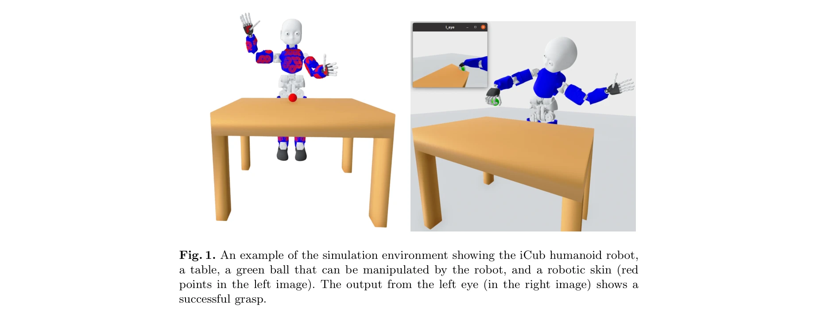
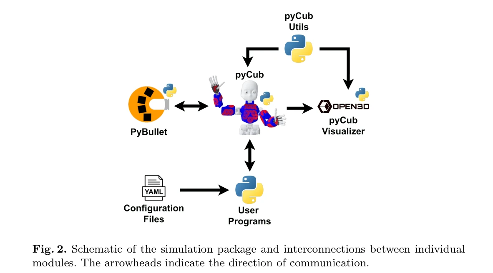

# Learning with pyCub: A Simulation and Exercise Framework for Humanoid Robotics

> **저자**: Lukas Rustler, Matej Hoffmann | **날짜**: 2025-06-02 | **URL**: [https://arxiv.org/abs/2506.01756](https://arxiv.org/abs/2506.01756)

---

## Essence

*Fig. 1. An example of the simulation environment showing the iCub humanoid robot,*

pyCub는 humanoid robot iCub의 Python 기반 physics 시뮬레이션 프레임워크로, YARP 미들웨어 없이 학생들이 humanoid robotics의 기초를 배울 수 있는 교육용 연습 문제들을 제공한다.

## Motivation

- **Known**: iCub SIM과 iCub Gazebo 같은 기존 시뮬레이터들이 존재하지만, C++ 코드와 YARP 미들웨어를 요구하여 초보자 진입 장벽이 높다. Python 기반의 접근 가능한 robotics 학습 프레임워크에 대한 수요가 있다.
- **Gap**: 기존 iCub 시뮬레이터들은 설정이 복잡하고 초보자 친화적이지 않아 학생들의 실습 만족도가 낮다. Python만으로 전체 humanoid robot 시뮬레이션과 교육 자료를 통합 제공하는 솔루션이 부재하다.
- **Why**: Humanoid robotics 교육에서 시뮬레이션 접근성이 높으면 더 많은 학생들이 로봇공학의 핵심 개념(kinematics, grasping, gaze control, tactile sensing)을 실습할 수 있다. 오픈소스 프레임워크는 전 세계 교육 기관에서 재사용 가능하다.
- **Approach**: PyBullet physics engine을 기반으로 iCub의 전체 articulation, 4000개의 tactile sensor, 양쪽 카메라를 Python으로 구현했다. 난이도별 연습 문제와 .yaml 설정 파일을 통한 환경 커스터마이제이션을 제공한다.

## Achievement

*Fig. 1. An example of the simulation environment showing the iCub humanoid robot,*

- **완전한 iCub 시뮬레이션**: 53개의 DoF, 4000개의 tactile receptor, 양쪽 eye camera를 포함한 완전한 humanoid robot 모델 구현
- **Python 친화적 설계**: YARP 미들웨어 제거하고 순수 Python으로 제어 가능하여 프로그래밍 경험이 적은 사용자도 접근 가능
- **확장성 있는 교육 자료**: velocity, joint, Cartesian space 제어부터 gazing, grasping, reactive control까지 다양한 난이도의 연습 문제 제공
- **실시간 성능**: 평균 노트북에서 full model + GUI + skin 활성화 시 0.95의 real-time factor 달성
- **완전한 공개**: 시뮬레이션, 연습 문제, 문서, Docker 이미지, 예제 영상 등을 GitHub에 공개
- **실제 교육 검증**: 2번의 humanoid robotics 과정 운영을 통해 프레임워크 평가 및 개선

## How

*Fig. 2. Schematic of the simulation package and interconnections between individual*

- PyBullet engine을 physics backbone으로 사용하여 multi-platform, open-source, 저 리소스 요구 달성
- Open3D library를 이용한 커스터마이징 가능한 GUI 개발 (PyBullet 내장 GUI의 단점 극복)
- .yaml 설정 파일을 통해 GUI, skin, eye-camera, logging, self-collision 등을 쉽게 활성화/비활성화
- Manual simulation step 방식으로 computation과 visualization 사이에 충분한 시간 확보
- 고성능 워크스테이션에서 parallel computation을 위해 여러 시뮬레이션 인스턴스 동시 실행 가능
- Proprioceptive, visual, tactile sensor에 대한 high-level interface 제공

## Originality

- YARP 없이 순수 Python으로 전체 iCub humanoid robot을 시뮬레이션한 최초의 프레임워크
- 4000개의 tactile sensor를 포함한 완전한 artificial skin 시뮬레이션을 Python에서 구현
- Open3D 기반의 커스터마이징 가능한 시각화 인터페이스 개발로 기존 PyBullet GUI의 한계 극복
- 초보자부터 고급 사용자까지 확장 가능한 난이도별 연습 문제 세트 설계
- 실제 교육 과정 피드백을 반영하여 접근성 중심의 교육용 로봇 시뮬레이터 개발

## Limitation & Further Study

- **기술적 한계**: 현재 single-core 기반으로 reinforcement learning 같은 대규모 병렬 계산이 제한적 (향후 multi-core 최적화 필요)
- **시뮬레이션 정확도**: 근 수준(muscle-level)의 정교한 생역학 모델은 포함되지 않음 (joint-level만 구현)
- **실제 iCub 전이**: 시뮬레이션의 dynamics가 실제 하드웨어와 완벽히 일치하지 않을 수 있어 sim-to-real transfer에 한계 (Table 1에서 'Transferable to real iCub' = No)", '**후속 연구 방향**: 고정밀 dynamics 모델 개선, GPU 기반 가속화, reinforcement learning 대규모 학습 환경 확장, sim-to-real transfer learning 방법론 개발

## Evaluation

- Novelty: 4/5
- Technical Soundness: 3/5
- Significance: 4/5
- Clarity: 4/5
- Overall: 4/5

**총평**: pyCub는 humanoid robotics 교육 접근성의 실질적 장벽을 Python과 단순화된 아키텍처로 제거한 가치 있는 오픈소스 프레임워크이며, 실제 교육 과정 검증과 완전한 공개를 통해 학술 커뮤니티에 즉시 활용 가능한 자원을 제공한다.

## Related Papers

- 🔄 다른 접근: [[papers/1796_AGILOped_Agile_Open-Source_Humanoid_Robot_for_Research/review]] — 교육용 시뮬레이션 프레임워크와 연구용 오픈소스 휴머노이드는 모두 교육 목적이지만 서로 다른 접근법을 제공한다.
- 🔗 후속 연구: [[papers/1628_PyRoki_A_Modular_Toolkit_for_Robot_Kinematic_Optimization/review]] — 모듈식 로봇 운동학 최적화 툴킷이 교육용 시뮬레이션 프레임워크의 확장된 도구이다.
- 🏛 기반 연구: [[papers/1715_ToddlerBot_Open-Source_ML-Compatible_Humanoid_Platform_for_L/review]] — 오픈소스 휴머노이드 플랫폼이 교육용 프레임워크의 하드웨어 기반을 제공한다.
- 🔗 후속 연구: [[papers/2006_Humanoid-Gym_Reinforcement_Learning_for_Humanoid_Robot_with/review]] — 강화학습 기반 휴머노이드 훈련 환경을 교육용으로 확장하여 접근성을 높인 발전된 형태이다.
- 🏛 기반 연구: [[papers/1846_ComFree-Sim_A_GPU-Parallelized_Analytical_Contact_Physics_En/review]] — GPU 병렬 물리 시뮬레이션의 기술적 기반을 제공하여 pyCub의 효율적인 교육용 시뮬레이션을 가능하게 한다.
- 🧪 응용 사례: [[papers/1666_Scaling_Large_Motion_Models_with_Million-Level_Human_Motions/review]] — 대규모 인간 동작 데이터를 활용한 학습 방법론을 교육용 휴머노이드 연습 문제에 적용할 수 있다.
- 🔄 다른 접근: [[papers/1647_RoboPlayground_구조화된_물리_도메인을_통한_로봇_평가_민주화/review]] — 두 논문 모두 휴머노이드 로보틱스 교육을 다루지만 pyCub는 Python 기반, RoboPlayground는 구조화된 물리 도메인을 제공한다.
- 🏛 기반 연구: [[papers/1828_Booster_Gym_An_End-to-End_Reinforcement_Learning_Framework_f/review]] — Python 기반 시뮬레이션 프레임워크가 end-to-end 강화학습 프레임워크의 교육적 기반을 제공한다.
- 🔗 후속 연구: [[papers/1942_GaussGym_An_open-source_real-to-sim_framework_for_learning_l/review]] — 교육용 시뮬레이션이 실제-시뮬레이션 프레임워크를 통한 실용적 학습으로 확장된다.
- 🏛 기반 연구: [[papers/2019_iCub3_Avatar_System_Enabling_Remote_Fully-Immersive_Embodime/review]] — pyCub 시뮬레이션 프레임워크가 iCub3 아바타 시스템의 교육 및 연구 기반을 제공한다.
