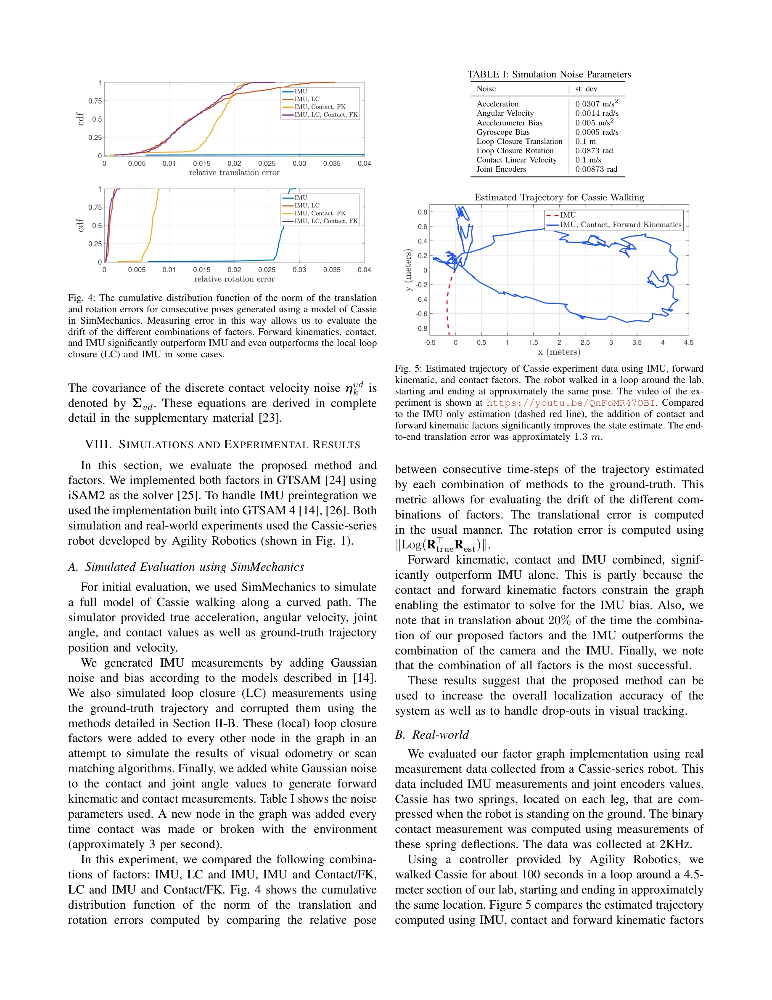

# Legged Robot State-Estimation Through Combined Forward Kinematic and Preintegrated Contact Factors

> **저자**: Ross Hartley, Josh Mangelson, Lu Gan, Maani Ghaffari Jadidi, Jeffrey M. Walls, Ryan M. Eustice, Jessy W. Grizzle | **날짜**: 2017-12-15 | **URL**: [https://arxiv.org/abs/1712.05873](https://arxiv.org/abs/1712.05873)

---

## Essence

*Fig. 2: An example factor graph for the proposed system. Forward kinematic*

시각 추적 손실 시에도 작동하는 다리 로봇 상태 추정 기법으로, Forward Kinematic 인수와 Preintegrated Contact 인수를 Factor Graph에 통합하여 엔코더 측정과 접촉 정보를 활용한다.

## Motivation

- **Known**: IMU와 카메라를 활용한 최첨단 로봇 인식 시스템이 존재하지만 시각 추적 손실 시 실패하며, Factor Graph 기반 SLAM이 실시간 처리를 제공한다.
- **Gap**: 기존 방법들은 시각 정보에 크게 의존하므로 조명 부족이나 특징 부재 시 성능이 급격히 저하되며, 다리 로봇의 Kinematic 모델과 접촉 정보를 체계적으로 Factor Graph에 통합한 연구가 부족하다.
- **Why**: 다리 로봇은 환경과 직접 접촉하므로 접촉 기반 Odometry를 활용하면 시각 손실 상황에서 Drift를 감소시키고 위치 추정 정확도를 개선할 수 있어 실질적 로봇 배포에 중요하다.
- **Approach**: Forward Kinematic 인수를 통해 엔코더 측정으로 센서 프레임을 접촉 프레임에 연결하고, Preintegrated Contact 인수로 발의 미끄러짐을 고려하면서 접촉 프레임의 운동을 추정한 후 두 인수를 Factor Graph 최적화 문제에 통합한다.

## Achievement

*Fig. 5: Estimated trajectory of Cassie experiment data using IMU, forward*

- **Forward Kinematic Factor 개발**: 노이즈가 있는 엔코더 측정을 통해 임의의 시간 단계에서 말단 위치(End-effector Pose)를 추정하는 인수 개발
- **Preintegrated Contact Factor**: Rigid 및 Point 접촉 모델을 이용하여 발의 미끄러짐을 고려하면서 연속 시간 단계 간 접촉 프레임 포즈 관계를 정의
- **Leg Odometry의 Factor Graph 통합**: 다리 Odometry를 기존 Factor Graph Smoothing 프레임워크에 처음으로 체계적으로 통합
- **실시간 구현 및 검증**: Cassie 이족 로봇에서 제안 방법의 실시간 구현 및 IMU 데이터 보충 시 Drift 감소 및 위치 정확도 개선 확인

## How

*Fig. 3: The contact frame is separated from the robot’s base frame by N*

- SE(3) Lie Group 및 on-manifold 최적화 기법을 수학적 기반으로 사용하여 회전과 병렬 이동을 통합적으로 처리
- Forward Kinematic 모델을 통해 다중 링크 로봇의 Kinematic Chain을 표현하고 엔코더 노이즈를 확률적으로 모델링
- 고주파 접촉 측정을 Preintegration하여 발의 상태 변화를 누적하고 미끄러짐 노이즈 특성을 반영
- Factor Graph Smoothing에서 정방형 문제의 희소 구조를 활용하여 실시간 성능 달성
- 시뮬레이션과 실제 Cassie 로봇 실험으로 IMU 단독 사용 대비 성능 개선을 정량적으로 검증

## Originality

- Forward Kinematic 인수를 명시적으로 Factor Graph 프레임워크에 도입하여 엔코더 기반 Leg Odometry와 관성 측정을 통합한 처음의 시스템적 접근
- 발의 미끄러짐을 모델링하면서 Preintegrated Contact 인수를 정의하여 접촉 불확실성을 정량적으로 처리한 창의적 방법론
- IMU Preintegration 이론을 접촉 측정 영역으로 확장하여 고주파 센서 데이터의 효율적 처리 방식 제시
- 다리 로봇의 Kinematic 제약 조건과 접촉 제약 조건을 동시에 고려하는 통합 최적화 프레임워크 구성

## Limitation & Further Study

- 실험이 'preliminary' 수준으로 제한적이며, 긴 거리 주행이나 복잡한 지형에서의 성능이 충분히 검증되지 않음", '발의 미끄러짐 모델이 단순화되어 있으며, 비정상적 접촉(부분 접촉, 이중 접촉) 상황에 대한 처리 방안이 명확하지 않음
- 제안 방법이 Cassie 로봇 특화로 보여 다른 형태의 다리 로봇 (사족보행, 육족보행 등)에 대한 일반화 가능성이 미흡
- 시각 정보 없이 순수 Leg Odometry만으로는 Yaw 방향의 장기 Drift를 완전히 제거하지 못할 가능성이 높음
- **후속 연구**: (1) Loop Closure 같은 추가적 제약 조건을 통한 Drift 감소, (2) 다양한 지형과 보행 속도에서의 광범위 실험, (3) 머신러닝 기반 미끄러짐 감지 통합, (4) 다른 레그 로봇 형태로의 일반화

## Evaluation

- Novelty: 4/5
- Technical Soundness: 3/5
- Significance: 4/5
- Clarity: 4/5
- Overall: 4/5

**총평**: 본 논문은 Factor Graph 프레임워크에 Forward Kinematic 및 Preintegrated Contact 인수를 처음 도입하여 시각 손실 상황에서도 다리 로봇의 상태를 추정할 수 있는 실용적 기법을 제시했으며, 이론적 엄밀성과 실제 로봇 구현 양면에서 견고한 기여를 하지만, 실험의 규모가 제한적이고 일반화 가능성 검증이 필요하다.

## Related Papers

- 🏛 기반 연구: [[papers/1849_Contact-Aided_Invariant_Extended_Kalman_Filtering_for_Robot/review]] — 접촉 보조 불변 확장 칼만 필터링이 다리 로봇 상태 추정의 이론적 기반 제공
- 🔄 다른 접근: [[papers/2023_InEKFormer_A_Hybrid_State_Estimator_for_Humanoid_Robots/review]] — 휴머노이드 상태 추정에서 하이브리드 추정과 transformer 기반의 다른 접근법
- 🏛 기반 연구: [[papers/1710_The_invariant_extended_Kalman_filter_as_a_stable_observer/review]] — The invariant extended Kalman filter가 Legged Robot State-Estimation의 Factor Graph에 통합된 Preintegrated Contact 인수 개발의 이론적 기반을 제공한다.
- 🔗 후속 연구: [[papers/1810_AutoOdom_Learning_Auto-regressive_Proprioceptive_Odometry_fo/review]] — Legged Robot State-Estimation의 접촉 정보 활용을 AutoOdom의 자기회귀 고유수용 추측항법과 결합하여 더 견고한 상태 추정이 가능하다.
- 🔗 후속 연구: [[papers/1618_PIMBS_Efficient_Body_Schema_Learning_for_Musculoskeletal_Hum/review]] — Legged Robot State-Estimation의 forward kinematics 기반 상태 추정이 PIMBS의 근골격 모델 학습을 확장할 수 있음
- 🔗 후속 연구: [[papers/1802_An_Empirical_Evaluation_of_Four_Off-the-Shelf_Proprietary_Vi/review]] — 상용 VIO 시스템 평가를 다리 로봇의 forward kinematics 기반 상태 추정으로 확장한 발전된 접근법이다.
- 🔄 다른 접근: [[papers/1810_AutoOdom_Learning_Auto-regressive_Proprioceptive_Odometry_fo/review]] — 다리 로봇 상태 추정에서 하나는 자동회귀 고유감각 방식, 다른 하나는 forward kinematics 방식을 사용한다.
- 🏛 기반 연구: [[papers/1849_Contact-Aided_Invariant_Extended_Kalman_Filtering_for_Robot/review]] — 전진 운동학과 결합한 다리 로봇 상태 추정이 접촉 보조 InEKF의 센서 융합 방법론에 필요한 기초 이론을 제공한다
- 🔄 다른 접근: [[papers/2023_InEKFormer_A_Hybrid_State_Estimator_for_Humanoid_Robots/review]] — InEKFormer는 Transformer와 InEKF 결합, Legged Robot State-Estimation은 Factor Graph 기반으로 서로 다른 아키텍처로 로봇 상태 추정 문제를 해결한다.
- 🏛 기반 연구: [[papers/2117_Omni-Perception_Omnidirectional_Collision_Avoidance_for_Legg/review]] — Legged Robot State-Estimation의 결합 전진 운동학 기반 상태 추정이 Omni-Perception의 시공간적 LiDAR 데이터 해석에 기술적 기반을 제공한다.
