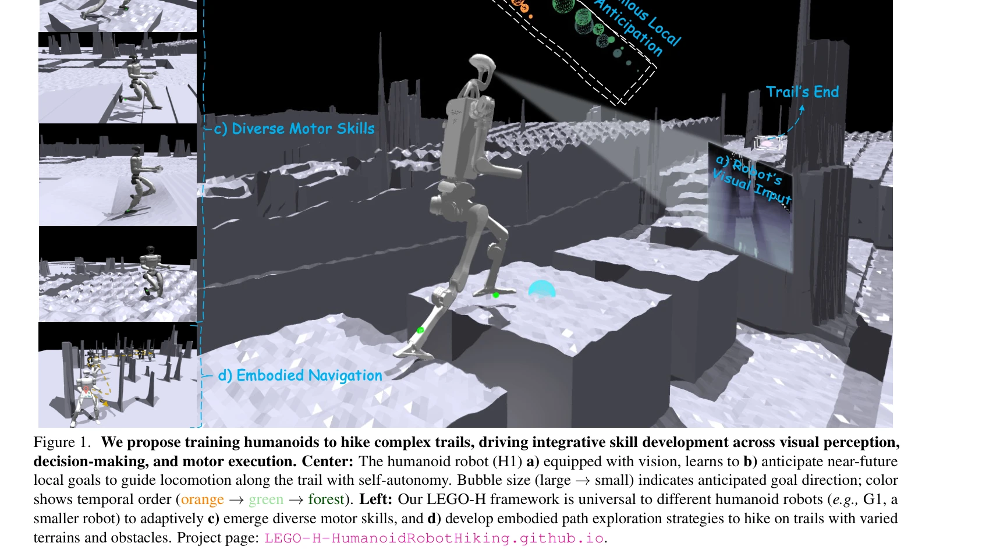
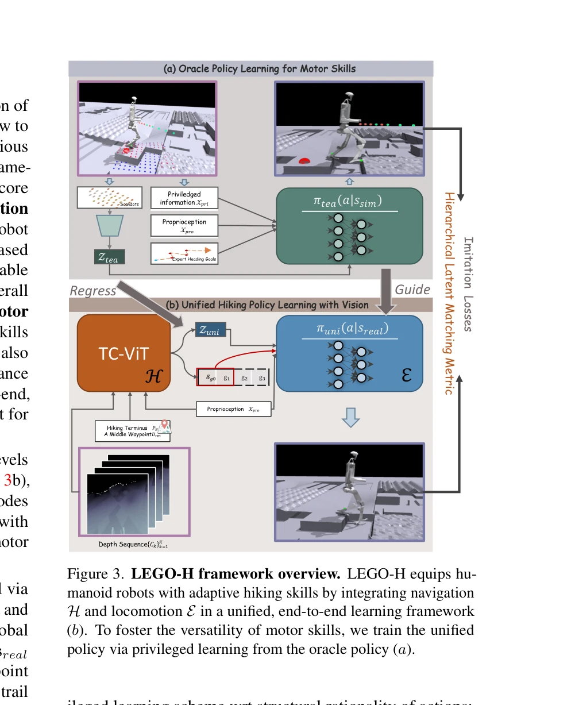

# Let Humanoids Hike! Integrative Skill Development on Complex Trails

> **저자**: Kwan-Yee Lin, Stella X. Yu | **날짜**: 2025-05-09 | **URL**: [https://arxiv.org/abs/2505.06218](https://arxiv.org/abs/2505.06218)

---

## Essence

*Figure 1. We propose training humanoids to hike complex trails, driving integrative skill development across visual perc*

휴머노이드 로봇이 복잡한 산길을 자율적으로 하이킹하도록 학습시키기 위해 시각 인식, 의사결정, 운동 실행을 통합하는 LEGO-H 프레임워크를 제안한다. TC-ViT와 Hierarchical Latent Matching을 통해 네비게이션과 로코모션을 단일 학습 체계로 통합한다.

## Motivation

- **Known**: 휴머노이드 로봇의 로코모션 연구는 장기 목표나 상황 인식 없이 운동 능력에만 집중하고, 시맨틱 네비게이션 연구는 실제 신체성과 국소 지형 변동성을 무시한다.
- **Gap**: 기존 연구는 로코모션 다양성, 지각 인식, 신체 인식 계획을 개별적으로만 다루며, 이들을 통합하여 불규칙한 지형에서 적응적으로 동작할 수 있는 통합 프레임워크가 부재하다.
- **Why**: 하이킹은 균형, 민첩성, 실시간 의사결정을 동시에 요구하므로 신체 자율성과 통합 기술 개발의 이상적인 테스트베드이며, 로봇이 구조화되지 않은 환경에서 자율적으로 작동할 수 있는 능력을 검증할 수 있다.
- **Approach**: Hierarchical Reinforcement Learning 프레임워크 내에서 temporal vision transformer (TC-ViT)를 사용하여 미래 로컬 목표를 예측하고, Hierarchical Latent Matching을 통해 특권 학습(privileged learning)에서 실제 배포로의 정책 전이를 개선한다.

## Achievement

*Figure 2. Hiking requires locomotion versatility, perceptual*

- **TC-ViT 아키텍처**: 네비게이션 목표의 시간-공간 관계를 모델링하여 순차적 로컬 목표 예측을 가능하게 하고, 로코모션 정책과 긴밀하게 통합된다.
- **Hierarchical Latent Matching (HLM)**: VAE를 기반으로 관절 간 의존성을 보존하면서 행동의 합리성을 기반으로 정책을 증류하여 특권 학습과 실제 실행 간 격차를 감소시킨다.
- **통합 프레임워크**: 로코모션 다양성, 지각 인식, 신체 인식 계획을 처음으로 단일 학습 체계에 통합하여 다양한 휴머노이드 로봇 형태에서 작동 가능하다.
- **다양한 지형 적응성**: 미리 정의된 운동 패턴 없이 다양한 물리적·환경적 도전을 처리할 수 있음을 시뮬레이션 실험으로 입증한다.

## How

*Figure 3. LEGO-H framework overview. LEGO-H equips hu-*

- TC-ViT는 로봇의 과거, 현재, 미래 상태를 고려하여 토큰화와 temporal modeling을 결합하는 Temporal Vision Transformer를 설계한다.
- 로코모션 정책 네트워크는 시각 특징, proprioceptive 입력, 예상된 네비게이션 목표를 통합하여 운동 행동을 생성한다.
- Teacher 정책은 특권 신호(발판 위치 등)를 활용하여 최적의 행동을 학습한 후, Student 정책이 onboard perception과 proprioception만 사용하여 이를 복제하도록 학습한다.
- HLM loss는 VAE의 latent space에서 masked reconstruction을 통해 관절 간 관계 일관성을 강제하여 정책 증류 시 행동 합리성을 보존한다.
- 다양한 시뮬레이션 트레일과 휴머노이드 형태(H1, G1 등)에서 광범위한 실험을 수행하여 프레임워크의 다재다능함과 강건성을 검증한다.

## Originality

- **하이킹을 휴머노이드 기술 개발의 테스트베드로 제시**: 기존에는 로코모션, 네비게이션, 신체 인식을 개별 문제로 다뤘으나, 하이킹이라는 통합된 작업을 통해 세 기능을 동시에 요구하는 새로운 벤치마크를 제안한다.
- **TC-ViT의 설계**: 기존 vision transformer를 HRL에 맞게 개선하여 temporal-spatial 관계를 모델링함으로써 sequential goal anticipation을 가능하게 한다.
- **HLM 기반 정책 증류**: 전역 행동 감독이나 관절 단위 정확성 대신 행동의 합리성(action rationality)에 초점을 맞춘 새로운 증류 메커니즘을 도입한다.
- **Oracle 정책 기반 학습**: 인간 시연 데이터 없이 oracle 정책으로부터 latent prior를 도출하여 로봇이 자신의 형태에 적합한 자율적 행동을 학습하도록 한다.

## Limitation & Further Study

- 현재 평가가 시뮬레이션 환경에 제한되어 있으며, 실제 로봇 플랫폼에서의 성능 검증이 부재하다.
- privileged learning이 teacher 정책의 quality에 강하게 의존하므로, teacher 정책이 부최적인 경우 student 정책의 성능이 제한될 수 있다.
- 다양한 휴머노이드 형태에서의 일반화 능력이 주장되나, 실제 적용되는 로봇 형태의 범위와 차이의 범위가 제한적일 가능성이 있다.
- 복잡한 지형과 동적 장애물이 있는 실제 환경에서의 robustness와 안전성에 대한 구체적인 분석이 부족하다.
- **후속 연구**: 실제 하드웨어에서의 광범위한 실험, transfer learning을 통한 서로 다른 로봇 형태 간 성능 이전, 실시간 안전성 보장 메커니즘 개발이 필요하다.

## Evaluation

- Novelty: 4/5
- Technical Soundness: 3/5
- Significance: 4/5
- Clarity: 4/5
- Overall: 4/5

**총평**: 본 논문은 하이킹을 새로운 벤치마크로 제시하고 TC-ViT와 HLM 기반 LEGO-H 프레임워크를 통해 네비게이션과 로코모션의 통합이라는 오래된 문제에 혁신적으로 접근한다. 다만 시뮬레이션 중심의 평가가 실제 배포 가능성의 의문을 남기지만, 휴머노이드 로봇 자율성 개발을 위한 강력한 기초 제시로서 충분히 의미 있는 기여이다.
