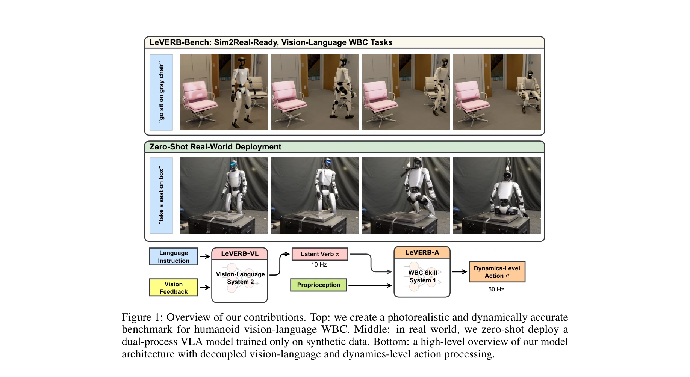
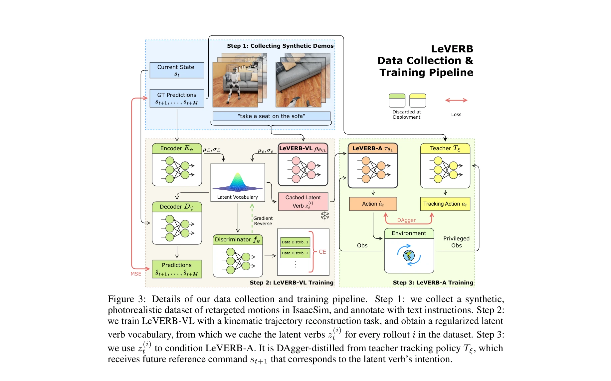

# LeVERB: Humanoid Whole-Body Control with Latent Vision-Language Instruction

> **저자**: Haoru Xue, Xiaoyu Huang, Dantong Niu, Qiayuan Liao, Thomas Kragerud, Jan Tommy Gravdahl, Xue Bin Peng, Guanya Shi, Trevor Darrell, Koushil Sreenath, Shankar Sastry | **날짜**: 2025-06-16 | **URL**: [https://arxiv.org/abs/2506.13751](https://arxiv.org/abs/2506.13751)

---

## Essence

*Figure 1: Overview of our contributions. Top: we create a photorealistic and dynamically accurate*

LeVERB는 humanoid 로봇의 전신 제어를 위해 vision-language 입력을 latent action 공간으로 인코딩하는 계층적 프레임워크를 제안하며, 150개 이상의 task로 구성된 첫 번째 sim-to-real 준비 벤치마크를 제시한다.

## Motivation

- **Known**: Vision-Language-Action(VLA) 모델은 강력한 의미 이해와 zero-shot 일반화를 보여주었으나, 대부분의 기존 시스템은 end-effector pose나 root velocity 같은 hand-crafted action 'vocabulary'를 가정하여 quasi-static task에만 국한된다.
- **Gap**: humanoid whole-body control(WBC)을 위한 agile한 전신 동작을 지원하는 vision-language 시스템의 부재, 그리고 photorealistic rendering을 포함한 WBC 벤치마크의 부족이 존재한다.
- **Why**: Humanoid 로봇이 복잡한 장면을 인지하고 언어 명령을 해석하며 전신 동작을 실행하도록 하는 것은 로봇공학의 중요한 목표이며, 이는 고차원 비선형 동역학 시스템의 제어를 요구한다.
- **Approach**: CVAE 기반 architecture를 통해 vision-language 정책이 synthetic kinematic demonstration에서 latent action vocabulary를 학습하고, 강화학습 기반 WBC 정책이 이러한 latent verb를 dynamics-level command로 변환하는 이중 과정(System 2-System 1) 구조를 제안한다.

## Achievement

*Figure 1: Overview of our contributions. Top: we create a photorealistic and dynamically accurate*

- **LeVERB-Bench 구축**: 10개 카테고리 150개 이상의 task로 구성된 photorealistic, sim-to-real 준비 벤치마크 개발
- **성능 달성**: 단순 navigation task에서 80% success rate, 전체적으로 58.5% success rate 달성하며 naive hierarchical VLA보다 7.8배 우수
- **Zero-shot 실제 배포**: synthetic data로만 학습되어 실제 humanoid 로봇에 zero-shot 배포 가능함을 입증
- **Latent instruction interface**: 손으로 설계한 action vocabulary 대신 structured latent space를 통해 표현력 있는 전신 동작 및 장면 상호작용 지원

## How

*Figure 3: Details of our data collection and training pipeline. Step 1: we collect a synthetic,*

- Human motion capture 데이터를 humanoid 로봇으로 retargeting한 후 photorealistic rendering으로 합성 데이터 생성
- Diverse scene context에서 randomized visual rendering 수행
- VLM을 사용한 semantic language annotation을 통해 robot-specific video-language pair 데이터 구성
- CVAE 기반 high-level vision-language policy로 structured latent space 학습
- Kinematics reconstruction으로 visual과 motion semantics 정렬
- Frozen latent space에서 proprioception-only controller 학습을 통해 robot dynamics 마스터링
- High-frequency(50Hz) low-level WBC와 low-frequency(10Hz) vision-language processing의 분리
- Closed-loop evaluation을 위한 dynamic simulation environment 구성

## Originality

- Humanoid WBC를 위한 latent vision-language interface 설계의 첫 사례
- Photorealistic rendering과 physics-based simulation을 모두 포함한 최초의 WBC 벤치마크 제시
- Human-inspired dual-process architecture(System 1-System 2)를 humanoid 로봇 제어에 체계적으로 적용
- Synthetic data만을 사용한 zero-shot sim-to-real transfer 달성
- CVAE를 활용한 structured latent space 학습으로 vision-language-action distribution 통합

## Limitation & Further Study

- 전체 success rate 58.5%는 복잡한 task의 어려움을 시사하며, 특히 seated interactions이나 복합 동작에서의 성능 개선 필요
- 합성 데이터의 domain gap이 여전히 존재할 수 있으며, 더 다양한 실제 환경에서의 검증 필요
- 고주파 WBC 정책의 계산 복잡도 및 실시간 성능에 대한 상세한 분석 부족
- Language instruction의 다양성과 robust성에 대한 광범위한 평가 필요
- 후속 연구로는 실제 데이터 수집을 통한 fine-tuning, 더 복잡한 multi-agent scenario 확대, 그리고 transfer learning 기법의 적용이 필요함

## Evaluation

- Novelty: 4/5
- Technical Soundness: 3/5
- Significance: 4/5
- Clarity: 4/5
- Overall: 4/5

**총평**: LeVERB는 humanoid WBC를 위한 vision-language 제어에서 중요한 진전을 이루었으며, 첫 latent instruction-following framework와 comprehensive sim-to-real 벤치마크를 제시하여 이 분야의 기초를 다졌다. 다만 실제 배포 성능의 추가 개선과 더 광범위한 task 평가를 통한 검증이 필요하다.
