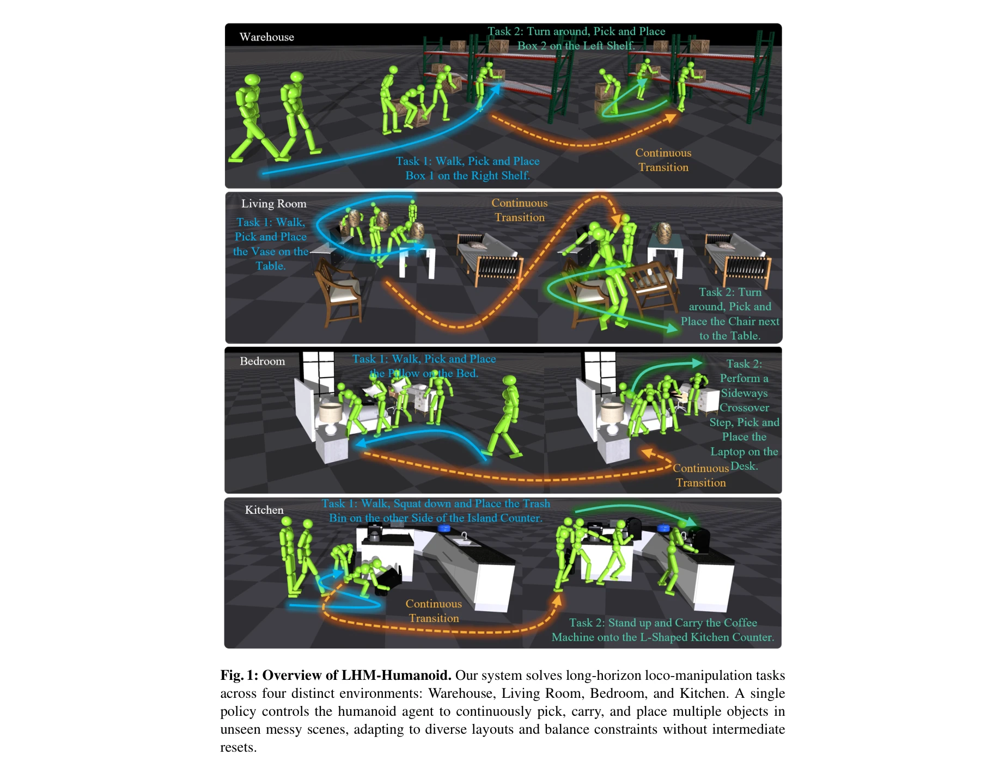
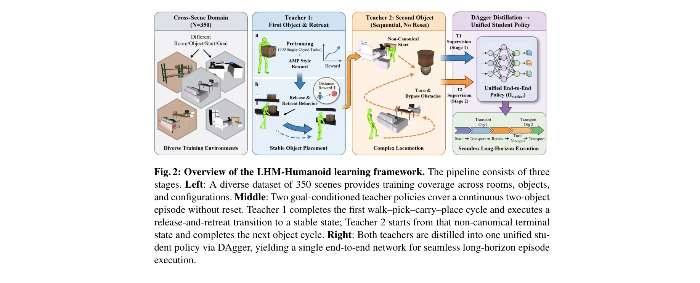

# LHM-Humanoid: Learning a Unified Policy for Long-Horizon Humanoid Whole-Body Loco-Manipulation in Diverse Messy Environments

> **저자**: Haozhuo Zhang, Jingkai Sun, Michele Caprio, Jian Tang, Shanghang Zhang, Qiang Zhang, Wei Pan | **날짜**: 2026-03-05 | **DOI**: [10.48550/arXiv.2508.16943](https://doi.org/10.48550/arXiv.2508.16943)

---

## Essence

*Fig. 1: Overview of LHM-Humanoid. Our system solves long-horizon loco-manipulation tasks*

LHM-Humanoid는 다양한 혼란스러운 환경에서 장시간 인간형 로봇이 복수 객체를 반복적으로 집기, 운반, 배치하는 작업을 단일 통합 정책으로 수행하는 벤치마크와 학습 프레임워크를 제시한다.

## Motivation

- **Known**: 기존 인간형 로봇 연구는 모션 제어, 장면 상호작용, 객체 조작에서 진전을 이루었으나 대부분 단일 객체 상호작용이나 고정된 장면 분포로 제한되어 있다.
- **Gap**: 장시간 지속적인 로코-조작, 교차 장면 일반화, 통합된 단일 정책 제어를 동시에 요구하는 혼란스러운 환경에서의 인간형 로봇 연구가 부족하다.
- **Why**: 실제 환경에서 인간형 로봇이 여러 객체를 유연하게 처리하고 다양한 장면 구성에 적응할 수 있어야 하며, 이는 로봇 일반화 능력 평가의 중요한 벤치마크가 될 수 있다.
- **Approach**: 두 개의 목표 조건부 RL 교사 정책을 학습하여 DAgger를 통해 단일 end-to-end 학생 정책으로 증류하고, 추가로 egocentric RGB와 자연언어로 조건화된 VLA 모델로 증류한다.

## Achievement

*Fig. 1: Overview of LHM-Humanoid. Our system solves long-horizon loco-manipulation tasks*

- **LHM-Humanoid 벤치마크**: 4가지 방 유형(침실, 거실, 주방, 창고)에 걸쳐 350개의 다양한 혼란스러운 장면/작업, 79개 객체(25개 이동 가능 대상)를 포함한 벤치마크 구성
- **이중 교사 증류 프레임워크**: 첫 번째 fetch-carry-place 주기를 완료하는 Teacher 1과 비표준 종료 상태에서 시작하는 Teacher 2를 통해 중간 리셋 없이 장시간 에피소드 처리
- **VLA 확장**: 통합 정책을 RGB 및 언어 조건부 end-to-end 모델로 추가 증류하여 대화형 명령 수행 가능
- **성능 우수성**: Isaac Gym에서 end-to-end RL 베이스라인 및 기존 인간형 로코-조작 방법을 보이지 않은 장면에서도 상회하며 강력한 장시간 견고성과 교차 장면 일반화 입증

## How

*Fig. 2: Overview of the LHM-Humanoid learning framework. The pipeline consists of three*

- 350개 다양한 장면으로 전체 정책을 공동 학습하여 교차 장면 일반화 추구
- Teacher 1: 단일 객체 작업에 대한 사전 훈련으로 초기화 후 AMP 스타일 보상을 통해 인간 유사 모션 유도
- Teacher 1: release-and-retreat 세부 조정으로 Teacher 2에 대한 안정적 상태 전달 보장
- Teacher 2: Teacher 1의 비표준 종료 상태에서 시작하여 다음 객체 주기 완료
- DAgger를 이용한 이중 교사의 단일 end-to-end 학생 정책으로의 증류로 중간 경계 제거
- 학생 정책을 VLA 모델로 추가 증류하여 자연언어 및 egocentric RGB 관찰 기반 제어 실현

## Originality

- 장시간, 교차 장면 일반화, 통합 단일 정책 제어를 동시에 요구하는 새로운 문제 설정 제시
- 정책 재설정 없이 비표준 종료 상태 간 seamless 전환을 위한 이중 교사 구조의 혁신적 활용
- scene-specific ground-truth 동작 시퀀스 없이 task-and-scene 벤치마크로 설계하여 진정한 일반화 요구
- RL 기반 교사와 DAgger 증류를 결합하여 장시간 접촉 풍부한 작업에서 직접 end-to-end RL의 수렴 실패 극복

## Limitation & Further Study

- 시뮬레이션(Isaac Gym) 환경에서만 검증되었으며 실제 로봇 구현의 sim-to-real 전이 가능성 미검증
- 학습 데이터가 4가지 특정 방 유형으로 제한되어 완전히 새로운 환경 유형에 대한 일반화 미평가
- VLA 모델 증류 단계에서 자연언어 주석의 품질 및 다양성이 성능에 미치는 영향 분석 부재
- 장시간 에피소드에서 누적 오류 전파 메커니즘 및 오류 복구 능력에 대한 상세 분석 필요
- 후속 연구: 실제 인간형 로봇 플랫폼에서 sim-to-real 전이 기법 개발, 미지의 환경 유형 적응 능력 강화, 오류 감지 및 복구 메커니즘 통합

## Evaluation

- Novelty: 4/5
- Technical Soundness: 3/5
- Significance: 4/5
- Clarity: 4/5
- Overall: 4/5

**총평**: 본 논문은 장시간 혼란스러운 환경에서의 인간형 로봇 로코-조작이라는 도전적인 새로운 문제를 정의하고 이중 교사 증류 프레임워크로 효과적으로 해결하며, 350개 다양한 장면의 종합 벤치마크를 제공하여 로봇 일반화 연구에 의미 있는 기여를 한다.

## Related Papers

- 🔄 다른 접근: [[papers/1644_RoboCasa_Large-Scale_Simulation_of_Everyday_Tasks_for_Genera/review]] — 일반적인 조작을 위한 대규모 시뮬레이션과 장시간 휴머노이드 전신 조작이라는 다른 접근법을 제시한다.
- 🔗 후속 연구: [[papers/2089_ManiSkill-HAB_A_Benchmark_for_Low-Level_Manipulation_in_Home/review]] — 가정 재배치를 위한 저수준 조작 벤치마크의 확장된 적용을 보여준다.
- 🏛 기반 연구: [[papers/1983_HOMIE_Humanoid_Loco-Manipulation_with_Isomorphic_Exoskeleton/review]] — 동형 외골격을 통한 휴머노이드 운동-조작의 이론적 기반을 제공한다.
- 🧪 응용 사례: [[papers/1647_RoboPlayground_구조화된_물리_도메인을_통한_로봇_평가_민주화/review]] — LHM-Humanoid의 장시간 조작 벤치마크는 RoboPlayground의 구조화된 평가 환경을 실제 복잡한 작업에 적용한 사례다
- 🏛 기반 연구: [[papers/1943_GBC_Generalized_Behavior-Cloning_Framework_for_Whole-Body_Hu/review]] — GBC의 generalized behavior-cloning이 LHM-Humanoid의 통합 정책 학습에 방법론적 기반을 제공했다
- 🔄 다른 접근: [[papers/2121_OmniXtreme_Breaking_the_Generality_Barrier_in_High-Dynamic_H/review]] — 둘 다 diffusion 기반 humanoid control이지만 LHM은 장시간 조작에, OmniXtreme은 고동역학 동작에 특화되어 있다
- 🏛 기반 연구: [[papers/1949_Generative_World_Modelling_for_Humanoids_1X_World_Model_Chal/review]] — 1X World Model의 생성형 세계 모델링이 LHM-Humanoid의 장시간 다중 객체 조작을 위한 환경 이해의 기반을 제공한다.
- 🔗 후속 연구: [[papers/1863_DemoHLM_From_One_Demonstration_to_Generalizable_Humanoid_Loc/review]] — DemoHLM의 단일 시연 기반 학습이 LHM-Humanoid의 장기간 휴머노이드 제어로 확장되어 더 지속적이고 복합적인 작업 수행을 가능하게 한다.
- 🔄 다른 접근: [[papers/2089_ManiSkill-HAB_A_Benchmark_for_Low-Level_Manipulation_in_Home/review]] — 장시간 휴머노이드 전신 조작과 가정 재배치 저수준 조작이라는 다른 접근법을 제시한다.
- 🔄 다른 접근: [[papers/2121_OmniXtreme_Breaking_the_Generality_Barrier_in_High-Dynamic_H/review]] — 둘 다 고성능 humanoid control이지만 OmniXtreme은 극단적 동작 추적에, LHM은 장시간 manipulation에 특화되어 있다
