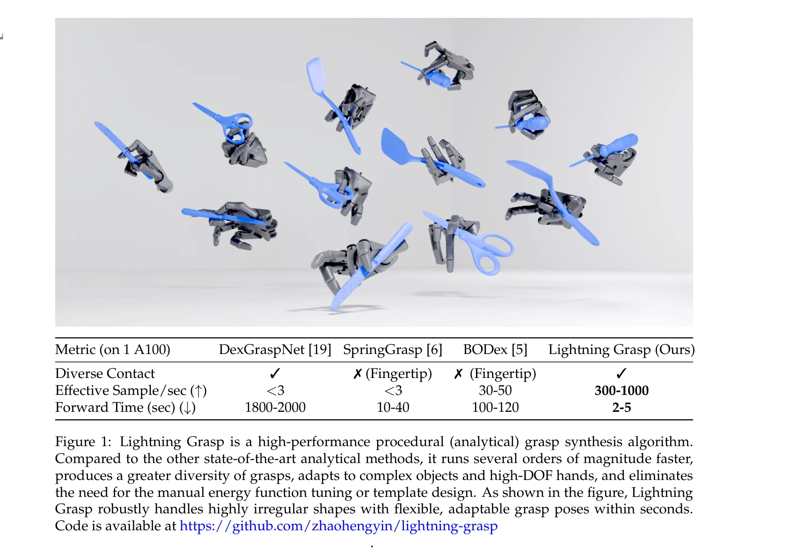
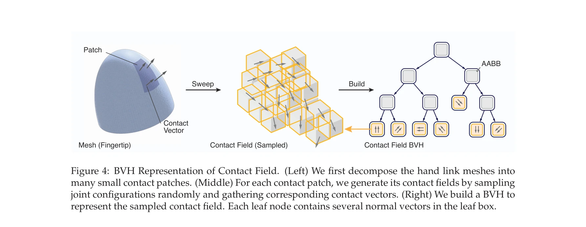

# Lightning Grasp: High Performance Procedural Grasp Synthesis with Contact Fields

> **저자**: Zhao-Heng Yin, Pieter Abbeel | **날짜**: 2025-11-10 | **URL**: [https://arxiv.org/abs/2511.07418](https://arxiv.org/abs/2511.07418)

---

## Essence

*Figure 3: Contact Field and Its Interaction with Objects. A contact field is a collection of vectors in*

Lightning Grasp는 Contact Field라는 새로운 데이터 구조를 도입하여 기하학적 계산과 최적화 과정을 분리함으로써 다지형 손을 위한 고속의 절차적 파지 합성을 실현한다.

## Motivation

- **Known**: 파지 합성은 로봇 조작의 핵심 과제이나, 기존 방법들(DexGraspNet, SpringGrasp, BODex)은 느리고 제한적이며 에너지 함수 튜닝과 민감한 초기화가 필요하다.
- **Gap**: 실시간 다양한 파지 합성을 위해 기하학적 제약과 최적화 과정의 분리가 필요하며, 불규칙한 형태의 물체에 대한 비지도 파지 생성이 부족하다.
- **Why**: 빠르고 효율적인 파지 합성은 데이터 기반 조작 정책 개발의 핵심 엔진이며, 다지형 손의 활용을 확대하는 데 중요하다.
- **Approach**: Contact Field를 통해 파지 가능 영역을 효율적으로 표현하고, block-wise zeroth-order optimization과 iterative kinematic optimization을 조합하여 3단계 파지 합성을 수행한다.

## Achievement

*Figure 1: Lightning Grasp is a high-performance procedural (analytical) grasp synthesis algorithm.*

- **성능 향상**: A100 GPU에서 1,000~10,000개의 다양한 유효 파지를 2~5초 내에 생성하여 기존 방법 대비 수십 배에서 수백 배 빠른 속도 달성
- **자동화**: 수작업 초기화 템플릿과 민감한 목적 함수 가중치 튜닝 제거로 파지 합성 과정 단순화
- **일반성**: 불규칙하고 도구 형태의 물체에 대해 비지도 파지 생성 가능하며 다양한 손 모델에 적응
- **호환성**: 레거시 GPU(TITAN X)에서도 실시간 추론 성능 달성

## How

*Figure 4: BVH Representation of Contact Field. (Left) We first decompose the hand link meshes into*

- Contact Field 정의: 손 링크 메시 위의 점 p와 법선 벡터 n으로부터 FK를 통해 도달 가능한 3D 위치와 방향의 6D 집합 구성
- Contact Domain 검출: Contact Field를 물체 표면과 교차시켜 각 손가락의 접촉 가능 영역을 충돌 감지 문제로 환원
- Contact Point 최적화: FSWO(Frictionless Self-balancing Wrench Optimization) 또는 GSWO(마찰 포함)를 통해 안정적인 접촉점 선택
- Kinematic Optimization: 선택된 접촉점에서 손가락을 정확히 위치시키기 위해 반복적 운동학 최적화 수행
- BVH 표현: Contact Field를 BVH(Bounding Volume Hierarchy)로 구성하여 효율적인 공간 탐색 및 교차 연산 지원

## Originality

- 기하학적 계산과 최적화 과정의 명시적 분리라는 근본적 재설계를 통해 기존 에너지 함수 기반 접근법의 구조적 한계 극복
- Contact Field라는 새로운 6D 데이터 구조 도입으로 공간적 접촉 가능성을 효율적으로 인코딩
- Zeroth-order 최적화와 kinematic 최적화의 계층적 조합으로 복잡한 기하학적 제약을 명시적으로 처리하지 않으면서도 높은 품질의 파지 생성

## Limitation & Further Study

- Contact Field 구성을 위한 초기 샘플링 단계의 계산 비용 및 표현 정확도에 대한 상세 분석 부족
- Stability metric으로 self-balancing wrench만 사용되며, 다른 형태의 closure 조건이나 동역학적 안정성 검증 미흡
- 불규칙 물체에 대한 실제 로봇 실험 결과 부재, 시뮬레이션 검증만 제시
- 매우 높은 자유도(>20DOF) 손에 대한 확장성 및 성능 저하 정도 미명시
- Contact Field의 메모리 효율성과 다양한 손 모델에 대한 전이 학습 가능성 탐구 필요

## Evaluation

- Novelty: 4/5
- Technical Soundness: 3/5
- Significance: 4/5
- Clarity: 4/5
- Overall: 4/5

**총평**: Lightning Grasp는 Contact Field라는 우아한 추상화를 통해 파지 합성의 근본적 병목을 해결하고 획기적인 속도 향상을 달성한 혁신적 기여로, 절차적 파지 합성의 새로운 표준을 제시한다.

## Related Papers

- 🔄 다른 접근: [[papers/1846_ComFree-Sim_A_GPU-Parallelized_Analytical_Contact_Physics_En/review]] — ComFree-Sim의 여집합-자유 접촉 모델링이 Lightning Grasp의 Contact Field보다 더 직접적인 접촉 임펄스 계산 방식을 제시한다.
- 🧪 응용 사례: [[papers/1631_RAPID_Hand_A_Robust_Affordable_Perception-Integrated_Dextero/review]] — RAPID Hand의 지각 통합 조작 시스템에 Lightning Grasp의 고속 절차적 파지 합성 기술을 적용하여 실시간 성능을 크게 향상시킬 수 있다.
- 🔗 후속 연구: [[papers/2169_UniDex_A_Robot_Foundation_Suite_for_Universal_Dexterous_Hand/review]] — UniDex의 범용적 정교한 손 조작을 위해 Lightning Grasp의 Contact Field 기반 고성능 파지 합성 기술이 핵심적으로 확장될 수 있다.
- 🏛 기반 연구: [[papers/1957_GraspDreamer_생성형_인간_시연_기반_기능적_파지_모방_학습/review]] — 기능적 파지 모방 학습의 이론적 기반을 제공한다.
- 🔄 다른 접근: [[papers/1846_ComFree-Sim_A_GPU-Parallelized_Analytical_Contact_Physics_En/review]] — Lightning Grasp의 Contact Field 데이터 구조가 ComFree-Sim의 여집합-자유 접촉 모델링과는 다른 방식으로 접촉 문제를 해결한다.
