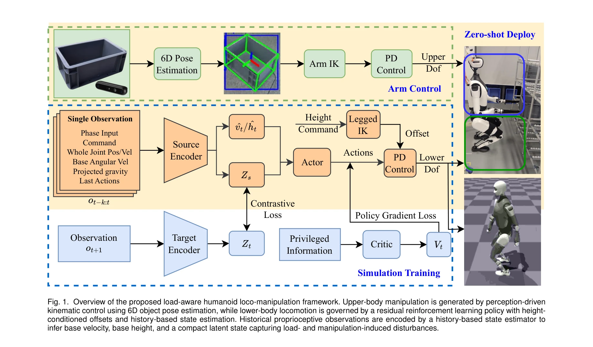
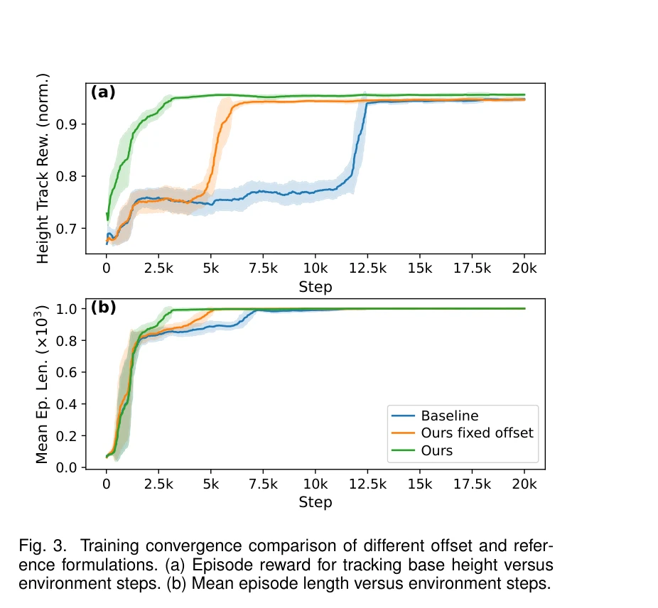
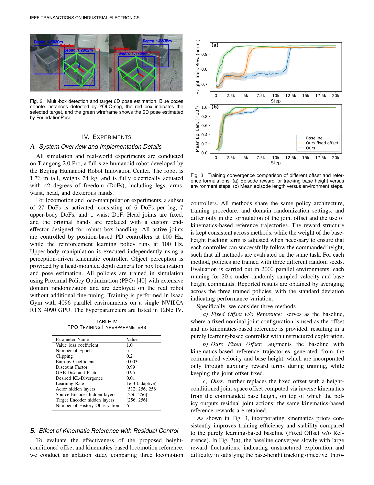

# Load-Aware Locomotion Control for Humanoid Robots in Industrial Transportation Tasks

> **저자**: Lequn Fu, Yijun Zhong, Xiao Li, Yibin Liu, Zhiyuan Xu, Jian Tang, Shiqi Li | **날짜**: 2026-03-15 | **URL**: [https://arxiv.org/abs/2603.14308](https://arxiv.org/abs/2603.14308)

---

## Essence

*Fig. 1. Overview of the proposed load-aware humanoid loco-manipulation framework. Upper-body manipulation is generated b*

산업용 휴머노이드 로봇의 다양한 하중 조건에서 안정적 보행을 위해 분리-협조 구조의 로코-매니퓰레이션 아키텍처를 제안하며, RL 기반 하체 제어와 상태 추정기를 통해 시뮬레이션 학습 후 실제 로봇에 파인튜닝 없이 배포 성공.

## Motivation

- **Known**: 기존 모델 기반 제어는 하중 변화에 민감하고 튜닝이 어렵고, RL 기반 접근은 유연하지만 기존 로코-매니퓰레이션 연구는 상하체 동적 결합을 명시적으로 모델링하거나 하중 변화에 적응하는 메커니즘이 부족하다.
- **Gap**: 기존 분리 제어는 하중이 말단 이펙터에서 이동하는 산업 작업의 특성을 간과하고, 기존 전체신체 RL은 상하체 결합과 부분 관측 문제를 구조화된 방식으로 다루지 않는다.
- **Why**: 산업 환경에서 휴머노이드 로봇의 자율적 박스 운반 작업은 미지 하중과 시간 변화 상체 동작에 대한 적응이 필수이며, 무튜닝 실제 배포는 현실적 가치가 높다.
- **Approach**: RL 정책이 운동학 기반 참조 궤적에 대한 잔차 조인트 액션을 생성하도록 하고, 히스토리 기반 상태 추정기가 기저 속도·높이와 하중-매니퓰레이션 외란을 학습하는 구조로 설계하여 부분 관측성을 해결.

## Achievement

*Fig. 3. Training convergence comparison of different offset and refer-*

- **부분 관측성 처리**: 히스토리 기반 상태 추정기가 기저 선형 속도, 기저 높이, 32차원 잠재 특성을 통해 하중·조작 외란을 콤팩트하게 인코딩
- **학습 효율 개선**: 높이 조건화 조인트공간 오프셋과 운동학 참조로 구조화된 잔차 RL을 구현하여 수렴 속도 및 접촉 품질 향상
- **높이 조절 성능**: 다양한 하중 조건에서 기저 높이 추적을 정확히 수행
- **무튜닝 실배포**: 순수 시뮬레이션 학습으로 전사이즈 휴머노이드에 파인튜닝 없이 배포 성공

## How

*Fig. 2. Multi-box detection and target 6D pose estimation. Blue boxes*

- 부동 기저 동역학 모델에서 상체는 IK 기반 매니퓰레이션 모듈이 제어, 하체는 RL 정책이 12개 조인트 제어
- 관측 공간: 위상 입력, 투영 중력(gravity), 각속도, 27개 조인트 위치/속도, 명령, 이전 액션, 추정 기저 속도/높이, 32차원 잠재 특성 포함
- 운동학 기반 참조 궤적: 명령 속도와 기저 높이 조건으로 생성되는 명목 구성(nominal configuration)에 RL의 잔차 액션 추가
- 상태 추정기: 히스토리 버퍼를 통해 부분 관측 POMDP의 은닉 상태 복원
- 보상 함수: 안정 보행, 견고한 균형, 높이 추적, 액션 정규화 항 포함
- 도메인 랜더마이제이션: 하중 질량, 위치, 마찰, 시뮬레이터 파라미터 변동

## Originality

- 분리-협조 구조에서 상체 매니퓰레이션 관측을 하체 정책에 명시적으로 포함하여 동적 결합을 처리하는 새로운 접근
- 높이 조건화 오프셋 기반 구조화된 잔차 RL로 기존의 경직된 높이 추적을 유연화
- 하중 및 조작 외란을 콤팩트한 잠재 표현으로 인코딩하는 상태 추정 스킴
- 전사이즈 휴머노이드에서의 실제 박스 운반 작업(depalletizing, transporting, placing)의 무튜닝 배포 달성

## Limitation & Further Study

- 관측되지 않는 하중 파라미터에 대한 직접적 추정 메커니즘이 없고 순전히 잠재 표현에 의존하는 점
- 현재 박스 감지 및 자세 추정 모듈의 정확도에 의존하며, 감지 실패 시 대응 방안 제한
- 산업 환경의 추가 복잡성(고르지 않은 지면, 동적 장애물, 극단적 하중)에 대한 일반화 정도 미명확
- 히스토리 버퍼 길이와 잠재 특성 차원 선택의 설계 원리 상세 분석 부족
- 추론 시간 및 실시간 처리 가능성에 대한 분석 미포함
- 후속 연구: 적응 하중 추정기 통합, 다양한 환경에서의 일반화 검증, 비정상 상황(슬립, 접촉 손실) 대응

## Evaluation

- Novelty: 4/5
- Technical Soundness: 3/5
- Significance: 4/5
- Clarity: 4/5
- Overall: 4/5

**총평**: 산업용 휴머노이드의 실질적 과제인 하중 변화 조건에서의 로코-매니퓰레이션을 분리-협조 구조와 상태 추정으로 체계적으로 해결하며, 시뮬레이션 학습 후 무튜닝 실배포 성공은 높은 실무 가치를 입증한다.

## Related Papers

- 🔄 다른 접근: [[papers/1674_Sim-to-Real_Learning_for_Humanoid_Box_Loco-Manipulation/review]] — Load-Aware Locomotion Control은 산업용 하중 운반, Sim-to-Real Learning for Humanoid Box Loco-Manipulation은 박스 조작으로 서로 다른 유형의 물체 운반 작업을 다룬다.
- 🏛 기반 연구: [[papers/1973_Hierarchical_Planning_and_Control_for_Box_Loco-Manipulation/review]] — Load-Aware Locomotion Control의 분리-협조 구조가 Hierarchical Planning and Control for Box Loco-Manipulation의 계층적 제어 아키텍처 설계에 이론적 기반을 제공한다.
- 🔗 후속 연구: [[papers/1982_Hold_My_Beer_Learning_Gentle_Humanoid_Locomotion_and_End-Eff/review]] — Load-Aware Locomotion Control의 하중 인식 보행을 Hold My Beer의 부드러운 end-effector 제어와 결합하여 더 안정적인 물체 운반이 가능하다.
- 🔗 후속 연구: [[papers/1922_FALCON_Learning_Force-Adaptive_Humanoid_Loco-Manipulation/review]] — FALCON의 force-adaptive 학습을 산업용 운반 작업의 하중 변화에 적응하는 방향으로 확장할 수 있다.
- 🧪 응용 사례: [[papers/1694_SteadyTray_Learning_Object_Balancing_Tasks_in_Humanoid_Tray/review]] — 트레이 운반 기술을 산업 환경에서의 부하 인식 이동 제어로 확장하여 실제 작업장에서 활용 가능한 휴머노이드 시스템을 구현했다.
- 🔄 다른 접근: [[papers/2036_Kinematics-Aware_Multi-Policy_Reinforcement_Learning_for_For/review]] — 둘 다 산업용 휴머노이드 고부하 작업이지만 Kinematics-Aware는 다중 정책, Load-Aware는 하중 인식 로코모션 중심
