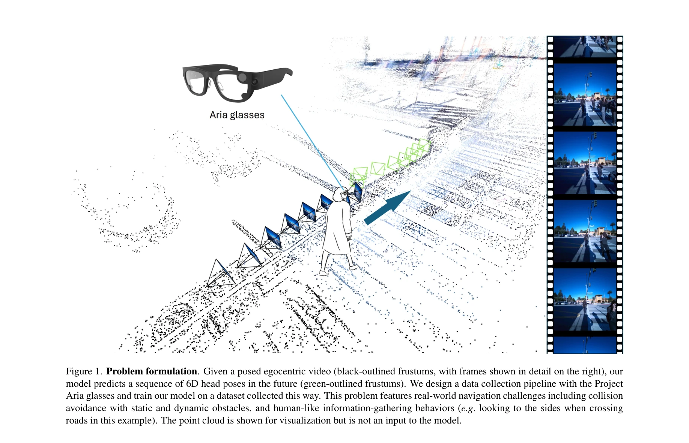

# LookOut: Real-World Humanoid Egocentric Navigation

> **저자**: Boxiao Pan, Adam W. Harley, C. Karen Liu, Leonidas J. Guibas | **날짜**: 2025-08-20 | **URL**: [https://arxiv.org/abs/2508.14466](https://arxiv.org/abs/2508.14466)

---

## Essence

*Figure 1. Problem formulation. Given a posed egocentric video (black-outlined frustums, with frames shown in detail on t*

Project Aria 안경을 이용한 데이터 수집 파이프라인과 함께, 동적 장애물이 있는 실제 환경에서 egocentric 비디오로부터 미래의 6D 헤드 포즈(위치 및 회전)를 예측하는 LookOut 모델을 제안한다.

## Motivation

- **Known**: Vision-Language Navigation과 robotic social navigation 분야에서 목표 지향적 경로 계획이나 이동 로봇을 위한 충돌 회피 연구가 진행되었다. 최근 인간 egocentric 네비게이션 예측 연구(EgoNav, EgoCast)도 등장했으나 정적 환경만 다루고 능동적 정보 수집 행동을 학습하지 못한다.
- **Gap**: 현존 인간형 egocentric 네비게이션 방법은 동적 환경에서의 동시 처리, 헤드 회전을 통한 능동적 정보 수집 행동 모델링, 그리고 대규모 현실 데이터 수집의 용이성이 모두 부족하다.
- **Why**: 인간형 로봇, VR/AR, 보조 네비게이션 등의 응용에서 실제 환경의 복잡한 상황에 대응하는 충돌 회피 능력이 필수적이며, 인간처럼 주변을 살피는 행동까지 학습하는 것이 실제 배포에 중요하다.
- **Approach**: 3D latent feature를 시간 축으로 집계하여 정적/동적 환경 제약을 모델링하는 LookOut 프레임워크를 제안하고, Project Aria 안경을 활용한 간편한 데이터 수집 파이프라인으로 4시간 분량의 Aria Navigation Dataset(AND)을 구축했다.

## Achievement

*Figure 2. LookOut architecture. Given a posed egocentric video, we obtain frame-wise DINO features with the pre-trained *

- **6D 헤드 포즈 예측 과제 정의**: 동적 장애물(보행자, 차량) 환경에서의 헤드 위치 및 회전 동시 예측 문제를 처음 정식화
- **LookOut 모델**: DINO feature를 3D로 투영한 후 시간 축 집계를 통해 기하학적·의미론적 제약을 모델링, 대기/속도 저하/우회/주변 관찰 등 인간다운 네비게이션 행동 학습
- **데이터 수집 파이프라인**: Project Aria 안경을 활용하여 수초의 설정으로 자연스러운 대규모 데이터 수집 가능, RGB/오디오/eye gaze/SLAM head pose/point cloud 등 다중 모달 제공
- **Aria Navigation Dataset(AND)**: 18개 밀집 지역에서 4시간 분량의 현실 네비게이션 데이터, 다양한 상황과 네비게이션 행동 포함

## How

*Figure 2. LookOut architecture. Given a posed egocentric video, we obtain frame-wise DINO features with the pre-trained *

- Per-frame DINO feature를 camera pose 정보와 함께 3D 공간으로 투영(unproject)
- 시간에 따라 3D feature volume을 누적하여 동적 장면 인식 및 환경 제약 모델링
- 6D 회전 표현(6D continuous rotation representation)을 사용하여 헤드 회전 예측
- Head-centered canonical frame을 정의하여 pose 좌표 정렬
- 과거 T1=8 프레임(context)으로부터 미래 T2=8 프레임(forecast) 예측
- 데이터 수집 시 보행자에게 표준화된 정보 수집 전략(예: 도로 횡단 전 차량 확인) 지시

## Originality

- 동적 환경의 정적·동적 장애물을 함께 다루는 인간형 egocentric 네비게이션 첫 시도
- 헤드 회전을 명시적으로 모델링하여 능동적 정보 수집(head-turning events) 학습 가능
- Project Aria 안경의 자체 SLAM 및 다중 센서 활용으로 혁신적으로 간편한 데이터 수집 파이프라인 구축
- 시간 집계 3D latent feature 접근은 기존 2D 또는 단순 trajectory 예측과 차별화된 3D 기하 인식 전략

## Limitation & Further Study

- 현존 방법들에 비해 정적 환경 전용 이전 연구(EgoCast 등)와의 직접 정량 비교 부족 가능성
- 4시간 데이터는 대규모 자율주행 데이터셋(Waymo 등)에 비해 여전히 제한적
- 미래 예측 길이가 8프레임으로 단기 예측에 집중, 장시간 궤적 계획 능력 미검증
- 실제 humanoid robot 배포 실험이 논문에 명시되지 않아 실제 로봇 제어로의 전이 검증 필요
- 다양한 카메라/센서로의 일반화 가능성, 야간/악천후 환경 성능 추가 연구 필요

## Evaluation

- Novelty: 4/5
- Technical Soundness: 3/5
- Significance: 4/5
- Clarity: 4/5
- Overall: 4/5

**총평**: 인간형 egocentric 네비게이션의 동적 환경 처리, 능동적 정보 수집 모델링, 그리고 실용적 데이터 수집 파이프라인을 종합적으로 해결한 포괄적 기여로, Project Aria를 활용한 혁신적 데이터 수집 방식과 현실성 높은 4시간 AND 데이터셋이 향후 연구에 큰 영향을 미칠 것으로 기대된다.
