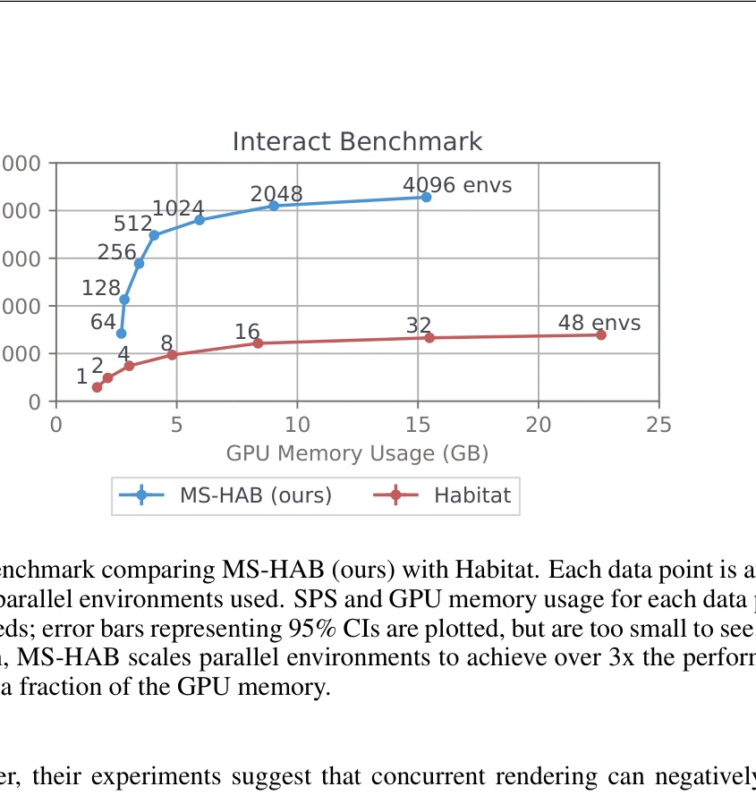
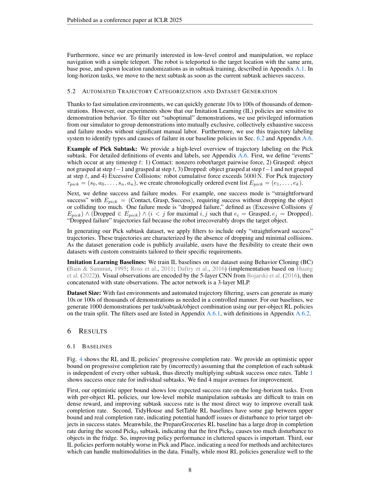

# ManiSkill-HAB: A Benchmark for Low-Level Manipulation in Home Rearrangement Tasks

> **저자**: Arth Shukla, Stone Tao, Hao Su | **날짜**: 2024-12-09 | **URL**: [https://arxiv.org/abs/2412.13211](https://arxiv.org/abs/2412.13211)

---

## Essence

*Figure 2: Interact benchmark comparing MS-HAB (ours) with Habitat. Each data point is annotated*

MS-HAB는 GPU 가속화된 Home Assistant Benchmark의 구현으로, 현실적인 저수준 조작과 빠른 시뮬레이션 속도(4300 SPS)를 지원하며 대규모 데이터셋 생성을 위한 자동화된 궤적 필터링 시스템을 제공한다.

## Motivation

- **Known**: Habitat 2.0은 가정용 재정렬 작업의 벤치마크를 제공하지만 CPU 시뮬레이션의 한계로 느린 속도와 제한된 병렬화를 가지고 있으며, ManiSkill3는 빠른 GPU 시뮬레이션을 제공하지만 더 간단한 작업만 포함한다.
- **Gap**: 기존 벤치마크들은 빠른 시뮬레이션 속도, 현실적인 저수준 제어, 대규모 시연 데이터셋, 그리고 통합된 평가 기준을 모두 제공하지 못하고 있다.
- **Why**: 로봇 조작 연구를 가속화하고 현실적인 가정용 환경에서의 장기 수평 작업을 해결하기 위해 고속 시뮬레이션, 현실적 물리, 그리고 대규모 제어된 데이터 생성이 필수적이다.
- **Approach**: ManiSkill3 기반의 GPU 가속화 구현으로 HAB를 재구성하고, RL 및 IL 기반선을 훈련한 후, 시뮬레이터의 특권 정보를 활용한 자동화된 사건 라벨링 및 궤적 분류 시스템을 개발하여 제어된 데이터 생성을 수행한다.

## Achievement

*Fig. 4 shows the RL and IL policies’ progressive completion rate. We provide an optimistic upper*

- **GPU 가속화 시뮬레이션**: Habitat 2.0 대비 3배 이상 빠른 4300 SPS 달성하면서 현실적인 저수준 제어 지원
- **광범위한 기반선**: 150개의 RL 정책(3개 시드, 50개/시드)을 1.83억 개의 환경 샘플로 훈련하고 IL 기반선 제공
- **자동화된 궤적 필터링**: 사건 라벨링 기반 규칙 시스템으로 특정 행동 및 안전 기준을 만족하는 시연 자동 분류
- **효율적 데이터 생성**: 빠른 환경과 결합된 필터링으로 대규모 제어된 시각 기반 로봇 데이터셋 생성 가능
- **저수준 조작 개선**: 객체별 특화 정책 훈련으로 일반화 정책보다 높은 성능 달성

## How

*Figure 3: Renders of low-level, whole-body control policies solving Pick, Place, Open, and Close*

- ManiSkill3 프레임워크를 기반으로 HAB의 3개 장기 수평 작업(TidyHouse, PrepareGroceries, SetTable)을 GPU 환경에서 재구현
- Fetch 모바일 매니퓨레이터에 대해 Pick, Place, Open/Close Fridge/Drawer, Navigate 등의 매개변수화된 스킬과 해당 부작업 정의
- 밀집 보상 함수 설계를 통한 RL 훈련으로 개별 스킬 학습 후 스킬 체이닝을 통해 장기 작업 해결
- 시뮬레이터 특권 정보(Contact, Grasped, Dropped, Success, Excessive Collisions)를 활용한 사건 라벨링
- 상호 배타적이고 집단적으로 완전한 성공/실패 모드 정의로 궤적 분류 및 선택적 필터링 수행
- RGB-D 이미지(2×128×128) 렌더링과 다중 동적 객체와의 상호작용을 동시에 수행하며 병렬 환경 확장

## Originality

- HAB를 현실적인 저수준 제어를 지원하는 GPU 가속화 환경으로 최초 구현하여 마법적 그래스핑(magical grasp) 제거
- 특권 정보 기반 자동화된 사건 라벨링 및 궤적 분류 시스템으로 수동 작업 없이 대규모 데이터 생성 자동화
- 객체별 특화 정책 훈련 방식으로 저수준 조작의 기하학적 민감성을 명시적으로 다루는 새로운 접근
- 스킬 체이닝에 새로운 세부사항 추가(그래스 포즈 샘플링, 부작업 성공 조건 재정의, 충돌 임계값 설정)

## Limitation & Further Study

- HAB의 3개 작업만 구현되어 있으므로 더 다양한 가정용 조작 작업으로의 확장 필요
- Fetch 로봇에 특화된 보상 함수 설계로 다른 로봇 형태로의 일반화 제한
- IL 기반선에서 시각 정보만 사용하는데, 다른 센서 모달리티(촉각, 고유감각 등) 통합 미흡
- 스킬 체이닝의 핸드오프 성공률 개선에 대한 구체적 수치 제시 부족
- 실제 로봇에서의 sim-to-real 전이 성능에 대한 평가 결과 미포함

## Evaluation

- Novelty: 4/5
- Technical Soundness: 4/5
- Significance: 4/5
- Clarity: 4/5
- Overall: 4/5

**총평**: MS-HAB는 현실적인 저수준 조작 제어, 고속 GPU 시뮬레이션, 그리고 자동화된 데이터 생성을 통합하여 가정용 로봇 조작 연구의 중요한 벤치마크를 제공하며, 광범위한 기반선과 투명한 평가 지표는 후속 연구에 큰 가치를 제공한다.

## Related Papers

- 🏛 기반 연구: [[papers/1644_RoboCasa_Large-Scale_Simulation_of_Everyday_Tasks_for_Genera/review]] — 일반적인 조작을 위한 대규모 시뮬레이션의 이론적 기반을 제공한다.
- 🔄 다른 접근: [[papers/2082_LHM-Humanoid_Learning_a_Unified_Policy_for_Long-Horizon_Huma/review]] — 장시간 휴머노이드 전신 조작과 가정 재배치 저수준 조작이라는 다른 접근법을 제시한다.
- 🔗 후속 연구: [[papers/1824_BiGym_A_Demo-Driven_Mobile_Bi-Manual_Manipulation_Benchmark/review]] — 시연 기반 모바일 양손 조작 벤치마크의 확장된 구현을 보여준다.
- 🔗 후속 연구: [[papers/2104_MolmoSpaces_A_Large-Scale_Open_Ecosystem_for_Robot_Navigatio/review]] — ManiSkill-HAB의 home manipulation 벤치마크가 MolmoSpaces의 대규모 실내 환경 생태계로 확장된 것으로 볼 수 있다
- 🏛 기반 연구: [[papers/1868_DexHub_and_DART_Towards_Internet_Scale_Robot_Data_Collection/review]] — DexHub의 internet scale data collection 개념이 MS-HAB의 자동화된 궤적 필터링 시스템 설계에 영감을 제공했다
- 🔗 후속 연구: [[papers/2100_Mimicking-Bench_A_Benchmark_for_Generalizable_Humanoid-Scene/review]] — MS-HAB의 저수준 조작 벤치마크를 Mimicking-Bench의 일반화 가능한 휴머노이드-장면 상호작용으로 확장할 수 있다.
- 🔄 다른 접근: [[papers/1678_SkillBlender_Towards_Versatile_Humanoid_Whole-Body_Loco-Mani/review]] — 두 논문 모두 계층적 학습을 통한 조작-이동 작업을 다루지만, 일반적인 스킬 혼합과 홈 환경 특화라는 다른 접근을 사용한다.
- 🔄 다른 접근: [[papers/1680_SLAC_Simulation-Pretrained_Latent_Action_Space_for_Whole-Bod/review]] — 두 논문 모두 전신 조작 작업을 다루지만, 잠재 행동 공간과 홈 환경 벤치마크라는 다른 접근을 사용한다.
- 🏛 기반 연구: [[papers/1824_BiGym_A_Demo-Driven_Mobile_Bi-Manual_Manipulation_Benchmark/review]] — ManiSkill-HAB의 low-level manipulation과 BiGym의 mobile manipulation이 계층적인 manipulation 벤치마크 생태계를 형성한다.
- 🧪 응용 사례: [[papers/1911_Emergent_Active_Perception_and_Dexterity_of_Simulated_Humano/review]] — ManiSkill-HAB의 가정 환경 저수준 조작 벤치마크가 PDC의 복잡한 household tasks 수행 능력을 평가하고 적용하는 구체적인 테스트베드를 제공한다.
- 🧪 응용 사례: [[papers/1973_Hierarchical_Planning_and_Control_for_Box_Loco-Manipulation/review]] — ManiSkill-HAB 벤치마크의 가정 환경 조작 작업들이 box rearrangement 시스템의 실제 적용 시나리오를 제공한다.
- 🔄 다른 접근: [[papers/2007_HumanoidBench_Simulated_Humanoid_Benchmark_for_Whole-Body_Lo/review]] — ManiSkill-HAB의 home manipulation과 달리 HumanoidBench는 general whole-body locomotion과 manipulation을 포괄적으로 벤치마킹한다.
- 🔗 후속 연구: [[papers/2082_LHM-Humanoid_Learning_a_Unified_Policy_for_Long-Horizon_Huma/review]] — 가정 재배치를 위한 저수준 조작 벤치마크의 확장된 적용을 보여준다.
- 🏛 기반 연구: [[papers/2100_Mimicking-Bench_A_Benchmark_for_Generalizable_Humanoid-Scene/review]] — ManiSkill-HAB의 저수준 조작 벤치마크가 제공하는 기초 위에 인간-장면 상호작용이라는 고수준 행동을 추가로 다룬다.
- 🔄 다른 접근: [[papers/2104_MolmoSpaces_A_Large-Scale_Open_Ecosystem_for_Robot_Navigatio/review]] — 둘 다 manipulation benchmark이지만 MolmoSpaces는 대규모 환경 다양성에, MS-HAB는 저수준 조작과 빠른 시뮬레이션에 중점을 둔다
- 🧪 응용 사례: [[papers/2157_Towards_Proprioception-Aware_Embodied_Planning_for_Dual-Arm/review]] — 고유감각 인식 계획 기술이 가정 환경에서의 이중팔 저수준 조작 작업 수행에 직접 적용된다.
- 🧪 응용 사례: [[papers/2136_PHUMA_Physically-Grounded_Humanoid_Locomotion_Dataset/review]] — 물리적으로 타당한 휴머노이드 모션 데이터가 가정 환경에서의 저수준 조작 벤치마크 구축에 필요한 기초 데이터를 제공한다.
