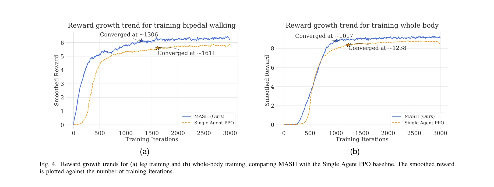
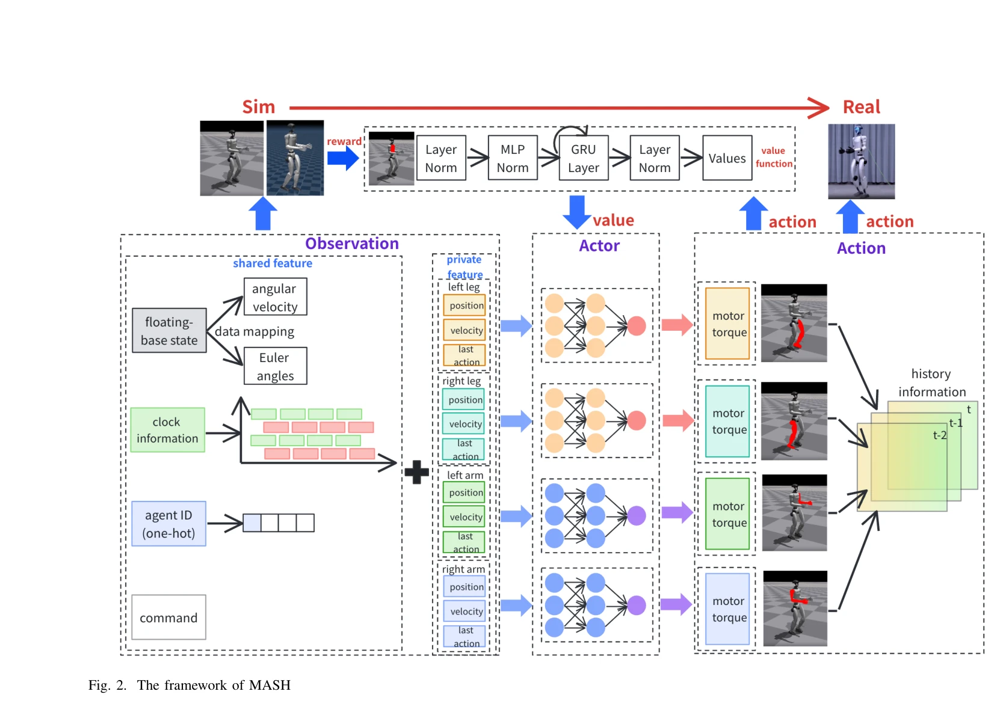

# MASH: Cooperative-Heterogeneous Multi-Agent Reinforcement Learning for Single Humanoid Robot Locomotion

> **저자**: Qi Liu, Xiaopeng Zhang, Mingshan Tan, Shuaikang Ma, Jinliang Ding, Yanjie Li | **날짜**: 2025-08-14 | **URL**: [https://arxiv.org/abs/2508.10423](https://arxiv.org/abs/2508.10423)

---

## Essence

*Fig. 1. MARL model for a single humanoid robot’s locomotion*

단일 인간형 로봇의 보행을 위해 각 팔다리를 독립 에이전트로 모델링하여 Cooperative-Heterogeneous MARL을 적용하는 MASH 프레임워크를 제안한다. 이는 전역 비평가를 공유하며 협력학습을 통해 전신 조화 능력을 향상시킨다.

## Motivation

- **Known**: 인간형 로봇 보행은 모델 기반 방법(MPC, 궤적 최적화) 또는 단일 에이전트 Deep RL을 사용해왔다. 단계 정책 훈련은 상체-하체 분리 학습으로 조화 부족 문제가 있다.
- **Gap**: 기존 방법들은 단일 로봇에는 단일 에이전트 RL을, 다중 로봇에는 MARL을 적용해왔으나, MARL 원칙을 단일 인간형 로봇의 신체 부위 간 조화에 활용하는 방안은 미탐색 상태이다.
- **Why**: 인간형 로봇은 높은 자유도(DoF)를 가지며 상체-하체 간 복잡한 조화가 필수적이므로, MARL의 협력 학습 메커니즘을 통해 효율적인 보행 정책 학습과 환경 적응성을 향상시킬 수 있다.
- **Approach**: 각 팔다리(양팔, 양다리)를 독립적인 에이전트로 취급하되 서로 다른 행동 공간을 탐색하면서 전역 비평가(global critic)를 공유하는 cooperative-heterogeneous MARL 구조를 설계하였다. 경험 공유 및 협력 정책 학습을 통해 전신 조화 보행을 학습한다.

## Achievement

*Fig. 4. Reward growth trends for (a) leg training and (b) whole-body training, comparing MASH with the Single Agent PPO *

- **훈련 수렴 가속화**: MASH이 기존 단일 에이전트 RL 방법 대비 더 빠른 수렴 속도를 달성하여 샘플 효율성을 개선하였다.
- **전신 조화 능력 향상**: 각 팔다리 간 협력을 통해 보행 실행(gait execution) 품질이 향상되고 최종 성능이 우수해졌다.
- **동적 환경 견고성**: 동적 환경에서의 견고성(robustness)이 증대되어 실제 응용 가능성이 높아졌다.
- **MARL-인간형 로봇 제어 통합**: MARL 원칙을 단일 인간형 로봇 제어에 효과적으로 적용한 새로운 패러다임을 제시하였다.

## How

*Fig. 2. The framework of MASH*

- Cooperative-heterogeneous MARL 알고리즘 적용: 각 팔다리를 독립 에이전트로 정의하되, 서로 다른 행동 공간(heterogeneous)을 가지면서도 공동 목표(보행) 달성을 위해 협력(cooperative)
- 공유 전역 비평가(shared global critic) 구조: 모든 에이전트가 단일 가치 함수를 공유하여 전신 상태 정보를 반영하고 에이전트 간 정보 흐름 증대
- 경험 공유 메커니즘: 각 에이전트의 경험을 공유하여 학습 효율 제고 및 정책 최적화 가속화
- Markov Decision Process(MDP) 및 Policy Gradient 기반 학습: MDP 프레임워크에서 상태, 행동, 보상을 정의하고 정책 그래디언트를 통해 최적화
- 시뮬레이션 환경(Simulator unspecified)에서 검증: 다양한 보행 시나리오에서 수렴성 및 성능 비교

## Originality

- 기존 MARL이 다중 로봇 협력에 적용된 반면, 본 연구는 단일 인간형 로봇의 신체 부위를 에이전트로 모델링하는 새로운 관점을 제시한다.
- Heterogeneous 행동 공간(팔과 다리의 서로 다른 제어 차원)을 갖는 협력 MARL은 기존 동질 다중 에이전트 문제와 차별화된다.
- 전역 비평가 공유 구조는 전신 보행 조화를 명시적으로 강화하는 설계 아이디어이다.
- 단계 정책 훈련의 조화 부족 문제를 MARL로 해결하는 대안을 제시한다.

## Limitation & Further Study

- **시뮬레이션 환경 한정**: 실제 인간형 로봇(예: Atlas, HUBO 등)에서의 실물 검증이 부재하여 sim-to-real gap 미검토
- **알고리즘 세부사항 부족**: 구체적인 MARL 알고리즘(예: QMIX, MAPPO, MADDPG 등)이 명확히 명시되지 않음
- **계산복잡도 분석 미흡**: 4개 에이전트 협력에 따른 계산 비용 증가 및 확장성(limb 수 증가 시) 미분석
- **비교 기저선 제한**: 다른 협력 MARL 변형(예: 부분 공유 비평가)과의 상세 비교 부족
- **후속 연구 방향**: (1) 실제 인간형 로봇 플랫폼에서의 sim-to-real 전이 학습 (2) 다양한 보행 과제(계단 오르기, 불규칙 지형) 확대 (3) 온라인 적응 학습 능력 강화 (4) 복합 조작-보행 작업에의 확장

## Evaluation

- Novelty: 4/5
- Technical Soundness: 3/5
- Significance: 4/5
- Clarity: 4/5
- Overall: 4/5

**총평**: MASH는 MARL 원칙을 단일 인간형 로봇에 창의적으로 적용하여 전신 조화 보행 학습을 효과적으로 개선한 의미 있는 기여이다. 다만 실제 로봇 검증과 알고리즘 세부사항 명확화가 필요하다.

## Related Papers

- 🏛 기반 연구: [[papers/1854_Coordinated_Humanoid_Robot_Locomotion_with_Symmetry_Equivari/review]] — 대칭 등변성을 통한 조정된 휴머노이드 로봇 보행의 이론적 기반을 제공한다.
- 🔄 다른 접근: [[papers/1981_HMC_Learning_Heterogeneous_Meta-Control_for_Contact-Rich_Loc/review]] — 접촉이 풍부한 보행을 위한 이질적 메타 제어와 협력적 이질적 다중 에이전트 강화학습이라는 다른 접근법을 제시한다.
- 🔗 후속 연구: [[papers/1844_Cognition_to_Control_-_Multi-Agent_Learning_for_Human-Humano/review]] — 인간-휴머노이드 인지를 위한 다중 에이전트 학습의 확장된 접근법을 보여준다.
- 🏛 기반 연구: [[papers/2108_Multi-task_Deep_Reinforcement_Learning_with_PopArt/review]] — PopArt의 multi-task 학습 정규화가 MASH의 cooperative-heterogeneous 다중 에이전트 학습에서 에이전트 간 협력을 안정화한다.
- 🔗 후속 연구: [[papers/1678_SkillBlender_Towards_Versatile_Humanoid_Whole-Body_Loco-Mani/review]] — 협력적 이종 다중 에이전트 학습을 원시 기술 혼합으로 확장하여 더 복잡한 조작-이동 작업을 수행한다.
- 🏛 기반 연구: [[papers/1844_Cognition_to_Control_-_Multi-Agent_Learning_for_Human-Humano/review]] — cooperative-heterogeneous multi-agent RL의 기초 방법론이 인간-휴머노이드 협업 시스템에 적용된다.
- 🔗 후속 연구: [[papers/1934_From_Experts_to_a_Generalist_Toward_General_Whole-Body_Contr/review]] — BumbleBee의 expert-generalist 학습을 다중 에이전트 환경으로 확장하여 MASH의 cooperative-heterogeneous 학습이 가능하다.
- 🔗 후속 연구: [[papers/2054_Learning_Humanoid_Arm_Motion_via_Centroidal_Momentum_Regular/review]] — Learning Humanoid Arm Motion의 multi-agent RL 프레임워크를 MASH의 cooperative-heterogeneous 다중 에이전트 강화학습으로 확장하여 더 복잡한 협업 제어가 가능하다.
- 🔄 다른 접근: [[papers/2108_Multi-task_Deep_Reinforcement_Learning_with_PopArt/review]] — 협력적 다중 에이전트 학습이라는 다른 방식으로 복잡한 멀티태스크 문제를 해결하는 대안적 접근법이다.
