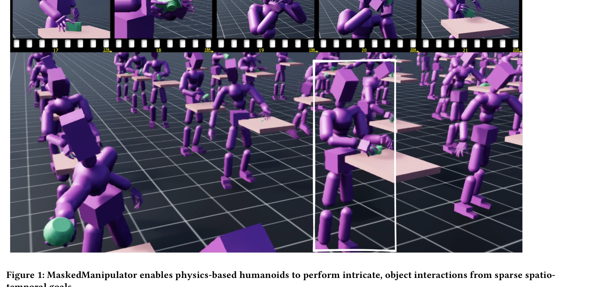
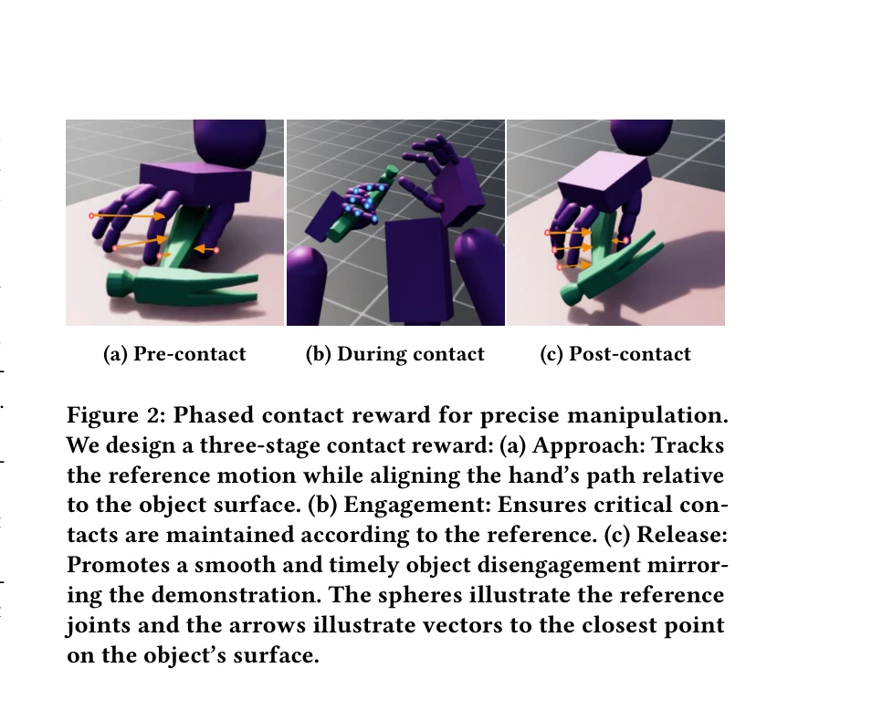

# MaskedManipulator: Versatile Whole-Body Manipulation

> **저자**: Chen Tessler, Yifeng Jiang, Erwin Coumans, Zhengyi Luo, Gal Chechik, Xue Bin Peng | **날짜**: 2025-05-25 | **URL**: [https://arxiv.org/abs/2505.19086](https://arxiv.org/abs/2505.19086)

---

## Essence

*Figure 1: MaskedManipulator enables physics-based humanoids to perform intricate, object interactions from sparse spatio*

MaskedManipulator는 대규모 모션 캡처 데이터로 학습한 추적 컨트롤러에서 증류한 생성적 제어 정책으로, 사용자가 객체 포즈나 신체 포즈 같은 고수준 목표를 지정하여 물리 기반 전신 조작 행동을 생성한다.

## Motivation

- **Known**: DeepMimic 같은 모방 학습과 강화학습은 성공적으로 캐릭터 제어에 적용되었으며, 최근 OmniGrasp 같은 방법들이 객체 조작을 통합하려 시도했다. 하지만 기존 방법들은 정교한 조작 또는 다용도 신체 제어 중 하나에만 우수하다.
- **Gap**: 유연한 제어와 물리적 정밀도 사이의 근본적 긴장 — 추상적 사용자 의도(희소 목표 좌표)를 해석하면서도 정교한 파지와 배치에서 높은 정밀도를 달성해야 한다. 전신 운동과 손재주 조작을 동시에 통합하는 통일된 다용도 제어 프레임워크가 부재하다.
- **Why**: 인간형 로봇과 캐릭터 애니메이션이 복잡한 실세계 상호작용을 자율적으로 수행하려면, 객체 조작과 신체 제어를 결합한 다용도 컨트롤러가 필수적이다. 이는 로봇공학과 컴퓨터 애니메이션 분야에서 장기적 도전 과제이다.
- **Approach**: 두 단계 학습 과정을 구조화한다: (1) MimicManipulator는 GRAB 데이터셋의 인간 조작 시연으로부터 정교한 추적 컨트롤러를 RL로 훈련하여 물리적 재구성을 보장하고, (2) MaskedManipulator는 이 추적기의 지식을 희소 spatio-temporal 목표에서 작동하는 생성 정책으로 증류한다.

## Achievement

*Figure 1: MaskedManipulator enables physics-based humanoids to perform intricate, object interactions from sparse spatio*

- **MimicManipulator 추적기**: GRAB 데이터셋의 다양한 전신 조작 시연을 정확히 추적하는 physics-based 모션 추적기로, RL을 통해 필요한 저수준 액션을 복구하고 동적 가능성을 보장한다.
- **MaskedManipulator 정책**: 인간형의 신체 부분과 조작 객체 모두에 대한 spatio-temporal goal-conditioning을 지원하는 통일된 생성 제어 정책으로, 희소한 제약 조건에서 다양한 조작 행동을 생성한다.
- **유연성-정밀도 균형**: 긴 시간 지평의 고수준 목표(예: '컵을 탁자에 놓으시오')부터 상세한 kinematic 목표(예: teleoperation)까지 다양한 제어 입력을 지원하는 통합 프레임워크를 달성한다.", '**다용도 상호작용**: 파지, 재파지, 손-대-손 이동 같은 복잡한 인간식 상호작용 전략을 물리적으로 타당하게 합성할 수 있다.

## How

*Figure 2: Phased contact reward for precise manipulation.*

- **Stage 1 – MimicManipulator 훈련**: GRAB 모션 캡처 데이터에서 추출한 reference 운동학(ˆq_t, ˆθ_t) 및 접촉 정보(ˆc_t)에 대해 policy를 RL로 훈련. 완전 정보 설정(fully observable)에서 작동하여 정교한 조작 행동을 정확히 추적한다.
- **단계적 접촉 보상**: Figure 2의 phased contact reward를 사용하여 manipulation 과정 중 정밀한 접촉 시퀀스(grasp → lift → place)를 학습한다.
- **목표 조건화 확장**: MaskedMimic의 motion inpainting 프레임워크를 객체 상태 q_obj_t로 확장하여, 신체 부분과 객체 모두에 대한 spatio-temporal 목표를 지원한다.
- **정책 증류**: MimicManipulator의 전문 지식을 MaskedManipulator로 증류하여, 희소 목표 조건(예: 객체 위치 좌표)에서도 다양하고 인간식의 행동을 생성할 수 있도록 한다.
- **형태론적 재타겟팅**: Figure 3의 object retargeting을 통해 다양한 객체 크기와 형태에 대응한다.
- **신경망 아키텍처**: Figure 4에서 제시한 multi-stream transformer 기반 아키텍처로 신체 상태, 객체 상태, 목표를 통합 처리한다.

## Originality

- MaskedMimic의 motion inpainting 패러다임을 **인간-객체 coupled interaction**으로 최초 확장하여, 신체 부분과 조작 객체에 대한 통일된 spatio-temporal goal-conditioning을 가능하게 함.
- 대규모 모션 캡처 데이터(GRAB)에서 정교한 조작 지식을 추적 컨트롤러로 복구하고, 이를 희소 목표 정책으로 증류하는 **두 단계 증류 프레임워크** 도입.
- OmniGrasp 같은 기존 방법과 달리 **장기 시간 지평의 goal-conditioned 제어**를 지원하면서도 높은 조작 정밀도를 유지하는 설계.
- 손-대-손 이동, 다중 파지 전략 같은 **복잡한 dexterous sequence**를 물리적으로 타당하게 합성할 수 있는 유연성 제공.

## Limitation & Further Study

- **모션 캡처 데이터 의존성**: GRAB 데이터셋에 포함되지 않은 새로운 객체 유형이나 상호작용 패턴에 대한 일반화 성능이 제한될 수 있다.
- **물리 시뮬레이션 복잡성**: 마찰, 변형 가능한 객체, 또는 복잡한 접촉 동역학을 가진 환경에서의 성능이 명시되지 않음.
- **실제 로봇 전이**: 물리 기반 시뮬레이션에서 실제 로봇으로의 sim-to-real 전이 성능 평가가 부재.
- **후속 연구**: (1) 적응형 목표 생성으로 사용자 피드백에 동적 대응, (2) 다중 객체 조작 시나리오 지원, (3) 실제 센서 데이터(부분 관찰)에서의 강건성 개선 필요.

## Evaluation

- Novelty: 4/5
- Technical Soundness: 3/5
- Significance: 4/5
- Clarity: 4/5
- Overall: 4/5

**총평**: MaskedManipulator는 두 단계 증류 프레임워크를 통해 정교한 물리 기반 전신 조작을 희소한 고수준 목표로 제어 가능하도록 함으로써, 캐릭터 애니메이션과 인간형 로봇 제어 분야의 중요한 진전을 이룬다. 대규모 모션 캡처 데이터 활용과 유연성-정밀도 균형 달성이 특히 주목할 만하나, 실제 로봇 적용 평가와 일반화 성능 분석이 보완되면 더욱 완성도 높은 기여가 될 것이다.

## Related Papers

- 🔄 다른 접근: [[papers/2092_MaskedMimic_Unified_Physics-Based_Character_Control_Through/review]] — 모션 캡처 데이터 기반 전신 조작이라는 같은 목표를 마스킹과 생성 정책이라는 다른 접근법으로 구현한다.
- 🏛 기반 연구: [[papers/1779_A_Humanoid_Visual-Tactile-Action_Dataset_for_Contact-Rich_Ma/review]] — 휴머노이드의 시각-촉각-행동 데이터셋을 제공하여 접촉이 많은 조작 작업의 학습 기반을 마련한다.
- 🔗 후속 연구: [[papers/1947_Generalizable_Humanoid_Manipulation_with_3D_Diffusion_Polici/review]] — 3D 확산 정책을 통해 전신 조작의 일반화 가능한 기하학적 이해를 확장한 방법론이다.
- 🧪 응용 사례: [[papers/1614_Physically_Consistent_Humanoid_Loco-Manipulation_using_Laten/review]] — 잠재 공간을 통한 물리적 일관성 있는 전신 조작을 실제 환경에서 구현한 응용 사례이다.
- 🏛 기반 연구: [[papers/1885_DreamControl-v2_Simpler_and_Scalable_Autonomous_Humanoid_Ski/review]] — DreamControl-v2의 autonomous skill development 기법이 MaskedManipulator의 생성적 제어 정책 설계에 기반이 되었다
- 🔗 후속 연구: [[papers/2119_OmniControl_Control_Any_Joint_at_Any_Time_for_Human_Motion_G/review]] — OmniControl의 flexible joint control이 MaskedManipulator의 다양한 고수준 목표 지정 방식으로 발전된 것이다
- 🔄 다른 접근: [[papers/1678_SkillBlender_Towards_Versatile_Humanoid_Whole-Body_Loco-Mani/review]] — 둘 다 versatile whole-body manipulation이지만 MaskedManipulator는 masked approach를, SkillBlender는 skill composition 방식을 사용한다
- 🏛 기반 연구: [[papers/1930_Flexible_Motion_In-betweening_with_Diffusion_Models/review]] — Flexible Motion In-betweening의 diffusion 기반 모션 생성이 MaskedManipulator의 생성적 제어 정책의 기술적 기반을 제공한다.
- 🔗 후속 연구: [[papers/1853_Coordinated_Humanoid_Manipulation_with_Choice_Policies/review]] — Choice Policy의 전신 협조 조작이 MaskedManipulator의 다양한 전신 조작으로 확장되어 더 범용적인 휴머노이드 제어를 달성한다.
- 🏛 기반 연구: [[papers/1923_FAME_Force-Adaptive_RL_for_Expanding_the_Manipulation_Envelo/review]] — MaskedManipulator의 다양한 전신 조작 기술이 FAME의 양팔 조작 시 균형 교란 해결을 위한 기본적인 조작 능력을 제공한다.
- 🔗 후속 연구: [[papers/1980_HiWET_Hierarchical_World-Frame_End-Effector_Tracking_for_Lon/review]] — MaskedManipulator의 다목적 전신 조작을 장기 과제에서의 정밀한 end-effector 추적으로 확장한 형태다.
- 🔄 다른 접근: [[papers/2092_MaskedMimic_Unified_Physics-Based_Character_Control_Through/review]] — 전신 물리 기반 제어라는 같은 목표를 추적 컨트롤러 증류와 모션 인페인팅이라는 다른 방식으로 접근한다.
- 🔄 다른 접근: [[papers/2119_OmniControl_Control_Any_Joint_at_Any_Time_for_Human_Motion_G/review]] — 둘 다 flexible control이지만 OmniControl은 text-conditioned joint control에, MaskedManipulator는 object/pose goal에 중점을 둔다
