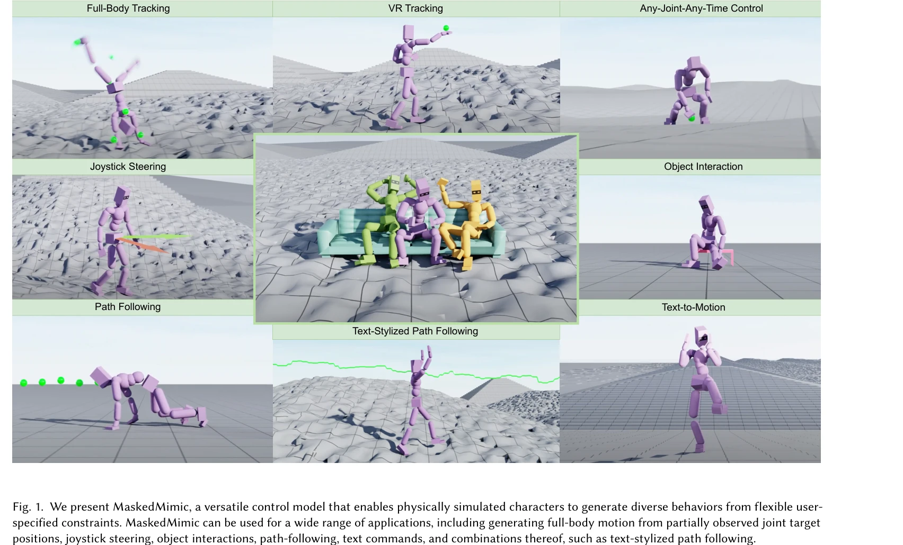
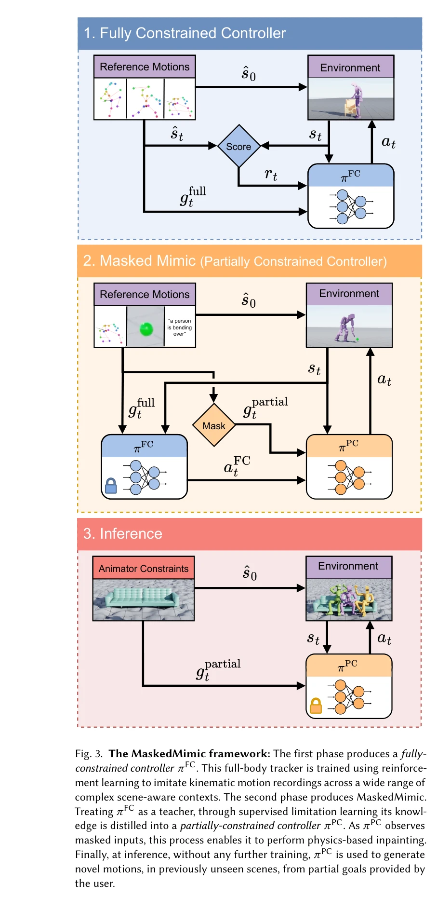

# MaskedMimic: Unified Physics-Based Character Control Through Masked Motion Inpainting

> **저자**: Chen Tessler, Yunrong Guo, Ofir Nabati, Gal Chechik, Xue Bin Peng | **날짜**: 2024-09-22 | **URL**: [https://arxiv.org/abs/2409.14393](https://arxiv.org/abs/2409.14393)

---

## Essence

*Fig. 1. We present MaskedMimic, a versatile control model that enables physically simulated characters to generate diver*

MaskedMimic은 motion inpainting 문제로 physics-based character control을 재정의하여, 마스킹된 keyframe, text, object 등 다양한 partial 조건으로부터 통합된 단일 모델이 전신 물리 기반 애니메이션을 생성할 수 있게 한다.

## Motivation

- **Known**: 기존 physics-based character animation 연구는 task-specific 컨트롤러를 각각 개발하거나 latent space 기반 composition 방식을 사용했으나, 이들은 versatility가 낮고 복잡한 reward engineering이 필요했다.
- **Gap**: 단일 unified model이 sparse keyframes, text instructions, scene information 등 diverse control modalities를 동시에 지원하면서도 task-specific training 없이 일반화할 수 있는 접근법이 부족했다.
- **Why**: Interactive character animation에서 단일 모델로 multiple tasks (locomotion, object interaction, VR tracking, text-to-motion 등)를 통합 제어할 수 있다면, 개발 프로세스 단순화와 cross-task positive transfer를 통해 현실적이고 immersive한 interactive experience를 가능하게 한다.
- **Approach**: Motion capture 데이터를 활용해 랜덤하게 마스킹된 motion sequence를 입력받아 원본 unmasked motion을 예측하도록 단일 unified controller를 학습하는 motion inpainting 프레임워크를 제안하고, goal-engineering이라는 prompt-engineering 유사 기법으로 다양한 control constraints를 정의한다.

## Achievement

*Fig. 1. We present MaskedMimic, a versatile control model that enables physically simulated characters to generate diver*

- **Unified multi-modal control framework**: 단일 MaskedMimic 모델이 full-body tracking, VR tracking, object interaction, terrain traversal, text-to-motion, joystick steering 등 8가지 이상의 서로 다른 control modality를 지원
- **Generalization to novel scenarios**: 학습 중 보지 못한 novel terrain, novel objects, text-style combinations에 대해 일반화
- **Simplified control interface**: 복잡한 reward engineering 없이 goal-engineering을 통한 직관적인 partial constraint 기반 제어
- **Cross-task positive transfer**: 통합 학습으로 인해 task-specific 방법들보다 VR tracking 등에서 더 우수한 성능 달성

## How

*Fig. 3. The MaskedMimic framework: The first phase produces a fully-*

- Motion capture dataset에서 kinematic trajectories, text descriptions, scene information 등 multi-modal 정보 활용
- Training phase: random masking을 적용한 motion sequences 입력 → masked condition에서 original unmasked motion 예측하도록 학습
- Inference phase: 사용자가 제공한 partial constraints (target positions, text, objects 등)를 masked motion으로 표현 → model이 full-body actions 생성
- Goal-engineering: natural language processing의 prompt-engineering 개념을 차용하여 다양한 constraints의 조합을 직관적으로 정의
- VAE architecture 기반 motion representation으로 diverse motion descriptions를 효과적으로 활용

## Originality

- Physics-based character control을 motion inpainting 문제로 재정의한 혁신적 관점 제시
- Single unified model로 8가지 이상의 heterogeneous control modality를 지원하는 첫 시도
- Goal-engineering이라는 새로운 control paradigm 도입으로 reward engineering을 완전히 대체
- Multi-modal motion descriptions (keyframes, text, objects, trajectories 등)의 자동 결합 및 seamless task transition 달성
- 기존 task-specific 방법들과의 성능 비교에서 generalization과 cross-task transfer 우월성 입증

## Limitation & Further Study

- Motion capture dataset의 질과 다양성에 크게 의존—학습 data에 없는 novel behaviors는 여전히 성능 저하 가능
- Multi-modal constraint 간의 conflict (예: 불가능한 text description + physics constraint)에 대한 명시적 해결 메커니즘 부재
- 실시간 interactive application에서의 inference latency 및 computational cost에 대한 분석 부족
- Physics simulation의 정확도에 따른 성능 변동성—poor contact modeling이나 numerical instability 시 애니메이션 quality 저하
- 후속 연구: (1) Semantic conflict resolution mechanism 개발, (2) Larger-scale multi-modal dataset 구축, (3) Real-time optimization과 online learning capability, (4) Hierarchical control과 high-level planning 통합

## Evaluation

- Novelty: 4/5
- Technical Soundness: 3/5
- Significance: 4/5
- Clarity: 4/5
- Overall: 4/5

**총평**: MaskedMimic은 motion inpainting이라는 우아한 재정의를 통해 physics-based character control의 versatility 문제를 근본적으로 해결하며, 단일 unified model로 diverse control modalities를 지원하는 breakthrough를 이루었다. 실제 응용 및 확장성 측면에서의 평가는 필요하지만, character animation의 패러다임을 크게 전환할 수 있는 높은 impact의 연구이다.
