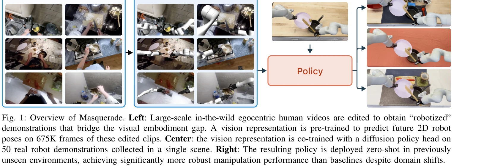
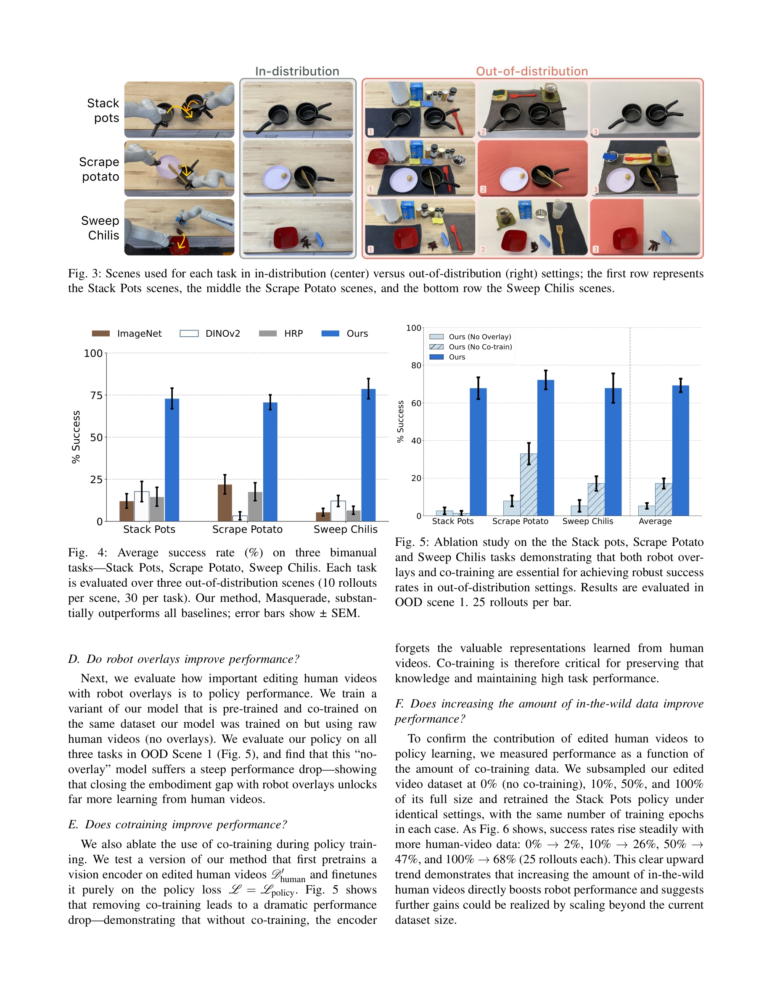
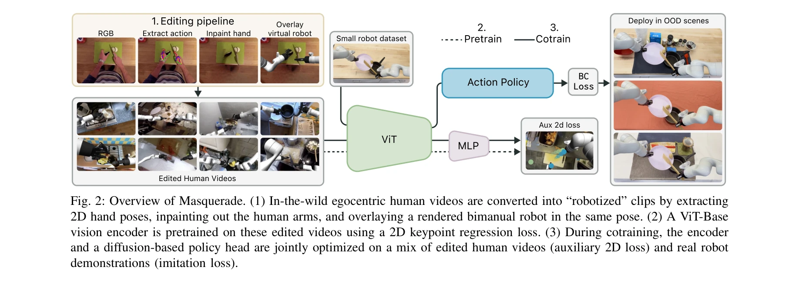

# Masquerade: Learning from In-the-wild Human Videos using Data-Editing

> **저자**: Marion Lepert, Jiaying Fang, Jeannette Bohg | **날짜**: 2025-08-13 | **URL**: [https://arxiv.org/abs/2508.09976](https://arxiv.org/abs/2508.09976)

---

## Essence

*Fig. 1: Overview of Masquerade. Left: Large-scale in-the-wild egocentric human videos are edited to obtain “robotized”*

Masquerade는 in-the-wild 인간 영상을 데이터 편집을 통해 로봇화된 시연으로 변환하고, 이를 통해 사전학습된 visual encoder로 로봇 조작 정책을 학습하는 방법을 제안한다. 675K 프레임의 편집된 인간 영상으로 사전학습 후 50개의 로봇 시연으로 fine-tuning하여 기존 방법 대비 5-6배 향상된 성능을 달성한다.

## Motivation

- **Known**: 로봇 조작 학습을 위해 인간 영상을 활용하려는 시도들이 있으나, 기존 방법들은 human-to-robot 간의 visual embodiment gap을 명시적으로 다루지 않는다. NLP와 CV 분야의 거대 데이터셋과 달리 로봇 데이터는 극히 부족한 상태이다.
- **Gap**: in-the-wild 인간 영상과 로봇 시연 간의 시각적 embodiment gap을 명시적으로 해결하면서 동시에 대규모 자연 영상을 활용하는 방법이 미탐색 상태이다. Curated human video에서의 embodiment gap 최소화 기법이 in-the-wild 대규모 데이터에 적용되지 않았다.
- **Why**: 로봇 조작 데이터의 극심한 부족은 로봇 정책 학습의 핵심 병목이며, in-the-wild 인간 영상은 대규모이고 다양하므로 이를 효과적으로 활용할 수 있다면 로봇 일반화 능력을 획기적으로 향상시킬 수 있다.
- **Approach**: 인간 영상에서 3D 손 자세를 추정하고 인간 팔을 inpaint한 후 렌더링된 bimanual 로봇을 overlaying하여 robotized 시연을 생성한다. 이 편집된 영상으로 2D robot keypoint 예측 task를 통해 visual encoder를 사전학습하고, 실제 로봇 데이터와 함께 co-training하여 diffusion policy를 학습한다.

## Achievement

*Fig. 4: Average success rate (%) on three bimanual*

- **out-of-distribution 일반화**: 기존 방법 대비 5-6배 우수한 성능으로 세 개의 unseen scene에서 bimanual kitchen task 수행
- **데이터 효율성**: 단 50개의 로봇 시연만으로도 robust policy 달성 가능
- **명시적 embodiment gap 해결**: Robot overlay와 co-training이 성능에 필수적임을 ablation으로 입증
- **스케일링 특성**: 편집된 인간 영상의 양에 따라 성능이 로그 스케일로 증가하는 pattern 발견

## How

*Fig. 2: Overview of Masquerade. (1) In-the-wild egocentric human videos are converted into “robotized” clips by extracti*

- Epic Kitchens 데이터셋에서 in-the-wild 인간 egocentric 영상 수집
- 각 프레임에서 3D 손 자세 추정 수행
- 인간의 팔 부분을 inpainting으로 제거
- 추정된 end-effector 궤적을 추적하는 bimanual 로봇을 렌더링하여 각 프레임에 overlaying
- 675K 프레임의 편집된 영상에서 ViT-Base encoder를 2D robot keypoint regression loss로 사전학습
- 사전학습된 encoder와 diffusion-based policy head를 edited human video(auxiliary 2D loss)와 실제 로봇 데이터(imitation loss)의 혼합으로 co-training
- 학습된 정책을 기존과 다른 scene에서 zero-shot 배포

## Originality

- Phantom의 data-editing 파이프라인을 carefully curated single-hand 영상에서 in-the-wild 대규모 자연 영상으로 확장
- Visual embodiment gap을 explicit하게 폐쇄하는 접근 방식이 in-the-wild 설정에서 효과적임을 입증
- Pretraining objective를 fine-tuning 단계에서도 유지하는 co-training 전략이 out-of-distribution robustness에 핵심임을 발견
- Simple 2D overlay 방식으로도 상당한 성능 향상을 달성하는 실용적 방법론 제시

## Limitation & Further Study

- Hand pose 추정 오류가 누적되어 robotized 시연의 정확도에 영향을 미칠 수 있음
- Inpainting 과정에서 복잡한 occlusion이나 rapid motion에서 부정확한 결과 발생 가능
- 평가가 세 개 task와 각각 세 개 scene으로 제한되어 있어 광범위한 일반화 가능성을 완전히 검증하지 못함
- Bimanual manipulation 특화로 single-arm 작업이나 다양한 로봇 형태에 대한 적용 가능성 미검증
- 렌더링된 로봇의 physics-based accuracy와 실제 로봇 행동 간의 차이 분석 부재
- 후속연구: 더 정교한 hand pose 추정 기법 적용, 다양한 로봇 형태와 작업에 대한 확대 평가, 실시간 정책 배포의 안정성 검증 필요

## Evaluation

- Novelty: 4/5
- Technical Soundness: 3/5
- Significance: 4/5
- Clarity: 4/5
- Overall: 4/5

**총평**: Masquerade는 visual embodiment gap을 명시적으로 해결하면서 대규모 in-the-wild 인간 영상을 로봇 학습에 활용하는 창의적이고 실용적인 방법론을 제시한다. 적절한 평가와 ablation으로 핵심 설계 선택의 효과를 입증했으며, 로봇 데이터 부족 문제를 완화하는 데 의미 있는 기여를 한다.
