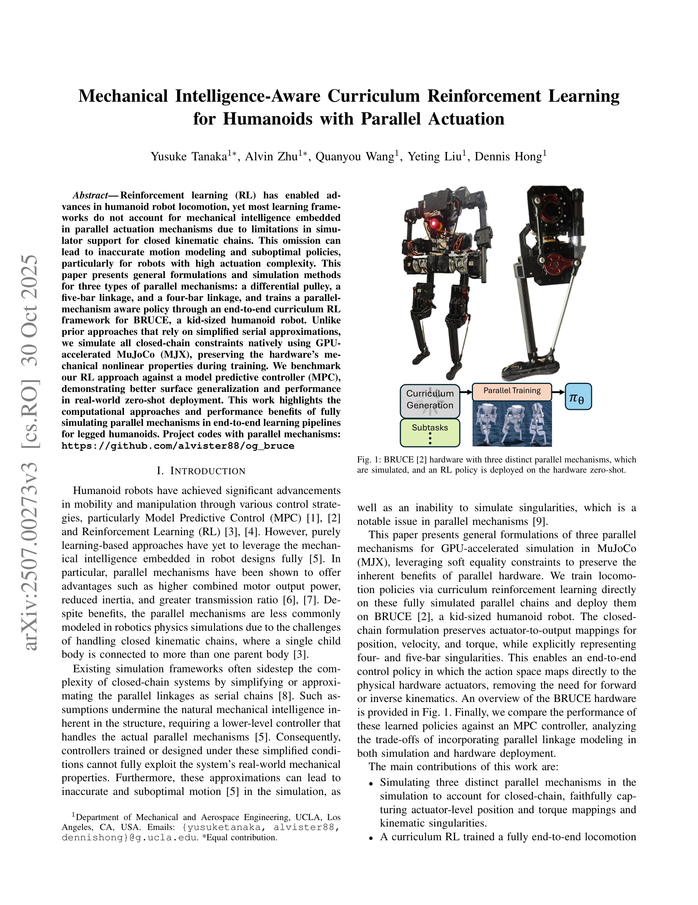
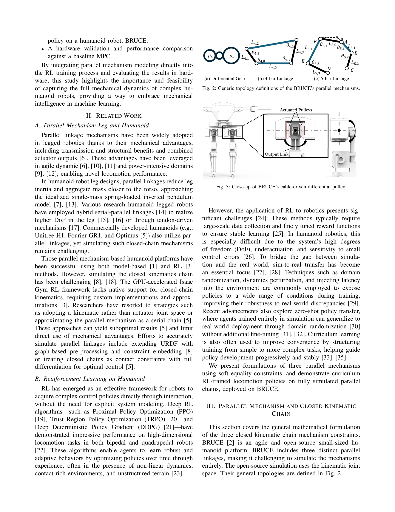

# Mechanical Intelligence-Aware Curriculum Reinforcement Learning for Humanoids with Parallel Actuation

> **저자**: Yusuke Tanaka, Alvin Zhu, Quanyou Wang, Yeting Liu, Dennis Hong | **날짜**: 2025-06-30 | **URL**: [https://arxiv.org/abs/2507.00273](https://arxiv.org/abs/2507.00273)

---

## Essence

*Fig. 1: BRUCE [2] hardware with three distinct parallel mechanisms, which*

본 논문은 병렬 구동 메커니즘을 완전히 시뮬레이션하여 학습한 RL 정책을 휴머노이드 로봇 BRUCE에 배포하며, 기존의 직렬 근사 방식과 달리 폐곡선 운동학 제약을 GPU 가속 MJX로 네이티브 구현한다.

## Motivation

- **Known**: 병렬 메커니즘은 더 높은 결합 모터 출력, 감소된 관성, 더 큰 전달 비 등의 장점을 제공하며, 휴머노이드 로봇에서 다양하게 활용되고 있다. RL은 고차원 복잡한 제어 문제에서 효과적인 학습 방법이다.
- **Gap**: 기존 시뮬레이션 프레임워크들은 폐곡선 운동학 체인 처리의 어려움으로 인해 병렬 링크를 직렬 체인으로 근사화하여, 실제 하드웨어의 기계적 비선형 특성을 충분히 활용하지 못하고 있다. Isaac Gym 같은 GPU 가속 RL 프레임워크는 폐곡선 운동학을 네이티브로 지원하지 않는다.
- **Why**: 병렬 메커니즘의 기계적 지능을 완전히 시뮬레이션하고 학습에 반영하면 더 정확한 모션 모델링과 최적의 정책 개발이 가능해지며, 실제 로봇 배포에서 더 나은 성능과 일반화를 달성할 수 있다.
- **Approach**: differential pulley, five-bar linkage, four-bar linkage 세 가지 병렬 메커니즘에 대해 soft equality constraint를 사용한 일반 수학 공식화를 제시하고, 이를 GPU 가속 MJX에서 네이티브로 구현한 후 curriculum RL로 엔드-투-엔드 보행 정책을 학습한다.

## Achievement

*Fig. 1: BRUCE [2] hardware with three distinct parallel mechanisms, which*

- **폐곡선 운동학 시뮬레이션**: soft equality constraint를 이용해 세 가지 병렬 메커니즘(differential pulley, 5-bar linkage, 4-bar linkage)을 MJX에서 폐곡선 제약을 완전하게 시뮬레이션하여 특이점과 구동기-출력 토크 매핑을 정확히 표현
- **Curriculum RL 기반 정책 학습**: BRUCE 휴머노이드 로봇을 위해 완전한 병렬 메커니즘을 포함한 시뮬레이션에서 curriculum RL을 통해 엔드-투-엔드 보행 정책을 학습
- **실제 하드웨어 검증**: 학습된 정책을 실제 BRUCE 로봇에 zero-shot 배포하여 MPC 기반 컨트롤러와 비교했을 때 더 나은 지표면 일반화와 성능 달성

## How

*Fig. 2: Generic topology definitions of the BRUCE’s parallel mechanisms.*

- Differential pulley: 구동 pulley의 각속도로부터 roll/pitch 관절 속도 매핑을 기어 비 ρ를 사용한 선형 변환으로 공식화 (Eq. 1)
- 5-bar linkage: 두 개의 직렬 체인의 끝점이 일치하도록 폐곡선 제약을 설정하고, 5가지 운동학 해 중 적절한 초기 구성을 선택
- 4-bar linkage: 단일 구동기와 출력 DoF를 가지므로 비선형 전달 비를 다항식 함수로 근사화
- GPU 가속 MJX: 폐곡선 제약을 soft equality constraint로 구현하여 고속 시뮬레이션 가능
- Curriculum learning: 단순한 작업부터 복잡한 보행 작업으로 점진적으로 학습 구조화
- Zero-shot 배포: domain randomization과 함께 시뮬레이션에서 정책을 실제 하드웨어에 직접 배포

## Originality

- 기존 직렬 근사 방식이 아닌 폐곡선 운동학 제약의 네이티브 시뮬레이션으로 병렬 메커니즘의 기계적 특성 완전 보존
- 세 가지 서로 다른 병렬 메커니즘 타입에 대한 일반화된 수학 공식화 및 구현 방법 제시
- 액추에이터 공간에서 직접 정책을 학습하여 순방향/역방향 운동학 불필요한 엔드-투-엔드 학습 파이프라인
- 실제 하드웨어 로봇에서의 검증과 MPC 기반 컨트롤러와의 직접적 성능 비교

## Limitation & Further Study

- 5-bar linkage의 5개 운동학 해 중 하나를 선택하기 위한 sanity check와 초기 구성 설정이 필요한 추가 복잡성
- Soft equality constraint의 수렴 안정성과 constraint 강도 파라미터 튜닝에 대한 상세 논의 부족
- 특정 로봇 플랫폼(BRUCE)에 대한 검증으로, 다른 병렬 메커니즘 구조를 가진 로봇에서의 일반화 가능성 미확인
- MPC와의 비교는 포함하지만 다른 RL 알고리즘(PPO, TRPO 등)의 직렬 근사 방식과의 비교 분석 부족
- 후속 연구로는 더 복잡한 병렬 메커니즘 구조에 대한 확장, 실시간 특이점 회피 알고리즘 개발, 다양한 휴머노이드 플랫폼에 대한 적용 가능성 검토 필요

## Evaluation

- Novelty: 4/5
- Technical Soundness: 3/5
- Significance: 4/5
- Clarity: 4/5
- Overall: 4/5

**총평**: 본 논문은 병렬 메커니즘의 기계적 특성을 완전히 시뮬레이션하여 RL 학습에 반영하는 혁신적 접근법을 제시하며, 실제 하드웨어 검증을 통해 이 방식의 실질적 성능 이득을 명확히 보여줌으로써 휴머노이드 로봇 제어 분야에 중요한 기여를 한다.
