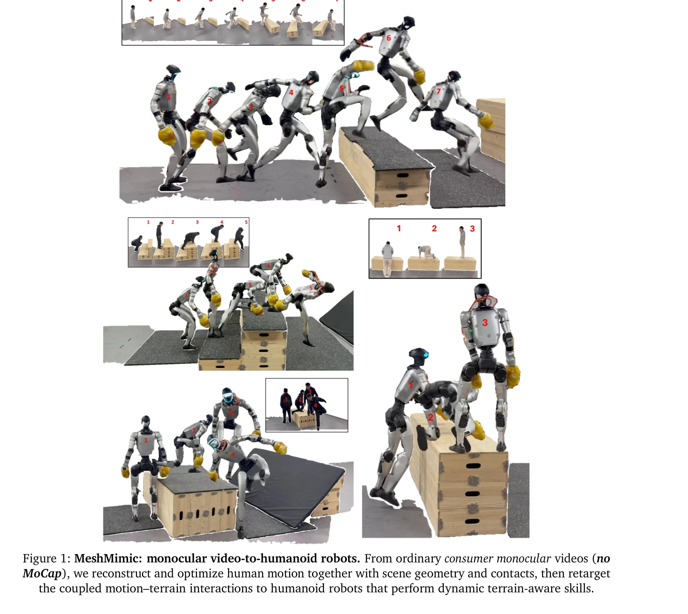
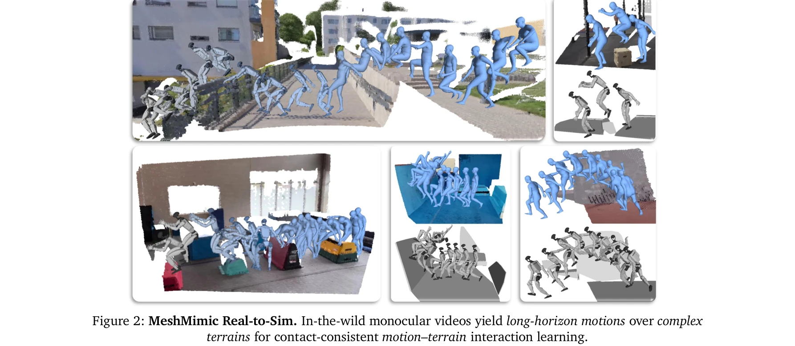
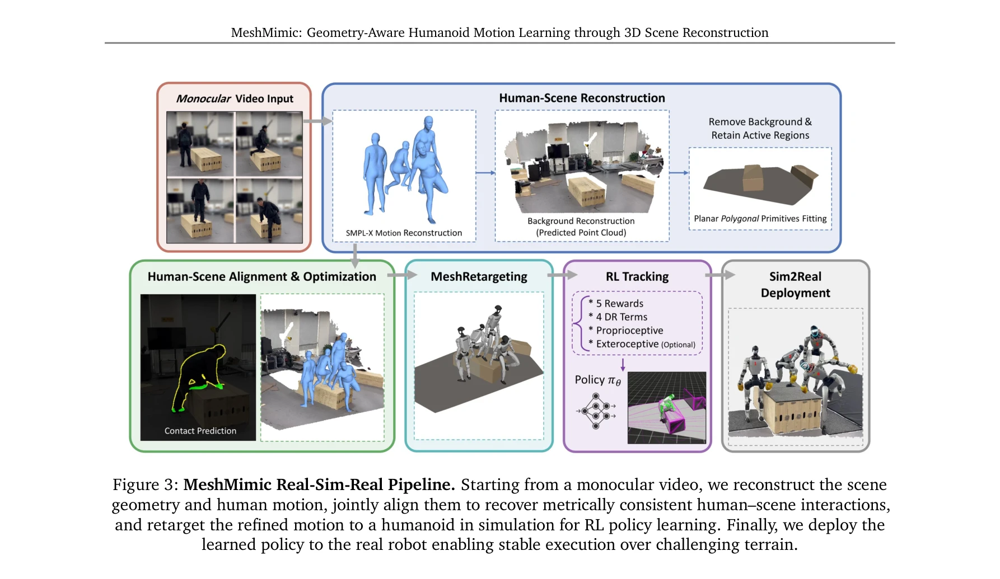

# MeshMimic: Geometry-Aware Humanoid Motion Learning through 3D Scene Reconstruction

> **저자**: Qiang Zhang, Jiahao Ma, Peiran Liu, Shuai Shi, Zeran Su, Zifan Wang, Jingkai Sun, Wei Cui, Jialin Yu, Gang Han, Wen Zhao, Pihai Sun, Kangning Yin, Jiaxu Wang, Jiahang Cao, Lingfeng Zhang, Hao Cheng, Xiaoshuai Hao, Yiding Ji, Junwei Liang, Jian Tang, Renjing Xu, Yijie Guo | **날짜**: 2026-02-17 | **DOI**: [10.48550/arXiv.2602.15733](https://doi.org/10.48550/arXiv.2602.15733)

---

## Essence

*Figure 1: MeshMimic: monocular video-to-humanoid robots. From ordinary consumer monocular videos (no*

MeshMimic은 단일 모노큘러 비디오에서 3D 장면 재구성을 통해 휴머노이드 로봇이 복잡한 지형과의 상호작용을 학습할 수 있는 프레임워크이다. Kinematic Consistency Optimization과 contact-aware retargeting을 통해 모션-지형 결합 상호작용을 정확하게 전달한다.

## Motivation

- **Known**: RL 기반 휴머노이드 제어는 복잡한 행동을 달성할 수 있으나, 고비용의 MoCap 데이터에 의존하고 있다. NeRF, 3DGS, SAM3D 등 최신 3D 비전 모델은 높은 품질의 장면 재구성을 가능하게 한다.
- **Gap**: 기존 모션 합성 프레임워크는 모션과 장면이 분리되어 있어 지형과의 상호작용 시 접촉 슬립이나 메시 관통 같은 물리적 불일치가 발생한다. 환경 기반 모션 재타게팅과 정밀한 접촉 최적화를 결합한 방법이 부족하다.
- **Why**: 비용 효율적이고 확장 가능한 휴머노이드 로봇 훈련이 필수적이며, 실제 환경에서 안정적인 상호작용을 위해서는 정확한 기하학적 맥락이 필수적이다.
- **Approach**: 3D 비전 기반 모델을 활용하여 비디오에서 인간 궤적과 지형 기하학을 동시에 재구성한 후, Kinematic Consistency Optimization으로 노이즈를 제거하고, MeshRetarget 메커니즘으로 인간-환경 상호작용을 휴머노이드 형태에 맞게 재타게팅한다.

## Achievement

*Figure 2: MeshMimic Real-to-Sim. In-the-wild monocular videos yield long-horizon motions over complex*

- **Terrain-Aware 모션 모방 프레임워크**: 모노큘러 비디오로부터 직접 학습 가능하며, Kinematic Consistency Optimization을 통해 시각적 노이즈로부터 물리적으로 타당한 참조 궤적을 추출한다.
- **MeshRetarget 메커니즘**: 형태학적 갭을 명시적으로 해결하면서 기하학적 상호작용 특성을 보존하여 다양한 신체 크기의 인간 모션을 다른 차원의 로봇에 효과적으로 매핑한다.
- **다양한 지형에서의 견고성**: 복잡하고 불규칙한 지형에서 높은 동역학 성능을 달성하며, 소비자용 모노큘러 센서만으로도 복잡한 물리 상호작용 훈련이 가능함을 입증한다.

## How

*Figure 3: MeshMimic Real-Sim-Real Pipeline. Starting from a monocular video, we reconstruct the scene*

- SAM3D와 3DGS를 이용하여 비디오에서 인간 액터와 환경을 분리하고 각각의 3D 기하학을 복원한다.
- Depth-edge 기반 접촉 예측을 통해 인간과 지형 간의 접촉점을 식별한다.
- Kinematic Consistency Optimization 알고리즘으로 시각적 포즈 추정의 노이즈를 제거하여 물리적으로 타당한 모션을 생성한다.
- Contact-invariant retargeting 방법으로 접촉 제약을 보존하면서 인간 모션을 휴머노이드 형태학에 맞춘다.
- 재타게팅된 모션과 재구성된 지형 메시를 RL 파이프라인에 통합하여 환경 인식 제어를 학습한다.

## Originality

- 비디오로부터 결합된 모션-지형 상호작용을 직접 학습하는 통합 프레임워크를 제시한다.
- 물리적 타당성을 보장하는 Kinematic Consistency Optimization을 모션 추출 단계에 도입한다.
- 접촉 제약을 명시적으로 고려하는 기하학 기반 retargeting 메커니즘을 제안한다.
- 3D 장면 재구성과 구체화된 지능(embodied intelligence)을 통합하여 환경 인식 로봇 제어의 새로운 경로를 제시한다.

## Limitation & Further Study

- 비디오 재구성의 정확성이 최종 모션 품질에 크게 의존하므로, 동적 폐색이나 질감이 없는 표면에서 성능 저하 가능성이 있다.
- 현재 프레임워크는 정적 환경을 가정하고 있어 동적 객체와의 상호작용으로 확장 필요하다.
- 모션 추출 및 retargeting 파이프라인의 계산 비용이 실시간 적용에 제약이 될 수 있다.
- 후속 연구로 동적 환경, 다양한 로봇 형태, 그리고 더 복잡한 접촉 상호작용(조작 등)에 대한 확장이 필요하다.

## Evaluation

- Novelty: 4/5
- Technical Soundness: 4/5
- Significance: 4/5
- Clarity: 4/5
- Overall: 4/5

**총평**: MeshMimic은 3D 비전과 구체화된 지능을 창의적으로 결합하여 비용 효율적이고 확장 가능한 휴머노이드 로봇 훈련 방식을 제시한다. 물리적 일관성 최적화와 접촉 인식 retargeting을 통해 복잡한 지형에서의 안정적인 상호작용을 실현함으로써 로봇 제어 분야에 상당한 기여를 한다.

## Related Papers

- 🏛 기반 연구: [[papers/1857_CRISP_Contact-Guided_Real2Sim_from_Monocular_Video_with_Plan/review]] — CRISP의 contact-guided real2sim 기법이 MeshMimic의 contact-aware retargeting 방법론에 핵심 아이디어를 제공했다
- 🔄 다른 접근: [[papers/2112_Now_You_See_That_Learning_End-to-End_Humanoid_Locomotion_fro/review]] — 둘 다 복잡한 지형에서의 humanoid locomotion이지만 MeshMimic은 3D scene reconstruction에, Now You See That은 raw depth perception에 중점을 둔다
- 🔗 후속 연구: [[papers/1978_Hiking_in_the_Wild_A_Scalable_Perceptive_Parkour_Framework_f/review]] — Hiking in the Wild의 perceptive parkour가 MeshMimic의 geometry-aware motion learning으로 더욱 정교하게 발전된 것이다
- 🔗 후속 연구: [[papers/1858_cuRoboV2_Dynamics-Aware_Motion_Generation_with_Depth-Fused_D/review]] — MeshMimic의 geometry-aware 학습을 depth-fused dynamics로 확장하여 더 정확한 물리 기반 상호작용을 구현할 수 있다.
- 🔄 다른 접근: [[papers/1618_PIMBS_Efficient_Body_Schema_Learning_for_Musculoskeletal_Hum/review]] — PIMBS는 physics-informed neural networks로, MeshMimic은 geometry-aware 학습으로 신체 스키마를 다르게 모델링함
- 🔗 후속 연구: [[papers/1785_A_Whole-Body_Motion_Imitation_Framework_from_Human_Data_for/review]] — 3D 형태 정보를 활용한 기하학적 인식 방법이 contact-aware 모션 리타겟팅의 정확성을 더욱 향상시킬 수 있다
- 🔄 다른 접근: [[papers/2112_Now_You_See_That_Learning_End-to-End_Humanoid_Locomotion_fro/review]] — 둘 다 복잡한 지형에서의 locomotion이지만 Now You See That은 raw pixel input에, MeshMimic은 3D reconstruction에 중점을 둔다
