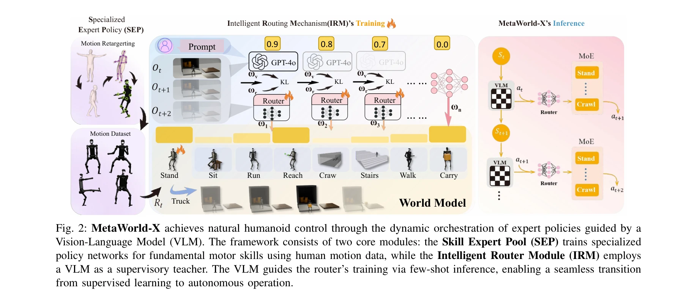

# MetaWorld-X: Hierarchical World Modeling via VLM-Orchestrated Experts for Humanoid Loco-Manipulation

> **저자**: Yutong Shen, Hangxu Liu, Penghui Liu, Jiashuo Luo, Yongkang Zhang, Rex Morvley, Chen Jiang, Jianwei Zhang, Lei Zhang | **날짜**: 2026-03-09 | **URL**: [https://arxiv.org/abs/2603.08572](https://arxiv.org/abs/2603.08572)

---

## Essence

*Fig. 2: MetaWorld-X achieves natural humanoid control through the dynamic orchestration of expert policies guided by a*

휴머노이드 로봇의 복잡한 로코-매니퓰레이션 제어를 Specialized Expert Policy(SEP)와 VLM 기반 Intelligent Routing Mechanism(IRM)으로 분해-통합하는 계층적 프레임워크를 제안한다. 인간 모션 프라이어와 의미적 라우팅을 결합하여 자연스럽고 안정적인 동작을 생성한다.

## Motivation

- **Known**: 세계 모델 기반 RL은 연속 제어에서 샘플 효율성을 개선하였고, Mixture-of-Experts는 스킬 간 간섭을 완화하는 아키텍처로 알려져 있다. 인간 모션 데이터를 활용한 모방 학습은 자연스러운 동작 생성을 가능하게 한다.
- **Gap**: 기존 단일 monolithic policy는 로코-매니퓰레이션에서 스킬 간 gradient 간섭으로 부자연스럽고 불안정한 동작을 생성한다. 기존 MoE 방식은 의미적 조성(semantic composition)보다 스킬 다양성에만 중점을 두어 다단계 작업에서 설명 가능성이 부족하다.
- **Why**: 고자유도(high-DoF) 휴머노이드 제어는 로보틱스에서 근본적인 도전 과제이며, 자연스럽고 안정적인 전신 제어는 실제 응용과 사회적 수용성을 위해 필수적이다. 의미적 라우팅을 통한 조성 일반화는 다양한 복합 작업에 대한 적응성을 크게 향상시킨다.
- **Approach**: SEP 모듈에서 인간 모션 프라이어를 활용한 imitation-constrained RL로 K개의 전문가 정책을 학습하고, IRM에서 Vision-Language Model(VLM)의 의미적 이해를 바탕으로 동적으로 전문가들을 라우팅한다. 에너지 기반 정렬 보상과 동적 가중치 조정으로 자연스러운 모션 생성을 보장한다.

## Achievement

*Fig. 2: MetaWorld-X achieves natural humanoid control through the dynamic orchestration of expert policies guided by a*

- **Human-Motion-Informed SEP 학습**: 에너지 기반 정렬 보상(energy-based alignment reward)과 동적 가중치 조정(dynamic reweighting)을 통해 생체역학적으로 일관되고 자연스러운 모션 원시요소(primitives)를 학습하며 스킬 간 gradient 간섭을 완화
- **VLM 기반 의미적 라우팅**: Vision-Language Model을 감독 신호로 활용하여 복잡한 작업을 전문가 조성으로 분해하고 few-shot 의미적 전이(semantic transfer)로 zero-shot 조성 일반화를 지원
- **성능 향상**: Humanoid-bench에서 TD-MPC2 대비 로코모션 및 매니퓰레이션 작업 전반에 걸쳐 return, 수렴 속도, 모션 품질에서 현저한 개선 달성

## How

*Fig. 2: MetaWorld-X achieves natural humanoid control through the dynamic orchestration of expert policies guided by a*

- Specialized Expert Policy(SEP) 모듈: K개의 전문가 정책 {π_i}를 인간 모션 데이터셋 D_human에서 정렬 연산자 A를 최소화하여 학습
- Motion Retargeting Pipeline: 인간 모션 캡처 데이터(AMASS 등)를 휴머노이드 로봇 동역학에 맞게 변환하여 동역학적 불일치 해소
- Intelligent Routing Mechanism(IRM): VLM(GPT-4o)을 이용하여 high-level 작업 의미를 해석하고 라우터 네트워크가 전문가 가중치 분포를 학습
- Few-shot Semantic Transfer: 제한된 시연(demonstrations)으로부터 라우터가 전문가 조성을 학습하여 감독 학습에서 자율 결정으로의 전환 지원
- World Model: 잠재 공간에서 환궤적 예측(trajectory prediction) 및 계획으로 데이터 효율성 향상

## Originality

- 인간 모션 프라이어와 world model 기반 RL을 MoE 아키텍처에 통합하여 단순 스킬 분해를 넘어 의미적 조성 기반의 계층적 제어 프레임워크 제시
- VLM을 라우팅 메커니즘의 감독 신호로 활용하는 것으로, 기존 VLM 활용(task planning)과 달리 실행 단계의 전문가 선택에 직접 적용
- 에너지 기반 정렬 보상과 동적 가중치 조정을 통한 novel imitation-constrained RL 공식화로 생체역학적 일관성과 작업 최적화의 목표 충돌 해결

## Limitation & Further Study

- 평가가 Humanoid-bench 시뮬레이션 환경에만 국한되어 실제 로봇(real-world humanoid)에서의 성능 검증 부재
- VLM 기반 라우팅의 계산 오버헤드 및 추론 시간에 대한 정량적 분석 부족
- SEP 모듈의 전문가 개수 K 결정 방식과 새로운 작업에 대한 전문가 추가 메커니즘에 대한 설명 부재
- 인간 모션 데이터셋 의존성: 모션 캡처 데이터 부족 시나리오에서의 성능 저하 가능성
- 후속 연구: (1) 실제 휴머노이드 로봇에서의 실험 검증, (2) 온라인 전문가 추가 및 동적 확장 메커니즘 개발, (3) 계산 효율적인 경량 라우팅 모델 탐색

## Evaluation

- Novelty: 4/5
- Technical Soundness: 3/5
- Significance: 4/5
- Clarity: 4/5
- Overall: 4/5

**총평**: MetaWorld-X는 human motion priors, world models, VLM 기반 의미적 라우팅을 창의적으로 결합하여 고자유도 휴머노이드 로코-매니퓰레이션 제어의 중요한 문제(스킬 간섭, 부자연스러운 동작, 낮은 일반화)를 효과적으로 해결한다. Humanoid-bench에서의 강력한 실험 결과와 명확한 방법론 제시에도 불구하고, 실제 로봇 검증 부재가 임팩트를 제한한다.

## Related Papers

- 🏛 기반 연구: [[papers/1951_Genie_Sim_30__A_High-Fidelity_Comprehensive_Simulation_Platf/review]] — Genie Sim 3.0의 고충실도 시뮬레이션 플랫폼이 MetaWorld-X의 계층적 세계 모델링의 시뮬레이션 기반을 제공한다.
- 🔄 다른 접근: [[papers/2018_HYPERmotion_Learning_Hybrid_Behavior_Planning_for_Autonomous/review]] — 자율 휴머노이드 행동 계획에서 VLM 기반 라우팅과 hybrid behavior planning의 다른 접근법을 비교할 수 있다.
- 🔗 후속 연구: [[papers/1647_RoboPlayground_구조화된_물리_도메인을_통한_로봇_평가_민주화/review]] — Language-based task specification을 hierarchical world modeling으로 확장
- 🔗 후속 연구: [[papers/1887_DreamGen_Unlocking_Generalization_in_Robot_Learning_through/review]] — MetaWorld-X의 hierarchical world modeling이 DreamGen의 video world model을 VLM-orchestrated 계층 구조로 확장한다.
- 🔄 다른 접근: [[papers/1949_Generative_World_Modelling_for_Humanoids_1X_World_Model_Chal/review]] — 둘 다 계층적 세계 모델링을 다루지만 Generative World Modelling은 video 예측에, MetaWorld-X는 VLM 기반 조율에 초점을 맞춘다.
- 🔄 다른 접근: [[papers/1974_Hierarchical_Vision-Language_Planning_for_Multi-Step_Humanoi/review]] — 복잡한 조작 작업을 이 논문은 3계층 구조로, MetaWorld-X는 VLM 오케스트레이션으로 해결한다.
- 🔗 후속 연구: [[papers/2154_Towards_Bridging_the_Gap_between_Large-Scale_Pretraining_and/review]] — 대규모 사전학습 기법을 MetaWorld-X의 hierarchical world modeling과 결합하면 더 효율적인 VLM 기반 휴머노이드 제어가 가능합니다.
- 🔗 후속 연구: [[papers/2157_Towards_Proprioception-Aware_Embodied_Planning_for_Dual-Arm/review]] — VLM 기반 계층적 세계 모델링 기법이 이중팔 휴머노이드의 고유감각 인식 계획 능력을 더욱 향상시킬 수 있습니다.
