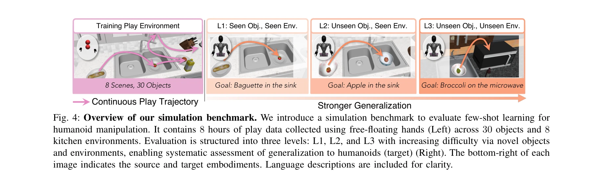
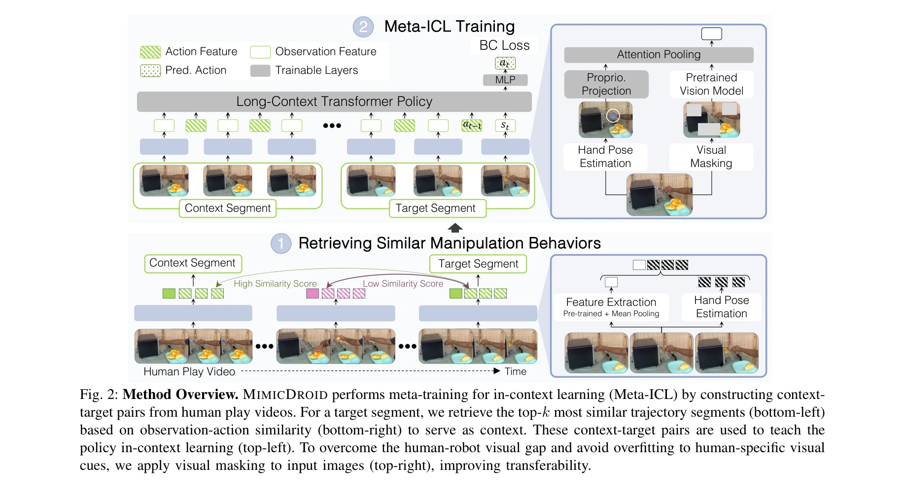

# MimicDroid: In-Context Learning for Humanoid Robot Manipulation from Human Play Videos

> **저자**: Rutav Shah, Shuijing Liu, Qi Wang, Zhenyu Jiang, Sateesh Kumar, Mingyo Seo, Roberto Martín-Martín, Yuke Zhu | **날짜**: 2025-09-11 | **URL**: [https://arxiv.org/abs/2509.09769](https://arxiv.org/abs/2509.09769)

---

## Essence

*Fig. 1: Overview. MIMICDROID enables few-shot learning for humanoid manipulation by training solely on human play*

MimicDroid는 인간의 자유로운 상호작용 비디오(human play videos)만을 학습 데이터로 사용하여 휴머노이드 로봇이 In-Context Learning(ICL)을 통해 새로운 조작 작업을 효율적으로 수행하도록 한다.

## Motivation

- **Known**: In-Context Learning은 소수의 예제로 빠른 적응을 가능하게 하지만, 기존 ICL 방법들은 노동 집약적인 원격조종 데이터에 의존하여 확장성이 제한된다.
- **Gap**: 휴머노이드 로봇의 몸체 차이(embodiment gap)를 극복하면서도 대규모로 수집 가능한 다양한 학습 데이터를 활용하여 ICL 기반 조작을 구현하는 방법이 부재하다.
- **Why**: 휴머노이드 로봇이 가정 환경의 변동성에 대응하려면 새로운 물체와 상황에 신속하게 적응할 수 있어야 하며, 확장 가능한 데이터 소스 활용이 필수적이다.
- **Approach**: 인간 play 비디오에서 유사한 조작 패턴을 가진 궤적 쌍을 추출하여 Meta-ICL 훈련을 수행하고, 운동학적 유사성을 활용한 손목 자세 재타겟팅과 random patch masking을 적용하여 embodiment 간극을 해결한다.

## Achievement

*Fig. 4: Overview of our simulation benchmark. We introduce a simulation benchmark to evaluate few-shot learning for*

- **human play videos 기반 ICL**: 원격조종 데이터 없이 순수하게 인간의 자유로운 상호작용 비디오만으로 휴머노이드의 In-Context Learning 능력을 습득하도록 함
- **시뮬레이션 벤치마크 제시**: 8시간의 play 데이터로 구성된 세 가지 일반화 수준의 오픈소스 휴머노이드 조작 벤치마크 구축
- **성능 향상**: SOTA 방법 대비 실세계에서 2배 이상의 성공률 달성 및 parameter-efficient fine-tuning 대비 26% 높은 성공률 기록
- **확장성 입증**: 학습 데이터 확대(64k→320k 프레임)에 따라 20% 성능 향상으로 데이터 확장성 확인

## How

*Fig. 2: Method Overview. MIMICDROID performs meta-training for in-context learning (Meta-ICL) by constructing context-*

- Human play 비디오에서 유사한 관찰-행동 관계를 가진 궤적 쌍을 자동으로 추출하여 context-target 쌍 구성
- Long-context Transformer 기반 정책 모델로 Meta-ICL 훈련: 한 궤적의 action을 다른 궤적에 condition하여 패턴 학습
- RGB 비디오에서 hand pose estimation을 통해 인간의 손목 자세 추출 및 kinematic 유사성을 활용한 humanoid 손목 자세로의 재타겟팅
- Random patch masking을 훈련 중 적용하여 인간 특화적 시각 단서에 대한 과적합 방지 및 로봇 실행 시 시각적 차이에 대한 강건성 개선
- Pretrained vision model과 attention pooling을 통한 observation feature 추출 및 action prediction

## Originality

- **확장 가능한 데이터 소스 활용**: 원격조종 데이터 대신 human play videos를 사용하여 약 18배 빠른 데이터 수집 달성
- **자가 지도 메타 훈련**: 레이블 없는 인간 비디오에서 유사 궤적 쌍을 자동 추출하는 자가 지도 방식의 Meta-ICL 구성
- **Embodiment 간극 해결의 이중 전략**: 운동학적 재타겟팅과 visual masking을 결합한 체계적 접근
- **휴머노이드 특화 설계**: 인간과 로봇의 kinematic 유사성을 활용한 자연스러운 행동 매핑

## Limitation & Further Study

- 인간 자세 추정의 오류가 축적될 수 있으며, 복잡한 손가락 움직임이나 고정밀 조작에 대한 처리 미흡
- 시뮬레이션 과제 위주 평가로 실제 다양한 가정 환경으로의 확대 일반화 검증 필요
- Embodiment 간극이 완전히 해소되지 않아 일부 task에서 성능 제약 가능
- Context 궤적 선택(top-k retrieval)의 품질이 성능에 큰 영향을 미칠 수 있으나 최적화 방안 분석 부족
- **향후 연구**: 보다 정교한 손/손가락 추적, 실제 가정 환경 데이터 수집, 다양한 로봇 형태로의 확대, 보다 정밀한 embodiment 적응 메커니즘 개발

## Evaluation

- Novelty: 4/5
- Technical Soundness: 4/5
- Significance: 4/5
- Clarity: 4/5
- Overall: 4/5

**총평**: MimicDroid는 human play videos라는 현실적이고 확장 가능한 데이터 소스를 활용하여 휴머노이드 로봇의 In-Context Learning 기반 조작을 실현한 혁신적인 연구이며, 명확한 방법론, 강력한 실증적 결과, 그리고 공개 벤치마크를 통해 로봇 학습 분야에 실질적인 기여를 한다.

## Related Papers

- 🏛 기반 연구: [[papers/1903_EgoMimic_Scaling_Imitation_Learning_via_Egocentric_Video/review]] — 자아중심적 비디오를 통한 모방 학습 확장의 이론적 기반을 제공한다.
- 🔄 다른 접근: [[papers/2093_Masquerade_Learning_from_In-the-wild_Human_Videos_using_Data/review]] — 데이터 편집을 통한 야생 인간 비디오 학습과 자유로운 상호작용 비디오만을 사용한 학습이라는 다른 접근법을 제시한다.
- 🔗 후속 연구: [[papers/1821_BFM-Zero_A_Promptable_Behavioral_Foundation_Model_for_Humano/review]] — 휴머노이드를 위한 프롬프트 가능한 행동 기초 모델의 확장된 구현을 보여준다.
- 🏛 기반 연구: [[papers/1904_EgoVLA_Learning_Vision-Language-Action_Models_from_Egocentri/review]] — EgoVLA의 vision-language-action learning이 MimicDroid의 in-context learning 기반 humanoid manipulation에 방법론적 토대를 제공했다
- 🔄 다른 접근: [[papers/2115_OKAMI_Teaching_Humanoid_Robots_Manipulation_Skills_through_S/review]] — 둘 다 human video에서 humanoid manipulation을 학습하지만 MimicDroid는 ICL 방식을, OKAMI는 single video demonstration을 사용한다
- 🔗 후속 연구: [[papers/1863_DemoHLM_From_One_Demonstration_to_Generalizable_Humanoid_Loc/review]] — 인컨텍스트 학습을 통한 인간형 로봇 조작으로 발전됩니다.
- 🔄 다른 접근: [[papers/2115_OKAMI_Teaching_Humanoid_Robots_Manipulation_Skills_through_S/review]] — 둘 다 human video에서 humanoid manipulation 학습이지만 OKAMI는 single demonstration에, MimicDroid는 ICL 방식을 사용한다
