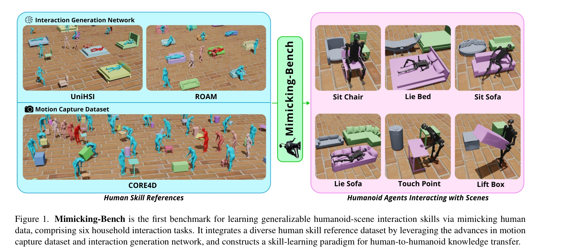
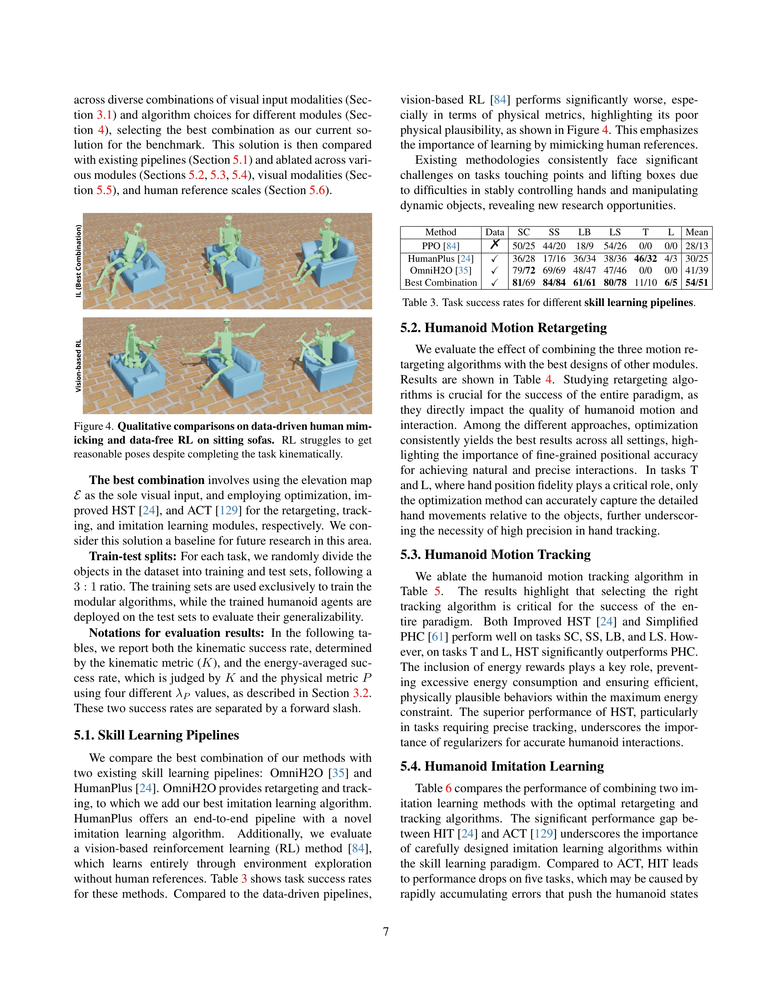
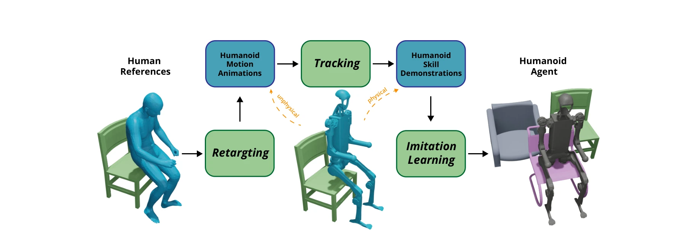

# Mimicking-Bench: A Benchmark for Generalizable Humanoid-Scene Interaction Learning via Human Mimicking

> **저자**: Yun Liu, Bowen Yang, Licheng Zhong, He Wang, Li Yi | **날짜**: 2024-12-23 | **URL**: [https://arxiv.org/abs/2412.17730](https://arxiv.org/abs/2412.17730)

---

## Essence

*Figure 1. Mimicking-Bench is the first benchmark for learning generalizable humanoid-scene interaction skills via mimick*

인간의 모션 데이터를 활용한 휴머노이드 로봇의 3D 장면 상호작용 학습을 위한 첫 번째 종합 벤치마크인 Mimicking-Bench를 제시하며, 23K개의 인간 상호작용 모션과 11K개의 다양한 객체 형상을 포함한다.

## Motivation

- **Known**: 휴머노이드 로봇 기술과 강화학습 기반 스킬 학습이 발전했으나, 소규모 수동 수집 데이터에 의존하는 기존 벤치마크들은 장면 기하학 일반화를 효과적으로 탐색하기 어렵다.
- **Gap**: 인간 모션 데이터의 대규모 다양성을 활용하면서도 motion retargeting, motion tracking, imitation learning 등 핵심 모듈을 체계적으로 평가할 수 있는 종합 벤치마크가 부재하다.
- **Why**: 휴머노이드 로봇의 실제 배포를 위해서는 다양한 장면과 객체 기하학에 일반화되는 상호작용 스킬이 필수적이며, 인간 데이터 기반 학습은 강화학습의 샘플 효율성 문제를 해결할 수 있다.
- **Approach**: 컴퓨터 비전과 그래픽스 분야의 인간-장면 상호작용 데이터셋과 생성 네트워크를 활용하여 대규모 인간 스킬 참조 데이터를 구축하고, motion retargeting → motion tracking → imitation learning의 3단계 파이프라인을 구성한다.

## Achievement

*Figure 4. Qualitative comparisons on data-driven human mim-*

- **Mimicking-Bench 벤치마크 개발**: 6개의 가정용 상호작용 작업(앉기, 누우기, 터치, 들기 등)을 포함하는 첫 번째 종합 벤치마크 제시
- **대규모 다양한 데이터셋**: 20K개의 합성 및 3K개의 실제 인간 상호작용 모션, 11K개 이상의 다양한 객체 형상 통합
- **일반 스킬 학습 패러다임**: motion retargeting, motion tracking, imitation learning의 모듈식 조합을 지원하는 완전한 파이프라인 구축
- **체계적 평가 체계**: 파이프라인 수준과 모듈 수준의 비교를 모두 지원하여 각 기술의 영향을 독립적으로 분석
- **성능 검증**: 인간 모방 접근법이 데이터 없는 강화학습 대비 자연스러운 모션과 높은 작업 성공률 달성

## How

*Figure 3. Humanoid interaction skill learning paradigm.*

- CORE4D 등 기존 모션 캡처 데이터셋과 interaction generation network를 활용한 합성 데이터 생성
- Human skeleton을 humanoid skeleton으로 변환하는 motion retargeting 기술 적용
- Physics simulation 환경에서 motion tracking을 통한 실행 가능한 제어 신호 생성
- Imitation learning으로 추상화된 정책 학습 (단일 단계 접근법 및 계획-제어 2단계 방법 모두 지원)
- 다양한 객체 크기와 형상에 대한 일반화 성능 평가

## Originality

- 인간 데이터 기반 휴머노이드 학습을 위한 첫 번째 종합 벤치마크로, 기존의 시뮬레이션 전용(HumanoidBench) 또는 소규모 텔레오퍼레이션(BiGym) 벤치마크와 차별화
- 컴퓨터 비전/그래픽스 분야의 interaction generation 기술을 로보틱스 스킬 학습에 연결하는 새로운 교차 분야 접근
- 파이프라인과 모듈 수준의 이중 평가 체계를 통해 인간 모방 학습의 각 기술 요소의 역할을 체계적으로 분석
- 23K개의 인간 상호작용 모션과 11K개의 다양한 객체 형상을 통합한 대규모 다양성 확보

## Limitation & Further Study

- 벤치마크가 시뮬레이션 환경에 기초하여 실제 로봇 배포 시 sim-to-real gap 해결 필요
- 현재 6개의 가정용 작업으로 제한되어 있으며 더 복잡한 조작 작업(dexterous manipulation) 확장 미흡
- Motion retargeting 과정에서 인간-휴머노이드 신체 구조 차이로 인한 정보 손실 존재
- Imitation learning 단계에서 multi-modal 스킬 표현 및 장기 수평선 계획(long-horizon planning) 개선 필요
- 후속 연구는 실제 로봇 시스템 검증, 더 많은 상호작용 도메인 추가, 및 강화학습과의 결합 방안 탐색 필요

## Evaluation

- Novelty: 4/5
- Technical Soundness: 3/5
- Significance: 4/5
- Clarity: 4/5
- Overall: 4/5

**총평**: Mimicking-Bench는 인간 모션 데이터의 대규모 다양성을 활용한 휴머노이드-장면 상호작용 학습을 위한 첫 종합 벤치마크로, 신체 모방 기반의 로봇 스킬 학습 연구를 체계적으로 진행할 수 있는 중요한 기여를 제공한다.

## Related Papers

- 🔄 다른 접근: [[papers/2104_MolmoSpaces_A_Large-Scale_Open_Ecosystem_for_Robot_Navigatio/review]] — 둘 다 로봇 내비게이션과 매니퓰레이션을 위한 대규모 데이터셋과 벤치마크를 제공하지만 Mimicking-Bench는 인간 모션 중심, MolmoSpaces는 환경 중심이다.
- 🔗 후속 연구: [[papers/1644_RoboCasa_Large-Scale_Simulation_of_Everyday_Tasks_for_Genera/review]] — RoboCasa의 일상 작업 시뮬레이션 프레임워크를 실제 3D 장면과 인간 상호작용 데이터로 확장한 종합 벤치마크이다.
- 🏛 기반 연구: [[papers/2089_ManiSkill-HAB_A_Benchmark_for_Low-Level_Manipulation_in_Home/review]] — ManiSkill-HAB의 저수준 조작 벤치마크가 제공하는 기초 위에 인간-장면 상호작용이라는 고수준 행동을 추가로 다룬다.
- 🏛 기반 연구: [[papers/1816_Benchmarking_Humanoid_Imitation_Learning_with_Motion_Difficu/review]] — Benchmarking Humanoid Imitation Learning의 motion difficulty 평가 방법이 Mimicking-Bench의 종합 벤치마크 설계에 기반이 되었다
- 🔗 후속 연구: [[papers/1676_SimGenHOI_Physically_Realistic_Whole-Body_Humanoid-Object_In/review]] — SimGenHOI의 humanoid-object interaction이 Mimicking-Bench의 대규모 3D 장면 상호작용 벤치마크로 확장된 것이다
- 🔄 다른 접근: [[papers/2007_HumanoidBench_Simulated_Humanoid_Benchmark_for_Whole-Body_Lo/review]] — 둘 다 humanoid benchmark이지만 Mimicking-Bench는 scene interaction에, HumanoidBench는 whole-body locomotion에 특화되어 있다
- 🧪 응용 사례: [[papers/1951_Genie_Sim_30__A_High-Fidelity_Comprehensive_Simulation_Platf/review]] — Mimicking-Bench의 23K 인간 상호작용 모션이 Genie Sim 3.0의 고충실도 시뮬레이션 플랫폼에서 다양한 휴머노이드 행동 학습에 활용될 수 있다.
- 🔗 후속 연구: [[papers/2089_ManiSkill-HAB_A_Benchmark_for_Low-Level_Manipulation_in_Home/review]] — MS-HAB의 저수준 조작 벤치마크를 Mimicking-Bench의 일반화 가능한 휴머노이드-장면 상호작용으로 확장할 수 있다.
- 🔄 다른 접근: [[papers/2104_MolmoSpaces_A_Large-Scale_Open_Ecosystem_for_Robot_Navigatio/review]] — 둘 다 로봇을 위한 대규모 환경 데이터를 제공하지만, MolmoSpaces는 정적 환경과 그래스프에, Mimicking-Bench는 동적 인간-객체 상호작용에 초점을 둔다.
