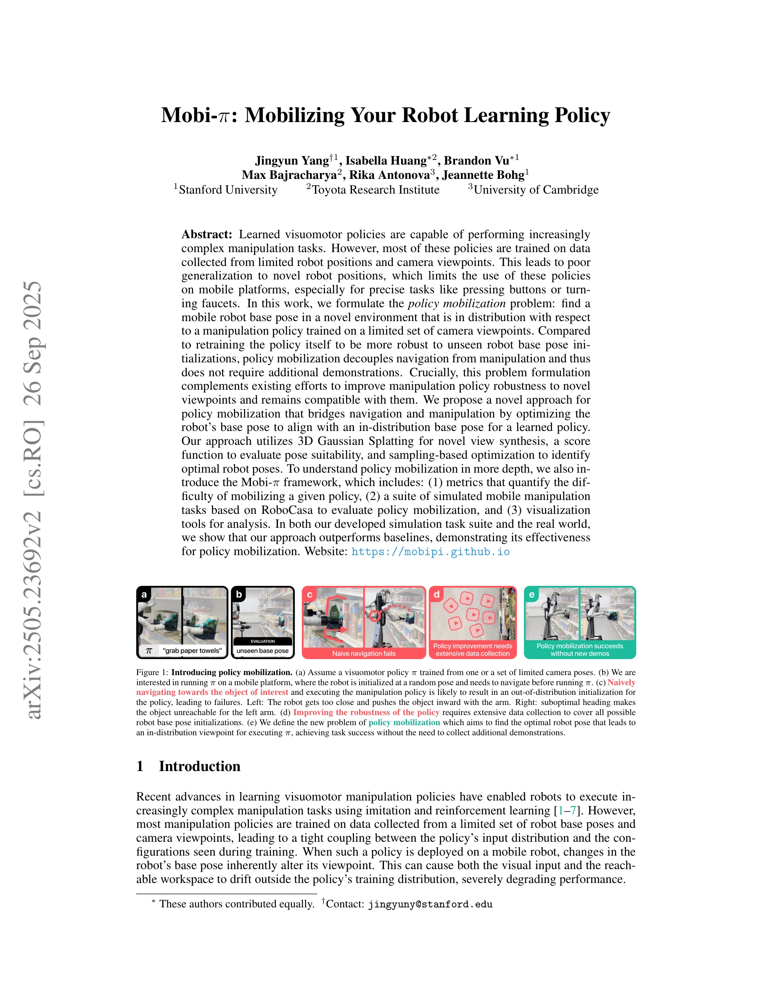
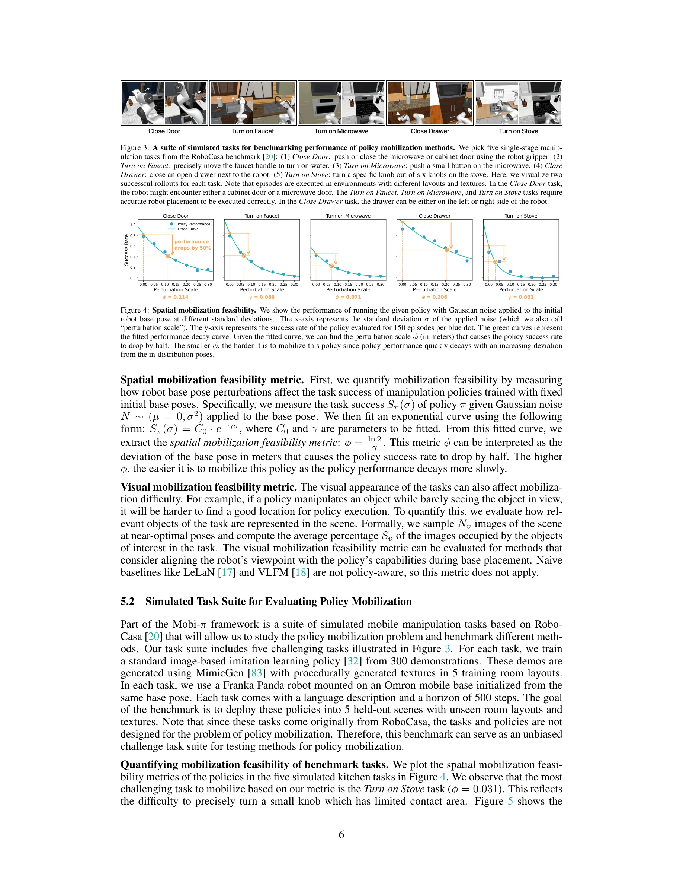
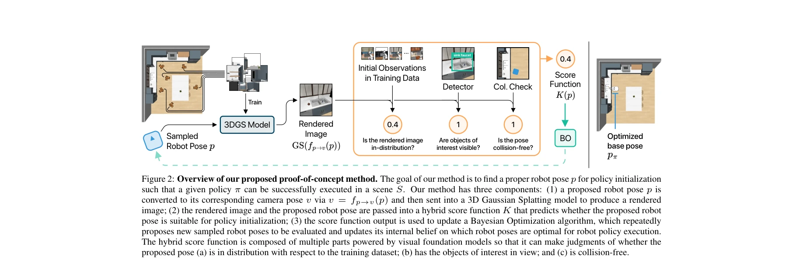

# Mobi-$π$: Mobilizing Your Robot Learning Policy

> **저자**: Jingyun Yang, Isabella Huang, Brandon Vu, Max Bajracharya, Rika Antonova, Jeannette Bohg | **날짜**: 2025-05-29 | **URL**: [https://arxiv.org/abs/2505.23692](https://arxiv.org/abs/2505.23692)

---

## Essence

*Figure 1: Introducing policy mobilization. (a) Assume a visuomotor policy π trained from one or a set of limited camera *

모바일 로봇에서 제한된 관점으로 학습된 조작 정책을 배포할 때 발생하는 분포 외 문제를 해결하기 위해, 정책과 호환되는 로봇 베이스 포즈를 찾는 '정책 모빌라이제이션' 문제를 제시하고 3D Gaussian Splatting과 샘플링 기반 최적화를 통해 해결한다.

## Motivation

- **Known**: 최근 visuomotor 정책은 복잡한 조작 작업을 수행할 수 있으나, 제한된 로봇 위치와 카메라 관점에서 수집된 데이터로만 학습되어 새로운 로봇 위치에 대한 일반화 성능이 낮다.
- **Gap**: 기존 연구는 정책 자체를 더 강건하게 만들기 위해 재학습을 시도하거나 언어/객체 위치 기반 네비게이션을 사용하지만, 정책의 훈련 분포와 정렬된 베이스 포즈를 명시적으로 찾지 않는다.
- **Why**: 모바일 로봇 플랫폼에서 기존의 정지 로봇 데이터로 학습된 정책을 효과적으로 재사용하면 대규모 데이터 수집 비용을 절감할 수 있으며, 네비게이션과 조작을 분리함으로써 문제 해결의 복잡성을 감소시킬 수 있다.
- **Approach**: 3D Gaussian Splatting으로 장면을 표현하고 미분 가능한 렌더링을 통해 후보 포즈의 분포 적합성을 평가하며, 샘플링 기반 최적화로 가장 적합한 로봇 베이스 위치를 식별한다. 또한 정책 모빌라이제이션의 난이도를 정량화하는 메트릭과 RoboCasa 기반 시뮬레이션 벤치마크를 제공한다.

## Achievement

*Figure 3: A suite of simulated tasks for benchmarking performance of policy mobilization methods. We pick five single-st*

- **정책 모빌라이제이션 문제 정의**: 네비게이션과 조작을 분리하면서도 정책 인식적(policy-aware) 베이스 포즈 선택 문제를 명확히 정의
- **통합 방법론**: 3D Gaussian Splatting, 점수 함수, 샘플링 기반 최적화를 결합하여 in-distribution 베이스 포즈 발견
- **Mobi-π 프레임워크**: 정책 모빌라이제이션 난이도 메트릭, 시뮬레이션 태스크 스위트, 시각화 도구 제공
- **실험 검증**: 시뮬레이션과 실제 환경에서 비정책 인식 기준선 및 정책 인식 기준선보다 우수한 성능 달성

## How

*Figure 2: Overview of our proposed proof-of-concept method. The goal of our method is to find a proper robot pose p for *

- 3D Gaussian Splatting을 사용하여 단일 또는 제한된 관점에서 새로운 카메라 포즈에 대한 novel view synthesis 수행
- 점수 함수를 설계하여 후보 베이스 포즈가 (1) 정책의 훈련 분포와 일치하는지, (2) 작업 관련 객체의 가시성을 제공하는지, (3) 충돌을 피하는지 평가
- Particle Swarm Optimization (PSO) 등의 샘플링 기반 최적화 알고리즘으로 점수 함수를 최대화하는 베이스 포즈 탐색
- RoboCasa 기반 시뮬레이션 환경에서 버튼 누르기, 수도꼭지 돌리기 등 다양한 조작 작업에 대해 평가
- 실제 Mobile Manipulation 로봇(Fetch 등)에서 학습된 정책을 배포하여 성능 검증

## Originality

- 기존 in-distribution detection 연구를 로봇 조작 맥락에서 적극적 포즈 최적화 문제로 확장
- 정책 재훈련 없이 기존 stationary 로봇 데이터로 학습된 정책을 모바일 플랫폼에 직접 적용 가능한 새로운 문제 공식화
- 네비게이션과 조작의 분리 원칙을 유지하면서도 policy-aware 네비게이션을 실현하는 접근
- 3D Gaussian Splatting의 novel view synthesis 능력을 정책 분포 평가에 활용하는 새로운 응용

## Limitation & Further Study

- 현재는 single-task 정책에만 적용되며 multi-task 정책으로의 확장이 미해결
- 3D Gaussian Splatting의 성능이 관점 간 거리에 의존하므로, 훈련 관점과 매우 다른 포즈에서는 렌더링 품질 저하 가능
- 점수 함수의 설계가 휴리스틱에 의존하며, 다양한 작업 유형에 대한 일반화 가능성이 제한적
- 실시간 성능 평가나 동적 환경에서의 성능이 논문에서 충분히 검토되지 않음
- 후속 연구로 multi-task 정책 지원, 학습 기반 점수 함수 설계, 부분 관찰(partial observability) 환경 확장이 필요

## Evaluation

- Novelty: 4/5
- Technical Soundness: 3/5
- Significance: 4/5
- Clarity: 4/5
- Overall: 4/5

**총평**: 본 논문은 모바일 조작 로봇에서 기존 정책의 재사용성을 크게 향상시키는 정책 모빌라이제이션이라는 새로운 문제를 정의하고, 3D Gaussian Splatting과 최적화 기법을 활용한 실용적 해법을 제시했다. 시뮬레이션과 실제 환경에서의 광범위한 검증을 통해 방법론의 유효성을 입증하였으며, 제시된 프레임워크는 향후 모바일 조작 연구의 중요한 기준이 될 것으로 기대된다.
