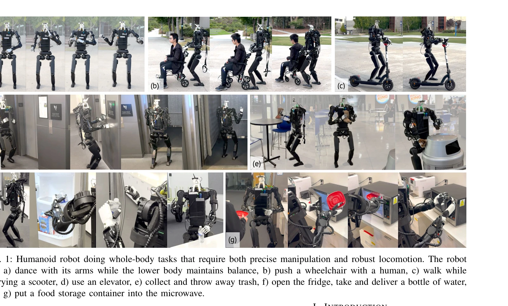

# Mobile-TeleVision: Predictive Motion Priors for Humanoid Whole-Body Control

> **저자**: Chenhao Lu, Xuxin Cheng, Jialong Li, Shiqi Yang, Mazeyu Ji, Chengjing Yuan, Ge Yang, Sha Yi, Xiaolong Wang | **날짜**: 2024-12-10 | **URL**: [https://arxiv.org/abs/2412.07773](https://arxiv.org/abs/2412.07773)

---

## Essence

*Fig. 2: The training pipeline consists of three stages: (a) preprocessing of the motion dataset by mapping local rotatio*

휴머노이드 로봇의 전신 제어를 위해 상체 조작과 하체 보행을 분리하고, CVAE 기반 Predictive Motion Priors (PMP)를 사용하여 상체의 정밀한 조작과 하체의 강건한 보행을 동시에 달성한다.

## Motivation

- **Known**: 최근 RL 기반 전신 제어 방법들(ExBody, OmniH2O, HumanPlus)이 보행과 조작을 함께 학습하지만, 고자유도 팔의 정밀한 조작에서는 부족하다.
- **Gap**: RL은 고 DoF 위치 및 방향 제어에 적합하지 않으며, 동적 보행 중 팔 제어의 불안정성이 발생하고, 완전 분리 제어도 상하체 상호작용으로 인한 불안정을 야기한다.
- **Why**: 일상적 로봇 활동에서 팔과 다리의 요구 사항이 근본적으로 다르므로(팔: 정밀성과 다양한 힘, 다리: 균형 유지), 이를 통합적으로 해결하는 것이 실용적 휴머노이드 시스템 구현의 핵심이다.
- **Approach**: 상체 제어를 역기구학과 모션 리타게팅으로 처리하고, 하체 보행을 RL로 학습하되, CVAE를 통해 상체 모션의 미래 정보를 잠재 표현으로 인코딩하여 하체 정책의 관찰값으로 제공함으로써 상하체 분리와 통합을 동시에 달성한다.

## Achievement

*Fig. 1: Humanoid robot doing whole-body tasks that require both precise manipulation and robust locomotion. The robot*

- **분리된 제어 구조의 안정성**: CVAE 기반 motion prior를 하체 정책에 제공함으로써 완전 분리의 불안정성을 해소하면서도 상체 정밀성 유지
- **높은 자유도 조작**: 7 DoF 팔로 GR1, Unitree H1에서 정밀한 조작 수행 (기존 방법은 4-5 DoF)
- **강건한 보행**: 짐 운반, 밀기, 엘리베이터 사용 등 부하가 있는 환경에서 10초 이상의 안정적 보행 달성
- **텔레오퍼레이션 친화적**: 간단한 속도 명령과 팔 제어를 통해 원격 조작 가능, 낮은 연산 비용
- **실세계 배포**: 시뮬레이션에서의 성능이 실제 로봇(Unitree H1)에 직접 전이 가능

## How

*Fig. 2: The training pipeline consists of three stages: (a) preprocessing of the motion dataset by mapping local rotatio*

- **Stage 1 (데이터 전처리)**: 인간 모션 데이터셋에 대해 로컬 로테이션 매핑을 적용하여 로봇 관절 각도로 변환 및 리타게팅
- **Stage 2 (Motion Prior 학습)**: CVAE 아키텍처로 과거 상체 모션 M₀ₜ(t-W~t-1)으로부터 미래 모션 M₁ₜ(t~t+W-1) 예측, 잠재 벡터 zₜ ∈ ℝ⁶⁴ 학습
- **CVAE 목적함수**: Evidence Lower Bound (ELBO)로 재구성 손실과 KL 발산을 결합하여 생성적 모션 표현 학습
- **Stage 3 (RL 정책 학습)**: 하체 RL 정책은 상체 motion prior zₜ를 관찰값으로 수신, 하체 12개 관절만 제어, 상체는 IK/리타게팅으로 직접 제어
- **Curriculum 학습**: 상체 제어를 점진적으로 확장하는 커리큘럼 스케줄로 학습 안정성 강화
- **Gait periodic signal 통합**: 보행 리듬 정보를 하체 정책 입력에 포함하여 걸음새 안정성 향상

## Originality

- **Motion Prior를 통한 분리-통합 결합**: 완전 분리의 문제를 해결하면서도 독립적 최적화를 유지하는 새로운 패러다임 제시
- **CVAE 잠재 표현의 정책 조건화**: 단순히 상태 피처가 아니라 미래 모션 예측 정보를 정책 입력으로 사용하는 창의적 접근
- **고 DoF 팔에 대한 역기구학 직접 제어**: RL을 거치지 않고 비용 함수 기반 IK로 정밀성 확보, 기존 방법과 구별
- **실세계 텔레오퍼레이션 시스템 구축**: 단순 속도 명령 + 손 리타게팅으로 실용적 인터페이스 제공

## Limitation & Further Study

- **CVAE 학습 데이터 의존성**: 인간 모션 데이터셋의 분포에 크게 의존하며, 데이터셋 외 모션 요청 시 성능 저하 가능성
- **상하체 물리적 상호작용 제한**: 상체 제어가 사실상 오픈루프이므로, 상체 무게가 하체 안정성에 영향을 미치는 경우의 정량적 분석 부족
- **실시간 계산 복잡도**: CVAE 인코더/디코더와 RL 정책 동시 실행의 실시간 계산 비용 분석 미흡
- **일반화 성능**: 두 가지 로봇(GR1, H1)에서만 평가되었으며, 더 다양한 형태의 휴머노이드에서의 검증 필요
- **후속 연구**: (1) 상하체 피드백 루프를 통한 적응적 보행 조정, (2) 학습 기반 손-발 협응 메커니즘, (3) 더 큰 규모 실세계 배포 및 장시간 안정성 테스트

## Evaluation

- Novelty: 4/5
- Technical Soundness: 3/5
- Significance: 4/5
- Clarity: 4/5
- Overall: 4/5

**총평**: 상체 정밀 조작과 하체 강건 보행이라는 근본적으로 다른 요구를 효과적으로 분리하면서도 CVAE 기반 motion prior를 통해 통합하는 창의적 접근으로, 고 DoF 팔 제어에서 기존 전신 RL 방법을 명확히 능가한다. 실세계 텔레오퍼레이션 가능성까지 보여주어 실용성이 높은 연구이다.
