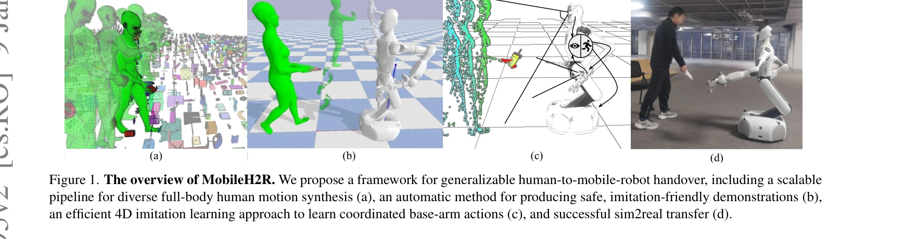
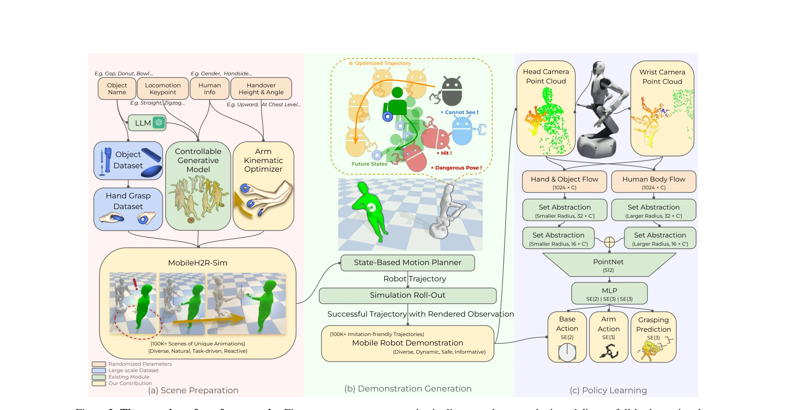

# MobileH2R: Learning Generalizable Human to Mobile Robot Handover Exclusively from Scalable and Diverse Synthetic Data

> **저자**: Zifan Wang, Ziqing Chen, Junyu Chen, Jilong Wang, Yuxin Yang, Yunze Liu, Xueyi Liu, He Wang, Li Yi | **날짜**: 2025-01-08 | **URL**: [https://arxiv.org/abs/2501.04595](https://arxiv.org/abs/2501.04595)

---

## Essence

*Figure 1. The overview of MobileH2R. We propose a framework for generalizable human-to-mobile-robot handover, including *

MobileH2R는 대규모 다양한 합성 데이터만을 사용하여 모바일 로봇이 인간으로부터 물체를 받을 수 있도록 학습하는 프레임워크를 제시한다. 인간의 전신 동작 생성, 안전한 시연 자동 생성, 4D imitation learning을 통합하여 베이스-암 협조 제어가 가능한 일반화된 정책을 학습한다.

## Motivation

- **Known**: Human-to-robot (H2R) handover는 손-물체 상호작용 데이터와 학습 기반 정책을 통해 고정 기반 로봇에서 연구되었다. 기존 HandoverSim, GenH2R 등은 mocap 데이터나 합성 자산을 활용하나 모바일 로봇의 대규모 작업 공간을 고려하지 않는다.
- **Gap**: 모바일 로봇의 H2MR handover는 안전성 때문에 실제 인간 시연 수집이 불가능하고, 기존 합성 데이터 방식은 제한된 규모(1000 시퀀스)와 부분적 인간 모션 모델링(손 제스처만)에 머물러 있다. 전신 동작의 대규모 다양한 합성과 베이스-암 협조 제어를 함께 다루는 방법이 부족하다.
- **Why**: 모바일 로봇의 인간-로봇 협업(healthcare, industrial assembly)에서 handover 능력은 필수적이며, 실제 학습의 안전/비용 문제를 해결하면서도 일반화 성능을 높이기 위해 고품질 합성 데이터의 확장성이 중요하다.
- **Approach**: 세 가지 주요 성분으로 구성된 통합 프레임워크를 제시한다: (1) 일반 동작 생성과 과제 특화 합성을 결합한 전신 인간 동작 생성 파이프라인, (2) 충돌 회피 및 시각적 명확성을 보장하는 동작 계획 기반 시연 자동 생성, (3) 인간과 물체 점 구름을 모두 입력으로 사용하는 4D imitation learning을 통한 폐루프 정책 학습.

## Achievement

*Figure 4. Qualitative results. We compare different methods in detail in the simulated scene and the real-world scene.*

- **대규모 합성 데이터 생성**: 100K 이상의 인터랙티브 handover 씬을 포함하는 확장 가능한 파이프라인 구현
- **안전성 개선**: 자동 생성된 시연이 충돌을 약 1/3 감소시키고 성공률을 11.6% 증가
- **성능 향상**: 시뮬레이션과 실제 환경 모두에서 기준 방법 대비 최소 +15% 성공률 개선
- **Sim-to-Real 전이 달성**: 실제 모바일 로봇 시스템으로의 효과적인 기술 전이 입증
- **스케일 효과 검증**: 시연 규모 확대와 장면 다양성 증가가 정책 일반화를 현저히 향상

## How

*Figure 2. The overview of our framework. First, we propose an automatic pipeline to scale up synthetic and diverse full-*

- **전신 인간 동작 생성**: AMASS 등 기존 데이터셋의 일반적 동작과 과제 특화 합성 알고리즘을 결합하여 handover 맥락에서 다양한 팔/손 동작 생성
- **인터랙티브 에이전트**: 로봇 근접성에 응응하는 대화형 인간 에이전트 설계로 현실적 상호작용 모델링
- **안전한 시연 생성**: 동작 계획 최적화를 통해 인간 신체 충돌 회피, 사각지대 진입 방지, 명확한 물체 상태 추정 보장
- **4D Imitation Learning**: 인간 신체/손/물체 점 구름을 입력으로 하고, 다양한 샘플링 반경의 set abstraction 레이어로 스케일 차이 처리하여 베이스-암 협조 동작 출력
- **멀티 카메라 비전**: 헤드 카메라(원거리)와 손목 카메라(근거리)를 상황에 따라 활용하여 폐루프 제어 실현

## Originality

- **모바일 로봇 handover의 전신 모델링**: 기존의 손 제스처나 부분 동작 중심 접근을 벗어나 전신 인간 동작을 통합한 첫 번째 대규모 프레임워크
- **자동화된 안전 시연 생성**: 충돌 회피와 시각적 명확성을 모두 고려한 동작 계획 기반 시연 생성 방법의 창의적 설계
- **베이스-암 협조 제어 학습**: 모바일 로봇의 기저부와 팔의 통합 제어를 4D imitation learning으로 학습하는 차별화된 접근
- **합성 데이터만으로의 학습**: 실제 mocap 데이터나 인간 시연 없이 고품질 합성 자산만으로 일반화 가능한 정책을 얻는 성과

## Limitation & Further Study

- **시뮬레이션 환경의 간소화**: 물리 시뮬레이션의 정확도 한계로 인한 sim-to-real gap 가능성
- **제한된 로봇 플랫폼**: 특정 모바일 로봇(base-arm 구성)에서만 평가되어 다양한 로봇 형태로의 확장성 미지수
- **인간 동작 다양성**: 합성 파이프라인이 특정 키네마틱 제약이나 신체 타입의 편향을 가질 가능성
- **후속 연구**: (1) 실제 인간 상호작용 데이터와의 비교를 통한 합성 데이터 품질 정량화, (2) 동적 장애물이나 복잡한 환경에서의 성능 평가, (3) 다양한 로봇 플랫폼으로의 확장성 검증

## Evaluation

- Novelty: 4/5
- Technical Soundness: 4/5
- Significance: 4/5
- Clarity: 4/5
- Overall: 4/5

**총평**: MobileH2R는 모바일 로봇의 인간-로봇 handover 문제를 체계적으로 해결하는 포괄적이고 확장 가능한 프레임워크를 제시한다. 합성 데이터의 생성, 안전한 시연 자동 생성, 통합 학습이라는 세 요소를 정교하게 설계하여 +15% 이상의 성능 향상을 달성했으며, 대규모 데이터의 효과를 실증한 점에서 실무적 가치가 높다.
