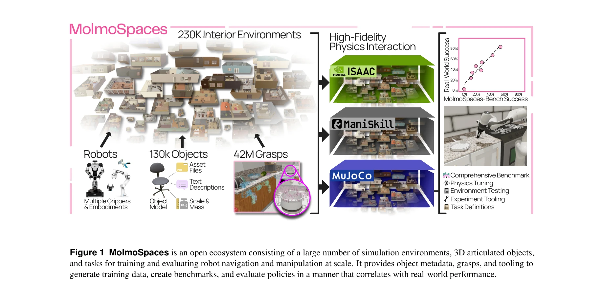
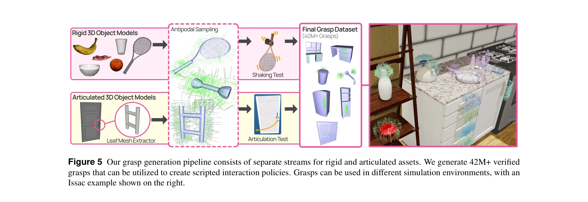

# MolmoSpaces: A Large-Scale Open Ecosystem for Robot Navigation and Manipulation

> **저자**: Yejin Kim, Wilbert Pumacay, Omar Rayyan, Max Argus, Winson Han, Eli VanderBilt, Jordi Salvador, Abhay Deshpande, Rose Hendrix, Snehal Jauhri, Shuo Liu, Nur Muhammad Mahi Shafiullah, Maya Guru, Ainaz Eftekhar, Karen Farley, Donovan Clay, Jiafei Duan, Arjun Guru, Piper Wolters, Alvaro Herrasti, Ying-Chun Lee, Georgia Chalvatzaki, Yuchen Cui, Ali Farhadi, Dieter Fox, Ranjay Krishna | **날짜**: 2026-02-11 | **URL**: [https://arxiv.org/abs/2602.11337](https://arxiv.org/abs/2602.11337)

---

## Essence

*Figure 1 MolmoSpaces is an open ecosystem consisting of a large number of simulation environments, 3D articulated object*

로봇 네비게이션과 매니퓰레이션을 위한 230k개 이상의 다양한 실내 환경, 130k개의 주석이 달린 객체 자산, 42M개의 안정적인 그래스프를 포함하는 대규모 오픈 에코시스템 MolmoSpaces를 제시하고, 이를 통해 로봇 정책의 일반화 능력을 평가할 수 있는 벤치마크를 구축했다.

## Motivation

- **Known**: 기존 로봇 벤치마크들은 제한된 수의 장면과 객체만 제공하거나 물리 시뮬레이션이 부족하며, 대부분 단일 룸 환경에서 단기 과제에만 집중하고 있다. 최근 VLA 모델들의 성능이 포화 상태에 가까워져 더 나은 평가 인프라의 필요성이 증대되고 있다.
- **Gap**: 현실 세계의 방대한 환경 변수(장면 레이아웃, 객체 형태, 작업 명세)의 장꼬리 분포를 충분히 대표하는 시뮬레이션 데이터셋과 벤칭마크가 부재하며, 시뮬레이션과 실제 성능 간의 강한 상관관계를 보증하는 대규모 평가 플랫폼이 필요하다.
- **Why**: 로봇 정책의 진정한 일반화 능력을 측정하려면 수천 개의 통제된 시나리오를 평가할 수 있는 다양한 시뮬레이션 환경이 필수적이며, 이는 비용이 많이 드는 물리 실험만으로는 불가능하기 때문이다.
- **Approach**: MuJoCo, IsaacSim, ManiSkill을 지원하는 시뮬레이터 agnotic 플랫폼으로 AI2-THOR, ProcTHOR, Holodeck의 230k 장면을 통합하고, 130k 객체와 42M 그래스프 어노테이션을 제공한 후, 8가지 기본 작업으로 구성된 MolmoSpaces-Bench를 설계했다.

## Achievement

*Figure 1 MolmoSpaces is an open ecosystem consisting of a large number of simulation environments, 3D articulated object*

- **대규모 통합 에코시스템**: 230k 실내 환경(수작업 제작 및 절차적 생성), 130k 객체 자산(2.8k 범주), 48k 조작 가능 객체에 대한 42M 안정적 그래스프 제공
- **멀티 시뮬레이터 호환성**: MuJoCo, IsaacSim, ManiSkill 간 호환 가능한 assets 및 scenes 제공
- **포괄적 작업 범위**: navigate-to, pick, pick-and-place, pick-and-place-next-to, pick-and-place-color, open, close, open-door 등 8가지 기본 작업 포함
- **강한 시뮬-투-리얼 상관관계**: Pearson R² ≈ 0.92, ρ = 0.98로 시뮬레이션 성능과 실제 성능의 높은 연관성 검증
- **정책 민감도 분석**: 프롬프트 표현, 초기 관절 위치, 카메라 폐색에 대한 zero-shot 정책들의 취약성 규명
- **오픈소스 공개**: 모든 assets, scenes, 벤칭마크 코드 및 도구 공개로 커뮤니티 확장성 제공

## How

*Figure 5 Our grasp generation pipeline consists of separate streams for rigid and articulated assets. We generate 42M+ v*

- AI2-THOR, ProcTHOR, Holodeck에서 수집한 장면을 표준화된 포맷으로 변환하고 시뮬레이터 agnotic 로더 개발
- Objaverse 및 기타 소스에서 수집한 130k 객체 모델에 대해 질량, 스케일, 중심 등 물리 메타데이터 추가
- Rigid 및 articulated 객체별 별도 파이프라인을 통해 grasp generation 수행하여 42M 안정적 그래스프 생성
- VLA 모델(π-models)과 classical 모듈식 baseline을 포함한 multiple 정책에 대해 zero-shot 평가 수행
- 현실 로봇 시스템에서 동일한 과제 수행 후 시뮬레이션 결과와의 상관관계 분석
- 프롬프트 표현, 초기 로봇 자세, 조명, 카메라 시점 등 파라미터 체계적 변동을 통한 민감도 분석

## Originality

- 기존 단일 시뮬레이터 기반 벤치마크를 넘어 MuJoCo, IsaacSim, ManiSkill 모두 호환 가능한 통합 에코시스템 제시
- 개별 grasp annotations(e.g., GraspGen)을 넘어 interactive scenes 내에서 48k 조작 객체에 대해 42M 그래스프를 scene context와 함께 제공
- 230k 규모의 multi-room 장면을 포함한 대규모 scene diversity로 기존 벤치마크(AI2-THOR 1, Habitat 15, iGibson 1)와 구별
- 시뮬레이션-현실 상관관계(R² ≈ 0.92)를 정량적으로 검증하여 시뮬레이션 벤치마크의 실무적 타당성 입증
- AI-generated tasks를 통한 task 다양성 확대로 기존 고정된 작업 세트에 비해 확장성 제공

## Limitation & Further Study

- 현재 8가지 기본 작업만 포함하고 있으며, 더 복잡한 long-horizon compositional tasks에 대한 평가는 초기 단계
- 시뮬레이션 객체의 시각적 현실성은 상대적으로 떨어질 수 있어 vision-heavy 정책의 시뮬-투-리얼 갭이 존재 가능
- 현재 주로 rigid 및 기본 articulated 객체 중심이며, 변형 가능한 물체나 매우 복잡한 조작 상호작용 지원 미흡
- 후속 연구: (1) 더 복잡한 다중 객체 조작 작업의 벤치마크 확대, (2) 시각 현실성 개선(photorealistic rendering), (3) 동적 객체 및 인간 상호작용 포함, (4) 더 긴 horizon의 자동 task generation 고도화

## Evaluation

- Novelty: 4/5
- Technical Soundness: 3/5
- Significance: 4/5
- Clarity: 4/5
- Overall: 4/5

**총평**: MolmoSpaces는 로봇 학습의 평가 기준이 되어 왔던 장면과 객체의 규모 제약을 크게 확장하며, simulator-agnostic 설계와 강한 시뮬-투-리얼 상관관계 검증으로 실무적 신뢰성을 확보한 중요한 오픈 인프라이다. 다만 task 복잡도와 시각적 현실성에서 아직 개선의 여지가 있다.

## Related Papers

- 🔄 다른 접근: [[papers/2100_Mimicking-Bench_A_Benchmark_for_Generalizable_Humanoid-Scene/review]] — 둘 다 로봇을 위한 대규모 환경 데이터를 제공하지만, MolmoSpaces는 정적 환경과 그래스프에, Mimicking-Bench는 동적 인간-객체 상호작용에 초점을 둔다.
- 🏛 기반 연구: [[papers/1951_Genie_Sim_30__A_High-Fidelity_Comprehensive_Simulation_Platf/review]] — Genie Sim 3.0의 고품질 시뮬레이션 플랫폼이 MolmoSpaces의 230k 환경을 생성하고 검증하는 기술적 기반을 제공한다.
- 🧪 응용 사례: [[papers/2087_LookOut_Real-World_Humanoid_Egocentric_Navigation/review]] — MolmoSpaces의 대규모 실내 환경 데이터셋이 LookOut의 egocentric 내비게이션 정책 학습에 훈련 환경으로 활용될 수 있다.
- 🔗 후속 연구: [[papers/1644_RoboCasa_Large-Scale_Simulation_of_Everyday_Tasks_for_Genera/review]] — RoboCasa의 everyday tasks 시뮬레이션이 MolmoSpaces의 대규모 실내 환경 생태계로 크게 확장된 것이다
- 🔄 다른 접근: [[papers/2089_ManiSkill-HAB_A_Benchmark_for_Low-Level_Manipulation_in_Home/review]] — 둘 다 manipulation benchmark이지만 MolmoSpaces는 대규모 환경 다양성에, MS-HAB는 저수준 조작과 빠른 시뮬레이션에 중점을 둔다
- 🔗 후속 연구: [[papers/1647_RoboPlayground_구조화된_물리_도메인을_통한_로봇_평가_민주화/review]] — MolmoSpaces의 대규모 실내 환경을 RoboPlayground의 구조화된 물리 도메인과 결합하여 더 체계적인 로봇 평가 민주화가 가능하다.
- 🔄 다른 접근: [[papers/1942_GaussGym_An_open-source_real-to-sim_framework_for_learning_l/review]] — MolmoSpaces는 대규모 시뮬레이션 환경, GaussGym은 real-to-sim 프레임워크로 서로 다른 방향의 로봇 학습 환경 구축을 제공한다.
- 🏛 기반 연구: [[papers/1713_Thinking_in_360_Humanoid_Visual_Search_in_the_Wild/review]] — 대규모 로봇 네비게이션 생태계에서 360도 시각 탐색이 다양한 환경에서의 일반화 능력을 제공할 수 있다.
- 🏛 기반 연구: [[papers/1868_DexHub_and_DART_Towards_Internet_Scale_Robot_Data_Collection/review]] — MolmoSpaces의 대규모 개방형 로봇 생태계가 DexHub의 클라우드 데이터베이스와 DART의 데이터 수집 플랫폼 구축에 필요한 인프라와 설계 원칙을 제공한다.
- 🧪 응용 사례: [[papers/2057_Learning_Humanoid_Navigation_from_Human_Data/review]] — 인간 데이터 기반 내비게이션 학습을 대규모 로봇 내비게이션 생태계에 적용
- 🔗 후속 연구: [[papers/2064_Learning_Social_Navigation_from_Positive_and_Negative_Demons/review]] — 대규모 개방형 생태계를 통한 로봇 네비게이션의 확장된 프레임워크를 제공한다.
- 🔗 후속 연구: [[papers/2089_ManiSkill-HAB_A_Benchmark_for_Low-Level_Manipulation_in_Home/review]] — ManiSkill-HAB의 home manipulation 벤치마크가 MolmoSpaces의 대규모 실내 환경 생태계로 확장된 것으로 볼 수 있다
- 🔄 다른 접근: [[papers/2100_Mimicking-Bench_A_Benchmark_for_Generalizable_Humanoid-Scene/review]] — 둘 다 로봇 내비게이션과 매니퓰레이션을 위한 대규모 데이터셋과 벤치마크를 제공하지만 Mimicking-Bench는 인간 모션 중심, MolmoSpaces는 환경 중심이다.
