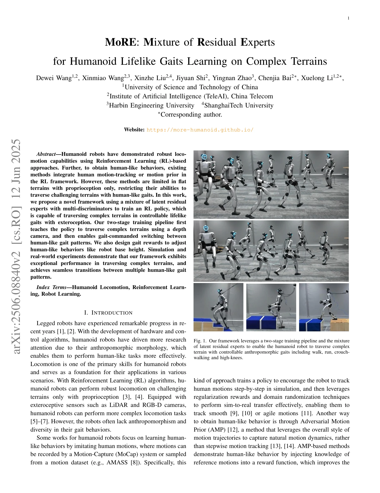

# MoRE: Mixture of Residual Experts for Humanoid Lifelike Gaits Learning on Complex Terrains

> **저자**: Dewei Wang, Xinmiao Wang, Xinzhe Liu, Jiyuan Shi, Yingnan Zhao, Chenjia Bai, Xuelong Li | **날짜**: 2025-06-10 | **URL**: [https://arxiv.org/abs/2506.08840](https://arxiv.org/abs/2506.08840)

---

## Essence

*Fig. 2.*

휴머노이드 로봇이 복잡한 지형을 인간다운 보행으로 횡단하기 위해 Mixture of Residual Experts (MoRE)와 다중 판별자를 활용한 2단계 RL 학습 프레임워크를 제안한다.

## Motivation

- **Known**: 휴머노이드 로봇은 RL 기반 접근법으로 강건한 보행 능력을 보이며, motion-tracking이나 AMP를 통해 인간다운 행동을 학습할 수 있다.
- **Gap**: 기존 motion-tracking 및 AMP 기반 방법들은 주로 평탄 지형에만 적합하고 proprioception만 사용하여 exteroception을 활용한 복잡 지형 횡단과 다중 보행 패턴의 원활한 전환을 동시에 달성하기 어렵다.
- **Why**: 휴머노이드 로봇이 실제 환경의 다양한 지형을 인간다운 자연스러운 보행으로 안정적으로 이동할 수 있다면 인간과 유사한 작업 수행 능력을 크게 향상시킬 수 있다.
- **Approach**: 2단계 훈련 파이프라인으로 첫 단계에서 깊이 카메라를 이용해 복잡 지형 횡단 정책을 학습하고, 두 번째 단계에서 MoE 기반 residual 모듈과 다중 판별자를 통해 인간 동작 prior를 활용하여 다중 보행 패턴을 학습한다.

## Achievement

*Fig. 1. Our framework leverages a two-stage training pipeline and the mixture*

- **2단계 패러다임**: 단일 정책으로 여러 보행을 습득하면서 복잡 지형에서 강건한 보행을 동시에 달성
- **Residual Experts 아키텍처**: MoE 기반 latent residual 전문가들을 학습하여 다중 판별자로부터의 인간 동작 prior를 효과적으로 통합
- **맞춤형 보행 보상**: 기준 동작과 보조 행동 제약을 동시에 학습하는 gait-specific 보상 설계로 정밀한 보행 제어 달성
- **실제 배포 검증**: Unitree G1 휴머노이드 로봇에서 walk, run, crouch-walking, high-knees 등 다중 인간다운 보행 패턴 간 원활한 전환 실현

## How

*Fig. 2.*

- Stage 1: depth camera 입력을 활용하여 elevation map을 구성하고 proprioception과 함께 사용하여 기본 locomotion 정책을 PPO로 훈련
- Stage 2: 훈련된 기본 정책의 마지막 hidden layer에 latent residual을 추가하는 MoRE 모듈 부착
- MoRE 모듈은 gating network를 통해 다중 expert outputs의 가중 조합을 생성하여 gait command 기반 보행 선택 실현
- 다중 판별자는 각각 서로 다른 참고 동작에 대해 훈련되며 gait command에 따라 선택되어 보행 의존적 보상 제공
- gait-specific 보상 함수로 base height 조정 등 세밀한 행동 제어를 통해 보행 다양성 강화

## Originality

- 기존 AMP 방법들이 단일 참고 동작만 사용하는 반면, 다중 판별자를 통해 여러 보행 패턴을 동시에 학습하는 구조 제안
- proprioception과 exteroception을 통합하면서 동시에 인간다운 보행을 달성하는 최초의 방법
- MoE 기반 residual 모듈로 gradient conflict를 제거하고 학습 가속화
- 2단계 훈련 파이프라임을 통해 기존 강건한 locomotion 정책을 효과적으로 재사용하면서 새로운 보행 학습

## Limitation & Further Study

- 현재 방법은 시뮬레이션 기반 훈련에 크게 의존하고 있어 sim-to-real 갭에 대한 상세 분석 부족
- MoE 기반 아키텍처의 computational overhead와 inference latency에 대한 정량적 분석 미흡
- 후속 연구: 더 다양한 극단적 지형(돌, 물 등)에 대한 일반화 능력 검증 필요
- 후속 연구: real-time gait 전환 시 에너지 효율성 및 안정성 분석 필요
- 후속 연구: 다른 휴머노이드 로봇 플랫폼으로의 일반화 가능성 탐색

## Evaluation

- Novelty: 4/5
- Technical Soundness: 3/5
- Significance: 4/5
- Clarity: 4/5
- Overall: 4/5

**총평**: 본 논문은 복잡 지형 횡단과 인간다운 다중 보행 학습을 동시에 달성하는 통합적 프레임워크를 제시하며, MoE 기반 residual 접근법과 다중 판별자 활용으로 방법론적 독창성을 보인다. 실제 로봇 배포 검증과 함께 기술적으로 견고하고 실무적 중요성이 높은 연구이다.
