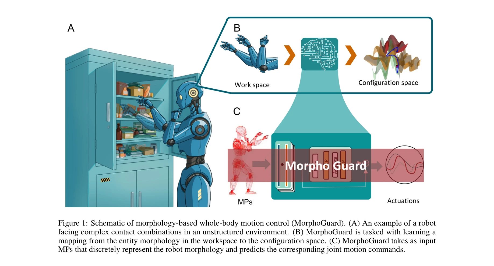

# MorphoGuard: A Morphology-Based Whole-Body Interactive Motion Controller

> **저자**:  | **날짜**: 2026-04-02 | **URL**: [https://arxiv.org/abs/2604.01517](https://arxiv.org/abs/2604.01517)

---

## Essence

*Figure 1: Schematic of morphology-based whole-body motion control (MorphoGuard). (A) An example of a robot*

로봇의 형태학적 표현을 기반으로 Material Point Method를 활용하여 전신 제어 네트워크 MorphoGuard를 제안. 복잡한 다중 접촉 조합을 명시적으로 관리하며 1cm의 접촉점 관리 오차를 달성.

## Motivation

- **Known**: Whole-Body Control(WBC)는 고차원 로봇 시스템의 운동 조율에 효과적이며, 기존 학습 기반 방법들은 주로 다중 운동연쇄의 끝점 최적화에 집중해왔다.
- **Gap**: 단일 운동연쇄 내에서 동적 다중 접촉 조합(예: 팔꿈치로 밀기+손으로 파지)을 다루는 연구가 부족하며, 기존 방법들은 관절 배치 결합으로 인한 복잡한 접촉 표현 및 불연속적 탐색공간 문제를 해결하지 못한다.
- **Why**: 일상적 작업에서 신체의 여러 부위를 동시에 사용하는 복잡한 상호작용이 필요하며, 이를 효과적으로 관리할 수 있는 통합 제어 방법의 발전은 로봇의 실용성을 크게 향상시킨다.
- **Approach**: 로봇의 형태를 고정된 위상관계를 가진 Material Point(MPs)의 유한집합으로 이산화하고, encoder-decoder 구조의 심층신경망을 통해 현재 형태에서 목표 형태로의 매핑을 학습하여 관절 명령을 예측한다.

## Achievement

*Figure 2: An overview of the MorphoGuard framework. The model consists of a MPs encoding module, an fusion*

- **전신 형태 기반 제어**: Material Point Method를 로봇 형태 표현에 확장하여 시공간적으로 일관된 형태 기하학적 표현 달성
- **다중 접촉 관리**: 복잡한 관절 배치 결합 문제를 동차 형태 표현으로 해결하여 임의의 접촉 조합을 명시적으로 관리
- **높은 제어 정확도**: 0.5의 관절 제어 오차 및 약 1cm의 접촉점 관리 오차 달성
- **대규모 데이터 수집**: 이중팔 로봇의 전체 작업공간 탐색을 통해 130만 개의 훈련 샘플 구축

## How

*Figure 2: An overview of the MorphoGuard framework. The model consists of a MPs encoding module, an fusion*

- 이중팔 로봇에 electronic skin을 전장착하고 실제/시뮬레이션 환경에서 데이터 수집 플랫폼 구축
- 로봇의 형태를 고정 위상관계를 가진 Material Point(MPs)로 이산화하여 공간적 표현
- Electronic skin 신호와 내재 구동을 경계 조건으로 하여 MPs의 상태 추적
- Encoder-Decoder 아키텍처로 현재/목표 형태의 특징 표현 인코딩
- 정보 Fusion 모듈을 통해 현재와 목표 형태 간의 관계 캡처
- Joint command decoder가 Fused 특징으로부터 관절 명령 예측
- 다중 객체 조작 작업을 벤치마크로 제어 성능 평가

## Originality

- Material Point Method를 로봇 제어에 처음 적용하여 형태학적 표현에 기반한 새로운 WBC 패러다임 제시
- 관절 배치 결합 문제를 형태 공간에서의 동차 표현으로 우아하게 해결하는 접근법 개발
- Electronic skin과 MPs의 결합을 통해 형태의 시공간적 일관성 보장하는 메커니즘 구현
- 단일 운동연쇄 내 복잡한 다중 접촉 조합을 명시적으로 관리하는 첫 시도

## Limitation & Further Study

- 단일 dual-arm 플랫폼에서만 실험하여 다양한 로봇 형태로의 일반화 가능성 미검증
- Electronic skin 취부 및 데이터 수집에 상당한 초기 비용과 노력 필요
- 동적 상황에서의 실시간 성능 및 안정성에 대한 평가 부족
- 다른 WBC 방법과의 비교 실험 결과 미제시로 상대적 우수성 검증 미흡
- 후속 연구로 다양한 형태의 로봇에 대한 전이학습(transfer learning) 방법 개발 필요
- 보상 학습(reinforcement learning)과의 결합으로 적응적 형태 제어 고도화 가능

## Evaluation

- Novelty: 4/5
- Technical Soundness: 3/5
- Significance: 4/5
- Clarity: 4/5
- Overall: 4/5

**총평**: 복잡한 다중 접촉 조합을 관리하는 로봇 전신 제어의 미해결 문제를 형태학적 표현과 Material Point Method의 창의적 결합으로 우아하게 해결했으며, 높은 정확도의 실험 결과를 보여준다. 다만 단일 플랫폼 실험과 일반화 가능성에 대한 검증이 보완되면 더욱 강력한 기여가 될 것으로 기대된다.
